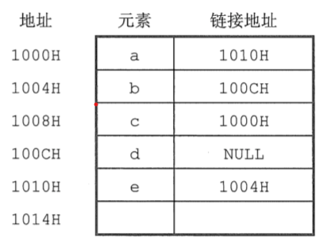
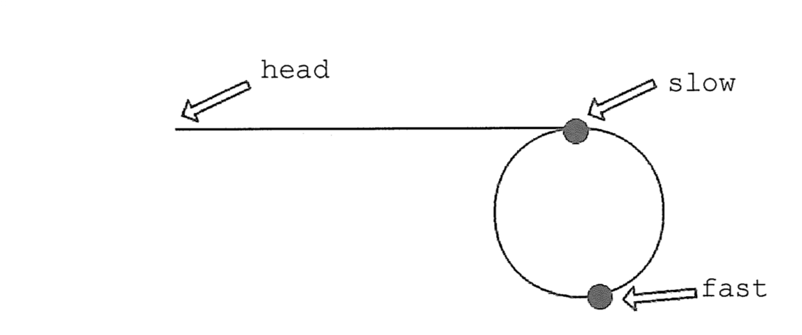
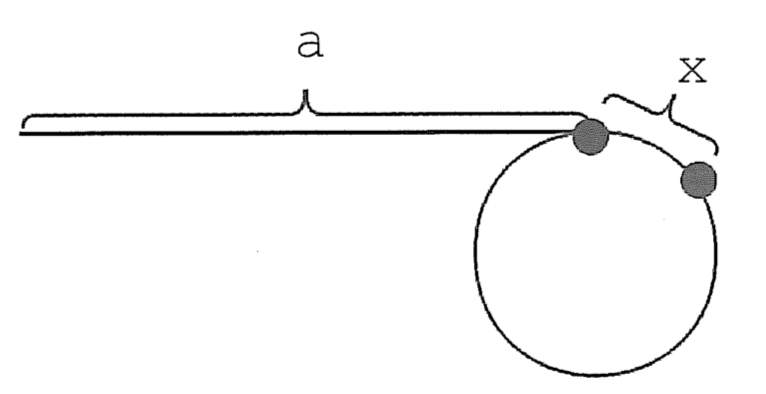
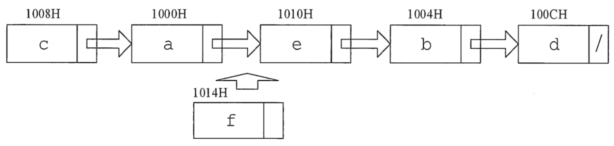

# 第二章 线性表

:warning: _注：代码均用`cpp`实现，且保证程序都能正常运行。可根据相关思路，用伪码表示_

## 习题 - 选择

### 1. 线性表是具有$n$个（）的有序序列

**&emsp;&emsp;A. 数据表
&emsp;&emsp;&emsp;&emsp;B. 字符
&emsp;&emsp;&emsp;&emsp;C. 数据元素
&emsp;&emsp;&emsp;&emsp;D. 数据项**

### 2. 以下（）是一个线性表

**&emsp;&emsp;A. 由$n$个实数组成的集合
&nbsp;&emsp;&emsp;&emsp;B. 由$100$个字符组成的序列**  
**&emsp;&emsp;C. 所有整数组成的序列
&emsp;&emsp;&emsp;&emsp;D. 邻接表**

### 3. 在线性表中，除开始元素外，每个元素（）

**&emsp;&emsp;A. 只有唯一的前驱元素
&emsp;&emsp;&emsp;&emsp;B. 只有唯一的后继元素**  
**&emsp;&emsp;C. 有多个前驱元素
&emsp;&emsp;&emsp;&emsp;&emsp;&emsp;D. 有多个后继元素**

### 4. 下述（）是顺序存储结构的优点

**&emsp;&emsp;A. 存储密度大
&emsp;&emsp;&emsp;&emsp;&emsp;&emsp;&emsp;&emsp;B. 插入运算方便**  
**&emsp;&emsp;C. 删除运算方便
&emsp;&emsp;&emsp;&emsp;&emsp;&emsp;&emsp;D. 方便地运用于各种逻辑结构的存储表示**

### 5. 线性表的顺序存储是是一种（）

**&emsp;&emsp;A. 随机存取的存储结构
&emsp;&emsp;&emsp;&emsp;B. 顺序存取的存储结构**  
**&emsp;&emsp;C. 索引存取的存储结构
&emsp;&emsp;&emsp;&emsp;D. 散列存取的存储结构**

### 6. 一个顺序表所占的存储空间大小与（）无关

**&emsp;&emsp;A. 表的长度
&emsp;&emsp;&emsp;&emsp;&emsp;&emsp;&emsp;&emsp;&emsp;B. 元素的存放顺序**  
**&emsp;&emsp;C. 元素的类型
&emsp;&emsp;&emsp;&emsp;&emsp;&emsp;&emsp;&emsp;D. 元素中各字段的类型**

### 7. 若线性表最常用的操作是存取第$i$各元素及其前驱和后继元素的值，为了提高效率，应采用（）的存储方式

**&emsp;&emsp;A. 单链表
&emsp;&emsp;&emsp;&emsp;B. 双向链表
&emsp;&emsp;&emsp;&emsp;C. 单循环链表
&emsp;&emsp;&emsp;&emsp;D. 顺序表**

### 8. 一个线性表最常用的操作是存取任一指定序号的元素并在最后进行插入删除操作，则利用（）存储方式可以节省时间

**&emsp;&emsp;A. 顺序表
&emsp;&emsp;&emsp;&emsp;&emsp;&emsp;&emsp;&emsp;&emsp;&emsp;B. 双链表**  
**&emsp;&emsp;C. 带头结点的双循环链表
&emsp;&emsp;&emsp;D. 单循环链表**

### 9. 在$n$个元素的线性表的数组表示中，时间复杂度为$O(1)$的操作是（）

&emsp;**Ⅰ. 访问第$i(1≤i≤n)$个结点和求第$i(2≤i≤n)$个结点的直接前驱**  
&emsp;**Ⅱ. 在最后一个结点后插入一个新的结点**  
&emsp;**Ⅲ. 删除第$1$个结点**  
&emsp;**Ⅳ. 在第$i(1≤i≤n)$个结点后插入一个结点**

**&emsp;&emsp;A. Ⅰ
&emsp;&emsp;&emsp;&emsp;B. Ⅱ、Ⅲ
&emsp;&emsp;&emsp;&emsp;C. Ⅰ、Ⅱ
&emsp;&emsp;&emsp;&emsp;D. Ⅰ、Ⅱ、Ⅲ**

### 10. 设线性表有$n$个元素，严格说来，以下操作中，（）在顺序表上实现要比链表上实现的效率高

&emsp;**Ⅰ. 输出第$i(1≤i≤n)$个元素值**  
&emsp;**Ⅱ. 交换第$3$个元素与第$4$个元素的值**  
&emsp;**Ⅲ. 顺序输出这$n$个元素的值**

**&emsp;&emsp;A. Ⅰ
&emsp;&emsp;&emsp;&emsp;B. Ⅰ、Ⅲ
&emsp;&emsp;&emsp;&emsp;C. Ⅰ、Ⅱ
&emsp;&emsp;&emsp;&emsp;D. Ⅱ、Ⅲ**

### 11. 在一个长度为$n$的顺序表中删除第$i(1≤i≤n)$个元素时，需向前移动（）个单位

**&emsp;&emsp;A. $n$
&emsp;&emsp;&emsp;&emsp;B. $i-1$
&emsp;&emsp;&emsp;&emsp;C. $n-i$
&emsp;&emsp;&emsp;&emsp;D. $n-i+1$**

### 12. 对于顺序表，访问第$i$个位置得元素和在第$i$个位置插入一个元素得时间复杂度为（）

**&emsp;&emsp;A. $O(n), O(n)$
&emsp;&emsp;&emsp;B. $O(n), O(1)$
&emsp;&emsp;&emsp;C. $O(1), O(n)$
&emsp;&emsp;&emsp;D. $O(1), O(1)$**

### 13. 若长度为$n$得非空线性表采用顺序存储结构，在表得第$i$个位置插入一个数据元素，$i$得合法值应该是（）

**&emsp;&emsp;A. $1≤i≤n$
&emsp;&emsp;&emsp;&emsp;&emsp;&emsp;B. $1≤i≤n+1$**  
**&emsp;&emsp;C. $0≤i≤n-1$
&emsp;&emsp;&emsp;&emsp;D. $0≤i≤n$**

### 14. 顺序表的插入算法中，当$n$个空间已满时，可再申请增加分配$m$个空间，若申请失败，则说明系统没有（）可分配的存储空间

**&emsp;&emsp;A. $m$个
&emsp;&emsp;&emsp;&emsp;B. $m$个连续
&emsp;&emsp;&emsp;&emsp;C. $n+m$个
&emsp;&emsp;&emsp;&emsp;D. $n+m$个连续**

### 15. 关于线性表的顺序存储结构和链式存储结构的描述中，正确的是（）

&emsp;**Ⅰ. 线性表的顺序存储结构优于其链式存储结构**  
&emsp;**Ⅱ. 链式存储结构比顺序存储结构更能方便地表示各种逻辑结构**  
&emsp;**Ⅲ. 若频繁使用插入和删除结点操作，则顺序存储结构更优于链式存储结构**  
&emsp;**Ⅳ. 顺序存储结构和链式存储结构都可以进行存取**

**&emsp;&emsp;A. Ⅰ、Ⅱ、Ⅲ
&emsp;&emsp;&emsp;&emsp;B. Ⅱ、Ⅳ
&emsp;&emsp;&emsp;&emsp;C. Ⅱ、Ⅲ
&emsp;&emsp;&emsp;&emsp;D. Ⅲ、Ⅳ**

### 16. 对于一个线性表既要求能够进行比较快速得插入和删除，又要求存储结构能反映数据之间的逻辑关系，则应该用（）

**&emsp;&emsp;A. 顺序存储方式
&emsp;&emsp;&emsp;&emsp;&emsp;B. 链式存储方式**  
**&emsp;&emsp;C. 散列存储方式
&emsp;&emsp;&emsp;&emsp;&emsp;D. 以上均可以**

### 17. 对于顺序存储的线性表，其算法时间复杂度为$O(1)$的运算应该是（）

**&emsp;&emsp;A. 将$n$个元素从小到大排序**  
**&emsp;&emsp;B. 删除第$i(1≤i≤n)$个元素**  
**&emsp;&emsp;C. 改变第$i(1≤i≤n)$个元素的值**  
**&emsp;&emsp;D. 在第$i(1≤i≤n)$个元素后插入一个新元素**

### 18. 下列关于线性表说法中，正确的是（）

&emsp;**Ⅰ. 顺序存储方式只能用于存储线性结构**  
&emsp;**Ⅱ. 取线性表的第$i$个元素的时间与$i$的大小有关**  
&emsp;**Ⅲ. 静态链表需要分配较大的连续空间，插入和删除不需要移动元素**  
&emsp;**Ⅳ. 在一个长度为$n$的有序单链表中插入一个新结点并仍保持有序的时间复杂度为$O(n)$**  
&emsp;**Ⅴ. 若用单链表来表示队列，则应该选用带尾指针的循环链表**

**&emsp;&emsp;A. Ⅰ、Ⅱ
&emsp;&emsp;&emsp;&emsp;B. Ⅰ、Ⅲ、Ⅳ、Ⅴ
&emsp;&emsp;&emsp;&emsp;C. Ⅳ、Ⅴ
&emsp;&emsp;&emsp;&emsp;D. Ⅲ、Ⅳ、Ⅴ**

### 19. 设线性表中有$2n$个元素，（）在单链表上实现要比在顺序表上实现效率更高

**&emsp;&emsp;A. 删除所有值为$x$的元素**  
**&emsp;&emsp;B. 在最有一个元素的后面插入一个新元素**  
**&emsp;&emsp;C. 顺序输出前$k$个元素**  
**&emsp;&emsp;D. 交换第$i$个元素和第$2n-i-1$个元素的值（$i=0,..,n-1$）**

### 20. 在一个单链表中，已知$q$所指结点是$p$所指结点的前驱结点，若在$q$和$p$之间插入结点$s$，则执行（）

**&emsp;&emsp;A. `s->next=p->next;p->next=s`
&emsp;&emsp;&emsp;&emsp;B. `p->next=s->next;s->next=p`**  
**&emsp;&emsp;C. `q->next=s;s->next=p`
&emsp;&emsp;&emsp;&emsp;&emsp;&emsp;&nbsp;&nbsp;&nbsp;D. `p->next=s;s->next=q`**

### 21. 给定有$n$个元素的一维数组，建立一个有序单链表的最低时间复杂度是（）

**&emsp;&emsp;A. $O(1)$
&emsp;&emsp;&emsp;&emsp;B. $O(n)$
&emsp;&emsp;&emsp;&emsp;C. $O(n^2)$
&emsp;&emsp;&emsp;&emsp;D. $O(nlog_2n)$**

### 22. 将长度为$n$的单链表链接在长度为$m$的单链表后面，其算法的时间复杂度采用大$O$形式表示应该是（）

**&emsp;&emsp;A. $O(1)$
&emsp;&emsp;&emsp;&emsp;B. $O(n)$
&emsp;&emsp;&emsp;&emsp;C. $O(m)$
&emsp;&emsp;&emsp;&emsp;D. $O(n+m)$**

### 23. 单链表中，增加一个头结点的目的是为了（）

**&emsp;&emsp;A. 使单链表至少有一个结点
&emsp;&emsp;&emsp;&emsp;B. 标识表结点中首结点的位置**  
**&emsp;&emsp;C. 方便运算的实现
&emsp;&emsp;&emsp;&emsp;&emsp;&emsp;&emsp;&emsp;D. 说明单链表是线性表的链式存储**

### 24. 在一个长度为$n$的带头结点的单链表$h$上，设有尾指针$r$，则执行（）操作与单链表的表长有关

**&emsp;&emsp;A. 删除单链表中的第一个元素**  
**&emsp;&emsp;B. 删除单链表中的最后一个元素**  
**&emsp;&emsp;C. 在单链表第一个元素前插入一个新元素**  
**&emsp;&emsp;D. 在单链表最后一个元素后插入一个新元素**

### 25. 对于一个头结点指针为`head`的带头结点的单链表，判定该表为空表的条件是（）；对于不带头结点的单链表，判定空表的条件是（）

**&emsp;&emsp;A. `head=NULL`
&emsp;&emsp;B. `head->next=NULL`
&emsp;&emsp;C. `head->next==head`
&emsp;&emsp;D. `head!=NULL`**

### 26. 下面关于线性表的一些说法中，正确的是（）

**&emsp;&emsp;A. 对于一个设有头指针和尾指针的单链表执行删除最后一个元素的操作与链表长度无关**  
**&emsp;&emsp;B. 线性表中每个元素都有一个直接前驱和一个直接后继**  
**&emsp;&emsp;C. 为了方便插入和删除数据，可以使用双链表存放数据**  
**&emsp;&emsp;D. 取线性表第$i$个元素的时间与$i$的大小有关**

### 27. 在双链表中向$p$所指的结点之前插入一个结点$q$的操作为（）

**&emsp;&emsp;A. `p->prior=q;q->next=p;p->prior->next=q;q->prior=p->prior`**  
**&emsp;&emsp;B. `q->prior=p->prior;p->prior->next=q;q->next=p;p->prior=q->next`**  
**&emsp;&emsp;C. `q->next=p;p->next=q;p->prior->next=q;q->next=p`**  
**&emsp;&emsp;D. `p->prior->next=q;q->next=p;q->prior=p->prior;p->prior=q`**

### 28. 在双链表存储结构中，删除$p$所指结点时必须修改指针（）

**&emsp;&emsp;A. `p->llink->rlink=p->rlink;p->rlink->llink=p->llink;`**  
**&emsp;&emsp;B. `p->llink=p->llink->llink;p->llink->rlink=p;`**  
**&emsp;&emsp;C. `p->rlink->llink=p;p->rlink=p->rlink->rlink;`**  
**&emsp;&emsp;D. `p->rlink=p->llink->llink;p->llink=p->rlink->rlink;`**

### 29.【2016 统考真题】已知一个带有表头结点的双循环链表$L$，结点结构为`[prev|data|next]`，其中`prev`和`next`分别是指向其直接前驱和直接后继结点的指针。现要删除指针$p$所指的结点，正确的语句序列是（）

**&emsp;&emsp;A. `p->next->prev=p->prev;p->prev->next=p->prev;free(p)`**  
**&emsp;&emsp;B. `p->next->prev=p->next;p->prev->next=p->next;free(p)`**  
**&emsp;&emsp;C. `p->next->prev=p->next;p->prev->next=p->prev;free(p)`**  
**&emsp;&emsp;D. `p->next->prev=p->prev;p->prev->next=p->next;free(p)`**

### 30. 在长度为$n$的有序单链表中插入一个新结点，并仍然保持有序的时间复杂度是（）

**&emsp;&emsp;A. $O(1)$
&emsp;&emsp;&emsp;&emsp;B. $O(n)$
&emsp;&emsp;&emsp;&emsp;C. $O(n^2)$
&emsp;&emsp;&emsp;&emsp;D. $O(nlog_2n)$**

### 31. 与单链表相比，双链表的优点之一是（）

**&emsp;&emsp;A. 插入、删除操作更方便
&emsp;&emsp;&emsp;&emsp;&emsp;&emsp;B. 可以进行随机访问**  
**&emsp;&emsp;C. 可以省略表头指针或表尾指针
&emsp;&emsp;&emsp;D. 访问前后相邻结点更灵活**

### 32. 带头结点的双循环链表$L$为空的条件是（）

**&emsp;&emsp;A. `L->prior=L&&L->next==NULL`
&nbsp;&emsp;&emsp;&emsp;&nbsp;B. `L->prior==NULL&&L->Next==NULL`**  
**&emsp;&emsp;C. `L->prior==NULL&&L->Next==L`
&emsp;&emsp;&emsp;&nbsp;D. `L->prior==L&&L->next==L`**

### 33. 一个链表最常用的操作是在末尾插入结点和删除结点，则选用（）最省时间

**&emsp;&emsp;A. 带头结点的双循环链表
&emsp;&emsp;&emsp;&emsp;&emsp;&emsp;B. 单循环链表**  
**&emsp;&emsp;C. 带尾指针的单循环链表
&emsp;&emsp;&emsp;&emsp;&emsp;&emsp;D. 单链表**

### 34. 设对$n(n>1)$个元素的线性表的运算只有$4$种：删除第一个元素；删除最后一个元素；在第一个元素之前插入新元素；在最后一个元素之后插入新元素，则最好使用（）

**&emsp;&emsp;A. 只有尾结点指针没有头结点指针的循环单链表**  
**&emsp;&emsp;B. 只有尾结点指针没有头结点指针的非循环双链表**  
**&emsp;&emsp;C. 只有头结点指针没有尾结点指针的循环双链表**  
**&emsp;&emsp;D. 既有头结点指针又有尾结点指针的循环单链表**

### 35. 一个链表最常用的操作是在最后一个元素之后插入一个元素和删除第一个元素，则选用（）最节省时间

**&emsp;&emsp;A. 不带头结点的单循环链表
&emsp;&emsp;&emsp;&emsp;&emsp;&emsp;B. 双链表**  
**&emsp;&emsp;C. 不带头结点且有尾指针的单循环链表
&emsp;D. 单链表**

### 36. 静态链表中指针表示的是（）

**&emsp;&emsp;A. 下一元素的地址
&emsp;&emsp;&emsp;&emsp;&emsp;&emsp;&emsp;&emsp;&emsp;&emsp;B. 内存储器地址**  
**&emsp;&emsp;C. 下一个元素在数组中的位置
&emsp;&emsp;&emsp;&emsp;&emsp;D. 左链或右链指向的元素的地址**

### 37.【2016 统考真题】已知表头元素为$c$的单链表在内存中的存储状态如下表所示，现将$f$存放于$1014H$处并插入单链表，若$f$在逻辑上位于$a$和$e$之间，则$a,e,f$的“链接地址”依次是（）

<div align="center"></div>

**&emsp;&emsp;A. $1010H,1014H,1004H$
&emsp;&emsp;&emsp;&emsp;B. $1010H,1004H,1014H$**  
**&emsp;&emsp;C. $1014H,1010H,1004H$
&emsp;&emsp;&emsp;&emsp;D. $1014H,1004H,1010H$**

### 38. 需要分配较大空间，插入和删除不需要移动元素的线性表，其存储结构为（）

**&emsp;&emsp;A. 单链表
&emsp;&emsp;&emsp;&emsp;B. 静态链表
&emsp;&emsp;&emsp;&emsp;C. 顺序表
&emsp;&emsp;&emsp;&emsp;D. 双链表**

### 39. 某线性表用带头结点的循环的单链表存储，头指针为`head`，当`head->next->next=head`成立时，线性表长度可能是（）

**&emsp;&emsp;A. $0$
&emsp;&emsp;&emsp;&emsp;B. $1$
&emsp;&emsp;&emsp;&emsp;C. $2$
&emsp;&emsp;&emsp;&emsp;D. 可能为$0$或$1$**

## 习题 - 综合

### 1. 从顺序表中删除具有最小值的元素（假设唯一）并由函数返回被删元素的值。空出的位置由最后一个元素填补，若顺序表为空则显示出错信息并退出运行

> **解答：** _[code 2-1.cpp](./src/exercise2_wangdao/2-1.cpp)_
>
> ```cpp
> #include "LinearList.cpp"
>
>
> template <typename T>
> class SqList: public ArrList<T>
> {
>     public:
>         using ArrList<T>::ArrList;
>         bool DelMin(T &value);
> };
>
> template <typename T>
> bool SqList<T>::DelMin(T &value)
> {
>     if(this->CurLen == 0)
>         return false;
>     value = this->List[0];
>     int pos = 0;
>     for(int i = 1; i < this->CurLen; i++)
>     {
>         if(this->List[i] < value)
>         {
>             value = this->List[i];
>             pos = i;
>         }
>     }
>     this->List[pos] = this->List[this->CurLen - 1];
>     this->CurLen --;
>     return true;
> }
> ```

### 2. 设计一个高效算法，讲顺序表$L$的所有元素逆置，要求算法的空间复杂度为$O(1)$

> **解答：** _[code 2-2.cpp](./src/exercise2_wangdao/2-2.cpp)_
>
> 思路：用顺序表前半部分元素与后半部分对应元素进行交换
>
> ```cpp
> #include "LinearList.cpp"
>
>
> template <typename T>
> class SqLsit: public ArrList<T>
> {
>     public:
>         using ArrList<T>::ArrList;
>         void Reverse();
> };
>
> template <typename T>
> void SqLsit<T>::Reverse()
> {
>     T tmp;
>     for(int i = 0; i < this->CurLen/2; i++)
>     {
>         tmp = this->List[i];
>         this->List[i] = this->List[this->CurLen - i - 1];
>         this->List[this->CurLen - i - 1] = tmp;
>     }
> }
> ```

### 3. 对长度为$n$的顺序表$L$，编写一个时间复杂度为$O(n)$、空间复杂度为$O(1)$的算法，该算法删除线性表中所有值为$x$的数据元素

> **解答：** _[code 2-3.cpp](./src/exercise2_wangdao/2-3.cpp)_
>
> 思路 $1$：用$k$记录顺序表$L$中不等于$x$的元素个数（即需要保存的元素个数），边扫描$L$边记$k$，并将不等于$x$的元素向前移动$k$个位置，最后修改$L$的长度  
> 思路 $2$：用$k$记录顺序表$L$中等于$x$的元素个数，边扫描$L$边记$k$，并将不等于$x$的元素向前移动$k$个位置，最后修改$L$的长度
>
> ```cpp
> #include "LinearList.cpp"
>
>
> template <typename T>
> class SqList: public ArrList<T>
> {
>     public:
>         using ArrList<T>::ArrList;
>         void Del_x_1(const T &x);
>         void Del_x_2(const T &x);
> };
>
> template <typename T>
> void SqList<T>::Del_x_1(const T &x)
> {
>     int k = 0;                  // 记录值不等于x的元素个数
>     for(int i = 0; i < this->CurLen; i++)
>     {
>         if(this->List[i] != x)
>         {
>             this->List[k] = this->List[i];
>             k++;
>         }
>     }
>     this->CurLen = k;
> }
>
> template <typename T>
> void SqList<T>::Del_x_2(const T &x)
> {
>     int k = 0, i = 0;
>     while(i < this->CurLen)
>     {
>         if(this->List[i] == x)
>             k++;
>         else
>             this->List[i-k] = this->List[i];
>         i++;
>     }
>     this->CurLen = this->CurLen - k;
> }
> ```

### 4. 从有序顺序表中删除其值在给定$s$与$t$之间（要求$s<t$)的所有元素，如果$s$或$t$不合理或顺序表为空，则显示出错信息并退出运行

> **解答：** _[code 2-4.cpp](./src/exercise2_wangdao/2-4.cpp)_
>
> 思路：先寻找大于$s$的第一个元素，然后寻找大于$t$的第一个元素
>
> ```cpp
> #include <iostream>
> #include "LinearList.cpp"
>
>
> template <typename T>
> class SqList: public ArrList<T>
> {
>     public:
>         using ArrList<T>::ArrList;
>         bool DelRange(const T &s, const T &t);
> };
>
> template <typename T>
> bool SqList<T>::DelRange(const T &s, const T &t)
> {
>     int i, j;
>     if(s >= t || this->CurLen == 0)
>         return false;
>     for(i = 0; i < this->CurLen && this->List[i] <= s; i++);    // 寻找大于s的第一个元素
>     if(i >= this->CurLen)                                       // 所有元素值均小于s
>         return false;
>     for(j = i; j < this->CurLen && this->List[j] < t; j++);    // 寻找值大于t的第一个元素
>     for(;j < this->CurLen; i++, j++)
>         this->List[i] = this->List[j];
>     this->CurLen = i;
>     return true;
> }
> ```

### 5. 从顺序表中删除其值在给定$s$与$t$之间（包含$s$和$t$，要求$s<t$）的所有元素，如果$s$或$t$不合理或顺序表为空，则显示出错信息并退出运行

> **解答：** _[code 2-5.cpp](./src/exercise2_wangdao/2-5.cpp)_
>
> 思路：从前向后扫描顺序表$L$，用$k$记录下元素值在$s$到$t$之间元素的个数（初始时$k=0$）。对应当前扫描的元素，若其值不在$s$到$t$之间，则前移$k$个位置，否则$k++$
>
> ```cpp
> #include "LinearList.cpp"
>
>
> template <typename T>
> class SqList: public ArrList<T>
> {
>     public:
>         using ArrList<T>::ArrList;
>         bool DelRange(const T &s, const T &t);
> };
>
> template <typename T>
> bool SqList<T>::DelRange(const T &s, const T &t)
> {
>     int i, k = 0;
>     if(this->CurLen == 0 || s >= t)
>         return false;
>     for(i = 0; i < this->CurLen; i++)
>     {
>         if(this->List[i] >= s && this->List[i] <= t)
>             k++;
>         else
>             this->List[i-k] = this->List[i];
>     }
>     this->CurLen -= k;
>     return true;
> }
> ```

### 6. 从有序顺序表中删除所有其值重复的元素，使表中所有元素均不相同

> **解答：** _[code 2-6.cpp](./src/exercise2_wangdao/2-6.cpp)_
>
> 思路：有序表相同的元素一定在连续位置上，初始时将第一个元素视为非重复的有序表。之后依此判断后面的元素是否与前面非重复有序表的最后一个元素相同，若相同则继续向后判断，若不同则插入到前面的非重复有序表的最后，直到判断到表尾为止
>
> ```cpp
> #include "LinearList.cpp"
>
>
> template <typename T>
> class SeqList: public ArrList<T>
> {
>     public:
>         using ArrList<T>::ArrList;
>         bool DeleteSame()
>         {
>             if(this->CurLen == 0)
>                 return false;
>             int i, j;
>             for(i = 0, j = 1; j < this->CurLen; j++)
>                 if(this->List[i] != this->List[j])
>                     this->List[++i] = this->List[j];
>             this->CurLen = i + 1;
>             return true;
>         }
> };
> ```

### 7. 将两个有序顺序表合并为一个新的有序顺序表，并由函数返回结果顺序表

> **解答：** _[code 2-7.cpp](./src/exercise2_wangdao/2-7.cpp)_
>
> 思路：按顺序不断取下两个顺序表的结点，将较小的结点存入新的顺序表中。然后，将有剩余结点的表中的剩余数据依此添加到新表中
>
> ```cpp
> #include "LinearList.cpp"
>
>
> template <typename T>
> class SeqList: public ArrList<T>
> {
>     public:
>         using ArrList<T>::ArrList;
>
>         template <typename N>
>         friend bool Merge(SeqList<N> &A, SeqList<N> &B, SeqList<N> &C);
> };
>
> template <typename T>
> bool Merge(SeqList<T> &A, SeqList<T> &B, SeqList<T> &C)
> {
>     if(A.CurLen + B.CurLen > C.MaxSize)
>        return false;
>     int i = 0, j = 0, k = 0;
>     while(i < A.CurLen && j < B.CurLen)
>     {
>         if(A.List[i] < B.List[j])
>             C.List[k++] = A.List[i++];
>         else
>             C.List[k++] = B.List[j++];
>     }
>     while(i < A.CurLen)
>         C.List[k++] = A.List[i++];
>     while(j < B.CurLen)
>         C.List[k++] = B.List[j++];
>     C.CurLen = k;
>     return true;
> }
> ```

### 8. 已知在一维数组$A[m+n]$中一次存放两个线性表$(a_1,a_2,...,a_m),(b_1,b_2,...,b_n)$。试写一个函数，将数组中两个顺序表的位置互换，即将$(b_1,b_2,...,b_n)$放在$(a_1,a_2,...,a_m)$的前面

> **解答：** _[code 2-8.cpp](./src/exercise2_wangdao/2-8.cpp)_
>
> 思路：先对全部元素逆置为$(b_1,b_2,b_3,...,b_n,a_1,a_2,a_3,...,a_m$，再对前$n$个元素和后$m$个元素逆置
>
> ```cpp
> #include "LinearList.cpp"
>
>
> template <typename T>
> class SqList: public ArrList<T>
> {
>     public:
>         using ArrList<T>::ArrList;
>         void Reverse(int left, int right, int arraySize);   // 逆置
>         void Exchange(int m, int n, int arraySize);
> };
>
> template <typename T>
> void SqList<T>::Reverse(int left, int right, int arraySize)
> {
>     if(left >= right || right >= arraySize)
>         return;
>     int mid = (right + left) / 2;
>     for(int i = 0; i <= mid - left; i++)
>     {
>         T tmp = this->List[left + i];
>         this->List[left + i] = this->List[right - i];
>         this->List[right - i] = tmp;
>     }
> }
>
> template <typename T>
> void SqList<T>::Exchange(int m, int n, int arraySize)
> {
>     Reverse(0, m+n-1, arraySize);
>     Reverse(0, n-1, arraySize);
>     Reverse(n, m+n-1, arraySize);
> }
> ```

### 9. 线性表$(a_1,a_2,...,a_n)$中的元素递增有序且按顺序存储于计算机内。要求设计一算法，完成用最少时间在表中查找数值为$x$的元素，若找到则将其与后继元素位置相交换，若找不到则将其插入表中并使表中元素仍递增有序

> **解答：** _[code 2-9.cpp](./src/exercise2_wangdao/2-9.cpp)_
>
> 思路：用二分法
>
> ```cpp
> template <typename T>
> void SearchExchangeInsert(T A[], T x, int n)
> {
>     int low = 0, high = n-1, mid;
>     while(low <= high)
>     {
>         mid = (low + high) / 2;
>         if(A[mid] == x) break;
>         else if(A[mid] < x)
>             low = mid + 1;
>         else high = mid - 1;
>     }
>
>     // 最后一个元素与x相等时不交换
>     if(A[mid] == x && mid != n-1)
>     {
>         T t;
>         t = A[mid];
>         A[mid] = A[mid+1];
>         A[mid+1] = t;
>     }
>     // 查找失败
>     if(low > high)
>     {
>         int i;
>         for(i = n-1; i > high; i--)
>             A[i+1] = A[i];
>         A[i+1] = x;
>     }
> }
> ```

### 10.【2010 统考真题】设将$n(n>1)$个整数存放到一维数组$R$中。设计一个在时间和空间两方面都尽可能高效的算法。将$R$中保存的序列循环左移$p(0<p<n)$个位置，即将$R$中的数据由$(X_0,X_1,...,X_{n-1})$变换为$(X_p,X_{p+1},...,X_{n-1},X_0,X_1,...,X_{p-1}$。要求

**（1）给出算法的基本设计思想**  
**（2）根据设计思想，采用`C/C++`或`Java`语言描述算法，关键之处给出注释**  
**（3）说明你所设计算法的时间复杂度和空间复杂度**

> **解答：** _[code 2-9.cpp](./src/exercise2_wangdao/2-10.cpp)_
>
> （1）可将这个问题视为把数组$ab$转换成数组$ba$（$a$代表数组的前$p$个元素，$b$代表数组中余下的$n-p$个元素），先将$a$逆置得到$a^{-1}b$，再将$b$逆置得到$a^{-1}b^{-1}$，最后将整个$a^{-1}b^{-1}$逆置得到$ba$  
> （2）`C/C++`描述算法如下：
>
> ```cpp
> void Reverse(int R[], int from, int to)
> {
>     int i, temp;
>     for(i = 0; i < (to-from+1)/2; i++)
>     {
>         temp = R[from+i];
>         R[from+i] = R[to-i];
>         R[to-i] = temp;
>     }
> }
>
> void Converse(int R[], int n, int p)
> {
>     Reverse(R, 0, p-1);
>     Reverse(R, p, n-1);
>     Reverse(R, 0, n-1);
> }
> ```
>
> （3）上述算法中三个`Reverse`函数的时间复杂度分别为$O(p/2),O((n-p)/2),O(n/2)$，故所设计算法的时间复杂度是$O(n)$，空间复杂度是$O(1)$

### 11.【2011 统考真题】一个长度为$L(L≥1)$的升序序列$S$，处在第$\lceil L/2 \rceil$个位置的数称为$S$的中位数。例如，若序列$S_1=(11,13,15,17,19)$，则$S_1$的中位数是$15$，两个序列的中位数是含它们所有元素的升序序列的中位数。例如，若$S_2=(2,4,6,8,20)$，则$S_1$和$S_2$的中位数是$11$。现在有两个等长升序序列$A$和$B$，试设计一个在时间和空间两方面都尽可能高效的算法，找出两个序列$A$和$B$的中位数。要求

**（1）给出算法的基本设计思想**  
**（2）根据设计思想，采用`C/C++`或`Java`语言描述算法，关键之处给出注释**  
**（3）说明你所设计算法的时间复杂度和空间复杂度**

> **解答：** _[code 2-11.cpp](./src/exercise2_wangdao/2-11.cpp)_
>
> （1）算法的基本设计思想如下:  
> &emsp;&emsp;分别求两个两个升序序列$A,B$的中位数，设为$a,b$，求解过程如下：  
> &emsp;&emsp;① 若$a=b$，则$a$或$b$即为所求中位数，算法结束  
> &emsp;&emsp;② 若$a<b$，则舍弃序列$A$中较小的一半，同时舍弃序列$B$中较大的一半，要求两次舍弃的长度相等。  
> &emsp;&emsp;③ 若$a>b$，则舍弃序列$A$中较大的一半，同时舍弃序列$B$中较小的一半，要求两次舍弃的长度相等。  
> &emsp;&emsp;重复以上过程，直到两个序列中均只含一个元素时为止，较小者即为所求中位数  
> （2）`C/C++`代码
>
> ```cpp
> int M_Search(int A[], int B[], int n)
> {
>     // 分别表示A,B首位数、末位数和中位数
>     int s1 = 0, d1 = n-1, m1;
>     int s2 = 0, d2 = n-1, m2;
>     while(s1 != d1 || s2 != d2)
>     {
>         m1 = (s1 + d1) / 2;
>         m2 = (s2 + d2) / 2;
>         if(A[m1] == B[m2])
>             return A[m1];
>         if(A[m1] < B[m2])
>         {
>             if((s1 + d1) % 2 == 0)  // 若元素个数为奇数
>             {
>                 s1 = m1;            // 舍弃A中间点以前的部分且保留中间点
>                 d2 = m2;            // 舍弃B中间点以后的部分且保留中间点
>             }
>             else
>             {
>                 s1 = m1 + 1;        // 舍弃A中间点以及中间点以前的部分
>                 d2 = m2;            // 舍弃B中间点以后的部分且保留中间点
>             }
>         }
>         else // A[m1] > B[m2]
>         {
>             if((s2 + d2) % 2 == 0)
>             {
>                 d1 = m1;            // 舍弃A中间点以前的部分且保留中间点
>                 s2 = m2;            // 舍弃B中间点以后的部分且保留中间点
>             }
>             else
>             {
>                 d1 = m1;            // 舍弃A中间点以后的部分且保留中间点
>                 s2 = m2 + 1;        // 舍弃B中间点以及中间点以前的部分
>             }
>         }
>     }
>     return A[s1] < B[s2] ? A[s1] : B[s2];
> }
> ```
>
> （3）算法时间复杂度是$O(log_2n)$，空间复杂度是$O(1)$
>
> _注：也可对$A,B$元素依此比较并计数，当计数值等于$n$时，比较当前$A[i]$与$B[j]$的值，较小的为中位数，时间复杂度为$O(n)$_

### 12.【2013 统考真题】已知一个整数序列$A=(a_0,a_1,...,a_{n-1})$，其中$0≤a_i≤n(0≤i<n)$。若存在$a_{p1}=a_{p2}=...=a_{pm}=x$且$m>n/2(0≤p_k<n,1≤k≤m)$，则称$x$为$A$的主要元素。例如$A=(0,5,5,3,5,7,5,5)$，则$5$为主元素；又如$A=(0,5,5,3,5,1,5,7)$，则$A$中没有主元素。假设$A$中的$n$个元素保存在一个一维数组中，请设计一个尽可能高效的算法，找出$A$的主元素。若存在主元素，则输出该元素；否则输出$-1$。要求

**（1）给出算法的基本设计思想**  
**（2）根据设计思想，采用`C/C++`或`Java`语言描述算法，关键之处给出注释**  
**（3）说明你所设计算法的时间复杂度和空间复杂度**

> **解答：** _[code 2-12.cpp](./src/exercise2_wangdao/2-12.cpp)_
>
> （1）基本设计思想：算法的策略是从前往后扫描数组元素，标记出一个可能成为主元素的元素$Num$。然后重新计数，确认$Num$是否是主元素。可分为下列两步：  
> &emsp;&emsp;① 选取候选的主元素。依此扫描所给数组中的每个元素，将第一个遇到的整数$Num$保存到$c$中，记录$Num$出现次数为$1$；若遇到的下一个整数仍等于$Num$，则计数加$1$，否则计数减$1$；当计数减到$0$时，将遇到的下一个整数保存到$c$中，计数重新记为$1$，开始新一轮计数，即从当前位置开始重复上述过程，直到扫描完全部数组元素  
> &emsp;&emsp;② 判断$c$中元素是否是真正的主元素。再次扫描该数组，统计$c$中元素出现的次数，若大于$n/2$，则为主元素；否则，序列中不存在主元素  
> :warning: 对于$A=\{5,1,5,1,5\}$也是正确的，因为长度为奇数时，假设有主元，但又没有连续且相等的元素，那么必然最后一个元素是主元  
> （2）`C/C++`代码：
>
> ```cpp
> int Majority(int A[], int n)
> {
>     // c保存主元，count计数
>     int i, c, count = 1;
>     c = A[0];               // 默认主元是A[0]
>     for(i = 1; i < n; i++)
>     {
>         if(A[i] == c)       // 对A中候选主元计数
>             count++;
>         else
>         {
>             if(count > 0)   // 处理不是候选主元情况
>                 count--;
>             else
>             {
>                 c = A[i];   // 更换候选主元素，重新计数
>                 count = 1;
>             }
>         }
>     }
>     if(count > 0)
>         for(i=count=0; i < n; i++)      // 统计候选主元素的实际出现次数
>             if(A[i] == c)
>                 count++;
>     if(count > n/2) return c;
>     return -1;
> }
> ```
>
> （3）时间复杂度为$O(n)$，空间复杂度为$O(1)$
>
> _注：也可先排序再统计，时间复杂度为$O(nlog_2n)$_

### 13.【2018 统考真题】给应一个含$n(n>1)$个整数的数组，请设计一个在时间上尽可能高效的算法，找出数组中未出现的最小正整数。例如，数组${-5,3,2,3}$中出现的最小正整数是$1$；数组${1,2,3}$中未出现的最小正数是$4$。要求

**（1）给出算法的基本设计思想**  
**（2）根据设计思想，采用`C/C++`或`Java`语言描述算法，关键之处给出注释**  
**（3）说明你所设计算法的时间复杂度和空间复杂度**

> **解答：** _[code 2-13.cpp](./src/exercise2_wangdao/2-13.cpp)_
>
> （1）设计思想：要求时间上尽可能高效，因此采用空间换时间的办法。分配一个用于标记的数组$B[n]$，用来记录$A$中是否出现了$1~n$中的正整数，$B[0]$对应正整数$1$，$B[n-1]$对应正整数$n$，初始化$B$中全部为$0$。由于$A$中含有$n$个整数，因此可能返回的值是$1~n+1$，当$A$中$n$个数恰好为$1~n$时返回$n+1$。当数组$A$中出现了小于等于$0$或大于$n$的值时，会导致$1~n$中出现空余位置，返回结果必然在$1~n$中，因此对于$A$中出现了小于等于$0$或大于$n$的值可以不采取任何操作。  
> &emsp;&emsp;以上分析得出流程：从$A[0]$开始遍历$A$，若$0<A[i]≤n$，则灵$B[A[i]-1]=1$；否则不做操作。对$A$遍历结束后，开始遍历数组$B$，若能查到第一个满足$B[i]==0$的下标$i$，返回结果$i+1$即为结构，此时说明$A$中未出现的最小整数在$1~n$之间。若$B[i]$全部不为$0$，返回$i+1$，此时说明$A$中未出现的最小正整数是$n+1$
>
> （2）`C/C++`代码
>
> ```cpp
> int findMissMin(int A[], int n)
> {
>     int i, *B;
>     B = new int[n]{0};
>     for(i = 0; i < n; i++)
>         if(A[i] > 0 && A[i] <= n)
>             B[A[i]-1] = 1;
>     for(i = 0; i < n; i++)
>         if(B[i] == 0) break;
>     return i + 1;
> }
> ```
>
> （3）时间复杂度：分别遍历一次$A,B$，因此为$O(n)$；空间复杂度$O(n)$

### 14. 设计一个递归算法，删除不带头结点的单链表$L$中所有值为$x$的结点

> **解答：** _[code 2-14.cpp](./src/exercise2_wangdao/2-14.cpp)_
>
> 思路：可用递归，设`f(L,x)`的功能是删除以$L$为首结点指针的单链表中所有值等于$x$的结点，显然有`f(L->next,x)`的功能是删除以$L->next$为首结点指针的单链表中的所有值等于$x$的结点。
>
> ```cpp
> typedef int T;
> typedef struct LNode* LinkList;
> struct LNode
> {
>     T data;
>     struct LNode* next;
> };
>
>
> void Del_x(LinkList L, T x)
> {
>     LinkList p;             // 指向待删结点
>     if(L == nullptr)
>         return;
>     if(L->data == x)
>     {
>         p = L;
>         L = L->next;
>         delete p;
>         Del_x(L, x);
>     }
>     else
>         Del_x(L->next, x);
> }
> ```
>
> 该算法需要借助一个递归工作栈，深度为$O(n)$，时间复杂度为$O(n)$

### 15. 在带头结点的单链表$L$中，删除所有值为$x$的结点，并释放其空间，假设值为$x$的结点不唯一，试编写算法以实现上述操作

> **解答：** _[code 2-15.cpp](./src/exercise2_wangdao/2-15.cpp)_
>
> ```cpp
> #include "LinearList.cpp"
>
>
> template <typename T>
> class LinkList2: public LinkList<T>
> {
>     public:
>         void Del_x(T x);
> };
>
> template <typename T>
> void LinkList2<T>::Del_x(T x)
> {
>     Link<T> *p = this->Head->Next;
>     Link<T> *pre = this->Head;
>     Link<T> *q;
>     while(p != nullptr)
>     {
>         if(p->Data == x)
>         {
>             q = p;
>             p = p->Next;
>             pre->Next = p;
>             delete q;
>         }
>         else
>         {
>             pre = p;
>             p = p->Next;
>         }
>     }
> }
> ```

### 16. 设$L$为带头结点的单链表，编写算法实现从尾到头反向输出每个结点的值

> **解答：** _[code 2-16.cpp](./src/exercise2_wangdao/2-16.cpp)_
>
> 思路：栈，递归，链表逆置
>
> ```cpp
> #include <stack>
> #include "LinearList.cpp"
>
>
> template <typename T>
> class LinkList2: public LinkList<T>
> {
>     public:
>         void R_Print();
>         void R_Print(Link<T> *L);               // 递归
>         void S_Print();                         // 栈
> };
>
> template <typename T>
> inline void LinkList2<T>::R_Print()
> {
>     using std::cout;
>     using std::endl;
>     R_Print(this->Head->Next);
>     cout << endl;
> }
>
> template <typename T>
> void LinkList2<T>::R_Print(Link<T> *L)
> {
>     using std::cout;
>     if(L->Next != nullptr)
>         R_Print(L->Next);
>     if(L != nullptr)
>         cout << L->Data << "  ";
> }
>
> template <typename T>
> void LinkList2<T>::S_Print()
> {
>     using std::stack;
>     using std::cout;
>     Link<T> *tmp = this->Head->Next;
>     stack<T> st;
>     while(tmp)
>     {
>         st.push(tmp->Data);
>         tmp = tmp->Next;
>     }
>     while(!st.empty())
>     {
>         cout << st.top() << "  ";
>         st.pop();
>     }
>     cout << "\n";
> }
> ```

### 17. 试编写在带头结点的单链表$L$中删除一个最小值结点的高效算法（假设最小值结点是唯一的）

> **解答：** _[code 2-17.cpp](./src/exercise2_wangdao/2-17.cpp)_
>
> ```cpp
> #include "LinearList.cpp"
>
>
> template <typename T>
> class LinkList2: public LinkList<T>
> {
>     public:
>         void Delete_Min();
> };
>
> template <typename T>
> void LinkList2<T>::Delete_Min()
> {
>     Link<T> *minpre = this->Head, *minp = minpre->Next;    // 保存最小结点以及其前驱
>     Link<T> *pre = minp, *p = minp->Next;                  // p为工作指针，pre是指向其前驱
>     while(p)
>     {
>         if(p->Data < minp->Data)
>         {
>             minp = p;
>             minpre = pre;
>         }
>         pre = p;
>         p = p->Next;
>     }
>     minpre->Next = minp->Next;
>     delete minp;
>     return;
> }
> ```

### 18. 试编写算法将带头结点的单链表就地逆置，所谓“就地”是指辅助空间复杂度为$O(1)$

> **解答：** _[code 2-18.cpp](./src/exercise2_wangdao/2-18.cpp)_
>
> ```cpp
> #include "LinearList.cpp"
>
>
> template <typename T>
> class LinkList2: public LinkList<T>
> {
>     public:
>         void Rverse_1();        // 头插法
>         void Rverse_2();        // 移动指针逆置
> };
>
> template <typename T>
> void LinkList2<T>::Rverse_1()
> {
>     Link<T> *p, *r;
>     p = this->Head->Next;
>     this->Head->Next = nullptr;
>     while(p)
>     {
>         r = p->Next;
>         p->Next = this->Head->Next;
>         this->Head->Next = p;
>         p = r;
>     }
>     return;
> }
>
> template <typename T>
> void LinkList2<T>::Rverse_2()
> {
>     Link<T> *p = this->Head->Next;  // p是工作结点
>     Link<T> *pre;                   // pre是前驱结点
>     Link<T> *r = p->Next;           // r是后继结点
>     p->Next = nullptr;              // 处理第一个结点
>     while(r != nullptr)
>     {
>         pre = p;
>         p = r;
>         r = r->Next;
>         p->Next = pre;
>     }
>     this->Head->Next = p;
>     return;
> }
> ```

### 19. 有一个带头结点的单链表$L$，设计一个算法使其元素递增有序

> **解答：** _[code 2-19.cpp](./src/exercise2_wangdao/2-19.cpp)_
>
> 思路：插入排序算法思想，时间复杂度为$O(n^2)$；也可将链表数据复制到数组中，在采用时间复杂度为$O(nlog2n)$的排序算法排序，然后将数组元素依次插入到链表中，此时的时间复杂度是$O(nlog2n)$，显然这是以空间换时间策略
>
> ```cpp
> #include "LinearList.cpp"
>
>
> template <typename T>
> class LinkList2: public LinkList<T>
> {
>     public:
>         void Sort();
> };
>
> template <typename T>
> void LinkList2<T>::Sort()
> {
>     Link<T> *p = this->Head->Next, *pre;
>     Link<T> *r = p->Next;
>     p->Next = nullptr;
>     p = r;
>     while(p != nullptr)
>     {
>         r = p->Next;
>         pre = this->Head;
>         while(pre->Next != nullptr && pre->Next->Data < p->Data)
>             pre = pre->Next;
>         p->Next = pre->Next;
>         pre->Next = p;
>         p = r;
>     }
> }
> ```

### 20. 设在一个带表头结点的单链表中所有元素结点的数据值无序，试编写一个函数，删除表中所有介于给定的两个值（作为函数参数给出）之间的元素的元素（若存在）

> **解答：** _[code 2-20.cpp](./src/exercise2_wangdao/2-20.cpp)_
>
> ```cpp
> #include "LinearList.cpp"
>
>
> template <typename T>
> class LinkList2: public LinkList<T>
> {
>     public:
>         void RangeDelete(int min, int max);
> };
>
>
> template <typename T>
> void LinkList2<T>::RangeDelete(int min, int max)
> {
>     Link<T> *pre = this->Head;
>     Link<T> *p = pre->Next;
>     while(p != nullptr)
>     {
>         if(p->Data > min && p->Data < max)
>         {
>             pre->Next = p->Next;
>             delete p;
>             p = pre->Next;
>         }
>         else
>         {
>             pre = p;
>             p = p->Next;
>         }
>     }
> }
> ```

### 21. 给定两个单链表，试编写算法找出两个链表的公共结点

> **解答：** _[code 2-21.cpp](./src/exercise2_wangdao/2-21.cpp)_
>
> 两个单链表有公共结点，即两个链表从某一结点开始，它们的$next$都指向同一个结点。由于每个单链表结点只有一个$next$域，因此从第一个公共结点开始，之后它们的所有结点都是重合的，不可能再出现分叉。所以两个有公共结点而部分重合的单链表，拓扑形状看起来像$Y$，而不可能像$X$  
> 有公共结点，那么两个单链表从公共结点到最后一个结点一定是一样的，即两个单链表中公共结点到最后一个结点长度相等。对于表长不同情况，先遍历表长长的链表，长度相等时再同步遍历
>
> ```cpp
> typedef int ElementType;
> typedef struct LNode* LinkList;
> struct LNode
> {
>     ElementType data;
>     struct LNode* next;
> };
>
> int Length(LinkList);
>
> LinkList Search_1st_Command(LinkList L1, LinkList L2)
> {
>     int len1 = Length(L1), len2 = Length(L2);       // 计算两个链表的表长
>     LinkList longList, shortList;                   // 分别指向较长和较短的链表
>     int dist;
>     if(len1 > len2)
>     {
>         longList = L1->next;
>         shortList = L2->next;
>         dist = len1 - len2;
>     }
>     else
>     {
>         longList = L2->next;
>         shortList = L1->next;
>         dist = len2 - len1;
>     }
>     while(dist--)           // 表长的链表先遍历到第dist个结点
>         longList = longList->next;
>     while(longList != nullptr)
>     {
>         if(longList == shortList)
>             return longList;
>         else
>         {
>             longList = longList->next;
>             shortList = shortList->next;
>         }
>     }
>     return nullptr;
> }
> ```

### 22. 给定一个带表头结点的单链表，设$head$为头指针，结点结构为$(data,next)$，$data$为整型元素，$next$为指针，试写出算法：按递增次序输出单链表中各结点的数据元素，并释放结点所占的存储空间（要求：不允许使用数组作为辅助空间）

> **解答：** _[code 2-22.cpp](./src/exercise2_wangdao/2-22.cpp)_
>
> 思路：每次找出最小输出
>
> ```cpp
> #include "LinearList.cpp"
>
>
> template <typename T>
> class LinkList2: public LinkList<T>
> {
>     public:
>         using LinkList<T>::LinkList;
>         void Min_Delete();
> };
>
> template <typename T>
> void LinkList2<T>::Min_Delete()
> {
>     Link<T> *pre, *p;
>     while(this->Head->Next != nullptr)
>     {
>         pre = this->Head;           // pre为最小元素结点的前驱结点的指针
>         p = pre->Next;              // p为工作指针
>         while(p->Next != nullptr)
>         {
>             if(p->Next->Data < pre->Next->Data)
>                 pre = p;
>             p = p->Next;
>         }
>         std::cout << pre->Next->Data << " ";
>         Link<T> *tmp = pre->Next;
>         pre->Next = tmp->Next;
>         delete tmp;
>     }
>     delete this->Head;
>     this->Head = nullptr;
> }
> ```

### 23. 建一个带头结点的单链表$A$分解为两个带头结点的单链表$A$和$B$，使得$A$表中含有原表中序号为奇数的元素，而$B$表中含有原表中序号为偶数的元素，且保持其相对顺序不变

> **解答：** _[code 2-23.cpp](./src/exercise2_wangdao/2-23.cpp)_
>
> ```cpp
> typedef int ElementType;
> typedef struct LNode* LinkList;
> struct LNode
> {
>     ElementType data;
>     struct LNode* next;
> };
>
>
> LinkList DisCreat_1(LinkList &A)
> {
>     int i = 0;                  // 记录表A中的结点序号
>     LinkList B = (LinkList) new struct LNode;
>     B->next = nullptr;
>     LNode *ra = A;
>     LNode *rb = B;
>
>     LNode *p = A->next;
>     A->next = nullptr;
>     while(p != nullptr)
>     {
>         i++;
>         if(i % 2 == 0)          // 序号为偶数时
>         {
>             rb->next = p;
>             rb = p;
>         }
>         else
>         {
>             ra->next = p;
>             ra = p;
>         }
>         p = p->next;
>     }
>     ra->next = nullptr;
>     rb->next = nullptr;
>     return B;
> }
> ```

### 24.设$C={a_1,b_1,a_2,b_2,...,a_n,b_n}$为线性表，采用带头结点的$hc$单链表存放，设计一个就地算法，将其拆分为两个线性表，使得$A={a_1,a_2,...,a_n}$，$B={bn,...,b_2,b_1}$

> **解答：** _[code 2-24.cpp](./src/exercise2_wangdao/2-24.cpp)_
>
> 思路：对于$B$采用头插法
>
> ```cpp
> typedef int ElementType;
> typedef struct LNode* LinkList;
> struct LNode
> {
>     ElementType data;
>     struct LNode* next;
> };
>
>
> LinkList DisCreat_2(LinkList &A)
> {
>     LinkList B = new struct LNode;
>     B->next = nullptr;
>     LNode *p = A->next;
>     LNode *ra = A;
>     LNode *q;
>     while(p != nullptr)
>     {
>         ra->next = p;
>         ra = p;
>         p = p->next;
>         if(p != nullptr)
>             q = p->next;         // 头插法，*p断链，因此用q记录后继
>         p->next = B->next;
>         B->next = p;
>         p = q;
>     }
>     ra->next = nullptr;
>     return B;
> }
> ```

### 25. 在一个递增有序的线性表中，有数值相同的元素存在。若存储方式为单链表，设计算法去掉数值相同的元素，使表中不再有重复的元素，例如$(7,10,10,21,30,42,42,42,51,70)$将变为$(7,10,21,30,42,51,70)$

> **解答：** _[code 2-25.cpp](./src/exercise2_wangdao/2-25.cpp)_
>
> ```cpp
> #include "LinearList.cpp"
>
>
> template <typename T>
> class LinkList2: public LinkList<T>
> {
>     public:
>         using LinkList<T>::LinkList;
>         void Del_Same();
> };
>
> template <typename T>
> void LinkList2<T>::Del_Same()
> {
>     Link<T> *p = this->Head->Next, *q;
>     if(p == nullptr)
>         return;
>     while(p->Next != nullptr)
>     {
>         q = p->Next;
>         if(p->Data == q->Data)
>         {
>             p->Next = q->Next;
>             delete q;
>         }
>         else
>             p = p->Next;
>     }
> }
> ```

### 26. 假设有两个按元素值递增次序排列的顺序表，均以单链表形式存储。请编写算法将这两个单链表归并成为一个按元素值递减次序排列的单链表，要求利用原来两个单链表的结点存放归并后的单链表

> **解答：** _[code 2-26.cpp](./src/exercise2_wangdao/2-26.cpp)_
>
> 思路：原链表递增，要求链表递减，应采用头插法
>
> ```cpp
> #include "LinearList.cpp"
>
>
> template <typename T>
> class LinkList2: public LinkList<T>
> {
>     public:
>         void MergeList(LinkList<T> &Lb)
>         {
>             Link<T> *r;
>             Link<T> *pa = this->Head->Next;
>             Link<T> *pb = Lb.SetPos(-1)->Next;  // SetPos(-1)是获取头结点
>             this->Head->Next = nullptr;         // La作为结果链表的头指针，先将结果链表初始化为空
>
>             while(pa && pb)
>             {
>                 if(pa->Data <= pb->Data)
>                 {
>                     r = pa->Next;
>                     pa->Next = this->Head->Next;
>                     this->Head->Next = pa;
>                     pa = r;
>                 }
>                 else
>                 {
>                     r = pb->Next;
>                     pb->Next = this->Head->Next;
>                     this->Head->Next = pb;
>                     pb = r;
>                 }
>             }
>             if(pa)
>                 pb = pa;            // 通常情况下会剩余一个链表非空
>             while(pb)
>             {
>                 r = pb->Next;
>                 pb->Next = this->Head->Next;
>                 this->Head->Next = pb;
>                 pb = r;
>             }
>
>             Lb.SetPos(-1)->Next = nullptr; // 让析构函数释放Lb空间
>         }
> };
> ```

### 27. 设$A$和$B$是两个单链表（带头结点），其中元素递增有序。设计一个算法从$A$和$B$中的公共元素产生单链表$C$，要求不破坏$A、B$的结点

> **解答：** _[code 2-27.cpp](./src/exercise2_wangdao/2-27.cpp)_
>
> ```cpp
> #include "LinearList.cpp"
>
>
> template <typename T>
> void Get_Common(LinkList<T> &A, LinkList<T> &B, LinkList<T> &C)
> {
>     Link<T> *pa = A.SetPos(0);
>     Link<T> *pb = B.SetPos(0);
>     Link<T> *r, *s;
>     while(pa && pb)
>     {
>         if(pa->Data < pb->Data)
>             pa = pa->Next;
>         else if(pa->Data > pb->Data)
>             pb = pb->Next;
>         else
>         {
>             C.append(pa->Data);
>             pa = pa->Next;
>             pb = pb->Next;
>         }
>     }
> }
> ```

### 28. 已知两个链表$A$和$B$分别表示两个集合，其元素递增排列。编制函数，求$A$与$B$的交集，并存放$A$链表中

> **解答：** _[code 2-28.cpp](./src/exercise2_wangdao/2-28.cpp)_
>
> ```cpp
> #include "LinearList.cpp"
>
>
> template <typename T>
> void Union(LinkList<T> &La, LinkList<T> &Lb)
> {
>     Link<T> *pa = La.SetPos(0);
>     Link<T> *pb = Lb.SetPos(0);
>     Link<T> *pc = La.SetPos(-1);            // 获取头结点
>     Link<T> *u;                             // 存放待删结点
>     while(pa && pb)
>     {
>         if(pa->Data == pb->Data)
>         {
>             pc->Next = pa;
>             pc = pa;
>             pa = pa->Next;
>             u = pb;
>             pb = pb->Next;
>             delete u;
>         }
>         else if(pa->Data < pb->Data)
>         {
>             u = pa;
>             pa = pa->Next;
>             delete u;
>         }
>         else
>         {
>             u = pb;
>             pb = pb->Next;
>             delete u;
>         }
>     }
>     while(pa)                               // B遍历完，A未完
>     {
>         u = pa;
>         pa = pa->Next;
>         delete u;
>     }
>     while(pb)
>     {
>         u = pb;
>         pb = pb->Next;
>         delete u;
>     }
>     pc->Next = nullptr;                     // 置结果链表尾指针为nullprt
>
>     pb = Lb.SetPos(-1);                     // 头指针置为nullprt,头结点空间由析构函数释放
>     pb->Next = nullptr;
> }
> ```

### 29. 两个整数序列$A=a_1,a_2,...,a_m$和$B=b_1,b_2,b_3,...,b_n$已经存入两个单链表中，设计一个算法， 判断序列$B$是否是序列$A$的连续子序列

> **解答：** _[code 2-29.cpp](./src/exercise2_wangdao/2-29.cpp)_
>
> 思路：字符匹配模式链式表示形式
>
> ```cpp
> #include "LinearList.cpp"
>
>
> template <typename T>
> int Pattern(LinkList<T> &La, LinkList<T> &Lb)
> {
>     Link<T> *pa = La.SetPos(0);
>     Link<T> *pb = Lb.SetPos(0);
>     Link<T> *pre = pa;                  // pre记住每趟比较A链表的开始结点
>     while(pa && pb)
>     {
>         if(pa->Data == pb->Data)
>         {
>             pa = pa->Next;
>             pb = pb->Next;
>         }
>         else
>         {
>             pre = pre->Next;
>             pa = pre;
>             pb = Lb.SetPos(0);
>         }
>     }
>     if(pb == nullptr)                   // 表明B全部比较成功
>         return 1;
>     else
>         return 0;
> }
> ```

### 30. 设计一个算法用于判断带头结点的循环双链表是否对称

> **解答：** _[code 2-30.cpp](./src/exercise2_wangdao/2-30.cpp)_
>
> ```cpp
> int Symmetry(DLinkList L)
> {
>     DNode *p = L->next, *q = L->prior;
>     while(p != q && q->next != p)
>     {
>         if(p->data == q->data)
>         {
>             p = p->next;
>             q = q->next;
>         }
>         else
>             return 0;
>     }
>     return 1;
> }
> ```

### 31. 有两个循环单链表，链表头指针分别为$h1$和$h2$，编写一个函数将链表$h2$链接到链表$h1$之后，要求链接后的链表仍保持循环链表形式

> **解答：** _[code 2-31.cpp](./src/exercise2_wangdao/2-31.cpp)_
>
> 思路：先找到两个链表的尾指针，将第一个链表的尾指针和第二个链表的头结点连接起来，再使之成为循环的
>
> ```cpp
> LinkList Link(LinkList &h1, LinkList &h2)
> {
>     LNode *p, *q;               // 分别指向两个链表的尾结点
>     p = h1;
>     while(p->next != h1)
>         p = p->next;
>     q = h2;
>     while(p->next != h2)
>         q = q->next;
>     p->next = h2;
>     q->next = h1;
>     return h1;
> }
> ```

### 32. 设有一个带头结点的循环单链表，其结点值均为正整数。设计一个算法，反复找出单链表中结点值最小结点并输出，然后将该结点从中删除，直到单链表空为止，再删除表头结点

> **解答：** _[code 2-32.cpp](./src/exercise2_wangdao/2-32.cpp)_
>
> ```cpp
> void Del_All(LinkList &L)
> {
>     LNode *p, *pre, *minp, *minpre;
>     while(L->Next != L)
>     {
>         p = L->next;
>         pre = L;
>         minp = p;
>         minpre = pre;
>         while(p != L)           // 循环一遍，查找最小值结点
>         {
>             if(p->data < minp->data)
>             {
>                 minp = p;
>                 minpre = pre;
>             }
>             pre = p;
>             p = p->next;
>         }
>         cout << minp->data << " ";
>         minpre->next = minp->next;  // 最小直接点从原链表断开
>         delete minpre;
>     }
>     delete L;
> }
> ```

### 33. 设头指针为$L$的带有表头结点的非循环双向链表，其每个结点中除有$pred$（前驱指针），$data$（数据）和$next$（后继指针）域外，还有一个访问频度域$freq$。在链表被启用前，其值均初始化为零。每当在链表中进行一次$Locate(L,x)$运算时，令元素值为$x$的结点中$freq$域值增$1$，并使此链表中结点保持按访问频度非（递减）的顺序排列，同时最近访问的结点排在频度相同的结点前面，以便使频繁访问的结点总是靠近表头。试编写符合上诉要求的$Locate(L,x)$运算的算法，该运算为函数过程，返回找到结点的地址，类型为指针型

> **解答：**
>
> 思路：首先在双向链表中查找数据值为$x$的结点，查到后，将结点从链表摘下，然后再顺着结点的前驱链查找该结点的插入位置（频度递减，且排在同一频度的第一个，即向前找到第一个比它的频度大的结点，插入位置为该结点之后），并插入到该位置
>
> ```cpp
> DLinkList Locate(DLinkList &L, ElementType x)
> {
>     DNode *p = L->next, *q;         // p为工作指针，q是p的前驱，用于查找插入位置
>     while(p && p->data != x)
>         p = p->next;
>     if(!p)
>     {
>         cout << "不存在值为x的结点“" << endl;
>         exit(0);
>     }
>     else
>     {
>         p->freq++;                  // 令元素值为x的结点的freq域加1
>         if(p->next != nullptr)
>             p->next->pred = p->pred;
>         p->pred->next = p->next;    // p结点从链表摘下
>         q = p->pred;
>         while(q != L && q->freq <= p->freq)
>             q = q->pred;
>         p->next = q->next;
>         q->next->pred = p;          // 将p结点插入
>         p->pred = q;
>         q->next = p;
>     }
>     return p;
> }
> ```

### 34.【2009 统考真题】已知一个带有表头结点的单链表，结点结构为$[data|link]$。假设该链表只给出了头指针$list$。在不改变链表的前提下，请设计一个尽可能高效的算法，查找链表中倒数第$k$个位置上的结点（$k$为正整数）。若查找成功，算法输出该结点的$data$域的值，并返回$1$；否则，只返回$0$。要求

**（1）描述算法的基本设计思想**  
**（2）描述算法的详细实现步骤**  
**（3）根据设计思想和实现步骤，采用`C/C++`或`Java`语言描述算法，关键之处给出注释**

> **解答：**
>
> （1）定义两个指针变量$p$和$q$，初始时均指向头结点的下一个结点（链表的第一个结点），$p$指针沿链表移动；当$p$指针移动到第$k$个结点时，$q$指针开始与$p$指针同步移动；当$p$指针移动到最后一个结点时，$q$指针所指示结点为倒数第$k$个结点  
> （2）实现步骤如下  
> &emsp;&emsp;① $count=0$，$p$和$q$指向链表表头结点的下一个结点  
> &emsp;&emsp;② 若$p$为空，转到 ⑤  
> &emsp;&emsp;③ 若$count=k$，则$q$指向下一个结点；否则，$count+=1$  
> &emsp;&emsp;④ $p$指向下一个结点，转 ②  
> &emsp;&emsp;⑤ 若$count=k$，则查找成功，输出该结点的$data$域的值，返回$1$；否则，说明$k$超过了线性表的长度，查找失败，返回$0$  
> &emsp;&emsp;⑥ 算法结束  
> （3）算法实现
>
> ```cpp
> #include <iostream>
>
> typedef int ElementType;
> typedef struct LNode
> {
>     ElementType data;
>     struct LNode *link;
> }LNode, *LinkList;
>
>
> int Search_k(LinkList list, int k)
> {
>     LNode *p = list->link;
>     LNode *q = list->link;
>     int count = 0;
>     while(p != nullptr)             // 遍历直到最后一个结点
>     {
>         if(count < k) count++;
>         else q = q->link;
>         p = p->link;
>     }
>     if(count < k)
>         return 0;
>     else
>     {
>         std::cout << q->data << " ";
>         return 1;
>     }
> }
> ```

### 35.【2012 统考真题】假定采用头结点的单链表保存单词，当两个单词有相同的后缀时，克恭喜相同的后缀存储空间，例如，$"loading"$和"beging"的存储映像如下图所示。设$str1$和$str2$分别指向两个单词所在单链表的头结点，结点链表结构为$[data|next]$，请设计一个时间上尽可能高效的算法，找出由$str1$和$str2$所指向两个链表共同后缀的起始位置（如图中字符$i$所在结点的位置$p$）。要求

**（1）给出算法的基本设计思想**  
**（2）根据设计思想，采用`C/C++`或`Java`语言描述算法，关键之处给出注释**  
**（3）说明你所设计算法的时间复杂度**

<div align="center"></div>

> **解答：** _[code 2-35.cpp](./src/exercise2_wangdao/2-35.cpp)_
>
> （1）基本设计思想如下：  
> &emsp;&emsp;① 分别求出$str1$和$str2$所指的两个链表长度$m$和$n$  
> &emsp;&emsp;② 将两个链表对齐：令指针$p,q$分别指向$str1$和$str2$的头结点，若$m≥n$，则指针$p$先走，使$p$指向链表中的第$m-n+1$个结点；若$m＜n$，则使$q$指向链表中的第$n-m+1$个结点，即使指针$p$和$q$所指的结点到表尾的长度相等  
> &emsp;&emsp;③ 反复将指针$p$和$q$同步向后移动，当$p,q$指向同一位置时停止，即为公共后缀的初始位置。  
> （2）代码如下：
>
> ```cpp
> typedef struct Node
> {
>     char data;
>     struct Node *next;
> }SNode;
>
> int listlen(SNode *head)
> {
>     int len = 0;
>     while(head->next != nullptr)
>     {
>         len ++;
>         head = head->next;
>     }
>     return len;
> }
>
>
> SNode* find_addr(SNode *str1, SNode *str2)
> {
>     int m, n;
>     SNode *p, *q;
>     m = listlen(str1);
>     n = listlen(str2);
>     for(p = str1; m > n; m--)           // 若m>n;使p指向链表中的第m-n+1个结点
>         p = p->next;
>     for(q = str2; m < n; n--)           // 若m<n,使q指向链表中的第n-m+1个结点
>         q = q->next;
>     while(p->next != nullptr && p->next != q->next)
>     {
>         p = p->next;
>         q = q->next;
>     }
>     return p->next;
> }
> ```
>
> （3）时间复杂度为$O(len1+len2)$或$O(max(len1,len2))$，$len1,len2$分别为两个链表的长度

### 36.【2015 统考真题】用单链表保存$m$个整数，结点结构为$[data|link]$，且$|data|≤n$（$n$为正整数）。要求设计一个时间复杂度尽可能高效的算法，对于链表中$data$的绝对值相等的结点，仅保留第一次出现的结点而删除其余绝对值相等的结点

<div align="center"></div>

**（1）给出算法的基本设计思想**  
**（2）采用`C/C++`或`Java`语言描述算法，给出单链表结点的数据类型定义**  
**（3）根据设计思想，采用`C/C++`或`Java`语言描述算法，关键之处给出注释**  
**（4）说明你所设计算法的时间复杂度和空间复杂度**

> **解答：** _[code 2-36.cpp](./src/exercise2_wangdao/2-36.cpp)_
>
> （1）基本设计思想：  
> &emsp;&emsp;① 算法的核心思想是用空间换时间。使用辅助数组记录链表中已出现的数值，从而只需对链表进行一趟扫描  
> &emsp;&emsp;② 因为$|data|≤n$，故辅助$q$的大小为$n+1$，各元素的初始值为$0$。依此扫描链表中的各结点，同时检查$q[|data|]$的值，若为$0$则保留该节点，并令$q[|data|]=1$；否则将该节点从链表中删除  
> &emsp;&emsp;③ 使用`C`语言描述的单链表结点的数据类型定义：
>
> ```cpp
> typedef struct node
> {
>     int data;
>     struct node *link;
> }NODE;
> typedef NODE *PNODE;
> ```
>
> （3）算法实现：
>
> ```cpp
> #include <cstdlib>
>
>
> typedef struct node
> {
>     int data;
>     struct node *link;
> }NODE;
> typedef NODE *PNODE;
>
>
> void func(PNODE h, int n)
> {
>     PNODE p = h, r;
>     int *q, m;
>     q = (int *)malloc(sizeof(int)*(n+1));
>     for(int i = 0; i < n+1; i++)
>         *(q+i) = 0;
>     while(p->link != NULL)
>     {
>         m = p->link->data > 0 ? p->link->data: p->link->data;
>         if(*(q+m) == 0)             // 判断该结点的data是否出现过
>         {
>             *(q+m) = 1;
>             p = p->link;
>         }
>         else
>         {
>             r = p->link;
>             p->link = r->link;
>             free(r);
>         }
>         free(q);
>     }
> }
> ```

### 37. 设计一个算法完成以下功能：判断一个链表是否有环，如果有，找出环的入口点并返回，否则返回$NULL$

> **解答：**
>
> 思路：设置快慢两个指针分别为$fast,slow$，初始时都指向链表头$head$。$slow$每次走一步，即$slow=slow->next$；$fast$每次走两步，即$fast=fast->next->next$。由于$fast$比$slow$走得快，如果有环，$fast$一定会先进入环，而$slow$后进入环。当两个指针都进入环之后，经过若干次操作后两个指针定能在环上相遇。
>
> 如下图所示，当$slow$刚进入环时$fast$早已进入环。因为 fast 每次比$slow$夺走一步且$fast$与$slow$的距离小于环的长度，所以$fast$与$slow$相遇时，$slow$所走的距离不超过环的长度。
>
> <div align="center"></div>
>
> 如下图所示，设头结点到环的入口点的距离为 $a$，环入口点沿着环的方向到相遇点的距离为$x$，环长为$r$，相遇时$fast$绕过了$n$圈。则有$2(a+x)=a+n*r-x$，即$a=n*r-x$。显然从头结点到环入口点的距离等于$n$倍环长减去环的入口点到相遇点的距离。因此可设置两个指针，一个指向$head$，一个指向相遇点，两个指针同步移动（均为一次走一步），相遇点即为环的入口点
> <div align="center"></div>
>
> ```cpp
> LNode* FindLoopStart(LNode *head)
> {
>     LNode *fast = head, *slow = head;
>     while(slow != NULL && fast->next != NULL)
>     {
>         slow = slow->next;
>         fast = fast->next->next;
>         if(slow == fast) break;
>     }
>     if(slow == NULL || fast->next == NULL)
>         return NULL;                // 没有环，返回NULL
>     LNode *p1 = head, *p2 = slow;
>     while(p1 != p2)
>     {
>         p1 = p1->next;
>         p2 = p2->next;
>     }
>     return p1;
> }
> ```

### 38.【2019 统考真题】设线性表$L=(a_1,a_2,a_3,...,a_{n-2},a_{n-1},a_n)$采用带头结点的单链表保存，链表中的结点定义如下代码块。请设计一个空间复杂度为$O(1)$且时间上尽可能高效的算法，重新排列$L$中的个结点，时的线性表$L'=(a_1,a_2,a_{n-1},a_3,a_{n-2}...)$。要求

**（1）给出算法的基本设计思想**  
**（2）根据设计思想，采用`C/C++`或`Java`语言描述算法，关键之处给出注释**  
**（3）说明你所设计算法的时间复杂度**

```cpp
typedef struct node
{
    int data;
    struct node* next;
}NODE;
```

> **解答：** _[code 2-32.cpp](./src/exercise2_wangdao/2-32.cpp)_
>
> （1）基本设计思想：先观察$L=(a_1,a_2,a_3,...,a_{n-2},a_n),L'=(a_1,a_n,a_2,a_{n-1},a_3,a_{n-2},...)$，发现$L'$是$L$摘取第一个元素，再摘取倒数第一个元素......依此合并而成。为了方便链表后半段取元素，需要先将$L$后半段原地逆置，否则每取最后一个结点都要遍历一次链表  
> &emsp;&emsp;① 先找出链表$L$的中间结点，为此设置两个指针$p$和$q$，指针$p$每次走一步，指针$q$每次走两步，当指针$q$到达链尾时，指针$p$正好再链表的中间结点；  
> &emsp;&emsp;② 然后将$L$的后半段结点原地逆置；  
> &emsp;&emsp;③ 从单链表前后两段中依此各取一个结点，按要求重排  
> （2）算法实现
>
> ```cpp
> typedef struct node
> {
>     int data;
>     struct node *next;
> }NODE;
>
> void change_list(NODE *h)
> {
>     NODE *p, *q, *r, *s;
>     p = q = h;
>     while(q->next != nullptr)
>     {
>         p = p->next;                            // p走一步
>         q = q->next;                            // q走两步
>         if(q->next != nullptr) q = q->next;
>     }
>     q = p->next;                                // q为后半段链表的首结点
>     p->next = nullptr;
>     while(q != nullptr)                         // 后半段逆置
>     {
>         r = q->next;
>         q->next = p->next;
>         p->next = q;
>         q = r;
>     }
>     s = h->next;                                // s为前半段第一个数据结点
>     q = p->next;                                // q为后半段第一个数据结点
>     p->next = nullptr;
>     while(q != nullptr)
>     {
>         r = q->next;
>         q->next = s->next;
>         s = q->next;
>         q = r;
>     }
> }
> ```
>
> （3）第一步找中间结点的时间复杂度为$O(n)$，第二步逆置的时间复杂度为$O(n)$，第三步合并链表的时间复杂度为$O(n)$，所以该算法时间复杂度为$O(n)$

## 答案与解析 - 选择

### 1. C

线性表由具有相同数据类型的有限数据元素组成的，数据元素有数据项组成的

### 2. B

线性表定义的要求为：相同数据类型、有序序列

### 3. A

线性表中，除最后一个（或第一个）元素外，每个元素只有一个后继（或前驱）元素

### 4. A

顺序表不像链表那样要在结点中存放指针域，因此存储密度较大。D 是错误的，比如对于树形结构，顺序表显然不如链表表示起来方便

### 5. A

### 6. B

### 7. D

### 8. A

### 9. C

### 10. C

### 11. C

### 12. C

### 13. B

### 14. D

### 15. B

### 16. B

散列存户通过散列函数映射到物理空间，不能反映数据之间的逻辑关系

### 17. C

### 18. D

顺序存储方式同样适合图和树，Ⅰ 错误。队列需要在表头删除元素，表尾插入元素，采用带尾指针的循环链表比较方便，插入和删除的时间复杂度都为$O(1)

### 19. A

### 20. C

### 21. D

若先建立链表，然后依此插入建立有序表，则每插入一个元素就需遍历链表寻找插入为止，即直接插入排序，时间复杂度为$O(n^2)$。若先将数组排好序，然后建立链表，建立链表的时间复杂度为$O(n)$，数组排序的最好时间复杂度为$(O(nlog_2n))$，总时间复杂度为$O(nlog_2n)$

### 22. C

### 23. C

单链表设置头结点的目的是为了方便运算的实现，主要好处体现在：第一，有头结点后，插入和删除数据元素的算法就统一了，不再需要判断是否在第一个元素之前插入或删除第一个元素；第二，无论链表是否为空，其头指针是指向头结点的非空指针，链表的头指针不变，因此空表和非空表的处理也就统一了

### 24. B

### 25. B，A

### 26. C

### 27. D

### 28. A

### 29. D

### 30. B

### 31. D

### 32. D

### 33. A

### 34. C

对于 A，删除尾结点`*p`时，需要找到`*p`的前一个结点，时间复杂度为$O(n)$。对于 B，删除首结点`*p`时，通过尾结点的`prior`找到`*p`的时间复杂度为$O(n)$。对于 D，删除尾结点`*p`时，需要找到`*p`的前一个结点，时间复杂度为$O(n)$。对于 C，这四种算法的时间复杂度均为$O(1)$

### 35. C

### 36. C

### 37. D

<div align="center"></div>

### 38. B

### 39. D

对于一个空循环单链表，有`head->next==head`，推出`head->next->next==head->next==head`。对于含有$1$个元素的循环单链表，头结点（头指针`head`指示）的`next`域指向该唯一元素的结点，该元素结点的`next`域指向头结点，因此也有`head->next->next=head`
