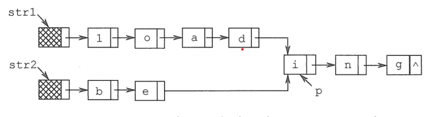
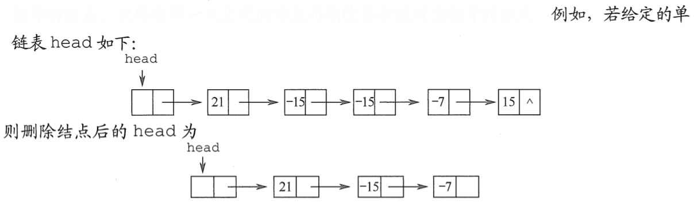

# 第二章 线性表

## 习题 - 选择

### 1. 线性表是具有$n$个（）的有序序列

**&emsp;&emsp;A. 数据表
&emsp;&emsp;&emsp;&emsp;B. 字符**  
**&emsp;&emsp;C. 数据元素
&emsp;&emsp;&emsp;&emsp;D. 数据项**

### 2. 以下（）是一个线性表

**&emsp;&emsp;A. 由$n$个实数组成的集合
&emsp;&emsp;&emsp;&emsp;B. 由$100$个字符组成的序列**  
**&emsp;&emsp;C. 所有整数组成的序列
&emsp;&emsp;&emsp;&emsp;D. 邻接表**

### 3. 在线性表中，除开始元素外，每个元素（）

**&emsp;&emsp;A. 只有唯一的前驱元素
&emsp;&emsp;&emsp;&emsp;B. 只有唯一的后继元素**  
**&emsp;&emsp;C. 有多个前驱元素
&emsp;&emsp;&emsp;&emsp;D. 有多个后继元素**

### 4. 下述（）是顺序存储结构的优点

**&emsp;&emsp;A. 存储密度大
&emsp;&emsp;&emsp;&emsp;B. 插入运算方便**  
**&emsp;&emsp;C. 删除运算方便
&emsp;&emsp;&emsp;&emsp;D. 方便地运用于各种逻辑结构的存储表示**

### 5. 线性表的顺序存储是是一种（）

**&emsp;&emsp;A. 随机存取的存储结构
&emsp;&emsp;&emsp;&emsp;B. 顺序存取的存储结构**  
**&emsp;&emsp;C. 索引存取的存储结构
&emsp;&emsp;&emsp;&emsp;D. 散列存取的存储结构**

### 6. 一个顺序表所占的存储空间大小与（）无关

**&emsp;&emsp;A. 表的长度
&emsp;&emsp;&emsp;&emsp;B. 元素的存放顺序**  
**&emsp;&emsp;C. 元素的类型
&emsp;&emsp;&emsp;&emsp;D. 元素中各字段的类型**

### 7. 若线性表最常用的操作是存取第$i$各元素及其前驱和后继元素的值，为了提高效率，应采用（）的存储方式

**&emsp;&emsp;A. 单链表
&emsp;&emsp;&emsp;&emsp;B. 双向链表**  
**&emsp;&emsp;C. 单循环链表
&emsp;&emsp;&emsp;&emsp;D. 顺序表**

### 8. 一个线性表最常用的操作是存取任一指定序号的元素并在最后进行插入删除操作，则利用（）存储方式可以节省时间

**&emsp;&emsp;A. 顺序表
&emsp;&emsp;&emsp;&emsp;B. 双链表**  
**&emsp;&emsp;C. 带头结点的双循环链表
&emsp;&emsp;&emsp;&emsp;D. 单循环链表**

### 9. 在$n$各元素的线性表的数组表示中，时间复杂度为$O(1)$的操作是（）

**Ⅰ. 访问第$i(1≤i≤n)$个结点和求第$i(2≤i≤n)$个结点的直接前驱**  
**Ⅱ. 在最后一个结点后插入一个新的结点**  
**Ⅲ. 删除第$1$个结点**  
**Ⅳ. 在第$i(1≤i≤n)$个结点后插入一个结点**

**&emsp;&emsp;A. Ⅰ
&emsp;&emsp;&emsp;&emsp;B. Ⅱ、Ⅲ**  
**&emsp;&emsp;C. Ⅰ、Ⅱ
&emsp;&emsp;&emsp;&emsp;D. Ⅰ、Ⅱ、Ⅲ**

### 10. 设线性表有$n$个元素，严格说来，以下操作中，（）在顺序表上实现要比链表上实现的效率高

**Ⅰ. 输出第$i(1≤i≤n)$个元素值**  
**Ⅱ. 交换第$3$个元素与第$4$个元素的值**  
**Ⅲ. 顺序输出这$n$个元素的值**

**&emsp;&emsp;A. Ⅰ
&emsp;&emsp;&emsp;&emsp;B. Ⅰ、Ⅲ**  
**&emsp;&emsp;C. Ⅰ、Ⅱ
&emsp;&emsp;&emsp;&emsp;D. Ⅱ、Ⅲ**

### 11. 在一个长度为$n$的顺序表中删除第$i(1≤i≤n)$个元素时，需向前移动（）个单位

**&emsp;&emsp;A. $n$
&emsp;&emsp;&emsp;&emsp;B. $i-1$**  
**&emsp;&emsp;C. $n-i$
&emsp;&emsp;&emsp;&emsp;D. $n-i+1$**

### 12. 对于顺序表，访问第$i$个位置得元素和在第$i$个位置插入一个元素得时间复杂度为（）

**&emsp;&emsp;A. $O(n), O(n)$
&emsp;&emsp;&emsp;&emsp;B. $O(n), O(1)$**  
**&emsp;&emsp;C. $O(1), O(n)$
&emsp;&emsp;&emsp;&emsp;D. $O(1), O(1)$**

### 13. 若长度为$n$得非空线性表采用顺序存储结构，在表得第$i$个位置插入一个数据元素，$i$得合法值应该是（）

**&emsp;&emsp;A. $1≤i≤n$
&emsp;&emsp;&emsp;&emsp;B. $1≤i≤n+1$**  
**&emsp;&emsp;C. $0≤i≤n-1$
&emsp;&emsp;&emsp;&emsp;D. $0≤i≤n$**

### 14. 顺序表得插入算法中，当$n$个空间已满时，可再申请增加分配$m$个空间，若申请失败，则说明系统没有（）可分配的存储空间

**&emsp;&emsp;A. $m$个
&emsp;&emsp;&emsp;&emsp;B. $m$个连续**  
**&emsp;&emsp;C. $n+m$个
&emsp;&emsp;&emsp;&emsp;D. $n+m$个连续**

### 15. 关于线性表的顺序存储结构和链式存储结构的描述中，正确的是（）

**Ⅰ. 线性表的顺序存储结构优于其链式存储结构**  
**Ⅱ. 链式存储结构比顺序存储结构更能方便地表示各种逻辑结构**  
**Ⅲ. 若频繁使用插入和删除结点操作，则顺序存储结构更优于链式存储结构**  
**Ⅳ. 顺序存储结构和链式存储结构都可以进行存取**

**&emsp;&emsp;A. Ⅰ、Ⅱ、Ⅲ
&emsp;&emsp;&emsp;&emsp;B. Ⅱ、Ⅳ**  
**&emsp;&emsp;C. Ⅱ、Ⅲ
&emsp;&emsp;&emsp;&emsp;D. Ⅲ、Ⅳ**

### 16. 对于一个线性表既要求能够进行比较快速得插入和删除，又要求存储结构能反映数据之间的逻辑关系，则应该用（）

**&emsp;&emsp;A. 顺序存储方式
&emsp;&emsp;&emsp;&emsp;B. 链式存储方式**  
**&emsp;&emsp;C. 散列存储方式
&emsp;&emsp;&emsp;&emsp;D. 以上均可以**

### 17. 对于顺序存储的线性表，其算法时间复杂度为$O(1)$的运算应该是（）

**&emsp;&emsp;A. 将$n$个元素从小到大排序
&emsp;&emsp;&emsp;&emsp;B. 删除第$i(1≤i≤n)$个元素**  
**&emsp;&emsp;C. 改变第$i(1≤i≤n)$个元素的值
&emsp;&emsp;&emsp;&emsp;D. 在第$i(1≤i≤n)$个元素后插入一个新元素**

### 18. 下列关于线性表说法中，正确的是（）

**Ⅰ. 顺序存储方式只能用于存储线性结构**  
**Ⅱ. 取线性表的第$i$个元素的时间与$i$的大小有关**  
**Ⅲ. 静态链表需要分配较大的连续空间，插入和删除不需要移动元素**  
**Ⅳ. 在一个长度为$n$的有序单链表中插入一个新结点并仍保持有序的时间复杂度为$O(n)$**  
**Ⅴ. 若用单链表来表示队列，则应该选用带尾指针的循环链表**

**&emsp;&emsp;A. Ⅰ、Ⅱ
&emsp;&emsp;&emsp;&emsp;B. Ⅰ、Ⅲ、Ⅳ、Ⅴ**  
\*_&emsp;&emsp;C. Ⅳ、Ⅴ
&emsp;&emsp;&emsp;&emsp;D. Ⅲ、Ⅳ、Ⅴ_

### 19. 设线性表中有$2n$哥元素，（）在单链表上实现要比在顺序表上实现效率更高

**&emsp;&emsp;A. 删除所有值为$x$的元素
&emsp;&emsp;&emsp;&emsp;B. 在最有一个元素的后面插入一个新元素**  
**&emsp;&emsp;C. 顺序输出前$k$个元素
&emsp;&emsp;&emsp;&emsp;D. 交换第$i$个元素和第$2n-i-1$个元素的值（$i=0,..,n-1$）**

### 20. 在一个单链表中，已知$q$所指结点是$p$所指结点的前驱结点，若在$q$和$p$之间插入结点$s$，则执行（）

**&emsp;&emsp;A. $s->next=p->next;p->next=s$
&emsp;&emsp;&emsp;&emsp;B. $p->next=s->next;s->next=p$**  
**&emsp;&emsp;C. $q->next=s;s->next=p$
&emsp;&emsp;&emsp;&emsp;D. $p->next=s;s->next=q$**

### 21. 给定有$n$个元素的一维数组，建立一个有序单链表的最低时间复杂度是（）

**&emsp;&emsp;A. $O(1)$
&emsp;&emsp;&emsp;&emsp;B. $O(n)$**  
**&emsp;&emsp;C. $O(n^2)$
&emsp;&emsp;&emsp;&emsp;D. $O(nlog_2n)$**

### 22. 单链表中，增加一个头结点的目的是为了（）

**&emsp;&emsp;A. 使单链表至少有一个结点
&emsp;&emsp;&emsp;&emsp;B. 标识表结点中首结点的位置**  
**&emsp;&emsp;C. 方便运算的实现
&emsp;&emsp;&emsp;&emsp;D. 说明单链表是线性表的链式存储**

### 23. 在一个长度为$n$的带头结点的单链表$h$上，设有尾指针$r$，则执行（）操作与单链表的表长有关

**&emsp;&emsp;A. 删除单链表中的第一个元素
&emsp;&emsp;&emsp;&emsp;B. 删除单链表中的最后一个元素**  
**&emsp;&emsp;C. 索引存取的存储结构
&emsp;&emsp;&emsp;&emsp;D. 散列存取的存储结构**

### 24. 对于一个头结点指针为$head$的带头结点的单链表，判定该表为空表的条件是（）；对于不带头结点的单链表，判定空表的条件是（）

**&emsp;&emsp;A. $head=NULL$
&emsp;&emsp;&emsp;&emsp;B. $head->next=NULL$**  
**&emsp;&emsp;C. $head->next==head$
&emsp;&emsp;&emsp;&emsp;D. $head!=NULL$**

### 25. 下面关于线性表的一些说法中，正确的是（）

**&emsp;&emsp;A. 对于一个设有头指针和尾指针的单链表执行删除最后一个元素的操作与链表长度无关
&emsp;&emsp;&emsp;&emsp;B. 线性表中每个元素都有一个直接前驱和一个直接后继**  
**&emsp;&emsp;C. 为了方便插入和删除数据，可以使用双链表存放数据
&emsp;&emsp;&emsp;&emsp;D. 取线性表第$i$个元素的时间与$i$的大小有关**

### 26. 在双链表中向$p$所指的结点之前插入一个结点$q$的操作为（）

**&emsp;&emsp;A. $p->prior=q;q->next=p;p->prior->next=q;q->prior=p->prior$
&emsp;&emsp;&emsp;&emsp;B. $q->prior=p->prior;p->prior->next=q;q->next=p;p->prior=q->next$**  
**&emsp;&emsp;C. $q->next=p;p->next=q;p->prior->next=q;q->next=p$
&emsp;&emsp;&emsp;&emsp;D. $p->prior->next=q;q->next=p;q->prior=p->prior;p->prior=q$**

### 27. 在双链表存储结构中，删除$p$所指结点时必须修改指针（）

**&emsp;&emsp;A. `p->llink->rlink=p->rlink;p->rlink->llink=p->llink;`
&emsp;&emsp;&emsp;&emsp;B. $p->llink=p->llink->llink;p->llink->rlink=p;$**  
**&emsp;&emsp;C. `p->rlink->llink=p;p->rlink=p->rlink->rlink;`
&emsp;&emsp;&emsp;&emsp;D. `p->rlink=p->llink->llink;p->llink=p->rlink->rlink;`**

### 28. 在长度为$n$的有序单链表中插入一个新结点，并仍然保持有序的时间复杂度是（）

**&emsp;&emsp;A. $O(1)$
&emsp;&emsp;&emsp;&emsp;B. $O(n)$**  
**&emsp;&emsp;C. $O(n^2)$
&emsp;&emsp;&emsp;&emsp;D. $O(nlog_2n)$**

### 29. 与单链表相比，双链表的优点之一是（）

**&emsp;&emsp;A. 插入、删除操作更方便
&emsp;&emsp;&emsp;&emsp;B. 可以进行随机访问**  
**&emsp;&emsp;C. 可以省略表头指针或表尾指针
&emsp;&emsp;&emsp;&emsp;D. 访问前后相邻结点更灵活**

### 30. 带头结点的双循环链表$L$为空的条件是（）

**&emsp;&emsp;A. `L->prior=L&&L->next==NULL`
&emsp;&emsp;&emsp;&emsp;B. `L->prior==NULL&&L->Next==NULL`**  
**&emsp;&emsp;C. `L->prior==NULL&&L->Next==L`
&emsp;&emsp;&emsp;&emsp;D. `L->prior==L&&L->next==L`**

### 31. 一个链表最常用的操作是在末尾插入结点和删除结点，则选用（）最省时间

**&emsp;&emsp;A. 带头结点的双循环链表
&emsp;&emsp;&emsp;&emsp;B. 单循环链表**  
**&emsp;&emsp;C. 带尾指针的带循环链表
&emsp;&emsp;&emsp;&emsp;D. 单链表**

### 32. 设对$n(n>1)$个元素的线性表的运算只有$4$种：删除第一个元素；删除最后一个元素；在第一个元素之前插入新元素；在最后一个元素之后插入新元素，则最好使用（）

**&emsp;&emsp;A. 只有尾结点指针没有头结点指针的循环单链表
&emsp;&emsp;&emsp;&emsp;B. 只有尾结点指针没有头结点指针的非循环双链表**  
**&emsp;&emsp;C. 只有头结点指针没有尾结点指针的循环双链表
&emsp;&emsp;&emsp;&emsp;D. 既有头结点指针又有尾结点指针的循环单链表**

### 33. 一个链表最常用的操作是在最后一个元素之后插入一个元素和删除第一个元素，则选用（）最节省时间

**&emsp;&emsp;A. 不带头结点的单循环链表
&emsp;&emsp;&emsp;&emsp;B. 双链表**  
**&emsp;&emsp;C. 不带头结点且有尾指针的单循环链表
&emsp;&emsp;&emsp;&emsp;D. 单链表**

### 34. 静态链表中指针表示的是（）

**&emsp;&emsp;A. 下一元素的地址
&emsp;&emsp;&emsp;&emsp;B. 内存储器地址**  
**&emsp;&emsp;C. 下一个元素在数组种的位置
&emsp;&emsp;&emsp;&emsp;D. 左链或右链指向的元素的地址**

### 35.【2016 统考真题】已知表头元素为$c$的单链表在内存中的存储状态如下表所示，现将$f$存放于$1014H$处并插入单链表，若$f$在逻辑上位于$a$和$e$之间，则$a,e,f$的“链接地址”依次是（）

<div align="center"></div>

**&emsp;&emsp;A. $1010H,1014H,1004H$
&emsp;&emsp;&emsp;&emsp;B. $1010H,1004H,1014H$**  
**&emsp;&emsp;C. $1014H,1010H,1004H$
&emsp;&emsp;&emsp;&emsp;D. $1014H,1004H,1010H$**

### 36. 需要分配较大空间，插入和删除不需要移动元素的线性表，其存储结构为（）

**&emsp;&emsp;A. 单链表
&emsp;&emsp;&emsp;&emsp;B. 静态链表**  
**&emsp;&emsp;C. 顺序表
&emsp;&emsp;&emsp;&emsp;D. 双链表**

### 37. 某线性表用带头结点的循环的单链表存储，头指针为$head$，当$head->next->next=head$成立时，线性表长度可能是（）

**&emsp;&emsp;A. $0$
&emsp;&emsp;&emsp;&emsp;B. $1$**  
**&emsp;&emsp;C. $2$
&emsp;&emsp;&emsp;&emsp;D. 可能为$0$或$1$**

## 习题 - 综合

### 1. 从顺序表中删除具有最小值的元素（假设唯一）并由函数返回被删元素的值。空出的位置由最后一个元素填补，若顺序表为空则显示出错信息并退出运行

### 2. 设计一个高效算法，讲顺序表$L$的所有元素逆置，要求算法的空间复杂度为$O(1)$

### 3. 对长度为$n$的顺序表$L$，编写一个时间复杂度为$O(n)$、空间复杂度为$O(1)$的算法，该算法删除线性表中所有值为$x$的数据元素

### 4. 从有序顺序表种删除其值在给定$s$与$t$之间（要求$s<t$)的所有元素，如果$s$或$t$不合理或顺序表为空，则显示出错信息并退出运行

### 5. 从顺序表中删除其值在给定$s$与$t$之间（包含$s$和$t$，要求$s<t$）的所有元素，如果$s$或$t$不合理或顺序表为空，则显示出错信息并退出运行

### 6. 从有序顺序表中删除所有其值重复的元素，使表中所有元素均不相同

### 7. 将两个有序顺序表合并为一个新的有序顺序表，并由函数返回结果顺序表

### 8. 已知在一维数组$A[m+n]$种一次存放两个线性表$(a_1,a_2,...,a_m),(b_1,b_2,...,b_n)$。试写一个函数，将数组中两个顺序表的位置互换，即将$(b_1,b_2,...,b_n)$放在$(a_1,a_2,...,a_m)$的前面

### 9. 线性表$(a_1,a_2,...,a_n)$中的元素递增有序且按顺序存储于计算机内。要求设计一算法，完成用最少时间在表中查找数值为$x$的元素，若找到则将其与后继元素位置相交换，若找不到则将其插入表中并使表中元素仍递增有序

### 10.【2010 统考真题】设将$n(n>1)$个整数存放到一维数组$R$中。设计一个在时间和空间两方面都尽可能高效的算法。将$R$中保存的序列循环左移$p(0<p<n)$个位置，即将$R$中的数据由$(X_0,X_1,...,X_{n-1})$变换为$(X_p,X_{p+1},...,X_{n-1},X_0,X_1,...,X_{p-1}$。要求

**（1）给出算法的基本设计思想**  
**（2）根据设计思想，采用`C/C++`或`Java`语言描述算法，关键之处给出注释**  
**（3）说明你所设计算法的时间复杂度和空间复杂度**

### 11.【2011 统考真题】一个长度为$L(L≥1)$的升序序列$S$，处在第$\lceil L/2 \rceil$个位置的数称为$S$的中位数。例如，若序列$S_1=(11,13,15,17,19)$，则$S_1$的中位数是$15$，两个序列的中位数是含它们所有元素的升序序列的中位数。例如，若$S_2=(2,4,6,8,20)$，则$S_1$和$S_2$的中位数是$11$。现在又两个等长升序序列$A$和$B$，试设计一个在时间和空间两方面都尽可能高效的算法，找出两个序列$A$和$B$的中位数。要求

**（1）给出算法的基本设计思想**  
**（2）根据设计思想，采用`C/C++`或`Java`语言描述算法，关键之处给出注释**  
**（3）说明你所设计算法的时间复杂度和空间复杂度**

### 12.【2013 统考真题】已知一个整数序列$A=(a_0,a_1,...,a_{n-1})$，其中$0≤a_i≤n(0≤i<n)$。若存在$a{p1}=a{p2}=...=a{pm}=x$且$m>n/2(0≤p_k<n,1≤k≤m)$，则称$x$为$A$的主要元素。例如$A=(0,5,5,3,5,7,5,5)$，则$5$为主元素；又如$A=(0,5,5,3,5,1,5,7)$，则$A$中没有主元素。假设$A$中的$n$个元素保存在一个一维数组中，请设计一个尽可能高效的算法，找出$A$的主元素。若存在主元素，则输出该元素；否则输出$-1$。要求

**（1）给出算法的基本设计思想**  
**（2）根据设计思想，采用`C/C++`或`Java`语言描述算法，关键之处给出注释**  
**（3）说明你所设计算法的时间复杂度和空间复杂度**

### 13.【2018 统考真题】给应一个含$n(n>1)$个整数的数组，请设计一个在时间上尽可能高效的算法，找出数组中未出现的最小正整数。例如，数组${-5,3,2,3}$中出现的最小正整数是$1$；数组${1,2,3}$中未出现的最小正数是$4$。要求

**（1）给出算法的基本设计思想**  
**（2）根据设计思想，采用`C/C++`或`Java`语言描述算法，关键之处给出注释**  
**（3）说明你所设计算法的时间复杂度和空间复杂度**

### 14. 设计一个递归算法，删除不带头节点的单链表$L$中所有值为$x$的结点

### 15. 在带头结点的单链表$L$中，删除所有值为$x$的结点，并释放其空间，假设值为$x$的结点不唯一，试编写算法以实现上述操作

### 16. 设$L$为带头结点的单链表，编写算法实现从尾到头反向输出每个结点的值

### 17. 试编写在带头结点的单链表$L$中删除一个最小值结点的高效算法（假设最小值结点是唯一的）

### 18. 试编写算法将带头结点的单链表就地逆置，所谓“就地”是指辅助空间复杂度为$O(1)$

### 19. 有一个带头结点的单链表$L$，设计一个算法使其元素递增有序

### 20. 设在一个带表头结点的单链表中所有元素结点的数据值无序，试编写一个函数，删除表中所有介于给定的两个值（作为函数参数给出）之间的元素的元素（若存在）

### 21. 给定两个单链表，试编写算法找出两个链表的公共节点

### 22. 给定一个带表头结点的单链表，设$head$为头指针，结点结构为$(data,next)$，$data$为整型元素，$next$为指针，试写出算法：按递增次序输出单链表中各结点的数据元素，并释放结点所占的存储空间（要求：不允许使用数组作为辅助空间）

### 23. 建一个带头结点的单链表$A$分解为两个带头结点的单链表$A$和$B$，使得$A$表中含有原表中序号为奇数的元素，而$B$表中含有原表中序号为偶数的元素，且保持其相对顺序不变

### 24.设$C={a_1,b_1,a_2,b_2,...,a_n,b_n}$为线性表，采用带头结点的$hc$单链表存放，设计一个就地算法，将其拆分为两个线性表，使得$A={a_1,a_2,...,a_n}$，$B={bn,...,b_2,b_1}$

### 25. 在一个递增有序的线性表中，有数值相同的元素存在。若存储方式为单链表，设计算法去掉数值相同的元素，使表中不再有重复的元素，例如$(7,10,10,21,30,42,42,42,51,70)$将变为$(7,10,21,30,42,51,70)$

### 26. 假设有两个按元素值递增次序排列的顺序表，均以单链表形式存储。请编写算法将这两个单链表归并成为一个按元素值递减次序排列的单链表，要求利用原来两个单链表的结点存放归并后的单链表

### 27. 设$A$和$B$是两个单链表（带头结点），其中元素递增有序。设计一个算法从$A$和$B$中的公共元素产生单链表$C$，要求不破坏$A、B$的结点

### 28. 已知两个链表$A$和$B$分别表示两个集合，其元素递增排列。编制函数，求$A$与$B$的交集，并存放$A$链表中

### 29. 两个整数序列$A=a_1,a_2,...,a_m$和$B=b_1,b_2,b_3,...,b_n$已经存入两个单链表中，设计一个算法， 判断序列$B$是否是序列$A$的连续子序列

### 30. 设计一个算法用于判断带头结点的循环双链表是否对称

### 31. 有两个循环单链表，链表头指针分别为$h1$和$h2$，编写一个函数将链表$h2$链接到链表$h1$之后，要求链接后的链表仍保持循环链表形式

### 32. 设有一个带头结点的循环单链表，其结点值均为正整数。设计一个算法，反复找出单链表中结点值最小结点并输出，然后将该结点从中删除，直到单链表空为止，再删除表头结点

### 33. 设头指针为$L$的带有表头结点的非循环双向链表，其每个节点中除有$pred$（前驱指针），$data$（数据）和$next$（后继指针）域外，还有一个访问频度域$freq$。在链表被启用前，其值均初始化为零。每当在链表中进行一次$Locate(L,x)$运算时，令元素值为$x$的结点中$freq$域值增$1$，并使此链表中结点保持按访问频度非（递减）的顺序排列，同时最近访问的结点排在频度相同的结点前面，以便使频繁访问的结点总是靠近表头。试编写符合上诉要求的$Locate(L,x)$运算的算法，该运算为函数过程，返回找到结点的地址，类型为指针型

### 34.【2009 统考真题】已知一个带有表头结点的单链表，结点结构为$[data|link]$。假设该链表只给出了头指针$list$。在不改变链表的前提下，请设计一个尽可能高效的算法，查找链表中倒数第$k$个位置上的结点（$k$为正整数）。若查找成功，算法输出该结点的$data$域的值，并返回$1$；否则，只返回$0$。要求

**（1）描述算法的基本设计思想**  
**（2）描述算法的详细实现步骤**  
**（2）根据设计思想和实现步骤，采用`C/C++`或`Java`语言描述算法，关键之处给出注释**

### 35.【2012 统考真题】假定采用头结点的单链表保存单词，当两个单词有相同的后缀时，克恭喜相同的后缀存储空间，例如，$"loading"$和"beging"的存储映像如下图所示。设$str1$和$str2$分别指向两个单词所在单链表的头节点，结点链表结构为$[data|next]$，请设计一个时间上尽可能高效的算法，找出由$str1$和$str2$所指向两个链表共同后缀的起始位置（如图中字符$i$所在结点的位置$p$）。要求

**（1）给出算法的基本设计思想**  
**（2）根据设计思想，采用`C/C++`或`Java`语言描述算法，关键之处给出注释**  
**（3）说明你所设计算法的时间复杂度**

<div align="center"></div>

### 36.【2015 统考真题】用单链表保存$m$个整数，节点结构为$[data|link]$，且$|data|≤n$（$n$为正整数）。要求设计一个时间复杂度尽可能高效的算法，对于链表中$data$的绝对值相等的结点，仅保留第一次出现的结点而删除其余绝对值相等的结点

<div align="center"></div>

**（1）给出算法的基本设计思想**  
**（2）采用`C/C++`或`Java`语言描述算法，给出单链表节点的数据类型定义**  
**（3）根据设计思想，采用`C/C++`或`Java`语言描述算法，关键之处给出注释**  
**（3）说明你所设计算法的时间复杂度和空间复杂度**

### 37. 设计一个算法完成以下功能：判断一个链表是否有环，如果有，找出环的入口点并返回，否则返回$NULL$

### 38.【2019 统考真题】设线性表$L=(a_1,a_2,a_3,...,a_{n-2},a_{n-1},a_n)$采用带头结点的单链表保存，链表中的结点定义如下代码块。请设计一个空间复杂度为$O(1)$且时间上尽可能高效的算法，重新排列$L$中的个节点，时的线性表$L'=(a_1,a_2,a_{n-1},a_3,a_{n-2}...)$。要求

**（1）给出算法的基本设计思想**  
**（2）根据设计思想，采用`C/C++`或`Java`语言描述算法，关键之处给出注释**  
**（3）说明你所设计算法的时间复杂度**

```cpp
typedef struct node
{
    int data;
    struct node* next;
}NODE;
```

## 答案与解析 - 选择

### 1.C

线性表由具有相同数据类型的有限数据元素组成的，数据元素有数据项组成的

### 2.B

线性表定义的要求为：相同数据类型、有序序列

### 3.A

线性表中，除最后一个（或第一个）元素外，每个元素只有一个后继（或前驱）元素
