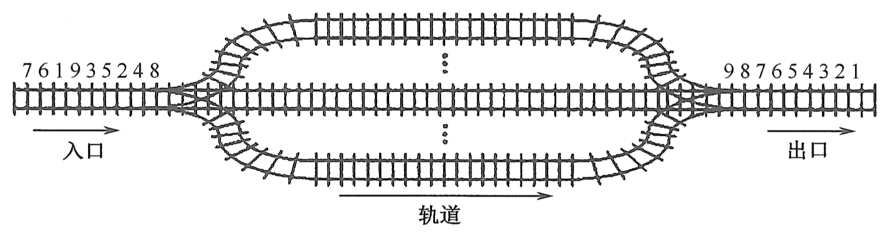
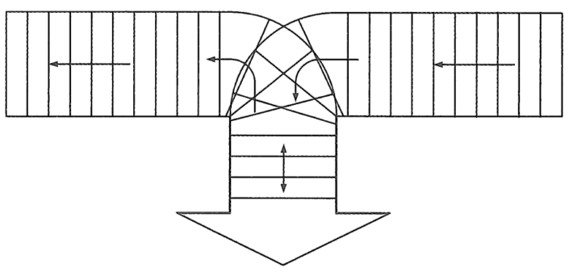

# 第三章 栈和队列

## 习题 - 选择

### 1. 栈和队列具有相同的（）

**&emsp;&emsp;A. 抽象数据类型
&emsp;&emsp;&emsp;&emsp;B. 逻辑结构**  
**&emsp;&emsp;C. 存储结构
&emsp;&emsp;&emsp;&emsp;D. 运算**

### 2. 栈是（）

**&emsp;&emsp;A. 顺序存储的线性结构
&emsp;&emsp;&emsp;&emsp;B. 链式存储的非线性结构**  
**&emsp;&emsp;C. 限制存取点的线性结构
&emsp;&emsp;&emsp;&emsp;D. 限制存储点的非线性结构**

### 3.（）不是栈的基本操作

**&emsp;&emsp;A. 删除栈顶元素
&emsp;&emsp;&emsp;&emsp;B. 删除栈底元素**  
**&emsp;&emsp;C. 判断栈是否为空
&emsp;&emsp;&emsp;&emsp;D. 将栈置为空栈**

### 4. 假定利用数组$a[n]$顺序存储一个栈，用$top$表示栈顶指针，用$top==-1$表示栈空，并已知栈未满，当元素$x$进栈时所执行的操作为（）

**&emsp;&emsp;A. `a[--top]=x`
&emsp;&emsp;&emsp;&emsp;B. `a[top--]=x`**  
**&emsp;&emsp;C. `a[++top]=x`
&emsp;&emsp;&emsp;&emsp;D. `a[top++]=x`**

### 5. 设有一个空栈，栈顶指针为$1000H$，每个元素需要一个存储单元，执行$Push、Push、Pop、Push、Pop、Push、Pop、Push$操作后，栈顶指针的值为（）

**&emsp;&emsp;A. $1002H$
&emsp;&emsp;&emsp;&emsp;B. $1003H$**  
**&emsp;&emsp;C. $1004H$
&emsp;&emsp;&emsp;&emsp;D. $1005H$**

### 6. 和顺序栈相比，链栈有一个比较明显的优势，即（）

**&emsp;&emsp;A. 通常不会出现栈满情况
&emsp;&emsp;&emsp;&emsp;B. 通常不回出现栈空情况**  
**&emsp;&emsp;C. 插入操作更容易实现
&emsp;&emsp;&emsp;&emsp;D. 删除操作更容易实现**

### 7. 设链表不带头结点且所有操作均在表头进行，则下列最不适合作为链栈的是（）

**&emsp;&emsp;A. 只有表头结点指针，没有表尾指针的双向循环链表
&emsp;&emsp;&emsp;&emsp;B. 只有表尾结点指针，没有表头指针的双向循环链表**  
**&emsp;&emsp;C. 只有表头结点指针，没有表尾指针的单向循环链表
&emsp;&emsp;&emsp;&emsp;D. 只有表尾结点指针，没有表头指针的单向循环链表**

### 8. 向一个栈顶指针为$top$的链栈中插入一个$x$的结点，则执行（）

**&emsp;&emsp;A. `top->next=x`
&emsp;&emsp;&emsp;&emsp;B. `x->next=top->next; top->next=x`**  
**&emsp;&emsp;C. `x->next=top;top=x`
&emsp;&emsp;&emsp;&emsp;D. `x->next=top, top=top->next`**

### 9. 链栈只想$Pop$操作，并将出栈的元素存在$x$中，应该执行（）

**&emsp;&emsp;A. `x=top; top=top->next`
&emsp;&emsp;&emsp;&emsp;B. `x=top->data`**  
**&emsp;&emsp;C. `top=top->next; x=top->data`
&emsp;&emsp;&emsp;&emsp;D. `x=top->data; top=top->next`**

### 10. 经过以下栈操作后，`InitStack(st); Push(st, a); Push(st, b); Pop(st, x); Top(st, x)`变量$x$的值为（）

**&emsp;&emsp;A. $a$
&emsp;&emsp;&emsp;&emsp;B. $b$**  
**&emsp;&emsp;C. $NuLL$
&emsp;&emsp;&emsp;&emsp;D. $FALSE$**

### 11. $3$个不同元素依次进栈，能得到（）种不同的出栈序列

**&emsp;&emsp;A. $4$
&emsp;&emsp;&emsp;&emsp;B. $5$**  
**&emsp;&emsp;C. $6$
&emsp;&emsp;&emsp;&emsp;D. $7$**

### 12. 设$a,b,c,d,e,f$以所给的次序进栈，若在进栈操作时，允许出栈操作，则下面得不到的序列为（）

**&emsp;&emsp;A. $4$
&emsp;&emsp;&emsp;&emsp;B. $5$**  
**&emsp;&emsp;C. $6$
&emsp;&emsp;&emsp;&emsp;D. $7$**

### 13.用$S$表示进栈操作，用$X$表示出栈操作，若元素的进栈顺序是$1234$，为了得到$1342$的出栈顺序，相应的$S$和$X$的操作序列为（）

**&emsp;&emsp;A. $4$
&emsp;&emsp;&emsp;&emsp;B. $5$**  
**&emsp;&emsp;C. $6$
&emsp;&emsp;&emsp;&emsp;D. $7$**

### 14.【2010 统考真题】若元素$a,b,c,d,e,f$依次进栈，允许进栈、退栈操作交替进行，但不允许连续$3$次进行退栈操作，不可能得到的出栈序列是（）

**&emsp;&emsp;A. $dcebfa$
&emsp;&emsp;&emsp;&emsp;B. $cbdaef$**  
**&emsp;&emsp;C. $bcaefd$
&emsp;&emsp;&emsp;&emsp;D. $afedcb$**

### 15.【2018 统考真题】若栈$S1$中保存整数，栈$S2$中保存运算符，函数$F()$依次执行下述各步操作；假定$S1$中的操作数依次是$5,8,3,2$（$2$在栈顶），$S2$中的运算符依次是$×、-、+$（$+$在栈顶）。调用$3$次$F()$后，$S1$栈顶保存的是（）

**&emsp;&emsp;A. $-15$
&emsp;&emsp;&emsp;&emsp;B. $15$**  
**&emsp;&emsp;C. $3$
&emsp;&emsp;&emsp;&emsp;D. $4$**

### 16.【2009 统考真题】设栈$S$和队列$Q$的初始状态均为空，元素$abcdefg$依次进入栈$S$。若每个元素出栈后立即进入队列$Q$，且$7$个元素出队的顺序是$bdcfeag$，则栈$S$的容量至少是（）

**&emsp;&emsp;A. $1$
&emsp;&emsp;&emsp;&emsp;B. $2$**  
**&emsp;&emsp;C. $3$
&emsp;&emsp;&emsp;&emsp;D. $4$**

### 17. 若一个栈的输入序列是$1,2,3,...,n$，输出序列的第一个元素是$n$，则第$i$个输出元素是（）

**&emsp;&emsp;A. $不确定$
&emsp;&emsp;&emsp;&emsp;B. $n-i$**  
**&emsp;&emsp;C. $n-i-1$
&emsp;&emsp;&emsp;&emsp;D. $n-i+1$**

### 18. 若一个栈的输入序列是$1,2,3,...,n$，输出序列的第一个元素是$i$，则第$j$个输出元素是（）

**&emsp;&emsp;A. $i-j-1$
&emsp;&emsp;&emsp;&emsp;B. $i-j$**  
**&emsp;&emsp;C. $i-j+1$
&emsp;&emsp;&emsp;&emsp;D. $不确定$**

### 19. 某栈的输入序列为$a,b,c,d$，下面的$4$个序列中，不可能为其输出序列的是（）

**&emsp;&emsp;A. $a,b,c,d$
&emsp;&emsp;&emsp;&emsp;B. $c,b,d,a$**  
**&emsp;&emsp;C. $d,c,a,b$
&emsp;&emsp;&emsp;&emsp;D. $a,c,b,d$**

### 20. 若一个栈的输入序列是$P_1,P_2,...,P_n$，输出序列是$1,2,3,...,n$，若$P_3=1$，则$P_1$的值（）

**&emsp;&emsp;A. 可能是$2$
&emsp;&emsp;&emsp;&emsp;B. 一定是$2$**  
**&emsp;&emsp;C. 不可能是$2$
&emsp;&emsp;&emsp;&emsp;D. 不可能是$3$**

### 21. 若已知一个栈的入栈序列是$1,2,3,4$，其出栈序列为$P_1,P_2,P_3,P_4$，则$P_2,P_4$不可能是（）

**&emsp;&emsp;A. $2,4$
&emsp;&emsp;&emsp;&emsp;B. $2,1$**  
**&emsp;&emsp;C. $4,3$
&emsp;&emsp;&emsp;&emsp;D. $3,4$**

### 22.【2013 统考真题】一个栈的入栈序列为$1,2,3,...,n$，出栈序列是$P_1,P_2,P_3,...,P_n$。若$P_2=3$，则$P_3$可能取值的个数是（）

**&emsp;&emsp;A. $n-3$
&emsp;&emsp;&emsp;&emsp;B. $n-2$**  
**&emsp;&emsp;C. $n-1$
&emsp;&emsp;&emsp;&emsp;D. $无法确定$**

### 23. 设栈的初始状态为空，当字符序列"$n1_$"作为栈的输入时，输出长度为$3$，且可用做`C`余元标识符的序列有（）个

**&emsp;&emsp;A. $4$
&emsp;&emsp;&emsp;&emsp;B. $5$**  
**&emsp;&emsp;C. $3$
&emsp;&emsp;&emsp;&emsp;D. $6$**

### 24.【2011 统考真题】元素$a,b,c,d,e$依次进入初始为空的栈中，若元素进栈后可停留、可出栈，直到所有元素都出栈，则在所有可能的出栈序列中，以元素$d$开头的序列个数是（）

**&emsp;&emsp;A. $3$
&emsp;&emsp;&emsp;&emsp;B. $4$**  
**&emsp;&emsp;C. $5$
&emsp;&emsp;&emsp;&emsp;D. $6$**

### 25. 采用共享栈的好处是（）

**&emsp;&emsp;A. 减少存取时间，降低发生上溢的可能
&emsp;&emsp;&emsp;&emsp;B. 节省存储空间，降低发生上溢的可能**  
**&emsp;&emsp;C. 减少存取时间，降低发生下溢的可能
&emsp;&emsp;&emsp;&emsp;D. 节省存储空间，降低发生下溢的可能**

### 26.【2017 统考真题】下列关于栈的叙述中，错误的是（）

**Ⅰ. 采用非递归方式重写递归程序时必须使用栈**  
**Ⅱ. 函数调用时，系统要用栈来保存必要的信息**  
**Ⅲ. 只要确定了入栈次序，即可确定出栈次序**  
**Ⅳ. 栈是一种受限的线性表，允许在其两端进行操作**

**&emsp;&emsp;A. 仅Ⅰ
&emsp;&emsp;&emsp;&emsp;B. 仅Ⅰ、Ⅱ、Ⅲ**  
**&emsp;&emsp;C. 仅Ⅰ、Ⅲ、Ⅳ
&emsp;&emsp;&emsp;&emsp;D. 仅Ⅱ、Ⅲ、Ⅳ**

### 27. 设有一个顺序共享栈$Share[0:n-1]$，其中第一个栈顶指针$top1$的初值为$-1$，第二个栈顶指针$top2$的初值为$n$，则判断共享栈满的条件是（）

**&emsp;&emsp;A. `top2-top1==1`
&emsp;&emsp;&emsp;&emsp;B. `top1-top2==1`**  
**&emsp;&emsp;C. `top1==top2`
&emsp;&emsp;&emsp;&emsp;D. 以上都不对**

### 28. 栈和队列的主要区别在于（）

**&emsp;&emsp;A. 它们的逻辑结构不一样
&emsp;&emsp;&emsp;&emsp;B. 他们的存储结构不一样
**&emsp;&emsp;C. 所包含的元素不一样
&emsp;&emsp;&emsp;&emsp;D. 插入、删除操作的限定不一样

### 29. 队列的“先进先出”特性是指（）

**Ⅰ. 最后插入队列中的元素总是最后被删除**  
**Ⅱ. 当同时进行插入、删除操作时，总是插入操作优先**  
**Ⅲ. 每当有删除操作时，总要先做一次插入操作**  
**Ⅳ. 每次从队列中删除的总是最早插入的元素**

**&emsp;&emsp;A. Ⅰ
&emsp;&emsp;&emsp;&emsp;B. Ⅰ、Ⅳ**  
**&emsp;&emsp;C. Ⅱ、Ⅲ
&emsp;&emsp;&emsp;&emsp;D. Ⅳ**

### 30. 允许对队列进行的操作有（）

**&emsp;&emsp;A. 对队列中的元素排序
&emsp;&emsp;&emsp;&emsp;B. 取出最近进队的元素
**&emsp;&emsp;C. 在队列元素之间插入元素
&emsp;&emsp;&emsp;&emsp;D. 删除队头元素

### 31. 一个队列的入队顺序是$1,2,3,4$，则出队的输出顺序是（）

**&emsp;&emsp;A. $4,3,2,1$
&emsp;&emsp;&emsp;&emsp;B. $1,2,3,4$
**&emsp;&emsp;C. $1,4,3,2$
&emsp;&emsp;&emsp;&emsp;D. $3,2,4,1$

### 32. 循环队列存储在数组$A[0...n]$中，入队时的操作为（）

**&emsp;&emsp;A. `rear=rear+1`
&emsp;&emsp;&emsp;&emsp;B. `rear=(rear+1) mod (n-1)`
**&emsp;&emsp;C. `rear=(rear+1) mod n`
&emsp;&emsp;&emsp;&emsp;D. `rear=(rear+1) mod (n+1)`

### 33. 已知循环队列的存储空间为数组$A[21]$，$front$指向队头元素的前一个位置，$rear$指向队尾元素，假设当前$front$喝$rear$的值分别为$8$和$3$，则该队列的长度为（）

**&emsp;&emsp;A. $5$
&emsp;&emsp;&emsp;&emsp;B. $6$
**&emsp;&emsp;C. $16$
&emsp;&emsp;&emsp;&emsp;D. $17$

### 34. 若用数组$A[0...5]$来实现循环队列，且当前$rear$和$front$的值分别为$1$和$5$，当从队列中删除一个元素，再加入两个元素后，$rear$和$front$的值分别为（）

**&emsp;&emsp;A. $3,4$
&emsp;&emsp;&emsp;&emsp;B. $3,0$
**&emsp;&emsp;C. $5,0$
&emsp;&emsp;&emsp;&emsp;D. $5,1$

### 35.【2011 统考真题】已知循环队列存储在一组一维数组$A[0...n-1]$中，且队列非空时$front$和$rear$分别指向队头元素和队尾元素。若初始时队列为空，且要求第一个进入队列的元素存储在$A[0]$处，则初始时$front$和$rear$的值分别是（）

**&emsp;&emsp;A. $0,0$
&emsp;&emsp;&emsp;&emsp;B. $0,n-1$
**&emsp;&emsp;C. $n-1,0$
&emsp;&emsp;&emsp;&emsp;D. $n-1,n-1$

### 36. 假设一个循环队列$Q[MaxSize]$的队头指针为$front$，队尾指针为$rear$，队列的最大容量为$MaxSize$，除此之外，该队列没有其他数据成员，则判断该队列满的条件是（）

**&emsp;&emsp;A. `Q.front==Q.rear`
&emsp;&emsp;&emsp;&emsp;B. `Q.front+Q.rear>=MaxSize`
**&emsp;&emsp;C. `Q.front==(Q.rear+1)%MaxSize`
&emsp;&emsp;&emsp;&emsp;D. `Q.rear=(Q.front+1)%MaxSize`

### 37.【2014 统考真题】循环队列放在一维数组$A[0..M-1]$中，$end1$指向队头元素，$end2$指向队尾的最后一个位置。假设队列两端均可进行入队和出队操作，队列中最多能容纳$M-1$个元素。初始时为空。下列判断队空和队满的条件中，正确的是（）

**&emsp;&emsp;A. 队空：`end1==end2;`            队满：`end1==(end2+1) mod M`**  
**&emsp;&emsp;B. 队空：`end1==end2;`            队满：`end2==(end1+1) mod (M-1)`**  
**&emsp;&emsp;C. 队空：`end2==(end1+1) mod M;`  队满：`end1==(end2+1) mod M`**  
**&emsp;&emsp;D. 队空：`end1==(end2+1) mod M;`  队满：`end2==(end1+1) mod (M-1)`**  

### 38. 最合适用做链队的链表是（）

**&emsp;&emsp;A. 带队首指针和队尾指针的循环单链表
&emsp;&emsp;&emsp;&emsp;B. 带队首指针和队尾指针的非循环单链表
**&emsp;&emsp;C. 只带队首指针的非循环单链表
&emsp;&emsp;&emsp;&emsp;D. 只带队首指针的循环单链表

### 39. 最不适合用作链式队列的链表是（）

**&emsp;&emsp;A. 只带队首指针的非循环双链表
&emsp;&emsp;&emsp;&emsp;B. 只带队首指针的循环双链表
**&emsp;&emsp;C. 只带队尾指针的循环双链表
&emsp;&emsp;&emsp;&emsp;D. 只带队尾指针的循环单链表

### 40. 在用单链表实现队列时，队头设在链表的（）位置

**&emsp;&emsp;A. 链头
&emsp;&emsp;&emsp;&emsp;B. 链尾
**&emsp;&emsp;C. 链中
&emsp;&emsp;&emsp;&emsp;D. 以上都可以

### 41. 用链式存储方式的队列进行删除操作时需要（）

**&emsp;&emsp;A. 仅修改头指针
&emsp;&emsp;&emsp;&emsp;B. 仅修改尾指针
**&emsp;&emsp;C. 头尾指针都要修改
&emsp;&emsp;&emsp;&emsp;D. 头尾指针可能都要修改

### 42. 在一个链队列中，假设队头指针为$front$，队尾指针为$rear$，$x$所指向的元素需要入队，则需要执行的操作为（）

**&emsp;&emsp;A. `front=x, front=front->next`**  
&emsp;&emsp;&emsp;&emsp;B. `x->next=front->next, front=x`
**&emsp;&emsp;C. `rear->next=x, rear=x`
&emsp;&emsp;&emsp;&emsp;D. `rear->next=x, x->next=null, rear=x`

### 43. 假设循环单链表表示的队列长度为$n$，队头固定在链表表尾，若只设头指针，则进队操作的时间复杂度为（）

**&emsp;&emsp;A. $O(n)$
&emsp;&emsp;&emsp;&emsp;B. $O(1)$
**&emsp;&emsp;C. $O(n^2)$
&emsp;&emsp;&emsp;&emsp;D. $O(nlog2n)$

### 44. 若以$1,2,3,4$作为双端队列的输入序列，则既不能由输入受限的双端队列得到，又不能由输出受限的双端队列得到的输出序列是（）

**&emsp;&emsp;A. $1,2,3,4$
&emsp;&emsp;&emsp;&emsp;B. $4,1,3,2$
**&emsp;&emsp;C. $4,2,3,1$
&emsp;&emsp;&emsp;&emsp;D. $4,2,1,3$

### 45.【2010 统考真题】某队列允许在其两端进行入队操作，但仅允许在一端进行出队操作。若元素$a,b,c,d$一次入此队列后再进行出队操作，则不可能得到的出队序列是（）

**&emsp;&emsp;A. $b,a,c,d,e$
&emsp;&emsp;&emsp;&emsp;B. $d,b,a,c,e$
**&emsp;&emsp;C. $d,b,c,a,e$
&emsp;&emsp;&emsp;&emsp;D. $e,c,d,a,d$

### 46.【2018 统考真题】现有队列$Q$与栈$S$，初始时$Q$中的元素依次是$1,2,3,4,5,6$（$1$在队头），$S$为空。若仅允许下列$3$种操作：①出队并输出出队元素；②出队并将出队元素入栈；③出栈并输出出栈元素，则不能得到的输出序列是（）

**&emsp;&emsp;A. $1,2,5,6,4,3$
&emsp;&emsp;&emsp;&emsp;B. $2,3,4,5,6,1$
**&emsp;&emsp;C. $3,4,5,6,1,2$
&emsp;&emsp;&emsp;&emsp;D. $6,5,4,3,2,1$

### 47.【2016 统考真题】设有如下图所示的火车车轨，入口到出口之间有$n$条轨道，列车的行进方向均从左至右，列车可驶入任意一条轨道。现有编号为$1~9$的$9$列列车，驶入的次序依次是$8,4,2,5,3,9,1,6,7$。若期望驶出的次序依次为$1~9$，则$n$至少是（）

**&emsp;&emsp;A. $2$
&emsp;&emsp;&emsp;&emsp;B. $3$
**&emsp;&emsp;C. $4$
&emsp;&emsp;&emsp;&emsp;D. $5$

<div align="center"></div>

### 48. 栈的应用不包括（）

**&emsp;&emsp;A. 递归
&emsp;&emsp;&emsp;&emsp;B. 进制转换
**&emsp;&emsp;C. 迷宫求解
&emsp;&emsp;&emsp;&emsp;D. 缓冲区

### 49. 表达式$a*(b+c)-d$的后缀表达式是（）

**&emsp;&emsp;A. $abcd*+-$
&emsp;&emsp;&emsp;&emsp;B. $abc+*d-$
**&emsp;&emsp;C. $abc*+d-$
&emsp;&emsp;&emsp;&emsp;D. $-+*abcd$

### 50. 下面（）用到了队列

**&emsp;&emsp;A. 括号匹配
&emsp;&emsp;&emsp;&emsp;B. 迷宫求解
**&emsp;&emsp;C. 页面替换算法
&emsp;&emsp;&emsp;&emsp;D. 递归

### 51.【2009 统考真题】为解决计算机主机和打印机之间速度不配的问题，通常设置一个打印数据缓冲区，主机将要输出的数据一次写入该缓冲区，而打印机则依次从该缓冲区取出数据。该缓冲区的逻辑结构应该是（）

**&emsp;&emsp;A. 栈
&emsp;&emsp;&emsp;&emsp;B. 队列
**&emsp;&emsp;C. 树
&emsp;&emsp;&emsp;&emsp;D. 图

### 52. 利用栈求表达式的值时，设立运算数栈$OPEN$，假设$OPEN$只有两个存储单元，则在下列表达式中，不会发生溢出的是（）

**&emsp;&emsp;A. $A-B*(C-D)$
&emsp;&emsp;&emsp;&emsp;B. $(A-B)*C-D$
**&emsp;&emsp;C. $(A-B*C)-D$
&emsp;&emsp;&emsp;&emsp;D. $(A-B)*(C-D)$

### 53. 执行完下列语句后，$i$的值为（）

```cpp
int f(int x)
{
    return ((x > 0) ? x*(f-1) : 2);
}
```

**&emsp;&emsp;A. $2$
&emsp;&emsp;&emsp;&emsp;B. $4$
**&emsp;&emsp;C. $8$
&emsp;&emsp;&emsp;&emsp;D. 无限递归

### 54. 对于一个问题的递归算法求解和其相对应的非递归算法求解，（）

**&emsp;&emsp;A. 递归算法通常效率高一些
&emsp;&emsp;&emsp;&emsp;B. 非递归算法通常效率高一些
**&emsp;&emsp;C. 两者相同
&emsp;&emsp;&emsp;&emsp;D. 无法比较

### 55. 执行函数时，其局部变量一般采用（）进行存储

**&emsp;&emsp;A. 树形结构
&emsp;&emsp;&emsp;&emsp;B. 静态链表
**&emsp;&emsp;C. 栈结构
&emsp;&emsp;&emsp;&emsp;D. 队列结构

### 56. 执行（）操作时，需要使用队列作为辅助存储空间

**&emsp;&emsp;A. 查找散列（哈希）表
&emsp;&emsp;&emsp;&emsp;B. 广度优先搜索图
**&emsp;&emsp;C. 前序遍历二叉树
&emsp;&emsp;&emsp;&emsp;D. 深度优先搜索图

### 57. 下列说法中，正确的是（）

**&emsp;&emsp;A. 消除递归不一定需要使用栈
&emsp;&emsp;&emsp;&emsp;B. 对同一输入序列进行两组不同的合法入栈和出栈组合操作，所得的输出序列也一定相同
**&emsp;&emsp;C. 通常使用队列来处理函数或过程调用
&emsp;&emsp;&emsp;&emsp;D. 队列和栈都是运算受限的线性表，只允许在表的两端进行运算

### 58.【2012 统考真题】已知操作符包括$+、-、*、/$、（和）。将中缀表达式$a+b-a*((c+d)/e-f)+g$转换为等价的后缀表达式$ab+acd+e/f-*-g+$时，用栈来存放暂时还不能确定运算次序的操作符。若栈初始时为空，则转换过程中同事保存在栈中的操作符的最大个数是（）

**&emsp;&emsp;A. $5$
&emsp;&emsp;&emsp;&emsp;B. $7$
**&emsp;&emsp;C. $8$
&emsp;&emsp;&emsp;&emsp;D. $11$

### 59.【2014 统考真题】假设栈初始为空，将中缀表达式$a/b+(c*d-e*f)/g$转换为等价的后缀表达式的过程中，当扫描到$f$时，栈中的元素依次是（）

**&emsp;&emsp;A. $+(*-$
&emsp;&emsp;&emsp;&emsp;B. $+(-*$
**&emsp;&emsp;C. $/+(*-*$
&emsp;&emsp;&emsp;&emsp;D. $/+-*$

### 60.【2015 统考真题】已知程序如下，程序运行时使用栈来保存调用过程的信息，自栈底到栈顶保存的信息依次对应的是（）

```cpp
int S(int n)
{ return (n <= 0) ? 0 : S(n-1) + n; }
void main()
{
    cout << S(1);
}
```

**&emsp;&emsp;A. `main()->S(1)->S(0)`
&emsp;&emsp;&emsp;&emsp;B. `S(0)->S(1)->main()`
**&emsp;&emsp;C. `main()->S(0)->S(1)`
&emsp;&emsp;&emsp;&emsp;D. `S(1)->S(0)->main()`

### 61. 对特殊矩阵采用压缩存储的主要目的是（）

**&emsp;&emsp;A. 表达式变得简单
&emsp;&emsp;&emsp;&emsp;B. 对矩阵元素的存取变得简单
**&emsp;&emsp;C. 去掉矩阵中的多余元素
&emsp;&emsp;&emsp;&emsp;D. 减少不必要的存储空间

### 62. 对$n$阶矩阵压缩存储时，需要表厂为（）的顺序表

**&emsp;&emsp;A. $n/2$
&emsp;&emsp;&emsp;&emsp;B. $n×n/2$
**&emsp;&emsp;C. $n(n+1)/2$
&emsp;&emsp;&emsp;&emsp;D. $n(n-1)/2$

### 63. 在一个二维数组$A$中，假设每个数组元素的长度为$3$个存储单元，行下标$i$为$0~8$，列下标$j$为$0~9$，从首地址$SA$开始连续存放。这种情况下，元素$A[8][5]$的起始地址为（）

**&emsp;&emsp;A. $SA+141$
&emsp;&emsp;&emsp;&emsp;B. $SA+144$
**&emsp;&emsp;C. $SA+222$
&emsp;&emsp;&emsp;&emsp;D. $SA+255$

### 64. 将三对角矩阵$A[1...100][1...100]$按行优先存入一维数组$B[1...298]$中，$A$中元素$A[66][65]$在数组$B$中的位置$k$为（）

**&emsp;&emsp;A. $198$
&emsp;&emsp;&emsp;&emsp;B. $195$
**&emsp;&emsp;C. $197$
&emsp;&emsp;&emsp;&emsp;D. $196$

### 65.【2016 统考真题】有一个$100$阶的三对角矩阵$M$，其元素$m_{i,j}(1≤i,j≤100)$按行优先一次压缩存入下标从$0$开始的一维数组$N$中。元素$m_{30,30}$在$N$中的下标是（）

**&emsp;&emsp;A. $86$
&emsp;&emsp;&emsp;&emsp;B. $87$
**&emsp;&emsp;C. $88$
&emsp;&emsp;&emsp;&emsp;D. $89$

### 66. 若将$n$阶上三角矩阵$A$按列优先级压缩存放在一维数组$B[1...n(n+1)/2+1]$中，则存放到$B[k]$中的非零元素$a_{i,j}(1≤i,j≤N)$的下标$i,j$与$k$的对应关系是（）

**&emsp;&emsp;A. $i(i+1)/2+j$
&emsp;&emsp;&emsp;&emsp;B. $i(i-1)/2+j-1$
**&emsp;&emsp;C. $j(j-1)/2+i$
&emsp;&emsp;&emsp;&emsp;D. $j(j-1)/2+i-1$

### 67. 若将$n$阶下三角矩阵$A$按列优先级压缩存放在一维数组$B[1...n(n+1)/2+1]$中，则存放到$B[k]$中的非零元素$a_{i,j}(1≤i,j≤N)$的下标$i,j$与$k$的对应关系是（）

**&emsp;&emsp;A. $(j-1)(2n-j+1)/2+i-j$
&emsp;&emsp;&emsp;&emsp;B. $(j-1)(2n-j+2)/2+i-j+1$
**&emsp;&emsp;C. $(j-1)(2n-j+2)/2+i-j$
&emsp;&emsp;&emsp;&emsp;D. $(j-1)(2n-j+1)/2+i-j-1$

### 68.【2017 统考真题】适用于压缩存储稀疏矩阵的两种存储结构是（）

**&emsp;&emsp;A. 三元组和十字链表
&emsp;&emsp;&emsp;&emsp;B. 三元组和邻接矩阵
**&emsp;&emsp;C. 十字链表和二叉链表
&emsp;&emsp;&emsp;&emsp;D.邻接矩阵和十字链表

### 69.【2018 统考真题】设有一个$12×12$的对称矩阵$M$，将其上三角部分的元素$m_{i,j}(1≤i≤j≤12)$按行优先存入`C`语言的一维数组$N$中，元素$m_{6,6}$在$N$的下标是（）

**&emsp;&emsp;A. $50$
&emsp;&emsp;&emsp;&emsp;B. $51$
**&emsp;&emsp;C. $55$
&emsp;&emsp;&emsp;&emsp;D. $66$

## 综合应用题

### 1. 有$5$个元素，其入栈次序为$A,B,C,D,E$，在各种可能的出栈次序中，第一个出栈元素为$C$且第二个出栈元素为$D$的出栈序列有哪几个

### 2. 若元素的进栈序列为$A,B,C,D,E$，运用栈操作，能否得到出栈序列$B,C,A,E,D$和$D,B,A,C,E$？为什么

### 3. 假设以$I$和$O$分别表示入栈和出栈操作。栈的初态和终态均为空，入栈和出栈的操作序列可表示为仅由$I$和$O$组成的序列，可以操作的序列称为合法序列，否则称为非法序列

**（1）下面所示的序列中哪些是合法的**  
**&emsp;&emsp;A. $IOIIOIOO$
&emsp;&emsp;&emsp;&emsp;B. $IOOIOIIO$**  
**&emsp;&emsp;C. $IIIOIOIO$
&emsp;&emsp;&emsp;&emsp;D. $IIIOOIOO$**  
**（2）通过对（1）的分析，写出一个算法，判定所给的操作序列是否合法。若合法，返回$true$，否则返回$false$（假定被判定的操作序列已存入一维数组中）

### 4. 设单链表的表头指针为$L$，节点结构由`[data|next]`两个域构成，其中`data`域为字符型。试设计算法判断该链表的全部$n$个字符是否中心对阵。例如$xyx,xyyx$都是中心对称

### 5. 设有两个栈$s1,s2$都采用顺序栈方式，并共享一个存储区$[0,...,maxsize-1]$，为了尽量利用空间，减少溢出的可能，可采用栈顶相向、迎面增长的存储方式。试设计$s1,s2$有关入栈和出栈的操作算法

### 6. 若希望循环队列种的元素都能得到利用，则需设置一个标志域$tag$，并以$tag$的值为$0$或$1$来区分队头指针$front$和队尾指针$rear$相同时的队列状态是“空”还是“满”。试编写与此结构相应的入队和出队算法

### 7. $Q$是一个队列，$S$是一个空栈，实现将队列中的元素逆置的算法

### 8. 利用两个栈$S_1,S_2$来模拟一个队列，已知栈的$4$个运算定义如下

**（1）`Push(S,x)           // 元素x入栈S`**  
**（2）`Pop(S,x)            // S出栈并将出栈元素赋值给x`**  
**（3）`StackEmpty(S)       // 判断栈是否为空`**  
**（4）`StackOverfkiw(S)    // 判断栈是否满`**  
**&emsp;如何利用栈的运算实现改队列的$3$个运算（形参由读者设计）？**  
**&emsp;`Enqueue;           // 将元素入队`**  
**&emsp;`Dequeue;           // 出队，并将元素存储在x中`**  
**&emsp;`QueueEmpty;        // 判断队列是否为空`**  

### 9.【2019 统考真题】请设计一个队列，要求满足：①初始时队列为空；②入队时，允许队列占用空间；③出队后，出队元素所占用的空间可重复使用，即整个队列所占用的空间只增不减；④入队操作和出队操作的时间复杂度始终保持为$O(1)$。请回答下列问题

**（1）该队列是应选择链式存储还是顺序存储**  
**（2）画出队列的初始状态，并给出判断队空和队满的条件**  
**（3）画出第一个元素入队后的队列状态**  
**（4）给出入队操作和出队操作的基本过程**

### 10. 假设一个算术表达之中包含圆括号、方括号和花括号$3$种类型的括号，编写一个算法来判断表达式中的括号是否匹配，以字符$"\0"$作为算术表达式的结束符

### 11. 按下图所示铁道进行车厢调度（注意，两侧铁道均为单向行驶道，火车调度站有一个用于调度的“栈道”），火车调度站的入口处有$n$节硬座和软座车厢（分别用$H$和$S$表示），等待调度，试编写算法，输出对着$n$节车厢进行调度的操作（即入栈或出栈操作）序列，以使所有的软座车厢都被调整到硬座车厢之前

<div align="center"></div>

### 12. 利用一个栈实现以下递归函数的非递归计算

$$
P_n(x)=\left\{\begin{matrix}
1, & n=0\\  
2x, & n=1\\  
2xP_{n-1}(x)-2(n-1)P_{n-2}(x) & n>1  
\end{matrix}\right.
$$

### 13. 某汽车轮渡口，果酱渡船每次能载10辆车过江。过江车辆分别为客车类和火车类，上渡船有如下规定：同类车先到先上船；客车先于货车上船，且每上$4$辆客车，才允许放上$1$辆货车；若等待客车不足$4$辆，则以货车代替；若无货车等待，允许客车都上船。试设计一个算法模拟渡口管理
