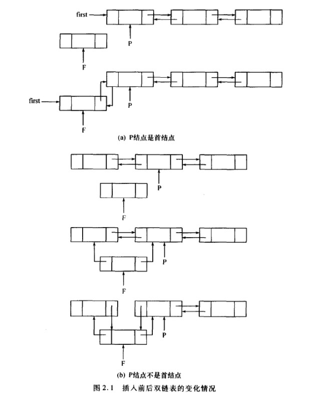
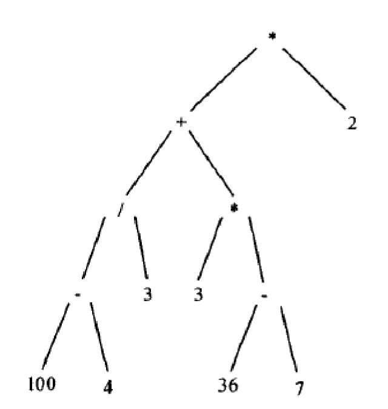
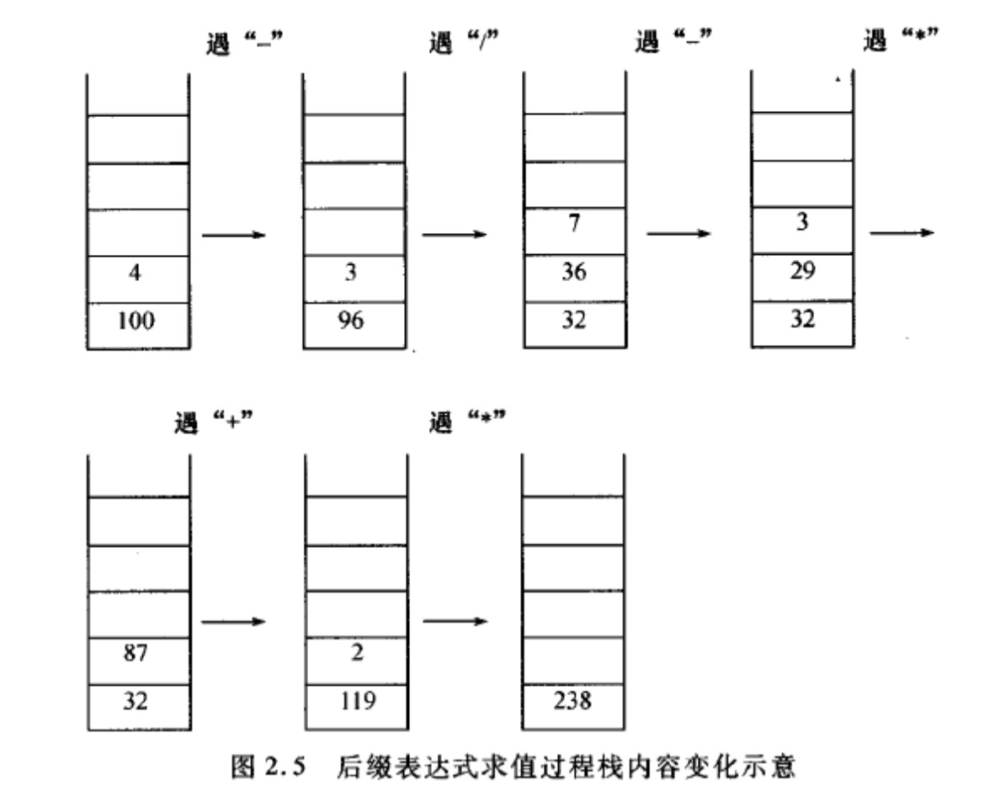

# 第三章 线性表、栈和队列 -《学习指导》

:warning: _注：缺少的题号表示习题重复_

## 3.1 教材习题解答

### 3.1.1 设计一个算法，求单链表 $X$ 中，内容为 $a$ 的结点的地址

> **解答：** _[code 3-1-1.cpp](./src/exercise3_zhangming/3-1-1.cpp)_
>
> 需考虑内容为 $a$ 的地址可能有多个，由于链表中内容为 $a$ 的结点数目不确定，可以选择用一个新链表来存放找到的结点地址。
>
> ```cpp
> #include <iostream>
> #include "../../include/LinearList.hpp"
>
>
> using namespace std;
>
> template <typename T>
> class ListNode                              // 地址链表节点,不能使用原链表的节点，不然会破环原链表
> {
>     public:
>         Link<T> *L;                         // 指向单链表节点的指针
>         ListNode<T> *Next;                  // 指向下一个地址链表节点的指针
>
>         ListNode(Link<T> *l = nullptr, ListNode<T> *next = nullptr):
>             L(l), Next(next){}
> };
>
> template <typename T>
> class LinkAddr                              // 存放地址的链表
> {
>     public:
>         ListNode<T> *Head;                  // 地址链表头指针
>
>         LinkAddr(): Head(new ListNode<T>()){}
>         ~LinkAddr()
>         {
>             ListNode<T> *tmp;
>             while(Head){
>                 tmp = Head;
>                 Head = Head->Next;
>                 delete tmp;
>             }
>         }
>         void find(T a, LinkList<T> *X);     // 找到值为a的节点,并添加到链表
>         void showAll();                     // 显示所有元素
> };
>
> template <typename T>
> void LinkAddr<T>::find(T a, LinkList<T> *X){
>     Link<T> *tmp = X->SetPos(0);    // 获取第一个结点
>     while(tmp != nullptr)
>     {
>         if(tmp->Data == a)
>         {
>             ListNode<T> *q = new ListNode<T>();
>             q->L = tmp;
>             q->Next = Head->Next;
>             Head->Next = q;
>         }
>         tmp = tmp->Next;
>     }
> }
>
> template <typename T>
> void LinkAddr<T>::showAll()
> {
>     ListNode<T> *tmp = Head->Next;
>     while(tmp != nullptr)
>     {
>         cout << tmp->L << "  ";
>         cout << (tmp->L)->Data << endl;
>         tmp = tmp->Next;
>     }
> }
> ```

### 3.1.2 设计一个算法，在单链表 $X$ 中内容为 $a$ 的结点前插入一个内容为 b 的结点

> **解答：** _[code 3-1-2.cpp](./src/exercise3_zhangming/3-1-2.cpp)_
>
> 需考虑存在多个内容为 $a$ 的结点，遍历链表，在每个这样的节点前插入新结点
>
> ```cpp
> #include <iostream>
> #include "../../include/LinearList.hpp"
>
>
> template <typename T>
> class NewLink:public LinkList<T>
> {
>     public:
>         void insert(const T &value1, const T &value2)
>         {
>             using namespace std;
>             Link<T> *tmp = this->Head;
>             int count;
>             while(tmp && tmp->Next)
>             {
>                 if(tmp->Next->Data == value1)
>                 {
>                     Link<T> *p = new Link<T>(value2);
>                     p->Next = tmp->Next;
>                     tmp->Next = p;
>                     tmp = p;        // 因加入一个结点，需要指向该结点，才能指向下一个为访问结点
>                     count++;
>                 }
>                 tmp = tmp->Next;
>             }
>             if(count == 0)
>                 cout << "No such an element" << endl;
>         }
> };
> ```

### 3.1.3 写出将单链表置逆的算法，即由单链表 $A$ 产生单链表 $Z$，使得 $A$ 的最后一个元素的是 $Z$ 的第一个元素，依此类推。要求 $Z$ 仍占用 $A$ 所占用的存储单元，并且尽可能地减少使用附加单元

> **解答：** _[code 3-1-3.cpp](./src/exercise3_zhangming/3-1-3.cpp)_
>
> 用 $trail,middle,head$ 指针指向相邻地 $3$ 个元素，并一次往后挪，每次循环中，把原链表地两个方向改过来，即置逆过来。这样一来，如果把 $head$ 指针看成链表自己地成员变量，只需要两个额外的指针。
>
> ```cpp
> #include "../../include/LinearList.hpp"
>
>
> template <typename T>
> class NewLink:public LinkList<T>
> {
>     public:
>         void invert();                      // 置逆方法
> };
>
> template <typename T>
> void NewLink<T>::invert()
> {
>     Link<T> *middle, *trail;
>     middle = this->Head->Next;               // first为第一个节点
>     this->Head->Next = nullptr;
>     while(middle)
>     {
>         trail = middle->Next;
>         middle->Next = this->Head->Next;
>         this->Head->Next = middle;
>         middle = trail;
>     }
> }
> ```

### 3.1.4 设计一个算法，一个双链表 $X$，是将指针边里 $F$ 指向的结点插入到指针边里 $P$ 指向的结点之前。请画图表示插入前后双链表的变化情况

> **解答：** _[code 3-1-4.cpp](./src/3-1-4.cpp)_
>
> ```cpp
> typedef int Elem;
> typedef struct DbListNode* DbList;
>
> // 双链表节点
> struct DbListNode
> {
>  Elem data;              // 数字域
>  DbList rlink;           // 右(后)指针
>  DbList llink;           // 左(前)指针
> };
>
> // 双链表结构
> struct List
> {
>  DbList first, last;
> };
>
>
> void Insert(DbList F, DbList P, List *X)
> {
>  // 先判断P是否是头节点
>  if(P == X->first)
>  {
>      F->rlink = P;
>      P->llink = F;
>      X->first = F;
>  }else
>  {
>      F->rlink = P;
>      F->llink = P->llink;    // F左边的指针指向P左边的指针
>      P->llink->rlink = F;    // P左边节点的右指针指向F
>      P->llink = F;
>  }
> }
> ```
>
> <div align=center></div>

### 3.1.5 设计一个算法，求循环链表中结点的个数

> **解答：** _[code 3-1-5.cpp](./src/exercise3_zhangming/3-1-5.cpp)_
>
> 判断已经边里整个链表环的方法：使用一个指针变量 $link$ 从链表首元素向后遍历整个链表，直到 $link=first$ 时，说明该结点即尾结点
>
> ```cpp
> #include <iostream>
> #include "../../include/LinearList.hpp"
>
> template <typename T>
> class LoopLink
> {
>     protected:
>         Link<T> *Head;
>     public:
>         LoopLink(): Head(new Link<T>())
>         {
>             Head->Next = Head;
>         }
>         ~LoopLink()
>         {
>             Link<T> *tmp, *Next;
>             tmp = Head->Next;
>             while(tmp != nullptr){
>                 Next = tmp->Next;
>                 delete tmp;
>                 tmp = Next;
>             }
>             delete Head;
>         }
>
>
>         bool addValue(const T &value);
>         int length() const;
> };
>
> template <typename T>
> bool LoopLink<T>::addValue(const T &value)
> {
>     Link<T> *last = Head;
>     while(last->Next != Head)
>         last = last->Next;
>     Link<T> *tmp = new Link<T>(value);
>     tmp->Next = last->Next;
>     last->Next = tmp;
>     return true;
> }
>
> template <typename T>
> int LoopLink<T>::length() const
> {
>     Link<T> *tmp = Head;
>     int count = 0;
>     while(tmp->Next != Head)
>     {
>         tmp = tmp->Next;
>         count++;
>     }
>     return count;
> }
> ```

### 3.1.6 设计一个算法，删除循环表中的第一个结点

> **解答：** _[code 3-1-6.cpp](./src/exercise3_zhangming/3-1-6.cpp)_
>
> - 头结点不是第一个结点，要删除的节点是头节点之后的一个节点（这里我认为是若是用 $new$ 申请的空间，那么头节点的 $next$ 即为第一个节点，若不是，那么 $first$ 指向的就是第一个节点）
> - 需要考虑特殊情况，如空链表、只有一个节点情况等。
>
> ```cpp
> #include <iostream>
>
> typedef int ELEM;
> typedef struct Node* ListNode;
>
> struct Node
> {
>     ELEM data;
>     ListNode next;
>     ListNode pre;
> };
>
> // 循环链表结构，假设用new申请头节点空间
> typedef struct
> {
>     ListNode first;
>     ListNode last;
> }CLL;
>
>
> // 考虑循环单链表
> void deleteFirstNode1(CLL *pCLL)
> {
>     using namespace std;
>     ListNode tmp;
>     if(pCLL->first == pCLL->last)
>     {  // 循环链表为空
>         cout << "The List is NULL, no fist node" << endl;
>         return;
>     }else if(pCLL->first->next == pCLL->last)
>     {  // 只有一个节点时
>         tmp = pCLL->first->next;
>         pCLL->first->next = tmp->next;
>         pCLL->last = pCLL->first;
>     }else
>     {  // 正常情况
>         tmp = pCLL->first->next;
>         pCLL->first->next = tmp->next;
>     }
>     delete tmp;
> }
>
> // 考虑循环双链表
> void deleteFirstNode2(CLL *pCLL)
> {
>     using namespace std;
>     ListNode tmp;
>     if(pCLL->first == pCLL->last)
>     {
>         cout << "The List is NULL, no first node" << endl;
>         return;
>     }else if(pCLL->first->next == pCLL->last)
>     {
>         tmp = pCLL->first->next;
>         pCLL->last = pCLL->first;
>         pCLL->first->next = pCLL->first;
>         pCLL->first->pre = pCLL->first;
>     }else
>     {
>         tmp = pCLL->first->next;
>         pCLL->first->next = tmp->next;
>         tmp->next->pre = pCLL->first;
>     }
>     delete tmp;
> }
> ```

### 3.1.7 设计一个算法，删除向量中第$i$个元素

> **解答：** _[code 3-1-7.cpp](./src/exercise3_zhangming/3-1-7.cpp)_
>
> 向量不是向量表，可以理解为是一维数组
>
> ```cpp
> #include <cassert>
> #include "../../include/LinearList.hpp"
>
> template <typename T>
> class AList:public ArrList<T>
> {
>     public:
>         AList(const int size):ArrList<T>(size){}
>
>         T remove(int ith)
>         {
>             assert((this->CurLen != 0) && (ith >= 0) && (ith < this->CurLen));    // 必须存在一个可删除元素
>             T tmp = this->List[ith-1];
>             for(int i = ith-1; i < this->CurLen-1; i++)
>                 this->List[i] = this->List[i+1];
>             this->CurLen--;
>             return tmp;
>         }
> };
> ```

### 3.1.10 对于环状的队列，写出计算队列元素个数的程序

> **解答：**
>
> 环状队列源码: _[code ArrQueue.cpp](./src/Note/ArrQueue.cpp)_
>
> ```cpp
> int ArrQueue::length()
> {
>     int len;
>     if(isEmpty())
>         len = 0;
>     else if(front <= rear)
>         len = rear - front;
>     else
>         len = mSize + rear - front;
>     return len;
> }
> ```

### 3.1.12 现有中缀表达式$E=((100-4)/3+3*(36-7))*2$，请写出与 $E$ 等价的后缀表达式

> **解答：**
>
> 中缀表达式的二叉树图如下：
>
> <div align=center></div>
>
> 其后缀表达式等价于后序遍历：$100\;\;4\;\;-\;\;3\;\;/\;\;3\;\;36\;\;7\;\;-\;\;*\;\;+\;\;2\;\;*$

### 3.1.13 _Fibonacci_ 序列为 $0,1,1,2,3,5,8,13,21,34......$其中每个元素是前两个元素之和，可递归定义为$fib(n)=fib(n-1)+fib(n-2)$;请设计一个计算$fib(n)$的递归过程，并利用栈来模拟递归调用，将递归过程改成一个非递归过程

> **解答：** _[code 3-1-13.cpp](./src/exercise3_zhangming/3-1-13.cpp)_
>
> 这里$fib(0)=0;fib(1)=1$
>
> 利用栈模拟递归的过程如图：
>
> <div align=center></div>
>
> ```cpp
> #include <stack>
>
>
> // 递归实现
> int fib1(int n)
> {
>     if(n > 1)
>         return fib1(n-1) + fib1(n-2);
>     else if(n == 1)
>         return 1;
>     else return 0;
> }
>
> // 非递归栈实现
> int fib2(int n)
> {
>     if(n == 0)
>         return 0;
>     else if(n == 1)
>         return 1;
>     else
>     {
>         std::stack<int> st;
>         // 除了f(0),f(1)压栈0,1以外，其余压栈为-1
>         while(n > 1)
>         {
>             st.push(-1);
>             n--;
>         }
>         st.push(1); // f(1);
>         st.push(0);
>         // 出栈两个求和以及一个待求的数，压栈求和以及第二个出栈的数
>         // 如求f(2)，弹出0,1以及一个-1，压栈0+1,1
>         int tmp1, tmp2;
>         while(st.size() > 2)
>         {
>             tmp1 = st.top();
>             st.pop();
>             tmp2 = st.top();
>             st.pop();
>             st.pop();       // 弹出一个-1，即待求数的位置
>             st.push(tmp1 + tmp2);
>             st.push(tmp2);
>         }
>         // 最后剩两个数，栈底的数即为所求的结果
>         st.pop();
>         return st.top();
>     }
> }
>
> // 非递归的循环迭代法
> int fib3(int n)
> {
>     if(n < 0)
>         return -1;
>     if(n <= 1)
>         return n;
>     int a = 0, b = 1, c;
>     for(int i = 1; i < n; i++)
>     {
>         c = a + b;
>         a = b;
>         b = c;
>     }
>     return b;
> }
> ```

### 3.1.14 用一个栈来模拟表达式的转换过程，中缀表达式($E=((100-4)/3+3*(36-7))*2$)在转成后缀表达式的过程中，栈内容的变化图

> **解答：** _[code 3-1-14.cpp](./src/exercise3_zhangming/3-1-14.cpp)_
>
> 要求画出中缀到后缀的转换过程中栈内容的变化，而不描述计算表达式值的过程中栈内容的变化。
>
> ```cpp
> #include <stack>
> #include <cstring>
> #include <iostream>
> using namespace std;
>
>
> class MidToPost
> {
>     private:
>         int priority(char op);              // 返回操作符优先级
>         bool isDigit(char num);             // 判断时候为数字
>         bool isOperator(char op);           // 判断是否为操作符
>     public:
>         string mid;
>         MidToPost(){}
>         MidToPost(string str): mid{str}{}
>         string transfer();                  // 转换成后缀表达式
> };
>
> bool MidToPost::isDigit(char num)
> {
>     if(num >= 48 && num <= 57)
>         return true;
>     else if(num == '.')
>         return true;
>     return false;
> }
>
> int MidToPost::priority(char op)
> {
>     switch(op){
>         case '*':
>         case '/':
>             return 3;
>         case '+':
>         case '-':
>             return 2;
>         case '(':
>             return 1;
>         default:
>             return 0;
>     }
> }
>
> bool MidToPost::isOperator(char op)
> {
>     switch(op){
>         case '+':
>         case '-':
>         case '*':
>         case '/':
>             return true;
>         default:
>             return false;
>     }
> }
>
> string MidToPost::transfer()
> {
>     string post = "";
>     char top;                                   // 存储栈顶元素
>     stack<char> sta = stack<char>();
>     sta.push(';');                              // 栈底标志元素
>     for(auto i = 0; i < mid.size(); i++)
>     {
>         char tmp = mid[i];
>         if(tmp == '(')
>             sta.push(tmp);                      // 左括号入栈
>         else if(isDigit(tmp))
>         {                  // 如果是数字或'.'则存入post
>             post += tmp;
>             while(isDigit((tmp = mid[++i])))
>                 post += tmp;
>             i--;                                // 已经不是数字了，返回上一个位置
>             post += " ";
>         }
>         else if(tmp == ')')                     // 遇到右括号出栈，直到遇到左括号为止
>         {
>             top = sta.top();
>             sta.pop();
>             while(top != '('){
>                 post += top;
>                 post += " ";
>                 top = sta.top();
>                 sta.pop();
>             }
>         }
>         else if(isOperator(tmp))                // 如果是操作符
>         {
>             char top = sta.top();
>             sta.pop();
>             while(priority(top) >= priority(tmp))
>             {
>                 post += top;
>                 post += " ";
>                 top = sta.top();
>                 sta.pop();
>             }
>             sta.push(top);                      // 当tmp优先级更大时
>             sta.push(tmp);
>         }
>     }
>     // 弹出栈所有元素直至栈底标志
>     top = sta.top();
>     while(top != ';')
>     {
>         sta.pop();
>         post += top;
>         post += " ";
>         top = sta.top();
>     }
>     return post;
> }
> ```
>
> 栈内容变化如下：
>
> | 1   | 2   | 3   | 4   | 5   | 6   | 7   | 8   | 9   | 10  | 11  | 12  |
> | --- | --- | --- | --- | --- | --- | --- | --- | --- | --- | --- | --- |
> |     |     |     |     |     |     |     |     |     | -   |     |     |
> |     |     |     |     |     |     |     |     | (   | (   |     |     |
> |     |     |     | -   |     |     |     | \*  | \*  | \*  | \*  |     |
> |     |     | (   | (   |     | /   | +   | +   | +   | +   | +   |     |
> |     | (   | (   | (   | (   | (   | (   | (   | (   | (   | (   | \*  |
> | ;   | ;   | ;   | ;   | ;   | ;   | ;   | ;   | ;   | ;   | ;   | ;   |

### 3.1.15 用一个栈来模拟一个较为复杂的后缀表达式的求值过程，画出$E=((100-4)/3+3*(36-7))*2$所得到的后缀表达式求值过程中栈内容变化图

> **解答：**
>
> 思路：
>
> 1. 遇到一个操作数时，压入栈顶
> 2. 遇到一个运算符时，从栈中两次取出栈顶元素，按照运算符对两个操作数进行计算，然后计算结果压入栈顶
>
> <div align=center></div>

### 3.1.16 请解决以下问题

**（1）设计一个计算前缀表达式的算法**  
**（2）设计一个将中缀表达式转换成前缀表达式的算法。假设中缀表达式以"@"结束，而前缀表达式以"@"开始**

> **解答：**
>
> （1） 利用一个栈，有两种解法
>
> - 方法一：从右向左扫描
>   1. 若遇到操作数压入栈中
>   2. 若遇到操作符，此时若栈中元素少于 $2$ 个（操作数）则表明出错，退出。其他情况下，从栈中弹出两个元素进行计算后将结果放回栈中（后弹出元素为第一操作数）。
>   3. 扫描结束时，如果栈中只含唯一元素，则将栈中数据作为结果输出，否则表明前缀表达式有错。
> - 方法二：从左向右扫描
>   1. 若遇到运算符则压入栈顶
>   2. 若遇到操作数，此时若栈空，则将操作数返回，退出，若栈不空：
>      - 若栈顶是一个运算符，则将操作数压入栈顶。
>      - 若栈顶也是一个操作数，此时若栈中元素少于 $2$ 个则表明出错，退出；其他情况下则取两次栈顶（第二次取得的应为操作符），并按照运算符对两个操作数进行计算（其中取得的栈顶为第一操作数），计算结果暂不压入栈顶，而是当作遇到的一个操作数，转到 ii。
>   3. 扫描结束，正确的情况下，输出结果应该在第 ii 步返回，并退出；如果执行到此处，表明出错。
>
> （2）
>
> ① 从右向左扫描中缀表达式
>
> 1. 遇到"@"，不做任何处理，转到 ①
> 2. 遇到操作数输出到前缀表达式中，转到 ①
> 3. 遇到")"则压入栈中，转到 ①
> 4. 遇到操作符:
>    - 如果栈顶不为空而且栈顶为操作符而且栈顶操作符的优先级高于该操作符，则将栈顶操作符弹出并输出到前缀表达式中，转到 $4$
>    - 将该操作符压入栈中
> 5. 遇到"("，将栈中元素依次弹出并输出到前缀表达式中，直至")"出现，并将")"弹出（不输出到前缀表达式中），转到 ①
>
> ② 扫描结束时，若栈中还有元素，则将栈中所有元素依次弹出并输出到前缀表达式中。最后将"@"输出到前缀表达式中

### 3.1.17 用计算机模拟“迷宫问题”，求出其中一条通路。用数组 $MAZE(1..m,1..n)$表示迷宫，数组元素为 $1$ 意味思路，$0$ 表示通路，$MAZE(1,1)$为迷宫入口，$MAZE(m,n)$为迷宫出口，试设计一个算法判别迷宫问题是否有解？有解则输入一条路径

> **解答：**

### 3.1.18 设计 $3$ 个具有三级优先级的队列，并写出插入某个已知优先级的元素的算法

> **解答：** _[code 3-1-18.cpp](./src/exercise3_zhangming/3-1-18.cpp)_
>
> 其实还是在一个队列中，逻辑上分为 $3$ 个子队列，具有 $3$ 种优先级。  
> 思路：可以利用二维数组来存放
>
> ```cpp
> #include <cstdlib>
>
>
> template <typename T>
> class Queue
> {
>     private:
>         T **Qrank;                      // 二维数组存放各级队列
>         const int rankNum  = 3;         // 当前的最大优先级数
>         int *CurrNum;                   // 一维数组存放各级队列的当前元素个数
>         int maxNum;                     // 记录每一级队列的最大元素个数
>     public:
>         Queue(int maxNumber)
>         {
>             for(auto i = 0; i < rankNum; i++)
>             {
>                 if((Qrank[i] = new T[maxNumber]) == NULL)
>                     exit(0);
>             }
>             maxNum = maxNumber;
>             CurrNum = new int[rankNum]();
>         }
>         ~Queue()
>         {
>             for(int i = 0; i < rankNum; i++)
>                 delete []Qrank[i];
>             delete [] CurrNum;
>         }
>
>         void enQueue(T data, int dataRank)
>         {
>             if(dataRank >= rankNum || CurrNum[dataRank] >= maxNum)
>                 return;
>             Qrank[dataRank][CurrNum[dataRank]] = data;
>             CurrNum[dataRank]++;
>         }
> };
> ```

### 3.1.19 现有 $4$ 个元素作为双端队列的输入，可以得到多少种不同的排列

> **解答：**
>
> 双端队列可以两端进行插入删除操作，题目问的是输入排列。第一个元素从左边或右边入队没有区别，以后每种元素有两种入队方式，即有$2^3=8$种。设元素为 $a,b,c,d$，各排列如下：
>
> &emsp;&emsp;第一次放入 $a$：  
> &emsp;&emsp;&emsp; $a$  
> &emsp;&emsp;第二次放入 $b$：  
> &emsp;&emsp;&emsp; $ab \quad ba$  
> &emsp;&emsp;第三次放入 $c$：  
> &emsp;&emsp;&emsp; $cab \quad abc \quad cba \quad bac$  
> &emsp;&emsp;第四次放入 $d$：  
> &emsp;&emsp;&emsp; $dcab \quad cabd \quad dabc \quad abcd \quad dcba \quad dacd \quad dbac \quad bacd$

## 3.2 增补习题

### 3.2.12 试将下列递归过程改成非递归过程

```cpp
void test(int &sum)
{
    int x;
    scanf(x);
    if(x == 0)
        sum = 0;
    else
    {
        test(sum);
        sum += x;
    }
    printf(sum);
}
```

> **解答：** _[code 3-2-12.cpp](./src/exercise3_zhangming/3-2-12.cpp)_
>
> ```cpp
> #include <iostream>
> #include <stack>
> using namespace std;
>
> void test2()
> {
>     int x;
>     stack<int> s1;
>     cin >> x;
>     while(x != 0)
>     {
>         s1.push(x);
>         cin >> x;
>     }
>     s1.push(0);
>     int sum = 0;
>     while(!s1.empty())
>     {
>         sum += s1.top();
>         s1.pop();
>         cout << sum << endl;
>     }
>     cout << endl;
> }
> ```

### 3.2.15 已知 $Q$ 是一个非空队列，$S$ 是一个空栈。仅用队列和栈的 $ADT$ 函数和少量工作变量，设计一个算法，将队列 $Q$ 的所有元素逆置

> **解答：** _[code 3-2-15.cpp](./src/exercise3_zhangming/3-2-15.cpp)_
>
> 将 $Q$ 队列的元素出队并压栈，再出栈入队
>
> ```cpp
> #include <iostream>
> #include <stack>
> #include <queue>
>
> using namespace std;
>
> template <typename T>
> void Revert(queue<T> &Q)
> {
>     stack<T> s;
>     while(!Q.empty())
>     {
>         s.push(Q.front());
>         Q.pop();
>     }
>     while(!s.empty())
>     {
>         Q.push(s.top());
>         s.pop();
>     }
> }
> ```

## 3.3 增补上机题

### 3.3.1 设计算法求解从集合${1..n}$中选取 $k(k≤n)$个元素的所有组合。例如，从集合${1..4}$中选取 $2$ 个元素的所有组合的输出结果为:$1\ 2，1\ 3，1\ 4，2\ 3，2\ 4，3\ 4$

### 3.3.2 编写算法解决背包问题：设有 $n$ 件物品，重量分别为 $w_1,w_2,...,w_n$ 和一个能装载总重量为 $T$ 的背包。能否从 $n$ 件物品中选择若干恰好使他们的重量之和等于 $T$。若能，则背包问题有解，否则无解。只需要判断是否有解

### 3.3.7 一元稀疏多项式以循环单链表按降幂排列，结点有 $3$ 个域，系数域 $coef$，指数域 $exp$ 和指针域 $next$。请编写算法对链表求一阶导数
