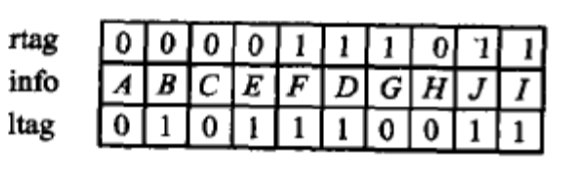
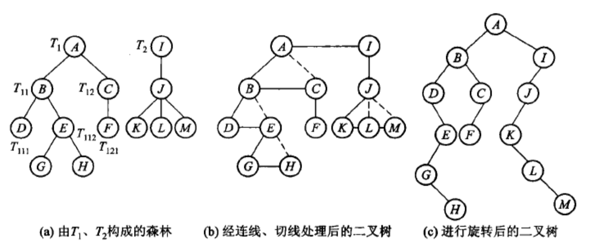

# 第五章 树与二叉树

**概览：**

**:bulb: 引子**  
**[:question: 由查找引入二叉树](#引子)**

**:bulb: 树与森林**  
**[:question: 树与森林的定义](#树与森林的定义)**  
**[:question: 树的基本术语](#树的基本术语)**  
**[:question: 树的抽象数据类型](#树抽象数据类型)**  
**[:question: 树的周游](#树的周游)**  
**[:question: 树的存储结构](#树的存储结构)**

**:bulb: 二叉树**  
**[:question: 二叉树的定义](#二叉树的定义)**  
**[:question: 二叉树的分类](#二叉树的分类)**  
**[:question: 二叉树的主要性质](#二叉树的主要性质)**  
**[:question: 二叉树的抽象数据类型](#二叉树的抽象数据类型)**  
**[:question: 二叉树的周游](#二叉树的周游)**  
**[:question: 二叉树的存储结构](#二叉树的存储结构)**  
**[:question: 二叉搜索树](#二叉搜索树)**  
**[:question: 堆与优先队列](#堆与优先队列)**  
**[:question: 哈夫曼（Huffman）树](#哈夫曼（Huffman）树)**  
**[:question: 森林与二叉树的等价转换](#森林与二叉树的等价转换)**

## 引子

**静态查找**：集合中记录是固定的，没有插入和删除的操作，只有查找

**动态查找**：集合中记录是动态变化的，除了查找，还可能发生插入和删除

- 静态查找

1. 方法 1 - 顺序查找

   ```cpp
   int SequentialSearch(StaticTable *Tbl, ElementType K)
   {
       // 在表Tbl[1]~Tbl[n]中查找关键字为K的数据元素
       int i;
       Tbl->Element[0] = K;        // 建立哨兵，建立哨兵后循环判断语句只需要一次
       for(i = Tbl->Length; Tbl->Element[i] != K; i--);
       return i;
   }
   ```

2. 方法 2 - 二分查找

   二分查找的数据必须是有序的(如：小到大)，二分查找的时间复杂度是 $O(logN)$

   ```cpp
   int BinarySearch(StaticTable *Tbl, ElementType K)
   {
       int left, right, mid, NoFound = -1;
       left = 1;               // 左边界
       right = Tbl->Length;    // 右边界
       while(left <= right){
           mid = (left + right) / 2;
           if(K < Tbl->Element[mid])       // 中间值大于目标值，调整右边界
               right = mid - 1;
           else if(K > Tbl->Element[mid])
               left = mid + 1;
           else return mid;                // 找到元素
       }
       return NoFound;
   }
   ```

   <div align=center></div>

## 树与森林

### 树与森林的定义

1. 树：$n(n≥0)$个结点构成的有限集合。当 $n=0$，称为*空树*，对于*非空树*，它具有以下性质:

   - 树中有一个称为“根（$root$）”的特殊结点，用 $r$ 表示
   - 其余结点可分为 $m(m>0)$个互不相交的有限集$T_1, T_2, ..., T_m$，其中每个集合本身又是一棵树，称为原来树的”子树”

   <div align=center></div>

2. 森林：是零棵或多颗不相交的数的集合（通常是有序集合）。对于树的每个结点，其子树组成的集合就是森林；而加入一个结点作为根，森林就可以转换成一棵树

3. 树与非树（区别）

   - 子树是不相交的；
   - 除了根结点外，每个结点有且仅有一个父结点；
   - 一棵 $N$ 个结点的树有 $N-1$ 条边。

### 树的基本术语

- 结点的度（$Degree$）：结点的子树个数
- 树的度：树的所有结点中最大的度
- 叶结点（$Leaf$）：度为 $0$ 的结点，也称终端结点
- 内部结点（$internal \; node$）：除叶结点以外的那些非终端结点，也称分支结点
- 父结点（$Parent$）：有子树的结点是其子树的根结点的父结点
- 子结点（$Child$）：若 $A$ 结点是 $B$ 结点的父结点，则 $B$ 结点是 $A$ 结点的子结点，也称孩子结点
- 边（$edge$）：父结点$k$与子结点$k'$存在一条有向连线$<k,k'>$
- 兄弟结点（$Sibling$）：具有同一父结点的各结点彼此是兄弟结点
- 路径和路径长度：从结点$n_1$到$n_k$的路径为一个结点序列$n_1, n_2, ..., n_k,$ 其中$n_j$是$n_{j+1}$的父结点。路径所包含边的个数为路径的长度。
- 祖先结点（$Ancestor$）：沿树根到某一结点路径上的所有结点都是这个结点的祖先结点
- 子孙结点（$Descendant$）：某一结点的子树中的所有结点是这个结点的子孙
- 结点的层次（$Level$）：规定根结点在 $1$ 层，其他任意结点的层数是其父结点的层数加 $1$
- 树的深度（$Depth$）：树中所有结点中最大层次

### 树的抽象数据类型

- 类型名称：树
- 数据对象集：包含$n$个结点的有穷集合，若$n>0$，某个没有前驱的结点称作树的根，其余结点都有且仅有一个前驱
- 操作集：

  ```cpp
  template <typename T>
  class TreeNode
  {
      private:
          T m_value;
          TreeNode<T> *pChild;
          TreeNode<T> *pRight;
      public:
          TreeNode(const T &value);
          virtual ~TreeNode(){};
          bool isLeaf();                              // 判断当前结点是否是叶结点
          T value();                                  // 返回结点的值
          TreeNode<T>* leftMostChild();               // 返回第一个左子结点
          TreeNode<T>* rightSibling();                // 返回右兄弟
          void setValue(const T &value);              // 设置当前结点的值
          void setChild(TreeNode<T> *pointer);        // 设置左子结点
          void setSibling(TreeNode<T> *pointer);      // 设置右兄弟
          void insertFirst(TreeNode<T> *node);        // 以第一个左子结点身份插入结点
          void insertNext(TreeNode<T> *node);         // 以右兄弟的身份插入结点
  };


  template <typename T>
  class Tree
  {
      private:
          TreeNode<T> *m_root;
      public:
          Tree();                                     // 构造函数
          virtual ~Tree();
          TreeNode<T>* getRoot();                     // 返回树的根结点
          void createRoot(const T &rootValue);        // 创建值为rootValue的根结点
          bool isEmpty();                             // 判断是否为空树
          TreeNode<T>* parent(TreeNode<T> *cur);      // 返回当前结点的父结点
          TreeNode<T>* prevSibling(TreeNode<T> *cur); // 返回当前结点的前一个兄弟
          void deleteSubTree(TreeNode<T> *subroot);   // 删除以subroot为根的子树
          void rootFirstTraverse(TreeNode<T> *root);  // 先根深度优先周游树
          void rootLastTraverse(TreeNode<T> *root);   // 后根深度优先周游树
          void widthTraverse(TreeNode<T> *root);      // 广度优先周游树
  };
  ```

### 树的周游

树的周游分为深度优先周游**DFS**和广度优先周游**BFS**

- 深度优先周游  
   对于树或森林，一个结点可能具有多于两个子树，因此不能像二叉树的中序周游法那样给出树的中根次序周游方式，但仍可考虑树或森林的前序和后序周游算法

  - 先根次序周游森林  
     （1）访问森林中第一棵树的根结点  
     （2）在先根次序下周游第一棵树根结点的子树森林  
     （3）在先根次序下周游其他树构成的森林

    ```cpp
    template <typename T>
    void Tree<T>::rootFirstTraverse(TreeNode<T> *root)
    {
        while(root != nullprt)
        {
            visit(root->value());
            rootFirstTraverse(root->leftMostChild());       // 周游第一棵树树根的子树
            root = root->rightSibling();
        }
    }
    ```

  - 后根次序周游森林  
     （1）在后根次序下周游第一棵树根结点的子树  
     （2）访问森林中第一棵树的根结点  
     （3）在后根次序下周游其他树构成的森林

    ```cpp
    template <typename T>
    void Tree<T>::rootLastTraverse(TreeNode<T> *root)
    {
        while(root != nullprt)
        {
            rootLastTraverse(root->leftMostChild());
            visit(root->value());
            root = root->rightSibling();
        }
    }
    ```

- 广度优先周游  
   从树的第$0$层（根结点）开始，自上而下逐层周游；在同一层中，则按从左到右的顺序对结点逐一访问

  ```cpp
  template <typename T>
  void Tree<T>::widthTraverse(TreeNode<T> *root)
  {
      using std::queue;
      queue<TreeNode<T> * > aQueue;
      TreeNode<T> *pointer = root;
      while(pointer != nullprt)
      {
          aQueue.push(pointer);                       // 当前结点入队
          pointer = pointer->rightSibling();          // pointer指向当前结点的右兄弟
      }
      while(!aQueue.empty())
      {
          pointer = aQueue.empty();
          aQueue.pop();
          visit(pointer->value());
          pointer = pointer->leftMostChild();         // pointer指向当前结点的最左子结点
      }
      while(pointer != nullprt)
      {
          aQueue.push(pointer);
          pointer = pointer->rightSibling();
      }
  }
  ```

- 周游例子

   <div align="center"></div>

  先根次序周游：$ABCEFDGHJI$  
   后根次序周游：$BEFCDAJHIG$  
   广度优先周游：$AGBCDHIEFJ$

### 树的存储结构

1. 树的顺序存储

   - 带右链的先根次序表示
     | ltag | info | rlink|
     | ---- | ---- | ---- |

     `info`是结点的数据；  
     `rlink`是右指针，指向结点的下一个兄弟，即树或森林所对应的二叉树中结点的右子结点；  
     `ltag`是一个标记位，当结点是叶结点时，即对应的二叉树没有左子结点时，`ltag`为$1$，否则为$0$

     上面例子的带右链的先根次序存储如下：
     <div align="center"></div>

   - 带双标记的先根次序表示  
      ”带右链的先根次序表示“中`rlink`也有冗余，可以把`rlink`指针替换为一个标识位`rtag`，成为”带双标记的先根次序表示“
     | ltag | info | rtag |
     | ---- | ---- | ---- |

     由根结点的先根次序以及`ltag、rtag`两个标识位，就可以确定树”左子/右兄“链表中结点的`llink`和`rlink`的值  
      由先根次序的性质可知，任何结点的子树都直接排在该结点的后面，接着再排该结点的下一个兄弟结点。任何一棵子树，在先根序列中排在最后的一定是没有子结点的叶结点，该叶结点的`ltag`为$1$。当一个结点$x$的`rtag`为$1$时，它的`rlink`显然为空；当一个结点$x$的`rtag`为$1$时，它的`rlink`显然为空；当一个结点$x$的`rtag`为$0$时，它的`rlink`应该指向结点序列中排在以$x$为根的子树后紧接着的那个结点$y$。由于树的先根次序中子树结点是嵌套出现的，在顺序搜索的过程中需要嵌套处理$x$的所有子树，因此确定$y$过程中要用到栈，。扫描到一个`ltag`为$1$的结点就从栈顶弹出一个结点并为其设置`rlink`

     上面例子的带双标记的先根次序存储如下：

     <div align="center"></div>

     带双标记位的先根次序构造算法：

     ```cpp
     template <typename T>
     class DualTagTreeNode
     {
         public:
             T info;
             int ltag;
             int rtag;
             DualTagTreeNode();
             virtual ~DualTagTreeNode();
     };

     template <typename T>
     Tree<T>::Tree(DualTagTreeNode<T> *nodeArray, int count)
     {   // 利用带双标记位的先根次序表示构造左子右兄表示树
         using std::stack;
         stack<TreeNode<T> *> aStack;
         TreeNode<T> *pointer = new TreeNode<T>;                         // 准备建立根结点
         m_root = pointer;
         for(int i = 0; i < count; i++)
         {
             pointer->setValue(nodeArray[i].info);                       // 结点赋值
             if(nodeArray[i].rtag == 0)                                  // 右标记位为0，压栈
                 aStack.push(pointer);
             else
                 pointer->setSibling(nullprt);                           // 若右标记为1，则将兄弟结点指针设为空
             TreeNode<T> *temppointer = new TreeNode<T>;
             if(nodeArray[i].ltag == 0)                                  // 左标记为0，则设置一个子结点结点
                 pointer->setChild(temppointer);
             else
             {
                 pointer->setChild(nullprt);                             // 子结点指针设为空
                 pointer = aStack.top();
                 aStack.pop();
                 pointer->setSibling(temppointer);                       // 为其设置一个兄弟结点
             }
             pointer = temppointer;
         }

         // 处理最后一个结点
         pointer->setValue(nodeArray[count-1].info)
         pointer->setChild(nullprt);
         pointer->setSibling(nullprt);
     }

     ```

   - 带度数的后根次序表示  
      在“带度数的后根次序表示”中，每个结点右两个域，`info`用于存放结点的数据，`degree`用于存储结点的度数
     | info | degree |
     | ---- | ---- |

     由于在后序序列中每一棵子树的结点都存储在一起，且每一棵子树在后序序列中的最后一个位置存储这棵子树的根结点，因此将带度数的后跟次序表示转化成森林的逻辑结构时，只需要从左至右扫描。度数为$0$的结点是叶子结点（也可以看作是一棵子树的根），当遇到度数非零（设为$k$）的结点时，则排在该结点之前且离他最近的$k$个子树的根就是该结点的$k$个子结点

     上面例子的带度数的后根次序存储如下：

     <div align="center"></div>

     该例子中，结点$C$的度数为$2$，那么排在$C$之前的两个结点$E,F$就是$C$子树的子结点，从而$C,E,F$构成一棵子树，结点$C$就是这棵子树的根；同理$A$的度数为$3$,则排在$A$之前的最近三棵子树的根结点就是$A$的子结点，即$A,B,C,D$构成以$A$为根的一棵树，以此类推

   - 带双标记的层次次序表示

     | ltag | info | rtag |
     | ---- | ---- | ---- |

     `info`是结点的数据；  
     `ltag`当结点没有左子结点时为$1$，否则为$0$  
     `rtag`当结点没有下一个兄弟时为$1$，否则为$0$

     由层次次序的性质可知，任何结点的子结点都排在该点的所有兄弟结点后面。并且任何结点的最有一个兄弟结点都不会再有下一个兄弟，即最后一个兄弟的`rtag`为$1$。由结点的层次次序以及`ltag,rtag`两个标记位，就可以确定树的左子/右兄链表中结点的`llink`和`rlink`的值。`rlink`的值很容易确定：结点的`rtag`为$1$，则`rlink`为空；结点`rtag`为$0$，则`rlink`指向该结点紧邻的下一个结点  
     下面用`ltag`和`rtag`的值来确定`llink`。让一个结点$x$的`ltag`为$0$时，其`llink`不空，应该指向结点序列中排在结点`x`的兄弟结点后面的那个结点`y`。由于根层次序列相关，因此需要使用队列确定这个结点的子结点。顺序扫描树的层次序列，若结点的`ltag`为$1$，则置其`llink`为空；否则该把该结点$x$放入队列。如果遇到`rtag`为$1$的结点，这时该结点的兄弟结点已经扫描完毕，下一个将要扫描的结点$y$就是结点$x$的最左子结点，此时取出队列的第一个元素（即先前保存的$x$），将其`llink`指向$y$即可

     上面例子的带双标记的层次次序存储如下：

     <div align="center"></div>

2. 树的链式存储

   - 子结点表表示法  
    “子结点表”表示法，就是指每个分支结点的子结点按照从左至右的顺序形成一个链表存储在该分支结点中，其主体是一个存储了树中各结点信息的数组。数组每个元素包括三个域，分别用来存放结点信息的值、其父结点指针以及子结点表的指针
   <div align="center"></div>

   - 静态“左子/右兄”表示法  
      仍用数组存储各结点，每个结点元素包含$4$个域，分别用于存储结点的值、指向父结点以及指向最左子结点和右侧兄弟结点的指针。这种方法比“子结点表”表示法的空间效率更高，而且每个结点的存储空间大小固定

        <div align="center"></div>

   - 动态表示法  
      由于树的结点可以有任意的度数，并且各结点的子结点树随时发生变化。树结点的动态性给树的实现带来困难。可为每个结点分配可变的存储空间，每一个结点都存储一个子结点指针表，其子结点的数目也存储在该结点中。该表示法本质上与“子结点表”表示法相同，但是它可以动态地分配结点空间，而不是把所有结点分配在同一个数组中

       <div align="center"></div>

   - 动态“左子/右兄”二叉链表表示法  
      左子结点在树中是结点的最左子结点，右子结点是结点原来的右侧兄弟结点，根的右链就是森林中每棵树的根结点。（可参考[二叉树链式存储](#二叉树的存储结构)食用）  
     _代码部分实现：[动态左子右兄二叉链.cpp](./src/Note/动态左子右兄-二叉链.cpp)_

   - 父指针表示法和在并查集中的应用  
      每个结点只需要保存一个指向其父结点的指针域
      <div align="center"></div>

     并查集基本操作是：  
      `find`: 判断某个元素所在的子集，目的是为了确定两个元素是否在同一个集合中  
      `union`: 归并两个集合  
      归并时只要将一棵树的根指向另一棵树的根即可。两个集合的合并，每次合并前都需要进行两次查找，查找所需要的时间由树的高度决定。合并所需的时间为$O(1)$。最坏情况下，合并可能使$n$个结点的树退化成一条链
      <div align="center"></div>

     为了防止树退化为单链，应该让每个结点到其相应根结点的距离尽可能小，有如下两种方法：

     1. 重量权衡合并规则：根据子集中包含的数目，令含元素少的子集的树根指向含元素多的子集的树根。小树合并到大树中，可以把树的整体深度限制在$O(logn)$，每次`find`操作只需要$O(logn)$
     2. 路径压缩：把结点到树根的路径上所有结点的父指针都指向根结点
        <div align="center"></div>

     _部分代码实现：[并查集算法.cpp](./src/Note/并查集算法.cpp)_

## 二叉树

### 二叉树的定义

一个有穷的结点集合。这个集合可以为空，若不为空，则它是根结点和称其为左子树 $TL$ 和右子树 $TR$ 的两个不相交的二叉树组成。

- 二叉树的五种基本形态

   <div align=center></div>

  > 注：二叉树的子树有左右顺序之分

### 二叉树的分类

1. 满二叉树（$full \; binary \; tree$）  
   如果一棵二叉树的任何结点，或者是树叶，或者是左右子树均非空，则这棵二叉树称作满二叉树
2. 完全二叉树（$complete \; binary \; tree$）

   如果一棵二叉树最多只有最下面的两层结点度数可以小于$2$，并且最下面一层的结点都集中在该层最左边的连续位置上，则此二叉树称作完全二叉树

   <div align="center"></div>

3. 扩充二叉树（$extended \; binary \; tree$）  
   在二叉树中出现空子树的位置增加空树叶，所形成的二叉树称作扩充二叉树

   构造一棵扩充二叉树只需要在原二叉树树叶下增加两个新的空树叶，度数为$1$的分支结点下增加一个空树叶即可。扩充二叉树是满二叉树，新增空树叶（外部结点）的个数等于原二叉树结点（内部结点）个数加$1$
      <div align="center"></div>

   上图为一棵二叉树搜索树的扩充二叉树，小方框表示空树叶  
    从扩充二叉树的根到每个外部结点的路径长度之和称为外部路径长度$E$；从根到每个内部结点的路径长度之和称为内部路径长度$I$  
    $E=3+4+4+3+4+4+3+4+4+3+3=39$  
    $I=0+1+2+3+2+3+1+2+3+2=19$  
    外部路径长度$E$和内部路径长度$I$满足：$E=I+2n$，其中$n$是内部结点个数

   > 证明：对内部结点数目进行归纳  
   > 当$n=1$时，$I=0$且$E=2$，故$E=I+2n$成立  
   > 设$n$个内部结点时成立，有$E_n=I_n+2n$。当有$n+1$个内部结点时，如果删除一个分支结点，该分支结点到根结点的路径长度是$K$，可使之成为有$n$个结点的扩充二叉树。由于删除了一个路径长度为$K$的内部结点，因此内部结点路径长度变为$I_n=I_{n+1}-K$，由于减少了两个路径长度为$K+1$的外部结点，增加了一个路径长度为$K$的外部结点，外部路径长度变为$E_n=E_{n+1}-2(K+1)+K=E_{n+1}-K-2$，由此可推出$E_{n+1}=I_n+2n+K+2=I_{n+1}+2(n+1)$。证毕

> 注：满二叉树定义与陈越姥姥视频定义有区别
>
> <div align=center></div>

### 二叉树的主要性质

1. 一个二叉树第 $i$ 层的最大结点数为：$2^{i-1}, i≥1$
2. 深度为 $k$ 的为叉树有最大结点总数为：$2^k-1, k≥1$
3. 对任何非空二叉树，若 $n_0$ 表示叶结点的个数、$n_2$ 是度为 $2$ 的非叶结点个数，那么两者满足关系$n_0=n_2+n_1$
4. 满二叉树定理：非空满二叉树树叶数目等于其分支结点树加$1$
5. 满二叉树定理推论：一个非空二叉树的空子树数目等于其结点数加$1$
6. 有$n$个结点的完全二叉树的高度为$⌈log_2(n+1)⌉$，深度为$⌈log2(n+1)⌉$
7. 对于具有$n$个结点的完全二叉树，结点按层次由左到右编号，则对任一结点$i(i≤n-1)$有：
   - （1） 如果$i=0$，则结点$i$是二叉树的根结点；若$i>0$，则其父结点编号是$⌊(i-1)/2⌋$
   - （2）当$2i+1≤n-1$时，结点$i$的左子结点是$2i+1$，否则结点$i$没有左子结点  
     当$2i+2≤n-1$时，结点$i$的右子结点是$2i+2$，否则结点$i$没有右子结点
   - （3）当$i$为偶数且$0<i<n$时，结点$i$的左兄弟是结点$i-1$，否则该结点没有左兄弟  
      当$i$为奇数且$i+1<n$时，结点$i$的右兄弟是结点$i+1$，否则该结点没有右兄弟

> 证明：
>
> 1. 利用数学归纳法  
>    当$i=1$时，有$2^{i-1}=1$，只有一个根结点，成立。  
>    假设$i=n$时成立，最多有$2^{n-1}$个结点；当$i=n+1$时，由于二叉树每个结点的度数最大为$2$，，因此第$n+1$层上的最大结点数为第$n$层上的最大结点数的$2$倍，即$2^{n-1}×2=2^{n}$个
>
> 2. 由性质$1$可知，第$i$层的最大结点数为$2^{i-1}$  
>    $\sum_{i=1}^{k}2^{i-1}=2^k-1$
>
> 3. 设$n_1$为二叉树中度为$1$的结点数。该二叉树总结点数$n$分别为$0,1,2$的结点数之和，即$n=n_0+n_1+n_2$；又边数$e=n-1$，且$e=0×n_0+1×n_1+2×n_2$，即边是由度为$1,2$的结点发出的。结合上述公式可推出$n_0=n_2+1$
>
> 4. 由性质$3$可直接推出
>
> 5. 设二叉树为$T$，将其所有空子树换为树叶，记新的扩充满二叉树为$T'$。所有原来$T$的现在是$T'$的分支结点。根据满二叉树定理，新添加的树叶数目等于$T$结点个数加$1$。而每个新添加的树叶对应于$T$的一个空子树。因此，$T$中空子树的数目等于$T$中结点个数加$1$
>
> 6. 假设高度为$h$，高度就是深度。由性质$2$和完全二叉树定义，有  
>    $2^{h-1}-1<n≤2^h-1$，得$h-1<log_2(n+1)≤h$。因为$h$为整数，所以$h=⌈log_2(n+1)⌉$
>
> 7. 这里证明(2)，(1)和(3)即可由结论(2)推得  
>    对于$i=0$，由完全二叉树的定义，其左边孩子的编号是$1$，如果$1>n-1$，即不存在编号为$1$的结点，此时结点$i$没有左子结点。其右子结点的编号只能为$2$，如果$2>n-1$，此时结点$i$没有右子结点  
>    对于$i>0$分两种情况：  
>    ① 设第$j$层的第一个结点编号为$i$（此时有$i=2^j-1$），则其左子结点必为第$j+1$层的第一个结点，其编号为$2^{j+1}-1=2i+1$。如果$2i+1>n-1$，那么$i$没有左子结点；其右子结点必为第$j+1$层第二个结点，其编号为$2i+2$  
>    ② 假设第$j$层的某个结点编号为$i$，若它有左子结点，那么它的左子结点必然是第$j+1$层中的第$2[i-(2^j-1)]+1$个，其左子结点的编号为$(2^{j+1}-1)+2[i-(2^j-10)]=2i+1$；如果结点$i$有右子结点，那么其右子结点的编号必定是$2i+2$

### 二叉树的抽象数据类型

- 类型名称：二叉树
- 数据对象集：一个有穷的结点集合。若不为空，则由根结点和左右二叉子树构成
- 操作集：  
   _C++实现 [code BinaryTree.cpp](./src/Note/BinaryTree.cpp)_

  ```cpp
  template <typename T>
  class BinaryTreeNode
  {
      friend class BinaryTree<T>;
      private:
          T info;
          BinaryTreeNode<T> *left;
          BinaryTreeNode<T> *right;
      public:
          BinaryTreeNode();
          BinaryTreeNode(const T &ele);
          BinaryTreeNode(const T &ele, BinaryTreeNode<T> *l, BinaryTreeNode<T> *r);
          T value() const;                                                      // 返回当前结点的数据
          BinaryTreeNode<T>* leftChild() const;                           // 返回当前结点的左子树
          BinaryTreeNode<T>* rightChild() const;                          // 返回当前结点的右子树
          void setLeftChild(BinaryTreeNode<T> *pointer);                  // 设置当前结点的左子树
          void setRightChild(BinaryTreeNode<T> *pointer);                 // 设置当前结点的右子树
          void setValue(const T &value);                                  // 设置当前结点的数据
          bool isLeaf() const;                                            // 判断当前结点是否为叶结点
          BinaryTreeNode<T>& operator=(const BinaryTreeNode<T> &node);    // 重载赋值操作符
  };


  template <typename T>
  class BinaryTree
  {
      private:
          BinaryTreeNode<T> *treeRoot;
      public:
          BinaryTree();
          ~BinaryTree(){ deleteBinaryTree(); }
          void deleteBinaryTree();                                            // 释放整个二叉树空间
          void deleteBinaryTree(BinaryTreeNode<T> *root);                     // 删除给定的二叉树
          bool isEmpty() const;                                               // 判定二叉树是否为空
          BinaryTreeNode<T>* root();                                          // 返回二叉树根结点
          BinaryTreeNode<T>* parent(BinaryTreeNode<T> *current);              // 返回当前结点的父结点
          BinaryTreeNode<T>* leftSibling(BinaryTreeNode<T> *current);         // 返回当前结点的左兄弟
          BinaryTreeNode<T>* rightSibling(BinaryTreeNode<T> *current);        // 返回当前结点的右兄弟
          void create(const T &info, BinaryTree<T> &leftTree, BinaryTree<T> &rightTree);  // 构造新树
          void visit(const T &val) const;                                     // 访问结点值
          void preOrder();                                                    // 先序周游二叉树
          void preOrder(BinaryTreeNode<T> *root);                             // 先序周游给定二叉树
          void inOrder();                                                     // 中序周游二叉树
          void inOrder(BinaryTreeNode<T> *root);                              // 中序周游给定二叉树
          void postOrder();                                                   // 后序周游二叉树
          void postOrder(BinaryTreeNode<T> *root);                            // 后序周游给定二叉树
          void levelOrder();                                                  // 层次周游二叉树
          void preOrderWithoutRecursion();                                    // 先序周游二叉树，非递归
          void inOrderWithoutRecursion();                                     // 中序周游二叉树，非递归
          void postOrderWithoutRecursion();                                   // 后序周游二叉树，非递归
  };
  ```

### 二叉树的周游

二叉树周游也分为深度优先周游**DFS**和广度优先周游**BFS**

- 深度优先周游

  - 前序周游（先根，再左，后右）  
     （1）访问根结点  
     （2）按前序周游左子树  
     （3）按前序周游右子树

    ```cpp
    template <typename T>
    void BinaryTree<T>::preOrder()
    {
        preOrder(treeRoot);
    }

    template <typename T>
    void BinaryTree<T>::preOrder(BinaryTreeNode<T> *root)
    {
        if(root)
        {
            visit(root->value());
            preOrder(root->leftChild());
            preOrder(root->rightChild());
        }
    }
    ```

  - 中序周游（先左，再根，后右）  
     （1）按中序周游左子树  
     （2）访问根结点  
     （3）按中序访问右子树

    ```cpp
    template <typename T>
    void BinaryTree<T>::inOrder()
    {
        inOrder(treeRoot);
    }

    template <typename T>
    void BinaryTree<T>::inOrder(BinaryTreeNode<T> *root)
    {
        if(root)
        {
            inOrder(root->leftChild());
            visit(root->value());
            inOrder(root->rightChild());
        }
    }
    ```

  - 后序周游（先左，再后，后根）  
     （1）按后序周游左子树  
     （2）按后序访问右子树  
     （3）访问根结点

    ```cpp
    template <typename T>
    void BinaryTree<T>::postOrder()
    {
        postOrder(treeRoot);
    }

    template <typename T>
    void BinaryTree<T>::postOrder(BinaryTreeNode<T> *root)
    {
        if(root)
        {
            postOrder(root->leftChild());
            postOrder(root->rightChild());
            visit(root->value());
        }
    }
    ```

    _注：以上三种周游路线是一样的，差异在输出结点的顺序_

- 深度优先周游的非递归算法

  - 前序周游  
     （1）每遇到一个结点，先访问该结点，并把该结点的非空右结点入栈，并周游其左子树  
     （2）左子树周游结束后，栈顶弹出待访问的结点

    ```cpp
    template <typename T>
    void BinaryTree<T>::preOrderWithoutRecursion()
    {
        using std::stack;
        stack<BinaryTreeNode<T>* > aStack;
        BinaryTreeNode<T> *pointer = treeRoot;
        aStack.push(nullptr);               // 栈底监视哨
        while(pointer)
        {
            visit(pointer->value());
            if(pointer->rightChild())
                aStack.push(pointer->rightChild());
            if(pointer->leftChild())
                pointer = pointer->leftChild();
            else
            {
                pointer = aStack.top();
                aStack.pop();
            }
        }
    }
    ```

  - 中序周游  
    （1）当遇到一个结点，把它压栈，并去周游它的左子树  
    （2）当左子树周游结束后，栈顶弹出并访问这个结点  
    （3）然后按其右链接指示的地址再去中序周游该结点的右子树

    ```cpp
    template <typename T>
    void BinaryTree<T>::inOrderWithoutRecursion()
    {
        using std::stack;
        stack<BinaryTreeNode<T>* > aStack;
        BinaryTreeNode<T> *pointer = treeRoot;
        while(!aStack.empty() || pointer)
        {
            if(pointer)
            {
                aStack.push(pointer);
                pointer = pointer->leftChild();
            }
            else
            {
                pointer = aStack.top();
                aStack.pop();
                visit(pointer->value());
                pointer = pointer->rightChild();
            }
        }
    }
    ```

  - 后序周游  
     （1）每遇到一个结点，先把它压栈，周游其左子树  
     （2）周游完左子树后，应继续周游该结点的右子树  
     （3）周游完右子树后，再从栈顶访弹出并访问这个结点  
     _注：由于访问某个结点前需要知道是否已经访问该结点的右子树，因此需要给栈中的每个元素增加一个标志位`tag`。标志位用枚举类型`Tags`表示：`Left`表示已进入该结点的左子树；`Right`表示已进入该结点的右子树。_

    ```cpp
    enum class Tags{Left, Right};
    template <typename T>
    class StackElement
    {
        public:
            BinaryTreeNode<T> *pointer;
            Tags tag;
    };
    template <typename T>
    void BinaryTree<T>::postOrderWithoutRecursion()
    {
        using std::stack;
        stack<StackElement<T>* > aStack;
        StackElement<T> element;
        BinaryTreeNode<T> *pointer = treeRoot;
        while(!aStack.empty() || pointer)
        {
            while(pointer)                  // 当前指针非空则压栈并下降到最左子结点
            {
                element.pointer = pointer;
                element.tag = Tags::Left;   // 标记为Left
                aStack.push(element);
                pointer = pointer->leftChild();
            }
            element = aStack.top();
            aStack.pop();
            pointer = element.pointer;
            if(element.tag == Tags::Left)   // 标记是Left，表示右子树未压栈
            {
                element.tag = Tags::Right;  // 置标记为Right
                aStack.push(element);
                pointer = pointer->rightChild();
            }
            else
            {
                visit(pointer->value());
                pointer = nullptr;
            }
        }
    }
    ```

  复杂度分析：  
   不管哪种周游方式，对于$n$个结点二叉树，周游完树的所有元素都需要$O(n)$时间。辅助空间是周游过程中栈的最大容量，即树的高度；最坏情况下，$n$个结点二叉树高度为$n$，所需的空间复杂度为$O(n)$

- 广度优先周游

  也即层次周游，从上到下、从左到右的按层次访问  
   使用队列实现：周游从根结点开始，先将根结点入队，然后开始执行循环：结点出队、访问该结点、其左右儿子入队

  ```cpp
  template <typename T>
  void BinaryTree<T>::levelOrder()
  {
      using std::queue;
      queue<BinaryTreeNode<T>* > aQueue;
      BinaryTreeNode<T> *pointer = treeRoot;
      if(pointer)
          aQueue.push(pointer);
      while(!aQueue.empty())
      {
          pointer = aQueue.front();
          aQueue.pop();
          visit(pointer->value());
          if(pointer->leftChild())
              aQueue.push(pointer->leftChild());
          if(pointer->rightChild())
              aQueue.push(pointer->rightChild());
      }
  }
  ```

  复杂度分析：  
   对于$n$个结点的二叉树，时间复杂度为$O(n)$；队列所需要的最大存储空间由二叉树中具有最多结点数目的那一层上的结点个数决定，因此，周游一棵满的完全二叉树所需要的队列空间最大，最大长度是$(n+1)/2$

- 周游例子

   <div align="center"></div>

  前序周游：$ABDEGCFHI$  
   中序周游：$DBGEACHFI$  
   后序周游：$DGEBHIFCA$  
   层次周游：$ABCDEFGHI$

  二叉树的**DFS**与表达式的前后缀表示法之间有密切的关系。表达式$A+B×(C+D)$的二叉树表示如下
   <div align="center"></div>

  前序周游->前缀表达式：$+A×B+CD$  
   中序周游->中缀表达式：$A+B×C+D$  
   _注：中缀表达式去掉了括号，会产生错误。解决办法：遇左叶结点加左括号，右叶结点加右括号_  
   后序周游->后缀表达式：$ABCD+×+$

### 二叉树的存储结构

- 顺序存储  
   完全二叉树的顺序存储：按从上到下、从左到右顺序存储，$n$ 各结点的完全二叉树的结点父子关系：  
   （1）非根结点(序号 $i>0$)的父结点的序号是$[(i-1)/2]$  
   （2）结点(序号为 $i$)的左孩子结点序号是 $2i+1$  
   （3）结点(序号为 $i$)的右孩子结点的序号是 $2i+2$

   <div align="center"></div>

  | 结点 |  A  |  B  |  C  |  D  |  E  |  F  |  G  |  H  |  I  |  J  |  K  |  L  |
  | :--: | :-: | :-: | :-: | :-: | :-: | :-: | :-: | :-: | :-: | :-: | :-: | :-: |
  | 序号 |  0  |  1  |  2  |  3  |  4  |  5  |  6  |  7  |  8  |  9  | 10  | 11  |

  这种方式是完全二叉树最简单、最节省空间的存储方式。与完全二叉树相关的大多数算法都是用这种顺序存储方式，如最大（小）堆，堆排序等  
  一般二叉树也可采用这种结构，但会造成空间浪费

- 链式存储

  - 二叉链表和三叉链表

    <div align="center"></div>

    ```cpp
    template <typename T>
    class BinaryTreeNode
    {
        public:
            T info;
            BinaryTreeNode<T> *left;
            BinaryTreeNode<T> *right;
    }
    ```

  - 静态链表（结构数组表示二叉树）

    ```cpp
    #define MaxTree 10
    #define ElementType char
    #define Tree int
    #define Null -1

    struct TreeNode{
        ElementType Element;
        Tree Left;
        Tree Right;
    }T1[MaxTree], T2[MaxTree];
    ```

    <div align=center></div>

## 二叉搜索树

1. 定义：二叉搜索树（$BST, Binary Search Tree$），也称二叉排序树或二叉查找树，当其不为空时，满足以下性质：

   - 非空左子树的所有键值小于其根结点的键值
   - 非空右子树的所有键值小于其根结点的键值
   - 左、右子树都是二叉搜索树

   <div align=center></div>

2. 二叉搜索树的基本操作

   - `Find`查找

     - 从根结点开始，若树为空，返回 `NULL`
     - 若搜索树非空，则根结点关键字和 $X$（目标值）进行比较，并进行不同处理：  
       （1）若 $X$ 小于根结点的键值，只需要在左子树中继续搜索；  
       （2）若 $X$ 大于根结点的键值，在右子树继续搜索；  
       （3）若结果相等，返回指向该结点指针

     ```cpp
     typedef struct TreeNode *BinTree;
     typedef BinTree Position;
     struct TreeNode{
         ElementType Data;
         BinTree Left;
         BinTree Right;
     }

     Position Find(ElementType X, BinTree BST){
         if(!BST) return NULL;
         if(X > BST->Data)
             return Find(X, BST->Right);         // 右子树查找
         else if(X < BST->Data)
             return Find(X, BST->Left);          // 左子树查找
         else // 相等
             return BST;
     }

     /*由于非递归执行效率高，将"尾递归"函数改成迭代函数*/
     Position Find(ElementType X, BinTree BST){
         while(BST){
             if(X > BST->Data)
                 BST = BST->Right;
             else if(X < BST->Data)
                 BST = BST->Left
             else
                 return BST;
         }
         return NULL;
     }
     ```

   - `FindMax`查找最大元素和`FindMin`最小元素

     - 最大元素一定是在树的最右分支的端结点上
     - 最小元素一定是在树的最左分支的端结点上

     ```cpp
     // 递归实现查找最小元素
     Position FindMin(BinTree BST){
         if(!BST)
             return NULL;
         else if(!BST->Left)
             return BST;             // 左子树为空，即为最左叶结点
         else
             return FindMIn(BST->Left);
     }

     // 非递归实现查找最大元素
     Position FindMax(BinTree BST){
         if(BST)
             while(BST->Right)
                 BST = BST->Right;
         return BST;
     }
     ```

   - `Insert`插入

     ```cpp
     BinTree Insert(ElementType X, BinTree BST){
         if(!BST){
             // 原树为空
             BST = malloc(sizeof(struct TreeNode));
             BST->Data = X;
             BST->Left = BST->Right = NULL;
         }else{
             if(X < BST->Data)
                 BST->Left = Insert(X, BST->Left)
             else if(X > BST->Data)
                 BST->Right = Insert(X, BST->Right);
             // X已经存在则忽略
         }
         return BST;
     }
     ```

   - `Delete`删除

     需要考虑三种情况：  
      （1）要删除的结点是叶结点，直接删除，修改父结点指针为 `NULL`  
      （2）要删除的结点只有一个孩子，将其父结点的指针指向要删除结点的孩子结点  
      （3）要删除的结点由左、右两棵子树，用另一结点替代被删除结点：右子树的最小元素或左子树的最大元素

     ```cpp
     BinTree Delete(ElementType X, BinTree BST){
         Position Tmp;
         if(!BST){
             printf("空树");
             return NULL;
         }
         else if(X < BST->Data)
             BST->Left = Delete(X, BST->Left);
         else if(X > BST->Data)
             BST->Right = Delete(X, BST->Right);
         else  // 找到要删除的结点
             if(BST->Left && BST->Right){ // 被删除结点有左右两个子结点
                 Tmp = FindMin(BST->Right);
                 BST->Data = Tmp->Data;
                 // 被删结点右子树中删除最小元素
                 BST->Right = Delete(BST->Data, BST->Right);
             }else{                      // 被删结点有一个或无子结点
                 Tmp = BST;
                 if(!BST->Left)          // 有右孩子或无子结点
                     BST = BST->Right;
                 else if(!BST->Right)    // 有左孩子或无子结点
                     BST = BST->Left;
                 free(Tmp);
             }
         return BST;
     }
     ```

   _附：`C++`二叉搜索树的基本操作实现 [code BinaryTreeSearchTree.cpp](./src/Note/BinarySearchTree.cpp)_

## 平衡二叉树

1. 平衡因子（$Balance \; Factor$）：$BF(T)=hl - hr$，左子树高度减去右子树高度
2. 平衡二叉树（$Balanced \; Binary \; Tree$ 或 $AVL$ 树）：任一结点左、右子树高度差的绝对值不超过 $1$，即$|BF(T)|≤1$
3. 平衡二叉树的调整
   <div align="center"></div>
   <div align="center"></div>
   <div align="center"></div>
   <div align="center"></div>

## 堆与优先队列

1. 优先队列（$Priority  \; Queue$)：特殊的“队列“，取出的元素的顺序时依照元素的优先权大小，而不是元素进入队列的先后顺序。  
   实现优先队列的方式之一是完全二叉树，堆是一种特殊的完全二叉树。

2. 堆  
   特性：任一结点的关键码是其子树所有结点的最大值（最大堆）或最小值（最小堆）  
   存储实现：一般采用顺序存储结构（完全二叉树采用顺序存储更合适）

3. 最小堆  
   _最小堆`C++`代码实现 [code MinHeap.cpp](./src/Note/MinHeap.cpp)_

   - 示例  
      关键码序列 $K=\{12,14,15,19,20,17,18,24,22,26\}$ 对应最小堆如下图
       <div align="center"></div>
   - 插入元素过程  
    首先，新添加的元素加入末尾，再沿着其祖先的路径，自下而上依次比较和交换该结点与父结点的位置，直到重新满足最小堆为止  
    _在插入过程中总是自下而上逐渐上升，最后停在满足最小堆性质的位置，这个过程通常称为”筛选“_  
   例如，在上面示例中插入元素$13$
      <div align="center"></div>

   - 删除元素过程  
      删除某个位置元素后会形成一个空位，首先把最末端的结点填入这个位置，末端元素需要与被删位置的子结点比较交换，直到过滤到该结点小于最小子结点的正确位置为止
      <div align="center"></div>

   - “插入法”建堆  
     过插入操作，将 $N$ 个元素一个个相继插入到一个初始为空的堆栈中去，时间代价最大为 $O(NlogN)$

   - “筛选法”建堆  
     时间算法复杂度是$O(n)$

     （1）将所有关键码放到一维数组中，此时形成的完全二叉树不一定具备最小堆特性，但是仅包含叶子结点的子树已经是堆，即在有$n$个结点的完全二叉树中，当$i>⌊n/2⌋ - 1$时，以关键码$K_i$为根的子树已经是堆  
      （2）再从含有内部结点最少的子树（这种子树在完全二叉树的倒数第二层，此时$i=⌊n/2⌋ - 1$）开始，从右至左依次调整该层  
      （3）每一层调整完成过，继续对上一层调整，直到达树根，整棵二叉树就成了一个堆

     例如，对于关键码值$K=\{19,8,35,65,40,3,7,45\}$，用筛选法建堆，其中$n=8,⌊n/2⌋-1=3$，所以从$K_3=65$开始调整
      <div align="center"></div>

4. 最大堆

   - 最大堆的抽象数据类型

     - 类型名称：最大堆`MaxHeap`
     - 数据对象集：完全二叉树，每个结点的元素值不小于其子结点的元素值
     - 操作集：最大堆`H∈MaxHeap`，元素`item∈ElementType`，主要操作有：

       - `MaxHeap Create(int MaxSize)`：创建一个空的最大堆
       - `Boolean IsFull(MaxHeap H)`：判断最大堆是否已满
       - `Insert(MaxHeap H, ElmentType item)`：将元素`item`插入最大堆
       - `Boolean IsEmpty(MaxHeap H)`：判断最大堆是否为空
       - `ElementType DeleteMax(MaxHeap H)`：返回$H$中的最大元素

   - 最大堆的创建

     ```cpp
     typedef struct HeapStruct *MaxHeap;
     struct HeapStruct
     {
         ElementType *Elements;      // 存储堆元素的数组
         int Size;                   // 堆当前的个数
         int Capacity;               // 堆的最大容量
     };

     MaxHeap Create(int MaxSize)
     {
         MaxHeap H = malloc(sizeof(struct HeapStruct));
         H->Elements = malloc((MaxSize+1)*sizeof(ElementType));
         H->Size = 0;
         H->Capacity = MaxSize;
         H->Elements[0] = MaxData;    // 哨兵
         return H;
     }
     ```

   - 最大堆的插入

     ```cpp
     void Insert(MaxHeap H, ElementType item)
     {
         // H->Elements[0]是哨兵
         int i;
         if(isFull(H))
         {
             printf("最大堆已满");
             return;
         }
         i = ++H->Size;          // 假设插入的位置是最后一个，再比较
         for(; H->Elements[i/2] < item; i /= 2)
             H->Elemnets[i] = H->Elements[i/2];
         H->Elements[i] = item;
     }
     ```

   - 最大堆的删除

     ```cpp
     ElementType DeleteMax(MaxHeap H)
     {
         int parent, child;
         ElementType MaxItem, temp;
         if(isEmpty(H))
         {
             printf("最大堆为空");
             return;
         }
         MaxItem = H->Elements[1];       // 取出最大值
         temp = H->Elements[H->Size--];  // 取出最后一个元素
         for(parent = 1; parent * 2 <= H->Size; parent = child)
         {
             child = parent * 2;
             if((child != H->Size) && (H->Elements[child] < H->Elements[child+1]))
                 child++;                // child指向左右子结点的较大者
             if(temp >= H->Elements[child])
                 break;
             else
                 H->Elements[parent] = H->Elements[child];
         }
         H->Elements[parent] = temp;
         return Maxitem;
     }
     ```

## 哈夫曼树与哈夫曼编码

1. 带权路径长度：设二叉树有 $n$ 个叶子结点，每个叶子结点带有权值$W_k$，从根结点到每个叶子结点的长度为$l_k$，则每个叶子结点的带权路径长度之和就是： $WPL=\sum_{k=1}^{n}W_k l_k$

2. 哈夫曼树（$Huffman$）：$WPL$ 最小的二叉树，也称最优二叉树

   - $Huffman$树示例

      <div align="center"></div>

     （a）$WPL=6×2+2×2+3×2+4×2=30$  
      （b）$WPL=6×2+2×3+3×3+4×1=31$  
      （c）$WPL=6×1+2×3+3×3+4×2=29$  
      可以验证，（c）就是一棵$Huffman$树

   - $Huffman$ 树的构造

     每次把权值最小的两棵二叉树合并，如对权重为 $6,2,3,4$ 构造$Huffman$树如下:

        <div align="center"></div>

     ```cpp
     typedef struct TreeNode *HuffmanTree;
     struct TreeNode
     {
         int Weight;
         HuffmanTree Left, Right;
     };

     HuffmanTree Huffman(MinHeap H)
     {
         // 假设H-Size个权值已经存在H->Elemnets[]->weight里
         int i;
         HuffmanTree T;
         BuildMinHeap(H);        // 将H->Elemnets[]按权值调整为最小堆
         for(i = 1; i < H->Size; i++)
         {
             T = malloc(sizeof(struct TreeNode));
             T->Left = DeleteMin(H);         // 从最小堆中删除一个结点，作为新T的左子结点
             T->Right = DeleteMin(H);
             T->Weight = T->Left->Weight + T->Right->Weight;     // 计算新权值
             Insert(H, T);       // 将新T插入最小堆
         }
         T = DeleteMin(H);
         return T;
     }
     ```

   - $Huffman$ 树的特点
     - 没有度为 $1$ 的结点
     - $n$ 个叶子结点的哈夫曼树共 $2n-1$ 个结点
     - 哈夫曼树的任意非叶结点的左右子树交换后仍是哈夫曼树
     - 堆同一组权值${W_1, W_2, ..., W_n}$，存在不同构的两颗哈夫曼树，但是 $WPL$ 是相等的。如
     <div align="center"></div>

3. 哈夫曼编码  
   哈夫曼编码是哈夫曼树的一种应用  
   哈夫曼编码的过程：根据权重构造哈夫曼树，把每个结点引向其左子结点的边标记为$0$，右子结点的变标记为$1$。从根结点到每个叶结点路径上的编号连接起来就是这个外部结点所代表字符的编码，得到的二进制前缀码称作哈夫曼编码

   例如：一个通信系统中使用的字符是 $a,b,c,d,e,f,g$，对应的频率分别为 $15,2,6,5,20,10,18$

      <div align="center"></div>

   各字符编码为：  
    $a:00$ &emsp;&emsp;&emsp;&emsp; $b:11110$ &emsp;&emsp;&emsp;&emsp; $c:1110$ &emsp;&emsp;&emsp;&emsp; $d:11111$  
    $e:10$ &emsp;&emsp;&emsp;&emsp; $f:110$ &emsp;&emsp;&emsp;&emsp;&emsp; $g:01$

### 森林与二叉树的等价转换

1. 树与森林 -> 二叉树  
   三步：连线、切线、旋转

   - 连线：将兄弟结点用线连接起来
   - 切线：保留父结点与其第一个子结点的连线，将父结点到其他子结点的连线切掉
   - 旋转：以根为轴，平面向下顺时针方向旋转一定角度。旋转只是为了调整画面，使得转换后的二叉树看起来比较规整

   形式定义：设有序集合${T_1,T_2,...,T_n}$表示由树$T_1,T_2,...,T_n$组成的森林，则森林$F$可以按如下规则递归转换成二叉树$B(F)$：

   - 若$F$为空，即$n=0$，则$B(F)$为空
   - 若$F$非空，即$n>0$，则$B(F)$的根是森林中第一棵树$T_1$的根$W_1$，$B(F)$的左子树是$T_1$中根结点$W_1$的子树森林$F=(T_{11},F_{12},...,F_{1m})$转换成的二叉树$B(T_{11}.T_{12},...,T_{1m})$；$B(F)$的右子树是从森林$F'={T_2,...,T_n}$转换而成的二叉树

   <div align="center"></div>

2. 二叉树 -> 树或森林  
   上面三步的逆过程：旋转、补线、删线

   - 旋转：以根为轴，平面逆时针方向旋转
   - 补线：若结点$x$是父结点$y$的左子结点，则把$x$的右子结点、右子结点的右子结点，依次类推，直到最右子结点，用连线与$y$连接起来
   - 删线：去掉所有父结点到右子结点的连线

   形式定义：设$B$是一棵二叉树，$root$是$B$的根，$B_L$是$root$的左子树，$B_R$是$root$放入右子树，则对应的森林或树$F(B)$：

   - 若$B$为空，则$F(B)$是空的森林
   - 若$B$不为空，则$F(B)$是一棵树$T_1$加上森林$F(B_R)$，其中树$T_1$的根为$root$，$root$的子树为$F(B_L)$
   <div align="center"></div>
