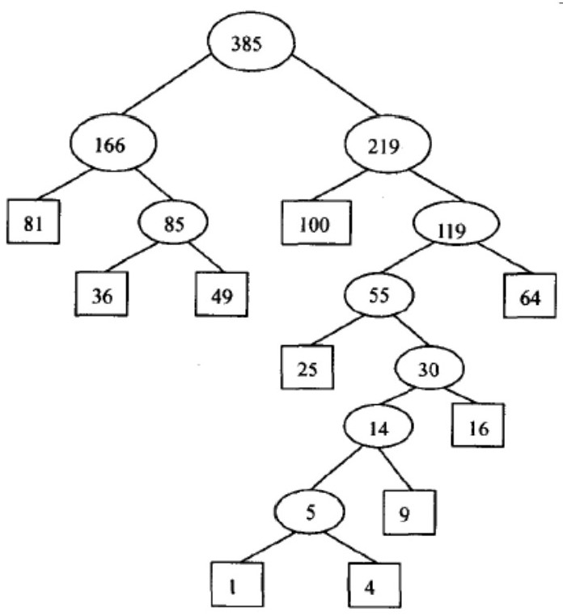

# 第五章 树与二叉树-二叉树

:warning: _注 1：对应张铭数据结构教材第五章-二叉树_  
:warning: _注 2：缺少的题号表示习题重复_

## 5.1 教材习题

### 5.1.1 对于 $3$ 个结点 $A、B、C$，有多少棵不同的二叉树，试画出来

> **解答：**
>
> 共有五种形状的二叉树，每种形状有$A_{3}^{3}=6$棵

<div align="center"></div>

### 5.1.2 分别按前序、后序、中序列出图 5.21 所示的二叉树结点

<div align="center"></div>

> **解答：**
>
> 前序：$ABDCEGFHI$  
> 后序：$DBGEHIFCA$  
> 中序：$DBAEGCHFI$

### 5.1.3 证明：一棵二叉树的所有终端结点(叶结点)，在前序序列、中序序列、后序序列中都按相同的相对位置出现

> **解答：**
>
> 数学归纳法证明
>
> （1）当 $n=0$ 时，对于空二叉树，其前、中、后序序列均为空，命题成立  
> （2）当 $n=1$ 时，对于只有一个结点的二叉树，设这个结点为 A，则它的前、中、后序序列均为 A，叶结点也为 A，命题成立  
> （3）假设 $n=k-1$ 和 $n=k-2$ 时成立，则当 $n=k(k≥2)$时，设这棵具有 k 个节点的二叉树$T_k$的根节点为 A，左子树$T_t$是一棵有 t 个节点的二叉树$(0≤t≤k-1)$，其前、中、后序序列分别为$L_1,L_2,L_3$；右子树$T_{k-t-1}$是一棵有$k-t-1$个结点的二叉树，其前、中、后序序列分别为$R_1,R_2,R_3$。则这棵二叉树的前、中、后序序列可分别表示为：$AL_1R_1,L_2AR_2,L_3R_3A$。  
> 根据假设，$L_1,L_2,L_3$中叶结点出现的相对位置是相同的，$R_1,R_2,R_3$中叶结点出现的相对位置也是相同的。而在二叉树$T_k$的前、中、后序序列中，$L_i$总是排在$R_i$之前，故叶结点出现的相对顺序仍是相同的。  
> 因此，当 $n=k$ 时，所有叶结点在前序序列、中序序列以及后序序列中都按相同的相对位置出现

### 5.1.4 找出所有这样的二叉树，其结点在下列两种次序之下都以同样的顺序出现

**（1）前序和中序**  
**（2）前序和后序**  
**（3）中序和后序**

> **解答：**
>
> 当为空树是成立。
>
> 当非空时：  
> &emsp;&emsp;前序周游：根、左、右  
> &emsp;&emsp;中序周游：左、根、右  
> &emsp;&emsp;后序周游：左、右、根  
> （1）前序和中序  
> &emsp;&emsp;只有根和左子树顺序是相反的，但根非空，所以当结点左子树为空时，其前序和中序结果一样  
> （2）前序和后序  
> &emsp;&emsp;只有一个根结点时，前序和后序结果一样  
> （3）中序和后序  
> &emsp;&emsp;当结点右子树为空时，其中序和后序结果一样

### 5.1.5 写一个递归函数计算二叉树的叶结点个数

> **解答：** _[code 5-1-5.cpp](./src/exercise1_zhangming/5-1-5.cpp)_
>
> ```cpp
> template <typename T>
> int BinaryTree<T>::leafNumber(BinaryTreeNode<T> *node)
> {
>     if(node == nullptr) return 0;
>     if(node->isLeaf()) return 1;
>     return leafNumber(node->leftChild()) + leafNumber(node->rightChild());
> }
> ```

### 5.1.6 写一个递归函数计算二叉树的高度，只有一个根节点的二叉树高度为 $1$

> **解答：** _[code 5-1-6.cpp](./src/exercise1_zhangming/5-1-6.cpp)_
>
> ```cpp
> template <typename T>
> int BinaryTree<T>::height(BinaryTreeNode<T> *node)
> {
>     if(node == nullptr)
>         return 0;
>     int h1 = height(node->leftChild()) + 1;
>     int h2 = height(node->rightChile()) + 1;
>     return h1 > h2 ? h1:h2;
> }
> ```

### 5.1.7 设计一个镜面影射算法，将一棵二叉树的每个结点的左右子结点交换位置。例如将图 5.22(a)所示二叉树转换成 5.22(b)

<div align="center"></div>

> **解答：** _[code 5-1-7.cpp](./src/exercise1_zhangming/5-1-7.cpp)_
>
> ```cpp
> template <typename T>
> void BinaryTree<T>::changePos(BinaryTreeNode<T> *node)
> {
>     BinaryTreeNode<T> *temppoint;
>     if(node != nullptr)
>     {
>         // 交换当前结点左右孩子的位置
>         temppoint = node->leftChild();
>         node->leftChild = node->rightChild();
>         node->rightChild = temppoint;
>         changePos(node->leftChild());
>         changePos(node->rightChild());
>     }
> }
> ```

### 5.1.8 给定结点类型为 `BinaryTreeNode` 的 $3$ 个指针 `p、q、rt`，设 `rt` 为根结点，求距离结点 `p` 和结点 `q` 最近的这两个结点的共同祖先结点

> **解答：** _[code 5-1-8.cpp](./src/exercise1_zhangming/5-1-8.cpp)_
>
> 先通过递归算法，找到并记录 `p`、`q` 两个结点自根结点以下路径，然后比较这两条路径，最后一个相同的结点即为 `p`、`q` 的最近共同祖先
>
> ```cpp
> bool rootPath(BinaryTreeNode *root, BinaryTreeNode *current);
>
> void collectiveAncestor(BinaryTreeNode *root, BinaryTreeNode *pchild, BinaryTreeNode *qchild)
> {
>     char proot[10], qroot[10];
>     // 求p、q结点到根结点的路径
>     int sum = 0;
>     rootPath(root, pchild);
>     proot[0] = root->element;
>     for(int i = 0; i <= sum - 1; i++)
>         proot[sum-i] = PathRoot[i];
>
>     sum = 0;
>     rootPath(root, qchild);
>     qroot[0] = root->element;
>     for(int i = 0; i <= sum - 1; i++)
>         qroot[sum-i] = PathRoot[i];
>     for(int i = 0; i <= sum; i++)
>     {
>         if(proot[i] != qroot[i]);
>         cout << "The ancestor of node p and q is: " << proot[i-1] << endl;
>         break;
>     }
> }
>
>
> bool rootPath(BinaryTreeNode *root, BinaryTreeNode *current)
> {
>     if(root == NULL) return false;
>     if(root->element == current->element) return true;
>     if(rootPath(root->leftChild, current))
>     {
>         PathRoot[sum] = root->leftChild->element;
>         sum += 1;
>         return true;
>     }
>     if(rootPath(root->rightChild(), current))
>     {
>         PathRoot[sum] = root->rightChild->element;
>         sum += 1;
>         return true;
>     }
>     return false;
> }
> ```

### 5.1.9 画出图 5.22(a)所示二叉树的二叉链表存储表示图，5.22 图见 [5.1.7](#417-设计一个镜面影射算法将一棵二叉树的每个结点的左右子结点交换位置例如将图-522a所示二叉树转换成-522b)

> **解答：**
>
> <div align="center"></div>

### 5.1.10 对于 $3$ 个关键码值 $A、B、C$ 有多少个不同的二叉搜索树？试将其画出来

> **解答：**
>
> 设 $A<B<C$
>
> （1）$A$ 为根，则 $B、C$ 必定都在 $A$ 的右子树，有两种情况
>
> <div align="center"></div>
>
> （2）$B$ 为根，则 $A$ 左 $C$ 右，一种情况
>
> <div align="center"></div>
>
> （3）$C$ 为根，则 $A、C$ 必定都在 $C$ 的左子树，有两种情况
>
> <div align="center"></div>

### 5.1.11 试证明：二叉搜索树结点的中序序列就是二叉搜索树结点按关键码值排序的序列

> **解答：**
>
> 本题可用反证、归纳等方法，下面是归纳法证明
>
> 设二叉搜索树共有 $N$ 个结点  
> （1）当 $N=0$，即二叉树为空时成立  
> （2）当 $N=1$，即二叉树只有一个结点时显然成立  
> （3）假设 $N<=K$ 时成立，当 $N=k+1$ 时，其左右子树的结点均小于或等于 $K$，所以其左右子树结点的中序排序都是这些结点按关键码值排序的序列。整棵树的中序序列 $A=$ {左子树中序序列}{根}{右子树中序序列}。根据二叉搜索树的性质，根结点的左子树中所有结点的关键码值都小于根结点的关键码值，而右子树中有所结点的关键码值都大于根结点的关键码值。序列 $A$ 仍是按关键码值排序的序列。  
> 由上可知，二叉树结点的中序序列就是二叉搜索树结点按关键码值排序的序列

### 5.1.12 写出从二叉搜索树中删除一个关键码的的递归算法

> **解答：** _[code 5-1-12.cpp](./src/exercise1_zhangming/5-1-12.cpp)_
>
> ```cpp
> template <typename T>
> void BinarySearchTree<T>::DeleteNodeEx(BinaryTreeNode<T> *pointer)
> {
>    if(pointer == NULL)
>        return;
>    BinaryTreeNode<T> *temppointer;                                     // 用于保存替换结点
>    BinaryTreeNode<T> *tempparent;                                      // 用于保存替换结点的父结点
>    BinaryTreeNode<T> *parent = Parent(pointer);                        // 用于保存待删除结点的父结点
>    if(pointer->leftchild() == NULL)                                    // 如果待删除结点的左子树为空
>        temppointer = pointer->rightchild();                            // 替换结点赋值为其右子树的根
>   else
>   {
>        temppointer = pointer->leftchild();
>        while(temppointer->rightchild() != NULL){                       // 寻找左子树最大结点
>            tempparent = temppointer;
>            temppointer = temppointer->rightchild();                    // 向右下降
>        }
>        if(tempparent == NULL)                                          // 如果替换结点是被删结点的左子结点
>            pointer->left = temppointer->leftchild();                   // 替换结点左子树挂接到被删结点的左子树
>        else tempparent->right = temppointer->leftchild();              // 替换结点的左子树作为其父结点右子树
>        temppointer->left = pointer->leftchild();                       // 继承pointer的左子树
>        temppointer->right = pointer->rightchild();                     // 继承pointer的右子树
>    }
>
>    // 下面用替换结点代替待删除结点
>    if(parent == NULL)
>        root = temppointer;
>    else if(parent->leftchild == pointer)
>        parent->left = temppointer;
>    else parent->right = temppointer;
>    delete pointer;
>    pointer = NULL;
>    return;
> };
>
> template <typename T>
> void BinarySearchTree<T>::deleteNode(BinaryTreeNode<T> *root, T num)
> {
>    if(root == NULL)
>        return;
>    if(root.value < num)
>        deleteNode(root->leftchild(), num);
>    else if(root.value > num)
>        deleteNode(root->rightchild(), num);
>    else
>        deleteEx(root);
> }
> ```

### 5.1.13 给出关键码序列${wxw, wxz, wzw, wzy, wzz, yyw, yyx, zww, zwx, zwy, zyw, zyx, zyy, zyz}$。从空二叉搜索树（BST）开始，按照上诉关键码出现的顺序依次插入，画出插入所有结点后的 BST

> **解答：**
>
> <div align="center"></div>

### 5.1.14 编写一个递归函数 `search()`，传入参数为一棵二叉树（不是二叉搜索树 BST）和一个值 `K`，如果值 `K` 出现在树中则返回 `true`，否则返回 `false`。相应的，写出一个等价的非递归函数

> **解答：** _[code 5-1-14.cpp](./src/exercise1_zhangming/5-1-14.cpp)_
>
> ```cpp
> #include <stack>
>
> // 方法一：递归
> template <typename T>
> bool search1(BinaryTreeNode<T> *root, T k)
> {
>     if(root == NULL)
>         return false;
>     if(root->vaule() == k)
>         return true;
>     return search1(root->leftChild(), k) || search1(root->rightChild(), k);
> }
>
>
> // 方法二：非递归，周游二叉树
> template <typename T>
> bool search2(BinaryTreeNode<T> *root, T k)
> {
>     using std::stack;
>     stack<BinaryTreeNode<T>* > aStack;
>     BinaryTreeNode<T> *pointer = root;
>     while(!aStack.empty() || pointer)
>     {
>         if(pointer)
>         {
>             aStack.push(pointer);
>             pointer = pointer->leftChild();
>         }
>         else
>         {
>             pointer = aStack.top();
>             if(pointer->value() == k)
>                 return true;
>             pointer = pointer->rightChild();
>             aStack.pop();
>         }
>     }
>     return false;
> }
> ```

### 5.1.15 编写一个递归函数 `smallcount()`，传入一棵二叉搜索树的根和值 `K`，返回小于或等于 `K` 结点的数目，函数 `smallcount()`应尽可能少地访问 BST 的结点。相应的，写出一个等价的非递归函数 `samllcount()`

> **解答：** _[code 5-1-15.cpp](./src/exercise1_zhangming/5-1-15.cpp)_
>
> 采取中序周游该二叉树，为了保证尽可能少地访问结点，可通过比较结点值与 $k$ 值的大小来判断周游的路径
>
> ```cpp
> #include <stack>
>
> // 方法一：递归算法
> template <typename T>
> int smallcount(BinaryTreeNode<T> *root, T k)
> {
>     if(root == NULL)
>         return 0;
>     else if(k >= root->value())
>         return (1 + smallcount(root->leftChild(), k) + smallcount(root->, k));
>     else
>         return smallcount(root->leftChild(), k);
> }
>
> // 方法二：非递归
> template <typename T>
> int smallcountWithRecursion(BinaryTreeNode<T> *root, T k)
> {
>     int n = 0;
>     using std::stack;
>     stack<BinaryTreeNode<T>*> aStack;
>     BinaryTreeNode<T> *pointer = root;
>     while(!aStack.empty() || pointer)
>     {
>         if(pointer)
>         {
>             aStack.push(pointer);
>             pointer = pointer->leftChild();
>         }
>         else
>         {
>             pointer = aStack.top();
>             if(pointer->value() <= k)
>                 n++;
>             else
>                 break;                  // 因为右侧的值必定不满足，可跳出循环
>             pointer = pointer->rightChild();
>             aStack.pop();
>         }
>     }
>     return n;
> }
> ```

### 5.1.16 编写一个递归函数 `printRange()`，传入一个 BST、一个较小的值和一个较大的值，按照顺序打印出介于两个值之间的所有结点。函数 `printRange()`应尽可能少地访问 BST 结点

> **解答：** _[code 5-1-16.cpp](./src/exercise1_zhangming/5-1-16.cpp)_
>
> 比较根结点，如果根结点的值位于两值之间，则打印根结点的值，并且递归调用根结点的左右结点，如果根结点的值大于更大的值，则递归调用根结点的左子树，如果小于更小的值，则递归调用右子树
>
> ```cpp
> #include <iostream>
>
>
> int printRange(BinaryTreeNode *root, int min, int max)
> {
>     using namespace std;
>     if(root->value() < min)
>         return 0;
>     else if(root->value() == min)
>     {
>         cout << root->value() << endl;
>         return printRange(root->rightChild(), min ,max) + 1;
>     }
>     else if(root->value() <= max)
>     {
>         cout << root->value() << endl;
>         return printRange(root->leftChild(), min, max) + printRange(root->rightChild(), min, max) + 1;
>     }
>     else if(root->value() > max)
>         return printRange(printRange(root->leftChild(), min, max), int min, int max)
> }
> ```

### 5.1.17 编写一个 `IsBST`，传入参数为一棵二叉树，如果该二叉树是 BST 则返回 `true`，否则返回 `false`

> **解答：** _[code 5-1-17.cpp](./src/exercise1_zhangming/5-1-17.cpp)_
>
> 如果根结点大于左子结点，小于右子结点，且左右子树均为 BST，则该二叉树为 BST
>
> ```cpp
> bool IsBST(BinaryTree *tree)
> {
>     if(tree)
>         return isBST(tree->root);
>     else
>         return false;
> }
>
> bool isBST(BinaryTreeNode *root)
> {
>     if(root == NULL) return true;
>     // 如果左子结点大于等于本结点的值，返回false
>     if(root->leftChild() && root->value() <= root->leftChild()->value())
>         return false;
>     // 如果右子结点小于本节点的值，返回false
>     if(root->rightChild() && root->value() > root->rightChild()->value())
>         return false;
>     return isBST(root->leftChild()) && isBST(root->rightChild());
> }
> ```

### 5.1.18 编写一个函数 `IsMinHeap()`，传入参数为一个数组，如果该数组中地值满足最小堆的定义则返回 `true`，否则返回 `false`

> **解答：** _[code 5-1-18.cpp](./src/exercise1_zhangming/5-1-18.cpp)_
>
> ```cpp
> bool IsMinHeap(int k[], int length)
> {
>     for(int i = 0; i <= (length-1)/2; i++)
>     {
>         if(2*i + 2 <= length)           // 左右孩子都有结点
>         {
>             if(!(k[i] <= k[2*i + 1] && k[i] <= k[2*i + 2]))
>                 return false;
>         }
>         else if(!(k[i] <= k[2*i + 1]))  // 判断左孩子结点
>             return false;
>     }
>     return true;
> }
> ```

### 5.1.19 初始关键码序列为${E, D, X, K, H, L, M, C, P}$，试给出用筛选法所建的最小堆，并写出其相应的序列，在建堆过程中，移位次数是多少

_提示：一次移位就是对关键码的一次赋值操作。例如，交换 `Arr[i]`与 `Arr[j]`的操作是 $3$ 次移位：`tmp = A[i], A[i] = A[j], A[j] = tmp`。不考虑下标变量的赋值(例如 `i = 100` 不算一次赋值)_
**&nbsp;**

> **解答：**
>
> <div align="center"></div>
>
> 最后得到的序列为${C,D,L,E,H,X,M,K,P}$
>
> 按照交换算法应该是 $5×3=15$ 次。（注意到笔记中筛选法构建最小堆代码 [MinHeap.cpp](./src/Note/MinHeap.cpp) 即教材 P125 的 `SiftUp` 方法中实际上不是交换两个结点的值，二十在循环外记录最小的值后，用大的值覆盖小的值，这样每一次操作实际是两次移位（即两次赋值），因此由于总共有 $5$ 次筛选，如果按照教材中的算法，移位次数是 $3×3+1+2+1=13$ 次）

### 5.1.20 对于给出的一组权 $W={1,4,9,16,25,36,49,64,81,100}$，构造具有最小带权外部路径长度的扩充二叉树，并求出它的带权外部路径长度

> **解答：**
>
> <div align="center"></div>
>
> 带权外部路径长度$=(1+4)×7+9×6+16×5+25×4+(36+49+64)×3+(81+100)×2=1078$

### 5.1.21 给定一组权$W_0,W_1,...,W_{n-1}$，说明怎样构造一个具有最小带权外部路径长度的扩充 $k$ 叉树。试对权集 $1,4,9,16,25,36,49,64,81,100$ 来具体构造一个这样的扩充三叉树

> **解答：**
>
> 必须让权越大的叶子离根越近，同时必须让外部路径长度最小，因此必须保证 $K$ 叉树高层结点的度数为 $k$  
> （1）如果 $n≤k$，直接合并成一棵树。否则，将序列按从小到大的顺序排好  
> （2）计算 $m$ 值，`if n % (k-1) <= 1 m = n % (k-1) + (k-1); if n % (k-1) > 1 m = n % (k-1)`  
> （3）取最小的 $m$ 个权值合并成一个新结点，其权值为两个值之和  
> （4）再将权值按从小到大的顺序排号，取前 $k$ 个（即最小的 $k$ 个）权，合并成一个新结点，其权值为 $k$ 个权的和  
> （5）重复第（4）步，知道合并所有的结点。
>
> 求 $1 \; 4 \; 9 \; 16 \; 25 \; 36 \; 49 \; 64 \; 81 \; 100$  
> 计算 $m=2$，即先合并最小的两个，再依此类推合并最小的 $3$ 个，直至恰好完成序列。其构造过程如下图：
>
> <div align="center"></div>

### 5.1.22 任何包括 $n$ 个结点的二叉树的二叉链表表示中，$2n$ 个指针中都只有 $n-1$ 个用来指示结点的左右子节点，而另外 $n+1$ 个为空。可以用指向结点按某种次序周游的前驱和后继的指针来替代这些空的指针。这种附加的指针称作“线索”，加进了线索的二叉链表称作穿线二叉树。由于有了线索的存在而使得周游二叉树和找结点在指定次序下的前驱、后继的算法变得很简单。例如图 5.23 就是一个中序穿线树。在穿线树中如果结点有左子树，那么它的左指针 `left` 就指向其左孩子，否则 `left` 指向其前驱结点；如果有右子树，那么它的右指针 `right` 就指向右孩子，否则 `right` 就指向其后继结点。为区分指针和线索，需要在每个结点中增加两个标志位，分别指示左右指针位置中存的是指针还是线索。试给出将二叉树以中序遍历使其变成穿线树的线索化算法。以下给出了穿线二叉树的结构

| left | ltag | info | rtag | right |
| :--: | :--: | :--: | :--: | :---: |

<div align=center>

</div>

> **解答：** _[code]()_
>
> 解答内容
>
> ```cpp
>
> ```

## 5.2 上机题

### 5.2.1 二叉树两个结点间的最小距离

**定义二叉树两个结点间的最小距离为：这两个结点的最近公共祖先结点分别到这两个结点的路径长度之和。试设计一种方法，找出给定二叉树中任意两个结点之间的最小距离，可以考虑以图形显示**
&nbsp;

### 5.2.2 表达式二叉树

**表达式可以用表达式二叉树表示，对于简单的四则运算表达式，请实现以下功能**  
**（1）对于任意给出的前缀表达式（不带括号）、中缀表达式（可以带括号）或后缀表达式（不带括号），能够在计算机内部构造出一棵表达式二叉树，并且以图示显示出来（字符图或图形的形式）**  
**（2）按照用户的要求，输出相应的前缀表达式（不带括号）、中缀表达式（可以带括号，但不允许冗余括号）或后缀表达式（不带括号）**  
_提示：所谓中缀表达式中的冗余括号，就是去掉该括号不影响表达式的计算。例如“(a+b)+a”中的括号是冗余的，可以表示成不冗余的“a+b+a”。_

### 5.2.3 逻辑表达式推演

**一个逻辑表达式如果对于其变元的任意一种取值都为真， 则称为重言式；反之，如果对于其变元的任一一种取值都为假，则称矛盾式；否则，既非重言式也非矛盾式。编写程序通过真值判断一个逻辑表达式属于哪一类。**  
**（1）逻辑运算符包括“|”、“ ”、“~”，分别标识逻辑或、与、非，表达式包含括号**  
**（2）如果是既非重言式，也非矛盾式，试按照用户给定变元的取值（可选）显示逻辑表达式的值**  
**（3）按照用户的要求可以打印真值表**

### 5.2.4 Huffman 编码

**完成根据代码 5.12 建立 Huffman 编码树的源代码，包括计算各个字母对应代码的函数以及对信息进行编码于解码的函数。这个对象可以进一步扩展以支持对文件的压缩，为此必须增加两个步骤：**  
**（1）扫描整个文件以生成文件各个字母的实际使用频率**  
**（2）在编码文件的开头存储 Huffman 树，以便解码函数使用**

### 5.2.5 优先队列

**利用最大堆实现一个优先队列，对于队列的操作应该至少支持下述代码段的几种指令**  
**函数 `enqueue()`向优先队列中插入一个 `ID` 号为 `ObjcetID`、优先级为 `priority` 的新对象**  
**函数 `deququq()`从优先队列中删除优先级最高的对象，并返回该对象的 `ID` 号**  
**函数 `changeweight` 将 `ID` 号为 `ObjectID` 的对象的优先级改为 `newPriority`**  
**需要建立一种机制来获取所需对象在堆的位置，还需要对堆实现进行修改，以存储对象在数组中的位置，以便在辅助数据结构中记录针对堆中对象的修改**

```cpp
void enqueue(int ObjectID, int Priority);
int dequeue();
void changeweight(int ObjectID, int newPriority)
```

## 5.3 《学习指导》教材习题解答

### 5.3.10 画出图 5.21 所示二叉树的中序穿线二叉树存储表示

<div align="center"></div>

> **解答：**
>
> <div align="center"></div>

### 5.3.11 编写算法在中序穿线二叉树里找指定结点在后续周游中的前驱

> **解答：** _[code 5-3-11.cpp](./src/exercise1_zhangming/5-3-11.cpp)_
>
> 在后序排列的二叉树中，如果给定的结点有右子树，则给定结点的前驱是其右子树的根结点。否则，如果给定结点的有左子树，则其前驱是其左子树的根结点  
> 如果给定的结点既没有右子树，也没有左子树，及给定的结点是叶结点，则可以利用穿线树的结构很容易地找到给定结点在中序周游中的前驱 $x$。根据中序周游的特点，如果给定结点有前驱 $x$，给定结点是 $x$ 的右子树在中序周游中的第一个结点，则其也是 $x$ 的右子树在后序周游中的第一个结点。所以，如果 $x$ 有左子树，则其根结点就是 $x$ 的左子树在后序周游中的最后一个结点，也就是给定结点在后序周游中的前驱。  
> 如果 $x$ 没有左子树，则找到 $x$ 在中序周游中的前驱 $x$'，可以判断，给定结点也是 $x$'的右子树在后序周游中的第一个结点，所以 $x$'如果有左子树，则其根结点是给定结点在后序周游中的前驱。如果没有，则按照这个方法继续寻找 $x$'在中序周游中的前驱。直到找出一个有左子树的结点为止。
>
> ```cpp
> ThreadBinaryTreeNode* FindPreInsorder(ThreadBinaryTreeNode *pointer)
> {
>     ThreadBinaryTreeNode *temppointer = nullptr;
>     // 指定结点有右孩子
>     if(pointer->rTag == 0)
>         return pointer->rightChild();
>     else temppointer = pointer;
>     while(temppointer->lTag == 1)
>         // 结点在中序下的前驱
>         temppointer = temppointer->leftChild();
>     temppointer = temppointer->leftChild();
>     return temppointer;
> }
> ```

### 5.3.12 编写算法按后续周游中序穿线树

> **解答：** [code 5-3-12.cpp](./src/exercise1_zhangming/5-3-12.cpp)
>
> ```cpp
> // 方法一：由于穿线是为方便中序遍历而设计的，后序遍历时穿线完全失去作用，所以还要向普通二叉树一样用栈遍历
> void ThreadPostOrder(TBT *root)
> {
>     if(root->lTag == 0)
>         ThreadPostOrder(root->left);
>     if(root->rTga == 0)
>         ThreadPostOrder(root->right);
>     visit(root);
> }
>
> // 利用5.3.11的函数
> #include "./4-3-11.cpp"
> template <typename T>
> void ThreadBinaryTree<T>::Postorder(ThreadBinaryTreeNode<T> *root)
> {
>     ThreadBinaryTreeNode<T> *pointer;
>     if(root == nullptr)
>         return;
>     pointer = FindPreInsorder(root);
>     Postorder(pointer);
>     visit(root->value);
> }
> ```

### 5.3.13 设计一个算法，往中序穿线二叉树指定结点的左边插入一个新结点。规定插入这样进行：$r$ 指向要插入的新节点，$p$ 指向穿线二叉树里的一个结点，将新结点插进来作为 $p$ 指向结点的左子树的根。$p$ 指向结点原来的左子树现在作为新结点的左子树（新结点的右子树为空）。即在中序序列里，新结点刚好插到 $p$ 所指向的结点之前

> **解答：** [code 5-3-13.cpp](./src/exercise1_zhangming/5-3-13.cpp)
>
> ```cpp
> template <typename T>
> void ThreadBinaryTree<T>::InsertNode(ThreadBinaryTreeNode<T> *p, ThreadBinaryTreeNode<T> *r)
> {
>     ThreadBinaryTreeNode<T> *temppointer = nullptr;
>     // 找到指定结点的中序前驱
>     if(p->leftChild() == nullptr)
>         temppointer = nullptr;
>     else if(p->lTag == 1)                   // 左孩子为线索，前驱是左孩子
>         temppointer = p->leftChild();
>     else
>     {
>         temppointer = p->leftChild();       // 左孩子是指针，前驱是左子树中按中序遍历周游最后一个点
>         while(temppointer->rTag == 0)
>             temppointer = temppointer->rightChild();
>     }
>
>     // 建立指定结点的中序前驱的右线索
>     if((temppointer != nullptr) && (temppointer->rTag == 1))
>         temppointer->right = r;
>     // 建立新结点的左指针或左线索
>     r->lTag = p->lTag;
>     r->left = p->leftChild();
>     // 插入新结点
>     p->lTag = 0;
>     p->left = r;
>     // 建立新结点右线索
>     r->rTag = 1;
>     r->right = p;
> }
> ```

### 5.3.26 一组包含不同权的字母已经对应好 Huffman 编码，如果某一字母对应编码 $001$，则

**（1）什么编码不可能对应其他字母**  
**（2）扫描编码肯定对应其他字母**

## 5.4 《学习指导》教材上机题解答

## 5.4 《学习指导》增补习题

### 5.4.1 已知二叉树各节点的前序、中序周游分别为 $ABCDEF$ 和 $CBAEDF$，试画出二叉树

> **解答：**
>
> 前序的第一个为根结点，由根结点到中序找对应结点，则在中序序列中，该节点左边是左子树，右边是右子树。  
> （1）$\textbf{A}BCDEF$ &emsp;&emsp;&emsp; $CB\textbf{A}EDF$  
> => $A$ 是根结点，$A$ 的左子树是 $CB$，右子树是 $EDF$  
> （2）$\textbf{B}CDEF$ &emsp;&emsp;&emsp; $C \textbf{B}$  
> => $A$ 的左子树的根结点是 $B$，$B$ 的左子树是 $C$，没有右子树  
> （3）$\textbf{D}EF$ &emsp;&emsp;&emsp; $E \textbf{D}F$  
> => $A$ 的右子树根结点是 $D$，$D$ 的左子树是 $E$，右子树是 $F$

### 5.4.2 将图 5.16 中的二叉树按中序线索化，结点 $X$ 的右指针和 $Y$ 的左指针分别指向哪

<div align="center"></div>

### 5.4.3 已知一个二叉树的前序及中序遍历结果，设计一个算法恢复该二叉树

> **解答：** _[code]()_
>
> 解答内容
>
> ```cpp
>
> ```

### 5.4.4 设计一个算法，在二叉树中查找值为 $x$ 的结点，并打印出所有的祖先

> **解答：** _[code 5-4-4.cpp](./src/exercise1_zhangming/5-5-4.cpp)_
>
> ```cpp
> #include "BinaryTreeNode.hpp"
>
>
> template <typename T>
> bool rootPath(BinaryTreeNode<T> *root, T value, T *PathRoot, int &sum)
> {
>     if(root == nullptr) return false;
>     if(root->value() == value) return true;
>     if(rootPath(root->leftChild(), value, PathRoot, sum))
>     {
>         PathRoot[sum] = root->rightChild()->value;
>         sum += 1;
>         return true;
>     }
>     if(rootPath(root->rightChild(), value, PathRoot, sum))
>     {
>         PathRoot[sum] = root->rightChild()->value;
>         sum += 1;
>         return true;
>     }
>     return false;
> }
>
> template <typename T>
> bool solution(BinaryTreeNode<T> *root, T value)
> {
>     int sum = 0;
>     T PathRoot[100];
>     bool ret = rootPath(root, value, PathRoot, sum);
>     return ret;
> }
> ```

### 5.4.5 设计一个算法，求任意二叉树中第一条最长的路径长度，并输出此路径上各结点的值

> **解答：** _[code]()_
>
> ```cpp
>
> ```

### 5.4.6 试编写一个算法，判定给定二叉树是否为满二叉树

> **解答：** _[code 5-4-6.cpp](./src/exercise1_zhangming/5-4-6.cpp)_
>
> 层序遍历思想，当结点左右子树只存在一个时，该二叉树不是满二叉树
>
> ```cpp
> #include <queue>
> #include "BinaryTreeNode.hpp"
>
>
> using std::queue;
>
> template <typename T>
> bool isFullBT(BinaryTreeNode<T> *root)
> {
>     queue<BinaryTreeNode<T> *> Q;
>     BinaryTreeNode<T> *temp;
>     if(!root)
>         return true;
>     Q.push(root);
>     while(!Q.empty())
>     {
>         temp = Q.front();
>         Q.pop();
>         if(temp->leftChild() && temp->rightChild())
>         {
>             Q.push(temp->leftChild());
>             Q.push(temp->rightChild());
>         }
>         else if(temp->leftChild() == nullptr && temp->rightChild() == nullptr)
>             continue;
>         else
>             return false;
>     }
> }
> ```

### 5.4.7 试编写一个算法，判定给定二叉树是否为完全二叉树

> **解答：** _[code 5-4-7.cpp](./src/exercise1_zhangming/5-4-7.cpp)_
>
> 解答内容
>
> ```cpp
> #include <queue>
>
> using std::queue;
>
>
> // 层次遍历思想
> template <typename T>
> bool IsCompleteBT(BinaryTree<T> *T)
> {
>     queue<BinaryTreeNode<T> * > Q;
>     BinaryTreeNode<T> *temp;
>     if(!T)
>         return 1;
>     Q.push(T.root);   // 根结点
>     while(!Q.empty())
>     {
>         temp = Q.front();
>         Q.pop();
>         if(temp)
>         {
>             Q.push(temp->leftChild());
>             Q.push(temp->rightChild());
>         }
>         else
>         {
>             while(!Q.empty())
>             {
>                 temp = Q.front();
>                 Q.pop();
>                 if(temp)
>                     return 0;
>             }
>         }
>     }
>     return 1;
> }
> ```

### 5.4.8 假设二叉树采用链表结构进行存储，编写一个函数，求根结点到任意一个结点 $p$ 之间的路径

> **解答：** _[code]()_
>
> 解答内容
>
> ```cpp
>
> ```

### 5.4.9 设计一个算法，判断两棵二叉树是否相似。所谓二叉树 $T_1$ 和 $T_2$ 相似，指的是 $T_1$ 和 $T_2$ 都是空的二叉树，或者 $T_1$ 和 $T_2$ 的根结点是相似的，$T_1$ 的左子树和 $T_2$ 的左子树是相似的且 $T_1$ 的右子树和 $T_2$ 的右子树是相似的

> **解答：** _[code]()_
>
> 解答内容
>
> ```cpp
>
> ```

### 5.4.10 有 $n$ 个结点的二叉树，已知叶节点个数为$n_0$，写出求度为 $1$ 的结点的个数$n_1$的计算公式；若此树是深度为 $k$ 的完全二叉树，写出 $n$ 为最小的公式；若二叉树中仅有度为 $0$ 和度为 $2$ 的结点，写出求改二叉树结点个数 $n$ 的公式

> **解答：** _[code]()_
>
> 解答内容
>
> ```cpp
>
> ```

### 5.4.11 有一棵完全二叉树，其结点按层次顺序存于一维数组 $A(1:n)$中，试编写一个算法，建立该二叉树的二叉链表存储结构

> **解答：** _[code]()_
>
> 解答内容
>
> ```cpp
>
> ```

### 5.4.12 试讨论，能否在一棵中序全线索二叉树上查找给定结点 $x$ 在前序序列中的后继，在后序序列中的后继

> **解答：** _[code]()_
>
> 解答内容
>
> ```cpp
>
> ```

### 5.4.13 已知某电文中共出现了 $10$ 种不同的字母，每个字母出现的频率分别为 $A:8,B:5,C:3,D:2,E:7,F:23,G:9,H:11,I:2,J:35$，现对这段电文用 $3$ 进制进行编码（即码字由 $0,1,2$ 组成），问电文编码总长度至少多少位？请画出相应的图

> **解答：** _[code]()_
>
> 解答内容
>
> ```cpp
>
> ```

### 5.4.14 已知某字符串 S 总共有 $8$ 种字符，各种字符分别出现 $2$ 次，$1$ 次，$4$ 次，$5$ 次，$7$ 次，$3$ 次，$4$ 次和 $9$ 次，对该字符串用${0,1}$进行前缀编码，问该字符串的编码至少有多少位

> **解答：**
>
> 根据 Huffman 编码规则，可知该字符串的编码至少有$6$位

## 5.5 《学习指导》增补上机题

### 5.5.1 利用 BST 存储数据库记录实现一个城市数据库。每个数据库结点包含城市名称（一个长度任意的字符串）和以整数 $x$ 与 $y$ 表示的城市坐标。根据城市的名称组织该 BST。这个数据库应该能够记录允许的插入，根据名称或坐标删除，以及根据名称或坐标进行检查，并且能够打印出与指定点的距离在给定值内的所有城市的记录。它应该能够使用某种顺序将 BST 写入磁盘，并且能够读出使用相同顺序存储的 BST 存储文件

### 5.5.2 已知一棵二叉树的前序遍历和中序遍历结果（例如 4.17 中的二叉树，其前序遍历为 $ABCDEF$，中序遍历为 $DBEAFC$），请编写一个算法还原这棵二叉树

<div align="center"></div>

### 5.5.3 已知一棵中序全线索二叉树（如图 4.18 所示），请编写一个算法后序遍历这棵中序全线索二叉树，算法中不允许使用栈和递归

<div align="center"></div>
