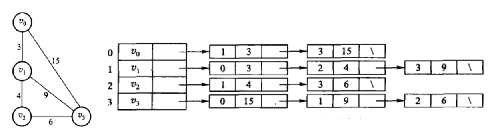
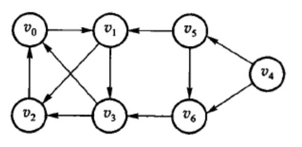

# 第六章 图

**概览：**

**[:question: 图的定义](#图的定义)**  
**[:question: 图的基本术语](#图的基本术语)**  
**[:question: 图的抽象数据类型](#图抽象数据类型)**  
**[:question: 图的存储结构](#图的存储结构)**  
**[:question: 图的周游](#图的周游)**  
**[:question: 拓扑序列与关键路径](#拓扑序列与关键路径)**  
**[:question: 最短路径](#最短路径)**  
**[:question: 最小生成树](#最小生成树)**

## 图的定义

前言

- 线性结构：唯一前驱、唯一后继，反映一种线性关系
- 树形结构：唯一前驱、多个后继，反映一种层次关系
- 图结构：不限制前驱和后继的个数，反映一种网状关系

可知，线性表和树可以看作是受限图

- 定义  
   图由数据元素集合$V$和表示数据之间关系的集合$E$组成，记为$G=<V,E>$  
   在图中，数据元素通常称作顶点（$vertex$），$V$表示顶点的集合；顶点的序偶称为边（$edge$），$E$表示边的集合

## 图的基本术语

- 无向图  
   代表一条边的顶点序偶是无序的（即该边无方向）  
   无序偶对用圆括号表示，设$v_1,v_2∈V$，若$(v_1,v_2)∈E$，则在无向图$G$中$v_1$和$v_2$间有一条边，且$(v_1,v_2)$和$(v_2,v_1)$是同一条边

- 有向图  
   代表一条边的顶点序偶是有序的（即边有方向）  
   有序偶对用尖括号表示，若$<v_1,v_2>∈E$，则$<v_1,v_2>$表示有向图$G$从$v_1$到$v_2$的一条边。有向图的边也可以称为弧，$v_1$称为弧尾或边的始点，$v_2$称为弧头或边的终点。$<v_1,v_2>$和$<v_2,v_1>$是不同的弧

  <div align="center"></div>

  无向图$G_1$表示如下

  > $G_1 = <V(G_1),E(G_1)>$  
  > $V(G_1) = \{v_0,v_1,v_2,v_3,v_4\}$  
  > $E(G_1) = \{(v_0,v_2),(v_0,v_3),(v_1,v_3),(v_1,v_4),(v_2,v_3),(v_2,v_4)\}$

  有向图$G_2$表示如下

  > $G_2 = <V(G_2),E(G_2)>$  
  > $V(G_2) = \{v_0,v_1,v_2,v_3\}$  
  > $E(G_2) = \{<v_0,v_1>,<v_0,v_2>,<v_2,v_3>,<v_3,v_0>\}$

- 带权图  
   每条边或弧都带权的图，该权可以用于表示一个顶点到另一个顶点的距离、代价、消耗等

- 完全图  
   任何两个顶点间都有边相关联的图称为完全图，完全图具有最大边数

- 子图  
   设$G=<V,E>$是一个图，若$E'⊆E,V'⊆V$，且$E'$中的边仅与$v'$中的顶点相关联，则图$G'=(V',E')$称为图$G$的子图

- 顶点的度  
   无向图中顶点的$v$度是与该顶点相关联的边的数目，记为$D(v)$  
   有向图中，把以顶点$v$为终点的弧的数目称为$v$的入度（$in \; degree$），记为$ID(v)$；把以顶点$v$为始点的弧的数目称为$v$的出度（$out degree$），记为$OD(v)$，并把出度为$0$的顶点称为终端顶点或叶子。有向图顶点$v$的度定义为$D(v)=ID(v)+OD(v)$  
   一般来说，如果图$G$中有$n$个顶点$\{v_0,v_1,...,v_n\}$，$e$条边，$D(v_i)$为顶点$v_i$的度数，显然有$e=\frac{1}{2}\sum_{i=0}^{n-1}D(v_i)$（这里每个顶点度数都算了两次，需要除以$2$）

  > 上文无向图$G_1$，顶点$v_1$的度为$2$，有向图$G_2$，顶点$v_1$入度为$1$，出度为$0$，度为$1$

- 路径  
   从顶点$v_p$到$v_q$的路径 一个顶点序列$v_p=v_{i0},v_{i1},...,v_{im}=v_q$，若是有向图，则路径也是有向的

  路径长度：路径上的边或弧的数目

  回路（$cycle$）：第一个顶点和最后一个顶点相同的路径称为回路或环

  简单路径：序列中顶点不重复出现的路径

  简单回路：除了第一个顶点和最后一个顶点外，其余顶点不重复的回路

  无环图（$acyclic \; graph$）：不带回路的图

  有向无环图（$directed \; acyclic \; graph,DAG$）：不带回路的有向图

  有根的图：一个有向图中，若存在一个顶点$v_0$，从此顶点有路径可以到达其他所有顶点，则称此有向图为有根的图，$v_0$称作图的根

- 连通

  - 无向图  
     无向图中，如果顶点$v_i$到顶点$v_j$有路径，则称$v_i$和$v_j$是连通的。  
     如果对于图中的任意两个顶点$v_i,v_j∈V$，$v_i,v_j$都是连通的，则称无向图$G$为连通图。连通分量定义为无向图中的极大连通子图
      <div align="center"></div>

  - 有向图  
      若$G$中任意两个顶点$v_i.v_j$，都有一条$v_i$到$v_j$的有向路径，同时还有一条从$v_j$到$v_i$的有向路径，则称有向图$G$是强连通图。有向图强连通的极大子图称为该有向图的强连通分量
      <div align="center"></div>

  - 一个连通的图的生成树是含有该连通图的一个极小连通子图
  - 自由树：不带简单回路的无向图，它是连通的，且具有$n-1$条边
  - 网络：带权的连通图
  - 有向树：有向图中，只有一个顶点的入度为$0$，其余顶点的入度均为$1$。  
      一个有向图生成的森林由若干棵有向树组成，这些树的的并集包含了原图的所有顶点，各有向树的弧互不相交

## 图的抽象数据类型

- 类型名称：图（$Graph$）
- 数据对象集：$G=<V,E>$由一个非空的有限顶点集合$V$和一个有限边集合$E$组成
- 操作集：对于任意图$G∈Graph,v∈V,e∈E$
  - `Graph Create()`：建立并返回空图
  - `Graph InsertVertex(Graph G, Vertex v)`：将$v$插入$G$
  - `Graph InsertEdge(Graph G, Edge e)`：将$e$插入$G$
  - `void DFS(Graph G, Vertex v)`：从顶点$v$出发深度优先遍历图
  - `void BFS(Graph G, Vertex v)`：从顶点$v$出发广度优先遍历图
  - `void ShortestPath(Graph G, Vertex v, int Dist[])`：计算图中顶点$v$到任意其他顶点的最短距离
  - `void MST(Graph G)`：计算图的最小生成树

## 图的存储结构

图的常用存储结构有相邻矩阵、邻接表和十字链表等

### 相邻矩阵

图的相邻矩阵表示顶点之间的邻接关系，即表示顶点之间右边或没有边的情况。设$G=<V,E>$是一个有$n$个顶点的图，则图的相邻矩阵是一个二维数组$A[n,n]$，定义如下：

$$
A[i,j] = \left\{\begin{matrix}
1 & (v_i,v_j)\in E \; or \;<v_i,v_j> \in E\\
0 & (v_i,v_j)\notin E \; or \;<v_i,v_j> \notin E
\end{matrix}\right.
$$

- 无向图的相邻矩阵是对称的  
    顶点$i$的度是第$i$行的元素或第$i$列的元素累加之和，即  
    $D(v_i)=\sum_{i=0}^{n-1}A[i,j]=\sum_{j=0}^{n-1}A[i,j]$
- 有向图的相邻矩阵不一定是对称的  
    第$j$列的所有元素之和是顶点$v_j$的入度$ID(v_j)$；  
    第$i$行的所有元素之和是顶点$v_i$的出度$OD(v_i)$，即  
    $ID(v_j)=\sum_{j=0}^{n-1}A[i,j] \;\; OD(v_i)=\sum_{i=0}^{n-1}A[i,j]$

<div align="center"></div>

- 网络带权图的相邻矩阵

    $$
    A[i,j] = \left\{\begin{matrix}
    w[i,j] & i \neq j, (v_i,v_j)\in E \; or \;<v_i,v_j> \in E\\
    \infty & i \neq j, (v_i,v_j)\in E \; or \;<v_i,v_j> \in E\\
    0 & i=j
    \end{matrix}\right.
    $$

    <div align="center"></div>

_相邻矩阵`C++`实现代码：[code adjacency_matrix.cpp](./src/Note/Adjacency_matrix.cpp)_

### 邻接表

当图的边数较少时，相邻矩阵会出现大量的$0$元素，存储这些$0$元素将耗费大量存储空间。对于稀疏图，可以采用邻接表存储法

邻接表表示法是一种链式存储结构，由一个顺序存储的顶点表和$n$个连接存储的边表组成。顶点表目有两个域：顶点数据域和指向此顶点边表指针域。边表把依附于同一个顶点$v_i$的边（即相邻矩阵中同一行的非$0$元素）组织成一个单链表。边表的每一个表目都代表一条边，由两个主要的域组成：与顶点$v_i$邻接的另一个顶点的序号、指向边表中下一个边表的目的指针

- 无向图  
    同一条边在连接表中出现两次。  
    <div align="center"></div>
- 有向图  
    一条弧在邻接表中只出现一次，顶点$v_i$的边表的表目个数是该顶点的出度，因此邻接表也称为出边表；要知道顶点$v_i$的入度，必须遍历整个邻接表，查看有多少个边表目中的顶点为$v_i$。也可建立逆邻接表，即顶点$v_i$的边表中表示的是以该顶点为终点的边，因此逆邻接表也称入边表，顶点$v_i$的边表的表目个数是该顶点的入度

    <div align="center"></div>

- 带权图  
    对于带权图，每一个边结点需要设置一个域来保存权值信息。  
    对于带权无向图：  
    <div align="center"></div>

_邻接表的`C++`实现代码：[code Adjacency_list](./src/Note/Adjacency_list.cpp)_

### 十字链表

十字链表是有向图的另一种链式存储结构，可以看成是邻接表和逆邻接表的结合  
表中对应有向图的每一条弧有一个表目，共有$5$个域：头`headvex`和尾`tailvex`分别表示弧头和弧尾（终点和始点）顶点序号；`tailnextarc`链接指针指向下一条顶点以`tailvex`为弧权值等信息的`info`域。  
顶点表目由$3$个域组成：`data`域存放顶点的相关信息；`firstinarc`链接指针指向第一条以该顶点为终点的弧；`firstoutarc`链接指针指向第一条以该顶点为始点的弧。所有的顶点也可以放在顺序存储结构中

<div align="center"></div>

十字链表有向图示例如下，其中省略了弧的`info`域  
<div align="center"></div>

从顶点结点$v_i$的`firstoutarc`出发，由`tailnextarc`域链接起来的链表，正好是原来的邻接表结构。统计这个链表中的表目个数，可以得到$v_i$的出度  
从顶点结点$v_i$的`firstinarc`出发，由`headvex`域链接起来的链表，恰好是原来的逆邻接表结构。统计这个链表中的表目个数，可以得到$v_i$的入度

## 图的周游

图的周游是指从图中的某一个顶点出发，按照一定的策略访问图中的每一个顶点，使得每一个顶点都被访问且只被访问一次

- 深度优先周游（**depth-first search, DFS**）

    图的**DFS**类似与树的先根次序周游。**DFS**特点是尽可能先对纵深方向进行搜索

  深度优先搜索的结果是沿着图的某一分支搜索，直到它的末端，然后回溯，沿着另一分支进行同样的搜索，依次类推  
  **DFS**过程如下：  
  <div align="center"></div>  

  假设从$v_0$出发，标记$v_0$为`VISITED`，然后从$v_0$邻接表中取出未访问邻接点$v_1$，标记$v_1$为`VISITED`。然后再从$v_1$的邻接表中取未访问邻接点$v_2$（假设$v_2$排在$v_3$之前），标记$v_2$为`VISITED`。因为$v_2$邻接表全部被访问过（只有$v_0$一个邻接点)，所以退回到顶点$v_1$。再取下一个未被访问的邻接点$v_3$，标记$v_3$为`VISITED`。查找$v_3$时，发现$v_0$和$v_2$都被访问，退回到顶点$v_1$，此时$v_1$也没有未访问邻接点，退回$v_0$。再继续找下一个未访问的顶点继续深度优先搜索。即先访问$v_4$，依次访问$v_5$和$v_6$

  ```cpp
  void DFS(Graph &G, int v)
  {
      G.mark[v] = VISITED;
      Visit(G, v);
      for(Edge e = G.firstEdge(v); G.isEdge(e); e = G.nextEdge(e))
      {
          if(G.mark[G.toVertex(e)] == UNVISITED)
              DFS(G, G.toVertex(e));
      }
  }
  ```
  
  复杂度分析：对于具有$n$个顶点$e$条边的无向图或有向图，深度优先周游算法对图中每个顶点至多调用一次`DFS()`函数。  
  对于相邻矩阵，共需检查$n^2$个矩阵元素，所需时间为$O(n^2)$  
  对于邻接表，找邻接结点需将邻接表中所有边结点检查一遍，需要时间$O(e)$，总时间是$O(n+e)$

- 广度优先周游（**breadth-frist search, BFS**）

  **BFS**类似于树的按层次次序周游

  **BFS**过程如下：  
  <div align="center"></div>  

  首先访问$v_0$和$v_0$的邻接点$v_1$，然后访问顶点$v_1$的所有邻接点$v_2$和$v_3$。由于$v_2$和$v_3$均访问过，选择未被访问的顶点$v_4$继续**BFS**，即访问$v_4$和其邻接点$v_5、v_6$

  ```cpp
  void BFS(Graph &G, int v)
  {
      using std::queue;
      queue<int> Q;
      Visit(G, v);
      G.mark[v] = VISITED;
      Q.push(v);
      while(!Q.empty())
      {
          int u = Q.front();
          Q.pop();
          // 与该顶点邻接的所有未访问过的顶点入队
          for(Edge e = G.firstEdge(v); G.isEdge(e); e = G.nextEdge(e))
              if(G.mark[G.toVertex(e)] == UNVISITED)
              {
                  Visit(G, G.toVertex(e));
                  G.mark[G.toVertex(e)] = VISITED;
                  Q.push(G.toVertex(e));
              }
      }
  }
  ```

  时间复杂度与$DFS$相同

## 拓扑序列与关键路径

### 拓扑序列

1. 基本术语

   有向无环图（**directed acyclic graph, DAG**）：一个无环的有向图

   **AOV(activity on vertex)** 网络：在有向无环图中，用顶点表示活动，边表示活动（顶点）发生的先后关系的网络

   拓扑序列：对于有向无环图$G=<V,E>$，如果顶点序列满足：存在顶点$v_i$到$v_j$的一条路径，那么在序列中顶点$v_i$必在顶点$v_j$之前，顶点集合$V$的这种线性序列称作一个拓扑序列

   > _判断是否可构成 **AOV** 网络，即判断是否存在拓扑序列_

   拓扑排序：根据有向图建立拓扑序列的过程就是拓扑排序

2. 拓扑排序应用

   一个工程项目通常由若干子工程组成，某些子工程完成之后另一些子工程才能开始。拓扑排序可以解决先决条件，即以某种线性顺序来组织多任务，以便能够在满足先决条件的情况下逐个完成各项子工程

3. 案例

   > <div align="center"></div>
   >
   > 上图关系可用有向无环图表示
   >
   > <div align="center"></div>
   >
   > 可以得到拓扑序列（$c_0,c_1,c_2,c_3,c_4,c_5,c_7,c_8,c_6$），也可以得到（$c_0,c_7,c_8,c_1,c_4,c_2,c_3,c_6,c_5$）等。拓扑序列不是唯一的

4. 拓扑排序算法步骤

   - （1）从有向图中选出一个没有前驱（入度为$0$）的顶点输出
   - （2）删除图中该顶点和所有以它为起点的弧
   - （3）重复上述两步

   在（3）步时会出现两种情形：要么有向图中顶点全部被输出，要么当前图中不存在没有前驱的顶点。当图中顶点全部输出时，就完成了有向无环图的拓扑排序；当图中还有顶点没有输出时，说明有向图中含有环。可见，**拓扑排序可以检查有向图是否存在环**

5. 代码实现

   这里以邻接表为例实现有向图的拓扑排序  
   可用队列存放入度为$0$的顶点，避免检查整个顶点表

   _[code Topological_sort.cpp](./src/Note/Topological_sort.cpp)_

   ```cpp
   void TopsortbyQueue(Graph& G)
   {
       for(int i = 0; i < G.verticesNum(); i++)
           G.mark[i] = UNVISITED;
       using std::queue;
       queue<int> Q;
       for(int i = 0; i < G.verticesNum(); i++)            // 入队入度为0的顶点
           if(G.indegree[i] == 0)
               Q.push(i);
       while(!Q.empty())
       {
           int v = Q.front();
           Q.pop();
           Visit(G, v);
           G.mark[v] = VISITED;
           for(Edge e = G.firstEdge(v); G.isEdge(e); e = G.nextEdge(e))
           {
               G.indegree[G.toVertex(e)] --;               // 与该顶点相邻的顶点入度减1
               if(G.indegree[G.toVertex(e)] == 0)          // 如果入度变为0，则入队
                   Q.push(G.toVertex(e));
           }
       }
   
       for(int i = 0; i < G.verticesNum(); i++)
       {
           if(G.mark[i] == UNVISITED)
           {
               std::cout << "此图有环!";
               break;
           }
       }
   }
   ```

   复杂度分析：  
   对于$n$个顶点$e$条边的邻接表表示的图，开始建立队列时检查所有顶点一次，所需时间$O(n)$，排序中每个顶点输出一次，更新顶点的入度需要检查每条边共计$e$次，因此执行时间为$O(n+e)$

### 关键路径

1. 基本术语

   **AOE(activity on edge)** 网络：以顶点表示事件，有向边表示活动，边上的权值表示该活动的持续时间的带权有向图

   关键路径：从开始点到完成点的最长路径的长度

2. 案例

    <div align="center"></div>

   如图所示，共有$11$项活动，$9$个事件。整个工程只有一个开始点和一个完成点，即只有一个入度为$0$的点（源点）和一个出度为零的点（汇点）  
   关键路径是$1->2->5->7->9$，总权重是$18$。  
   _注：关键路径可以有多条_

## 最短路径

## 最小生成树
