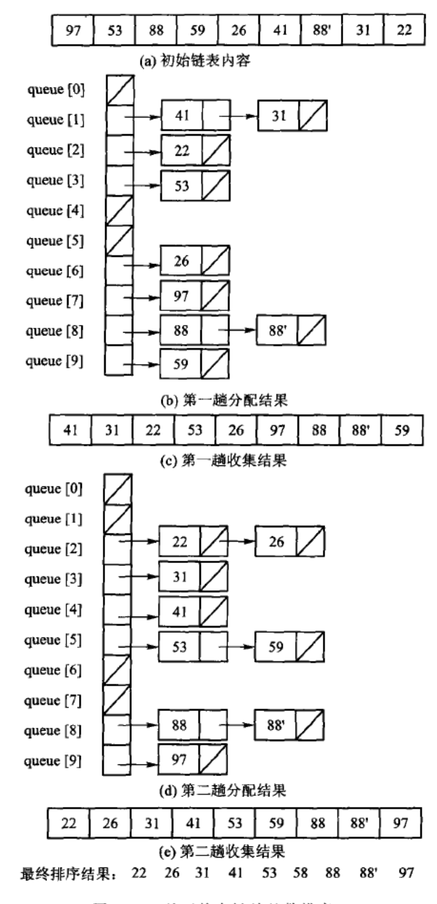

# 排序

**概览：**

**:bulb: 前言**  
**[:question: 排序的分类](#排序的分类)**  
**[:question: 排序的基本概念](#排序的基本概念)**

**:bulb: 内排序**  
**[:question: 插入排序](#插入排序)**  
**[:question: 选择排序](#选择排序)**  
**[:question: 交换排序](#交换排序)**  
**[:question: 归并排序](#归并排序)**  
**[:question: 分配排序](#分配排序)**  
**[:question: 索引排序](#索引排序)**  
**[:question: 排序算法总结](#排序算法总结)**

**:bulb: 外排序**  
**[:question: 置换选择排序](#置换选择排序)**  
**[:question: 二路外排序](#二路外排序)**  
**[:question: 多路归并-选择数](#多路归并-选择树)**

## 前言

### 排序的分类

排序主要分为两类

- 内排序（$internal \; sorting$）  
   如果待排序的记录个数比较少，整个排序过程中所有的记录都可以直接放在内存中，这样的排序叫做内排序
- 外排序（$external \; sorting$）  
   如果待排序记录数量太大，内存无法容纳所有记录，在排序过程中还需要访问外存，这样的排序叫做外排序

### 排序的基本概念

- 稳定：如果存在多个具有相同排序码的记录，经过排序后这些记录的相对次序仍保持不变，这种排序算法称为”稳定的“，否则称为”不稳定的“

## 内排序

### 插入排序

插入排序（$insert \; sorting$）就是对待排的记录逐个进行处理，每个新纪录与同组那些已排好序的记录进行比较，然后插入到适当的位置。 插入排序算法关键在于如何将一个新纪录$r_i$插入到已经排序序列$R'$中，这涉及两个方面：找到序列中应插入的位置以及如何移动序列中那些以及排好序的元素以便插入新纪录

主要介绍：直接插入排序和$Shell$ 排序

#### 直接插入排序

直接插入排序是通过线性搜索来确定待插入记录的位置。  
 如果前面已经有若干记录排成了不减序列，则对已排序记录按照从小到大依次逐个与新纪录进行比较，直到找到第一个不大于新纪录的值，这就是新纪录应该插入的位置；依次把新纪录插入到逐步扩大的已排序子序列中，直到最后完全排好序

直接插入排序算法是稳定的，不改变相同排序码的相对顺序

**代码：**  
_[code 直接插入排序](./src/Note/直接插入排序.cpp)_

```cpp
template <typename Record>
void InsertSort(Record Array[], int n)      // Array[]为待排数组，n为数组长度
{
    Record TempRecord;
    int i, j;
    for(i = 1; i < n; i++)
    {
        TempRecord = Array[i];
        j = i - 1;                          // 内循环j从i-1开始
        // 寻找记录i的正确位置
        while(j >= 0 && TempRecord < Array[j])
        {
            Array[j+1] = Array[j];          // 大于记录i的值后移
            j--;
        }
        Array[j+1] = TempRecord;            // 此时j+1就是记录i的正确位置
    }
}
```

**例子：**

<div align="center"></div>

**复杂度：**

- 空间复杂度  
   用到一个辅助存放待插入记录的临时变量，$Θ(1)$
- 时间复杂度
  - 最好情况：数组已经是正序排列，每次第$i$个记录一进入内层循环就退出，迭代次数为$0$，比较次数为$n-1$；当前记录保存在临时变量$n-1$次，回填$n-1$次，移动次数共$2(n-1)$。因此代价为$Θ(n)$
  - 最坏情况：数组恰好是降序排列，每次在外层的第$i$次迭代中内层都需要进行$i$次循环，比较$i$次；当前记录保存在临时变量中发生$1$次移动，回填时发生$1$次移动，前面序列$Array[0]...Array[i-1]$顺序向后移动$i$次，总移动$i+2$次。总比较次数为：  
    $\sum_{i=1}^{n-1}i=n(n-1)/2=Θ(n^2)$  
    总移动次数为：  
    $\sum_{i=1}^{n-1}(i+2)=n(n-1)/2+2(n-1)=(n-1)(n+4)/2=Θ(n^2)$  
    所以代价为$Θ(n^2)$
  - 平均代价：考虑序列$R={r_0,r_1,...,r_n-1}$的一个排列$P={p_0,p_1,...,p_n}$。如果$P$中两个元素$p_i$和$p_j$满足$p_i > p_j$但$i<j$，那么$(p_i,p_j)$称为一个逆置。$P$的全逆置序列为$P'={p_{n-1},p_{n-2},...,p_0}$。当$R$中不含重复元素时，$P$共有$n!$种排列。如果将$P$中的元素两两组成对，则共有$n(n-1)/2$个元素对，每个元素对都可能构成$P$或者$P'$的一个逆置，因此根据每个元素对出现的几率相等的原则，平均有一半的逆置出现在$P$中，即$P$中平均有$n(n-1)/4$个逆置  
    当处理第$i$个记录时，内层循环的迭代次数依赖于记录前面比它大的记录个数，即逆置的数目。例如上图中$i=3$时，记录$12$前面有$3$个比它大的数，存在$3$个逆置。逆置的数目决定了比较及移动的次数，因此计算平均时间代价就是要计算整个数组中平均有多少个逆置  
    所以代价为$n(n-1)/4$，即$Θ(n^2)$

#### Shell 排序

**Shell** 排序的核心：分间隔进行插入排序  
先将待排序序列分为若干子序列，而且要保证子序列中的记录在原始数组中不相邻，且间距相同，分别对这些小子序列进行插入排序；然后减少记录间的间距，减少小序列个数，将原始序列分为更大、更有序的子序列，分别进行插入排序；重复进行下去，直到最后间距减少为$1$（整个序列比较接近于正序状态），然后对整个序列进行插入排序

**Shell** 排序算法不稳定，它的子序列互相交错，可能改变相同排序码的相对顺序

**代码：**  
_[code Shell 排序.cpp](./src/Note/Shell排序.cpp)_

```cpp
// 修改的插入排序算法
template <typename Record>
void ModInsSort(Record Array[], int n, int delta)   // delta表示当前增量
{
    int i, j;
    for(i = delta; i < n; i += delta)
        for(j = i; j >= delta; j -= delta)          // j以delta为步长向前寻找逆置对进行调整
        {
            if(Array[j] < Array[j-delta])
            {
                Record tmp = Array[j];
                Array[j] = Array[j-delta];
                Array[j-delta] = tmp;
            }
            else
                break;
        }
}

// 以增量每次除以2递减划分子序列
template <typename Record>
void ShellSort(Record Array[], int n)
{
    int i, delta;
    for(delta = n /2; delta > 0; delta /=2)         // 增量每次除以2
        for(i = 0; i < delta; i++)                  // 分别对delta个子序列进行插入排序
            ModInsSort(&Array[i], n-i, delta);      // 传入Array[i]地址，待处理数组长度为n-i
    // 如果增量序列不能保证最后一个delta为1，可以加入扫尾性质的插入排序
    // 本算法增量为2可以保证最后依次间距为1
    // ModInsSort(Array, n, 1)
}
```

**例子：**

<div align="center"></div>

**复杂度：**

- 空间复杂度  
   用到一个辅助存放待插入记录的临时变量，$Θ(1)$
- 时间复杂度  
   **Shell** 排序的时间复杂度与增量序列的选取有关。最坏情况下和直接插入排序一样是$Θ(n^2)$，此时每次间隔都是有序的，即没有消除逆序对，真正消除逆序对时候是最后依次间隔为$1$

  _Hibbard_ 提出的增量序列$\{2^k-1,2^{k-1}-1,...,7,3,1\}$，推理证明这种选取增量序列的**Shell** 排序效率达$Θ(n^{3/2})$，但模拟实验表明甚至可以达$Θ(n^{5/4})$。”增量每次除以 3“的效率也是$Θ^{3/2}$

### 选择排序

选择排序（$selection \; sorting$）的算法思想是逐个找出第$i$小的记录，并将其放到数组的第$i$个位置。选择排序的关键在于如何从剩余的未排序记录中找出最小（或最大）的那个记录

主要介绍：直接选择排序和堆排序

#### 直接选择排序

直接选择排序算法思想是逐个找出第$i$小的记录，并将这个记录与数组的第$i$个位置的记录交换，第$i$小的记录一次交换到位

直接选择排序算法不稳定，因为两两交换可能把原先在前的关键码移到了后面，可见下面例子

**代码：**  
_[code 直接插入排序.cpp](./src/Note/直接插入排序.cpp)_

```cpp
template <typename Record>
void SelectSort(Record Array[], int n)
{
    int i, j, smallest;
    for(i = 0; i < n-1; i++)            // 依次选出第i小的记录
    {
        smallest = i;                   // 假设记录i就是最小
        for(j = i+1; j < n; j++)
            if(Array[j] < Array[smallest])  // 发现更小值
                smallest = j;
        int tmp = Array[i];
        Array[i] = Array[smallest];
        Array[smallest] = tmp;
    }
}
```

**例子：**

<div align="center"></div>

**复杂度：**

- 空间复杂度  
   需要用到一个临时记录，$Θ(1)$
- 时间复杂度  
   直接选择排序外循环迭代$n-1$次，第$i$次循环内循环迭代$(n-1-i)$次，需要进行$(n-1-i)$次比较，$1$次交换。因此总比较次数为$\sum_{i=0}^{n-2}(n-1-i)=n(n-1)/2=Θ(n^2)$  
   直接选择排序的总时间复杂度为$Θ(n^2)$，算法不依赖于原始数组的输入顺序，因此最大、最小、平均时间复杂度均为$Θ(n^2)$

#### 堆排序

直接选择排序采用的是直接从剩余记录中线性查找最大记录的方法，没有充分利用前一轮查找所能得到的信息。而堆排序可以利用数据结构来保持剩余记录的相对大小信息，因而是更有效的选择排序

以最大堆为例，算法步骤如下：

- 对所有记录建立最大堆
- 取出堆顶的最大记录与数组末端的记录交换，最大记录放在下表$n-1$位置，原数组末端元素临时处于根结点；将根元素向下调整到合适的位置，即剩下的$n-1$个记录重新调整为堆，再取新堆最大记录，与数组$n-2$位置交换；...；重复这一操作，直到堆为空

堆排序是不稳定的，因为建堆过程中，二叉树的父子结点之间的移动不能保证两个重复记录一定能保持原始输入顺序

**代码：**  
_[code 堆排序.cpp](./src/Note/堆排序.cpp)_ 代码有问题，需要修改

```cpp
#include "MaxHeap.hpp"


template <typename Record>
void HeapSort(Record Array[], int n)
{
    int i;
    MaxHeap<Record> max_heap(Array, n);
    for(i = n-1; i < 0; i++)
    {
       Record tmp = max_heap.removeMax();
       Array[i] = tmp;
    }
}
```

**例子：**

部分流程如下图，其中竖线后面部分表示已排好序

<div align="center"></div>

**复杂度：**

- 空间复杂度  
   用到一个临时记录变量，$Θ(1)$
- 时间复杂度  
   建堆函数时间复杂度为$Θ(n)$，每次删除对顶重新建堆需要$Θ(logn)$，一共需要进行$n$次删除堆顶操作，因此总时间复杂度为$Θ(n)+Θ(nlogn)=Θ(nlogn)$

### 交换排序

交换排序的基本思想是：两两比较待排记录的关键码，发现记录逆置则进行交换，直到没有逆置对位置

主要介绍：冒泡排序和快速排序

#### 冒泡排序

冒泡排序（$Bubble \; soring$）算法思想是不停地比较相邻记录，如果不满足排序要求，就交换相邻就交换相邻记录，直到所有的记录都排好序为止

长度为$n$的待排记录数组$R=\{r_0,r_1,...,r_{n-1}\}$，冒泡排序步骤如下：

- 从数组末端开始，不断比较相邻记录，不满足排序要求就交换，例如首先比较$r_{n-1}$和$r_{n-2}$，如果$r_{n-1}<r_{n-2}$，则两者进行交换。依次比较，比较完一轮后，最小的记录已经排好序在$r_0$位置了
- 开始第二轮冒泡过程，由于$r_0$已经是最小的记录，因此第二次冒泡排序只需对$r_{n-1}$到$r_1$进行比较。第二次冒泡完成后，次小的记录就被推到$r_1$上。依次类推，直到数组中所有记录都已经排好序位置

冒泡排序是稳定的

**代码：**  
_[code 冒泡排序.cpp](./src/Note/冒泡排序.cpp)_

```cpp
template <typename Record>
void BubbleSort(Record Array[], int n)
{
    // `NoSwap`标志为`true`表示没有逆置对，整个数组已经有序了
    bool NoSwap = true;                 // 是否发生交换标志
    int i, j;
    for(i = 0; i < n-1; i++)
    {
        for(j = n-1; j > i; j--)
            if(Array[j] < Array[j-1])   // 出现逆置对
            {
                Record tmp = Array[j];
                Array[j] = Array[j-1];
                Array[j-1] = tmp;
                NoSwap = false;         // 发生了交换，标志变为假
            }
        if(NoSwap)
            break;
    }
}
```

**例子：**

<div align="center"></div>

箭头连线表示尾部记录在本轮排序将调整到箭头所指记录之前

**复杂度：**

- 空间复杂度  
   用到一个临时记录变量，$Θ(1)$
- 时间复杂度
  - 最好情况：数组已经有序，只运行第一轮循环进行$n-1$次比较后就发现没有发生过交换，$Θ(n)$
  - 最坏情况：外层循环最多可能发生$n-1$次，第$i$次内存`for`循环中共需要比较$n-i$次，最多交换$n-i$次，因此$\sum_{i=1}^{n-1}(n-i)=n(n-1)/2=Θ(n^2)$
  - 平均情况：平均交换次数为最多次数的一半，$\sum_{i=1}^{n-1}(n-i)/2=n(n-1)/4=Θ(n^2)$

#### 快速排序

快速排序就是基于分治发的排序算法。分治法的关键是分、治、合，将给定问题分成若干个子问题（分），再对每个子问题求解（治），最后将所有子问题的解合并成一个综合的解（合），得到原始问题的解

算法步骤：

- 从待排序列$S$中任意选择一个记录$k$作为轴值$(pivot)$
- 将剩余的记录分割成左子序列$L$和右子序列$R$
- $L$中所有记录都小于或等于$k$，$R$中记录都大于等于$k$，因此$k$正好在正确位置
- 对子序列$L$和$R$递归进行快速排序，直到子序列中只含有$0$或$1$个元素，退出递归

算法中如何选择$pivot$是关键，这对快速排序时间复杂度影响很大。假如选择的轴值恰好是最大或最小，那么有一个子序列就会恰好为空

快速排序是不稳定的，因为记录移动的跨度比较大，可看下面例子

**代码：**  
_[code 快速排序.cpp](./src/Note/快速排序.cpp)_ 代码有问题，需要修改

快速排序有改进的余地，当快速排序的子数组小于某个长度时，不必继续递归；此时整个序列基本有序，正好适合插入排序。_（随着编译器越来越好，这种优化措施效果已经不明显）_

```cpp
int SelectPivot(int left, int right);               // 选择轴值
template <typename T>
void Swap(T Array[], int i, int j);                 // 交换
template <typename T>
int Partition(T Array[], int left, int right);      // 分割


template <typename Record>
void QuickSort(Record Array[], int left, int right)
{
    if(right <= left) return;
    int pivot = SelectPivot(left ,right);
    Swap(Array, pivot, right);                      // 分割前先将轴值放到数组末端
    pivot = Partition(Array, left, right);          // 分割后轴值已经到达正确位置
    QuickSort(Array, left, pivot-1);
    QuickSort(Array, pivot+1, right);
}

int SelectPivot(int left, int right)
{
    return (left + right) / 2;
}

template <typename T>
void Swap(T Array[], int i, int j)
{
    int tmp = Array[i];
    Array[i] = Array[j];
    Array[j] = tmp;
}

template <typename T>
int Partition(T Array[], int left, int right)
{
    int l = left;
    int r = right;
    T tempRecord = Array[r];
    while(l < r)
    {
        // l指针向右移动，越过那些小于等于轴值的记录，直到找到一个大于轴值的记录
        while(Array[l] <= tempRecord && r > 1)
            l++;
        if(l < r)                                       // 若l、r尚未相遇，将逆置元素换到右边空位
        {
            Array[r] = Array[l];
            r--;                                        // r指针左移一步
        }
        // r指针向左移动
        while(Array[r] >= tempRecord && r > 1)
            r--;
        if(l < r)
        {
            Array[l] = Array[r];
            l++;
        }
    }
    Array[l] = tempRecord;                              // 回填轴值
    return l;
}


// 改进快速排序

const int THRESHOLD = 28;
template <typename T>
void InsertSort(T Array[], int n);                      // 直接插入排序

template <typename Record>
void ModQuickSort(Record Array[], int left, int right)
{
    if(right - left + 1 > THRESHOLD)
    {
        int pivot = SelectPivot(left, right);
        Swap(Array, pivot, right);
        pivot = Partition(Array, left, right);
        ModQuickSort(Array, left, pivot - 1);
        ModQuickSort(Array, pivot + 1, right);
    }
}

template <typename Record>
void QuickSort2(Record Array[], int n)
{
    ModQuickSort(Array, 0, n-1);
    InsertSort(Array, n);               // 扫尾插入排序
}
```

**例子：**

快速排序：

<div align="center"></div>

快速排序的分割：

<div align="center"></div>

- 轴值为$32$，用临时变量保存，并与最后一个位置记录交换，最后一个位置即为空位
- $l$位置记录与轴值比较，若大于轴值，则填入空位，并将$l$位置设为空位；$r$位置记录与轴值比较，若小于轴值，则填入空位，并将$r$位置设置为空位。（可记为左边一次、右边一次）
- 当$l,r$相遇时，序列扫描完毕，这时的空位就是轴值所在位置

**复杂度：**

- 空间复杂度
  - 最坏情况：$Θ(n)$
  - 平均情况：$Θ(logn)$
- 时间复杂度
  - 最坏情况：$Θ(n^2)$
  - 最好情况：$Θ(nlogn)$
  - 平均情况：$Θ(nlogn)$

### 归并排序

归并排序（$merge \; soring$）简单地将原始序列划分为两个子序列，然后分别对子序列递归排序，最后再将有序子序列合并

算法步骤：

- 将序列划分为两个子序列
- 分别对两个子序列递归进行归并排序
- 将这两个已排好序的子序列合并为一个有序序列，即归并过程（如下）
  - 每次比较子序列头，取出较小的进入结果序列
  - 其后次小记录顶上来，继续比较两个子序列头，取出较小的进入结果序列
  - 重复上述过程，直到其中一个子序列为空，剩余子序列中的记录就可以直接进入结果序列

归并排序也是一种基于分治法的排序。快速排序侧重于”分“（含”治“），即用轴值分割子序列的过程，没有明显的”合“。归并排序的”分“很简单，它侧重与”治“和”合“

**代码：**  
_[code 归并排序.cpp](./src/Note/归并排序.cpp)_

归并排序优化（$R.Sedewick$发明）：在把数组暂时复制到临时数组时，将第二个子数组中元素的顺序颠倒一下。这样，两个子数组从两端开始处理，向中间推进，使得这两个子数组的两端互成另外一个数组的”监视哨“，从而不用像原算法那样检查子序列情况；另外，当子数组小于某个长度时，也不继续递归，而是对整个序列使用插入排序

```cpp
template <typename Record>
void Merge(Record Array[], Record TempArray[], int left, int right, int middle);

template <typename Record>
void MergeSort(Record Array[], Record TempArray[], int left, int right)
{
    int middle;
    if(left < right)                                    // 如果序列只有0或1个记录，不排序
    {
        middle = (left + right) / 2;                    // 从中间划分两个子序列
        MergeSort(Array, TempArray, left, middle);      // 对左边递归
        MergeSort(Array, TempArray, middle+1, right);   // 对右边递归
        Merge(Array, TempArray, left, right, middle);   // 归并
    }
}

template <typename Record>
void Merge(Record Array[], Record TempArray[], int left, int right, int middle)
{
    int i, j, index1, index2;
    for(j = left; j <= right; j++)                      // 将数组暂存入临时数组中
        TempArray[j] = Array[j];
    index1 = left;                                      // 左边子序列起始位置
    index2 = middle + 1;                                // 右边子序列起始位置
    i = left;
    while(index1 <= middle && index2 <= right)
    {
        // 取较小者插入合并数组
        if(TempArray[index1] <= TempArray[index2])      // 保证稳定性，相等时左边优先
            Array[i++] = TempArray[index1++];
        else
            Array[i++] = TempArray[index2++];
    }
    while(index1 <= middle)                             // 只剩左序列，可以直接复制
        Array[i++] = TempArray[index1++];
    while(index2 <= right)
        Array[i++] = TempArray[index2++];
}


// 优化归并排序
const int THRESHOLD = 28;
template <typename Record>
void InsertSort(Record* Array, int n);
template <typename Record>
void ModMerge(Record Array[], Record TempArray[], int left, int right, int middle);


template <typename Record>
void ModMergeSort(Record Array[], Record TempArray[], int left, int right)
{
    int middle;
    if(right - left + 1 > THRESHOLD)                    // 如果序列长度大于阈值，递归进行归并
    {
        middle = (left + right) / 2;
        ModMergeSort(Array, TempArray, left, middle);
        ModMergeSort(Array, TempArray, middle+1, right);
        ModMerge(Array, TempArray, left, right, middle);
    }
    else
        InsertSort(&Array[left], right - left + 1);
}

template <typename Record>
void ModMerge(Record Array[], Record TempArray[], int left, int right, int middle)
{
    int index1, index2;
    int i, j, k;
    for(i = left; i <= middle; i++)
        TempArray[i] = Array[j];
    for(j = 1; j <= right - middle; j++)                // 赋值右边子序列，但顺序颠倒
        TempArray[right - j + 1] = Array[j + middle];
    for(index1 = left, index2 = right, k = left; k <= right; k++)
        if(TempArray[index1] <= TempArray[index2])
            Array[k] = TempArray[index1++];
        else
            Array[k] = TempArray[index2++];
}
```


**例子：**

- 先划分子序列，直到长度为$1$
- 第一轮归并，将$8$个长度为$1$的子序列归并为$4$个长度为$2$的子序列
- 第二轮归并，$2$个长度为$4$的子序列
- 依此类推，最后归并成一个长度为$8$的子序列

<div align="center"></div>

**复杂度：**

- 空间复杂度  
需要用到一个临时数组来保存原记录数组，$Θ(n)$

- 时间复杂度  
归并时间随着数组长度$n$线性增长，时间代价为$T(n)=2T(n/2)+c×n$，其中$T(1)=1$，可推出时间复杂度为$Θ(nlogn)$

### 分配排序

分配排序特征是不需要进行关键码之间比较，但是需要事先知道记录序列的一些具体情况

主要介绍：桶式排序和基数排序

#### 桶式排序

**代码：**  
_[code 桶式排序.cpp](./src/Note/桶式排序.cpp)_

```cpp
template <typename Record>
void BucketSort(Record Array[], int n, int max)
{
    Record *TempArray = new Record[n];          // 开辟临时数组
    int *count = new int[max];                  // 桶容量计数器，count[i]存储了第i个桶中的记录数

    int i;
    for(i = 0; i < n; i++)                      // 把序列复制到临时数组
        TempArray[i] = Array[i];
    for(i = 0; i < max; i++)                    // 初始化计数器为0
        count[i] = 0;
    for(i = 0; i < n; i++)                      // 统计每个值出现次数
        count[Array[i]]++;
    for(i = 1; i < max; i++)                    // 统计小于等于i的元素个数
        count[i] = count[i-1] + count[i];       // count[i]记录了i+1的开始位置
    for(i = n-1; i >= 0; i--)                   // 从尾部开始按顺序输出，保证稳定性
        Array[--count[TempArray[i]]] = TempArray[i];
}
```

**例子：**

待排数组为$Array=[7, 3, 8, 9, 6, 1, 8, 1, 2]$，实现知道数字范围是$[0,9]$

- 确定计数器大小为$10$，用来统计待排数组每个记录出现的个数，即  
    `count=[0,2,1,1,0,0,1,1,2,1]`，分别对应$0-9$出现的个数
- 确定位置，更新`count[i] = count[i-1] + count[i]`，得`count=[0,2,3,4,4,4,5,6,8,9]`，表示$i+1$开始的位置，比如`count[2]=3`表示$3$在位置$3$上
- 尾部向前扫描，`Array[--count[2]]`即`Array[2]`表示记录$2$放到位置$3-1$上，`Array[--count[1]]`即`Array[1]`，即记录$1$放到位置$2-1$上，依次类推，可得到排序结果$Array=[1,1,2,3,6,7,8,8,9]$

**复杂度：**

对于一个长度为$n$且值域长度为$m$的数组，例如$[0,m)$

- 空间复杂度  
    需要用到$m$个计数器和一个长度$n$的临时数组，$Θ(m+n)$
- 时间复杂度  
    先扫描一遍序列，以便统计计数，然后再统计小于等于$i(i\in[0,m))$的个数，输出有序序列时共循环$n$次，因此时间复杂度为$Θ(n+m)$  
    当$m$远远小于$n$时，时间复杂度为$Θ(n)$，当$m$为更高数量级时，如$Θ(nlogn)$或$Θ(n^2)$时，时间复杂度由$m$决定。因此，桶式排序适合$m$较小时使用

#### 基数排序

当值域$m$很大时，对桶式排序改进：将排序码拆分为多个部分来进行比较。如，对$0 \sim 9999$之间的整数进行排序，可以先按千、百、十、个位拆分。这种将排序码按其进制的基数进行拆分排序的方法就是基数排序

假设排序码$K$包含$d$个子排序码$(k_{d-1},k_{d-2},...,k_1,k_0)$  
按照排序码的先后顺序，分配排序分为两种：高位优先法和低位优先法

- 高位优先法（most significant digit first, MSD）  
    先对最高位$k_{d-1}$排序，将序列分成若干子序列，每个子序列具有相同的$k_{d-1}$值；然后，对每个序列按次高位$k_{d-2}$排序，分成更小的子序列；依次重复，直到对$k_1$排序后，分成极小子序列，每个子序列内部含有相同的排序码$(k_{d-1},k_{d-2},...,k_1)$。最后，对每个子序列用最低位$k_0$排序，将所有子序列依次连接在一起，成为一个有序序列。  
    这是一个分、分、...、分、收的过程，是一个递归分治问题
- 低位优先法（least significant digit first, LSD）  
    与MSD相反，从最低为$k_0$开始排序，然后依次是$k_1,...,k_{d-1}$

**排序码例子：**

例$1$：按照桥牌规则，扑克牌的排序码就是花色和面值的组合，花色按黑桃$S$ > 红心$H$ > 梅花$D$ > 方片$C$的顺序，面值按$A>K>Q>J>10>9...>3>2$的顺序。对扑克牌$S3,HJ,C8,H9,S9,D3,CA,D7$排序

- MSD方法：先按花色分$4$堆，按面值分，最后合并这$4$堆  
     先花色：$C8,CA,D3,D7,HJ,H9,S3,S9$  
     再面值：$C8,CA,D3,D7,H9,HJ,S3,S9$
- LSD方法：先按面值分$13$堆，再依次从$13$堆中取出$4$种花色  
    先面值：$S3,D3,D7,C8,H9,S9,HJ,CA$  
    再花色：$C8,CA,D3,D7,H9,HJ,S3,S9$

例$2$  
高位优先：先十位再个位  
低位优先：先个位再十位

<div align="center"></div>

**实现：**

实现基数排序时，数据项的存储方式有两种：顺序存储和链式存储  
假设数组$S$的长度为$n$，基数为$r$，排序码个数为$d$

- 顺序存储  
用队列数组来表示桶，每次把$S$中的所有记录分配到$r$个队列（桶）中；然后，进行收集，将$r$个队列（桶）中的记录收集回$S$。这样的分配收集一共需要进行$d$次  
缺点：需要用一个数组$S$存放待排序的所有记录，再用$r$个数组存储分配时的$r$个队列（即桶），这样每分配依次需要移动$n$个记录，收集起来又要移动$n$个记录，$d$遍分配和收集共需$2dn$次移动，时间代价很高。另一方面，由于每个队列的大小不好估计，都需要按$n$分配，共需$rn$个结点空间

  **代码：**  
  _[code 基数排序_顺序存储.cpp](./src/Note/基数排序_顺序存储.cpp)_

  _注：这里采用$d$次调用桶式排序方式解决 $rn$ 个结点空间问题和 $2dn$次的移动问题_

  ```cpp
  template <typename Record>
  void RadixSort(Record Array[], int n, int d, int r)
  {
      Record *TempArray = new Record[n];                  // 辅助排序临时数组
      int *count = new int[r];                            // 桶容量计数器，count[i]存储第i个桶的记录数
      int i, j, k;
      int Radix = 1;                                      // 模保持进位，用来取Array[j]的第i位排序码
      for(i = 1; i <= d; i++)                             // 分别对第i个排序码进行分配
      {
          for(j = 0; j < r; j++)
              count[j] = 0;                               // 初始化计数器为0
          for(j = 0; j < n; j++)                          // 统计每个桶中的记录数
          {
              k = (Array[j] / Radix) % r;                 // 取Array[j]的第i位排序码
              count[k] ++;
          }
          for(j = 1; j < r; j++)                          // 将TempArray中的位置依次分配给r个桶
              count[j] = count[j-1] + count[j];
              // count[i]记录了i+1的开始位置，元素i应该从Array[count[i]-1]往前追溯
          for(j = n-1; j >= 0; j--)                       // 从数组尾部，把记录收集到相应的桶
          {
              k = (Array[j] / Radix) % r;                 // Array[j]应放到count[k]-1处
              TempArray[--count[k]] = Array[j];
          }
          for(j = 0; j < n; j++)                          // 复制内容到Array
              Array[j] = TempArray[j];
          Radix *= r;                                     // 左进一位，修改模
      }
      delete [] TempArray;
      delete [] count;
  }
  ```

  **例子：**

  <div align="center"></div>

  **复杂度：**

  - 空间复杂度  
      需要用一个长度为$n$的临时数组来存放待排记录，一个长度为$r$的计数器数组来统计每个桶中的记录个数，$Θ(n+r)$  
  - 时间复杂度  
      桶式排序的时间复杂度为$Θ(m+n)$，而基数排序相当于做了$d$次桶式排序，每次$m=r$，因此$Θ(d(n+r))$

- 链式存储

  链式存储主要是解决简单顺序存储所需$rn$个记录空间和$2dn$次移动记录问题  
  链式存储LSD，在原数组中给每个记录设置整数`next`域，该域指向的是同一个桶中下一个元素的下标，这$r$个桶组成$r$个静态队列。LSD分配第$i$位时，按照某记录排序码$i$位的值分配到相应的队列中，实际上只需要修改`next`域；收集时，只需要利用`next`域依次把各队列首位相连

  **代码：**  
  _[code 基数排序_链式存储.cpp](./src/Note/基数排序_链式存储.cpp)_

  ```cpp
  // 结点类
  class Node
  {
      public:
          int key;
          int next;
  };
  // 静态队列类
  class StaticQueue
  {
      public:
          int head;
          int tail;
  };
  
  template <typename Record>
  void RadixSort(Record* Array, int n, int d, int r)
  {
      int i, first = 0;                               // first指向静态链中的第一个记录
      StaticQueue *queue = new StaticQueue[r];        // 存放r个桶的静态队列
      for(i = 0; i < n-1; i++)                        // 初始化建链，相邻记录的静态指针链接为单链表
          Array[i].next = i + 1;                      // 第i个记录的静态指针域设为i+1
      Array[n-1].next = -1;                           // 链尾为空
      for(i = 0; i < d; i++)                          // 堆第i个排序码进行分配和收集，一共d趟
      {
          Distrubute(Array, first, i, r, queue);
          Collect(Array, first, r, queue);
      }
      delete [] queue;
      AddSort(Array, n, first);                       // 线性时间整理静态链表，使得数组按下标有序
  }
  
  // 分配过程
  template <typename Record>
  void Distrubute(Record* Array, int first, int i, int r, StaticQueue* queue)
  {
      int j, k, a, curr = first;
      for(j = 0; j < r; j++)
          queue[j].head = -1;                         // 初始化r个队列
      while(curr != -1)
      {
          k = Array[curr].key;                        // 取第i位排序码数字k
          for(a = 0; a < i; a++)
              k = k / r;
          k = k % r;
          // 把Array[curr]分配到第k个桶中
          if(queue[k].head == -1)                     // 如果桶空，Array[curr]就是第一个记录
              queue[k].head = curr;
          else
              Array[queue[k].tail].next = curr;
          queue[k].tail = curr;                       // 当前记录下标curr被标记为该桶的尾部
          curr = Array[curr].next;
      }
  }
  
  // 收集过程
  template <typename Record>
  void Collect(Record *Array, int& first, int r, StaticQueue* queue)
  {
      int last, k = 0;
      while(queue[k].head == -1)                      // 找到第一个非空队列
          k++;
      first = queue[k].head;
      last = queue[k].tail;
      while(k < r-1)                                  // 继续收集下一个队列
      {
          k++;
          while(k < r-1 && queue[k].head == -1)       // 当前队列空，且不是最后一个队列
              k++;
          if(queue[k].head != -1)                     // 将这个非空序列与上一个非空序列连接起来
          {
              Array[last].next = queue[k].head;
              last = queue[k].tail;
          }
      }
      Array[last].next = -1;                          // 收集完毕
  }
  
  // 整理静态链表
  template <typename Record>
  void AddSort(Record *Array, int n, int first)
  {
      int i, j;
      j = first;                                      // j待处理数据下标，第一次为first
      Record TempRec;
      for(i = 0; i < n-1; i++)
      {
          TempRec = Array[j];
          Array[j] = Array[i];
          Array[i] = TempRec;
          Array[i].next = j;
          j = TempRec.next;
          while(j <= i)
              j = Array[j].next;
      }
  }
  ```

  **例子：**

  <div align="center"></div>

  **复杂度：**

  - 空间复杂度  
      $n$个待排记录都有`next`域，加上$r$个桶的头尾指针，$Θ(n+r)$  
  - 时间复杂度  
      分配和收集不需要移动记录，只需要修改`next`指针；扫描一遍待排数组进行分配的时间为$Θ(n)$，收集$r$个队列的时间为$Θ(n+r)$，因此$d$遍分配和收集的时间复杂度为$Θ(d(n+r))$

### 索引排序

当记录很大时，需要减少移动或交换的次数，以降低总的排序时间。可以让数组中的每个元素存储指向该元素记录的指针，还在需要移动记录时，只移动指针值（或索引地址）而不移动记录本身。这种排序称为”索引排序“，或称地址排序。（静态链基数排序实际上也是一种索引排序）

索引排序需要一些空间来存放指针，是典型的空间换取时间方式

**索引方式：**

除了可以用链式基数排序那样的链表索引结果外，还有以下两种主要索引形式
<div align="center"></div>

索引$1$中的下标`IndexArray1[i]`存放的是`Array[i]`中数据在排序后应该处于的位置，即结果数组中`Array[IndexArray1[i]]=Array[i]`  
索引$2$中的下标`IndexArray2[i]`存放的是`Array[i]`应该摆放的数据位置，即结果数组中`Array[i]=Array[IndexArray2[i]]`

**代码：**  
_[code 索引排序.cpp](./src/Note/索引排序.cpp)_

实现的是索引方式中`IndexArray2`

```cpp
// 采用简单插入的索引排序
template <typename Record>
void IndexSort(Record Array[], int IndexArray[], int n)
{
    int i, j;
    for(i = 0; i < n; i++)
        IndexArray[i] = i;                  // 初始化索引下标
    // 简单插入排序的地址排序过程
    for(i = 1; i < n; i++)
        for(j = i; j > 0; j--)
            if(Array[IndexArray[j]] < Array[IndexArray[j-1]])
            {
                // 交换
                int tmp = IndexArray[j];
                IndexArray[j] = IndexArray[j-1];
                IndexArray[j-1] = tmp;
            }
            else
                break;

    AdjustRecord(Array, IndexArray, n);
}

// 利用索引数字进行循环调整
template <typename Record>
void AdjustRecord(Record Array[], int IndexArray[], int n)
{
    Record TempRec;
    int i, j;
    for(i = 0; i < n; i++)                          // 循环n-1次，每次处理数组中第i个记录
    {
        j = i;
        TempRec = Array[i];
        while(IndexArray[j] != i)                   // 如果循环链中索引下标还不是i，则顺链循环调整
        {
            int k = IndexArray[j];
            Array[j] = Array[k];
            IndexArray[j] = j;
            j = k;
        }
        Array[j] = TempRec;
        IndexArray[j] = i;
    }
}
```

### 排序算法总结

| 算法 | 最大时间 | 平均时间 | 最小时间 | 辅助空间代价 | 稳定性 |
| ---- | -------- | -------- | -------- | ------------ | ------ |
| 直接插入排序    | $Θ(n^2)$ | $Θ(n^2)$ | $Θ(n)$ | $Θ(1)$ | 稳定 |
| 冒泡排序    | $Θ(n^2)$ | $Θ(n^2)$ | $Θ(n)$ | $Θ(1)$ | 稳定 |
| 直接选择排序 | $Θ(n^2)$ | $Θ(n^2)$ | $Θ(n)$ | $Θ(1)$ | 不稳定 |
| Shell排序    | $Θ(n^{3/2})$ | $Θ(n^{3/2})$ | $Θ(n^{3/2})$ | $Θ(1)$ | 不稳定 |
| 快速排序    | $Θ(n^2)$ | $Θ(nlogn)$ | $Θ(nlogn)$ | $Θ(logn)$ | 不稳定 |
| 归并排序    | $Θ(nlogn)$ | $Θ(nlogn)$ | $Θ(nlogn)$ | $Θ(n)$ | 稳定 |
| 堆排序    | $Θ(nlogn)$ | $Θ(nlogn)$ | $Θ(nlogn)$ | $Θ(1)$ | 不稳定 |
| 桶式排序 | $Θ(n+m)$ | $Θ(n+m)$ | $Θ(n+m)$ | $Θ(n+m)$ | 稳定 |
| 基数排序    | $Θ(d·(n+r))$ | $Θ(d·(n+r))$ | $Θ(d·(n+r))$ | $Θ(n+r)$ | 稳定 |

选择算法时，可以遵循以下一些原则：

- 当待排序的关键码序列基本有序时，直接插入排序最快，冒泡排序也很快
- 归并排序对待排序关键码的初始排列不敏感，因此排序速度比较稳定
- 若待排序的记录个数$n$较小时，可采用直接插入或直接选择排序
- 若$n$较大时，则应采用时间代价为$O(nlogn)$的快速排序、堆排序、归并排序或基数排序
- 当$n$较大，且输入顺序比较随机时，如果没有稳定性要求，则采用快速排序
- 当$n$很大且关键码位数较少时，采用静态链的基数排序效果比较好

## 外排序

外排序处理的数据对象非常多，而且不能一次性处理完成。因此，需要根据内存的大小，将外存中的数据文件划分成若干段，每次把其中一段读入内存并用内排序方法进行排序。这些已排序的段或有序的子文件称为顺串或归并段，顺串需要重写回外存等待将来处理，让出的内存空间继续处理其他文件段。外排序通常由两个相对独立的阶段组成：

- 文件形成尽可能长的初始顺串
- 逐趟归并顺串，最后形成对整个数据文件的排序文件

外排序所需的时间由三部分组成：内部排序所需时间、外存信息读/写所需时间和内部归并所需时间

对同一个文件而言，进行外排序所需读写外存的次数与归并趟数有关。假设有$m$个初始顺串，每次对$k$个顺串进行归并，归并趟数为$[log_km]$。为了减少顺串，可以从两个方面着手：一是减少初始顺串的个数$m$，二是增加归并的顺串数量$k$

下面介绍的“置换选择”算法在扫描一遍的前提下，能够生成更长的初始顺串，从而减少顺串的个数。“多路归并”通过增加归并顺串的个数来减少对数据的扫描趟数

### 置换选择排序

置换选择排序是在堆排序的基础上演化而来。为了提高处理速度，需要借助一个输入缓冲区和输出缓冲区

**算法的处理过程：**

- 从输入文件读取一定数量的记录进入输入缓冲区
- 向内存工作区放入待排序记录并进行排序
- 记录被处理后，写到输出缓冲区
- 当输出缓冲区满时，把整个缓冲区写回到外存文件
- 当输入缓冲区为空时，再次从外存文件中读取下一块记录

**置换选择产生顺串算法：**

令初始化时最小堆的大小为内存工作区的大小$M$，数组下标范围从$0 \sim M-1$，堆的规模大小记为$LAST$。缓冲区中待输入的记录关键码记为$R$

- 初始化堆
  - 从磁盘读入$M$个记录放到数组$RAM$中
  - 设置堆尾指针$LAST=M-1$
  - 建立一个最小堆
- 重复以下步骤，直到堆为空（即$LAST<0$）
  - 把具有最小关键码值的记录（根结点）送到输出缓冲区
  - 设$R$是输入缓冲区中的下一条记录，判断$R$的关键码值是否大于刚输出的关键码值
    - 如果是，则把$R$放到根结点
    - 否则：
      - 使用数组中$LAST$位置的记录替代根结点
      - 把$R$放到$LAST$位置
      - 设置$LAST=LAST-1$
      - 重新排列堆，筛出根结点

**例子：**

关键码分别为$50,,49,35,45,30,25,25,60,16,27,1,...$ 假设内存最多容纳$7$个记录

<div align="center"></div>

**代码：**

```cpp
template <typename T>
void replacementSelection(T *A, int n, const char *in, const char *out)
{
    T mval;                                 // 存放最小堆的最小值
    T r;                                    // 存放从输入缓冲区中读入的元素
    FILE *inputFile;                        // 输入文件句柄
    FILE *outputFile;                       // 输出文件句柄
    Buffer<T> input;                        // 输入缓冲区
    Buffer<T> output;                       // 输出缓冲区
    initFiles(inputFile, outputFile, in, out);      // 初始化输入输出文件
    initMinHeapArray(inputFile, n, A);      // 从输入文件读入n个数据初始化堆数组A
    MinHeap<T> H(A, n);                     // 建立最小堆
    initInputBuffer(input, inputFile);      // 初始化输入缓冲区，读入一部分数据
    for(int last = n-1; last >= 0; ;)
    {
        mval = H.heapArray[0];              // 获得堆的最小值
        sendToOutputBuffer(input, output, inputFile, outputFile, mval);     // 把mval送到输出缓冲区
        input.read(r);                      // 从输入缓冲区读入一个记录r
        if(!less(r, mval))                  // 如果r大于等于输出值，r放到堆的根结点
            H.heapArray[0] = r;
        else
        {
            H.heapArray[0] = H.heapArray[last];     // 用堆中last位置记录代替根结点
            H.heapArray[last] = r;          // r放到last位置
            H.setSize(last);                // 堆规模减一
            last--;
        }
        if(last != 0)
            H.SiftDown(0);                  // 重排序堆，向下筛选
    }
    endUp(output, inputFile, outputFile);   // 处理输出缓冲区，关闭输入/输出文件
}
```

置换选择排序得到的顺序串长度并不相等。平均情况下，置换选择排序算法可以形成长度为$2M$的顺序串

### 二路外排序

首先把数据文件划分成若干段，用有效的内排序方法对文件的各段进行初始排序以形成顺串；然后，把这些顺串逐趟合并，直至变成一个顺串为止。本质上基于归并的思想

外排序实现顺串的两两归并时，用两个输入流读取数据，用一个输出数据流建立归并后的文件，即把内存分成$3$个页块，其中两个用于作为输入缓冲区，另一个页块作为输出缓冲区。此时，需要多次进行外存的读写操作

**例子：**

假设一个含有$3000$个记录的文件，首先通过$10$次内部排序形成了$10$个初始顺串$R_1,R_2,...,R_{10}$，其中每一个初始顺串的长度都含有$300$个记录。经过第一阶段的内排序过程之后，这$10$个顺串均被放到外存中

首先把顺串$R_1$和$R_2$的第一个页块读入到输入缓冲区，进行归并，结果放入到输出缓冲区，输出缓冲区满时写入磁盘。当一个输入缓冲区为空时，便把该顺串的下一页读入缓冲区，继续归并，直到顺串$R_1$与$R_2$的归并完成为止，此时形成了一个新串$R_1'$。依次归并$R_3$和$R_4$，$R_5$和$R_6$，...，最后归并$R_9$和$R_10$。这样就完成了第一趟归并，得到五个顺串$R_1',R_2',...,R_5'$，其中每个新串含有$600$个记录。依此归并，共需要$4$趟二路归并把震哥哥文件排序完毕

<div align="center"></div>

回顾上述二路归并的过程，每一趟归并的过程都需要把外存文件扫描一遍，此时就要以物理块（页块）为单位对外存文件进行读写多次。例如，假设每个物理页块能容纳$100$个记录，第一趟归并顺串需要把外存文件扫描一遍，需要$30$次读写；第二趟归并$R_5'$不参与，共进行$24$次读写；第三趟归并$R_3''$不参与，共进行$24$次读写；第四趟归并，所有记录都扫描一遍，共进行$30$次读写。四趟归并，需要$108$次归并  
文件长度不变，初始串长度增加$1$倍，则可以减少$1$趟归并，只需要$78$次读写。因此，为一个待排文件创建尽可能大的初始顺串，可以大幅减少扫描遍数和外存读写次数  
归并排序的安排也能影响读写次数，把初始顺串长度作为权，其实质就是**Huffman**树最优化问题

### 多路归并-选择树
