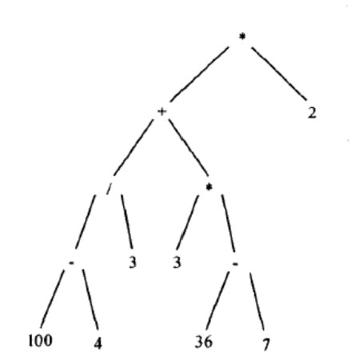
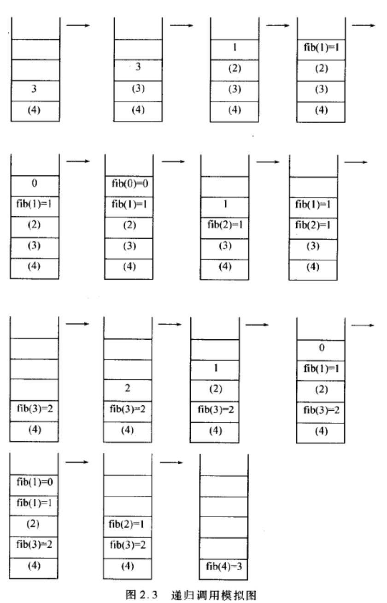

# 第二章 线性表、栈和队列

## 2.1 教材习题

### 2.1.1 设顺序表 va 中的数据元素递增有序，设计一个算法，将 x 插入到顺序表的适当位置，以保持该表的有序性

> **解答：** _[code 2-1-1.cpp](./src/2-1-1.cpp)_
>
> 因为是顺序表，并且递增，可用二分法查找合适位置。当有重复的数据元素时，在该位置的前或后插入元素均可
>
> ```cpp
> #include <iostream>
>
> using namespace std;
>
> template <typename T>
> class List{
>     private:
>         T *aList;               // 存储顺序表的实例
>         int maxSize;            // 顺序表的最大长度
>         int curLen;             // 顺序表的当前长度
>     public:
>         List(const int size){
>             maxSize = size;
>             aList = new T[maxSize];
>             curLen = 0;
>         }
>         ~List(){
>             delete []aList;
>         }
>         bool insert(const T value){
>             int left, right, mid;
>             left = 0;
>             right = curLen;
>             if(curLen >= maxSize){
>                 cout << "顺序表已满" << endl;
>                 return false;
>             }
>             // 若当前无元素或最后一个元素小于value, 直接加入新元素
>             if(curLen == 0 || aList[curLen-1] <= value){
>                 aList[curLen++] = value;
>                 return true;
>             }
>             // 否则用二分查找合适位置
>             while(left < right){
>                 mid = (right - left)/2 + left;
>                 if(aList[mid] < value)
>                     left = mid + 1;
>                 else if(aList[mid] > value){
>                     if(aList[mid-1] < value)
>                         break;
>                     right = mid - 1;
>                 }
>                 else
>                     break;
>             }
>             // mid后的所有元素后移一个位置
>             for(int i = curLen-1; i >= mid; i--)
>                 aList[i+1] = aList[i];
>             aList[mid] = value;
>             curLen ++;
>             return true;
>         }
>         void showAll(){
>             for(int i = 0; i < curLen; i++)
>                 cout << aList[i] << " ";
>             cout << endl;
>         }
> };
> ```

### 2.1.2 设$A=(a_1,...,a_m)$和$B=(b_1,..,b_n)$均为顺序表，A'和 B'分别是 A 和 B 中除去最大共同前缀后的子表。例如，$A=(b,e,i,j,i,n,g)，B=(b,e,i,f,a,n,g)$，则两者最大公共前缀为 b,e,i。此时 $A'=(j,i,n,g)，B'=(f,a,n,g)$。若 A'=B'=空表，则 A=B；若 A'=空表，而 B'≠ 空表，或者两者均不为空表，且 A'的首元小于 B'的首元，则 A<B；否则 A>B。试编写一个比较 A、B 大小的算法

> **解答：** _[code 2-1-2.cpp](./src/2-1-2.cpp)_
>
> ```cpp
> // An是A[]的长度，Bn是B[]的长度
> template <typename T>
> int compare(T A[], int An, T B[], int Bn){
>     // 过滤掉公共前缀
>     int i = 0;
>     while(i < An && i < Bn && A[i] == B[i]){
>             i++;
>     }
>     if(i >= An && i >= Bn)      // A,B均为空，下标i大于数组中的元素
>         return 0;
>     else if((i >= An && i < Bn) || A[i] < B[i])     // A空B不空或A’有元素小与B'首元素
>         return -1;
>     else
>         return 1;
> }
> ```

### 2.1.3 设线性表中的数据元素依值递增排序，并以单链表作为存储结构。设计一个高效的算法，删除表中所有值大于 mink 且小于 maxk 的元素，同时释放被删除结点的空间，并分析算法的时间复杂度

> **解答：** _[code 2-1-3.cpp](./src/2-1-3.cpp)_
>
> ```cpp
> #include "../headers/linear.hpp"
>
>
> template <typename T>
> class LinkList2:public LinkList<T>{
>     public:
>         bool deleteMiddleElem(int mink, int maxk);
> };
>
> template <typename T>
> bool LinkList2<T>::deleteMiddleElem(int mink, int maxk){
>     Link<T> *pre;               // 存放mink前一个结点
>     Link<T> *cur;               // 存放当前结点
>     Link<T> *tmp;               // 存放待释放结点
>     if(mink > maxk) return false;
>     pre = this->head;           // 该链表的头结点也申请了空间，所以第一个结点是头结点的下一个
>     cur = pre->next;            // cur指向第一个结点
>
>     while(cur && cur->data < maxk){
>         if(cur->data <= mink){
>             pre = cur;
>             cur = cur->next;
>         }else{
>             pre->next = cur->next;      // 跳过待删除结点
>             tmp = cur;
>             cur = cur->next;
>             free(tmp);
>         }
>     }
>     return true;
> }
> ```

### 2.1.4 假设有两个按元素值递减的有序排序的线性表 A 和 B，均以单链表作为存储结构，设计一个算法将 A 和 B 归并成一个按元素值递减有序排列的线性表 C，并要求利用原表（即表 A 和 B）的结点空间构造表 C

> **解答：** _[code 2-1-4.cpp](./src/2-1-4.cpp)_
>
> ```cpp
>
> ```

### 2.1.5 已知由一个链表表示的线性表中含有 3 类字符的数据元素（字母字符、数字字符和其他字符），设计一个算法将该线性表分割为 3 个循环链表，其中每个循环链表均只含一类字符

> **解答：** _[code 2-1-5.cpp](./src/2-1-5.cpp)_
>
> ```cpp
>
> ```

### 2.1.6 设计一个算法，从一个顺序表中删除第 i 个元素开始的 k 个元素

> **解答：** _[code 2-1-6.cpp](./src/2-1-6.cpp)_
>
> ```cpp
>
> ```

### 2.1.7 已知线性表中元素依值递增有序排列，并以单链表作为存储结构。设计一个算法，删除表中值相同的多余元素，使得操作后表中的所有元素值均不相同，同时释放被删除的结点空间

> **解答：** _[code 2.1-7.cpp](./src/2.1-7.cpp)_
>
> ```cpp
>
> ```

### 2.1.8 已知两个依元素低增的有序排列的顺序表 A 和 B，且同一表中的元素值各不相同，构造一个线性表 C，其元素为 A 和 B 中元素的交集，且表 C 中的元素也依值有序递增排列。设计对 A,B,C 都是顺序表的情况的算法

> **解答：** _[code 2.1-8.cpp](./src/2.1-8.cpp)_
>
> ```cpp
>
> ```

### 2.1.9 要求同第 8 题，设计对 A、B、C 都是单链表的情况的算法

> **解答：**
>
> ```cpp
>
> ```

### 2.1.10 设表达式以字符形式已存入数组 E[n]中，"#"为表达式的结束符，试设计判断表达式中括号（"("和")"）是否匹配的算法

> **解答：** _[code 2-1-10.cpp](./src/2-1-10.cpp)_
>
> ```cpp
> #include <stack>
> #include <iostream>
>
> using namespace std;
>
> typedef char Elem;
>
> bool isMatch(Elem *E, int length){
>     stack<Elem> s;
>     for(int i = 0; i < length; i++){
>         if(E[i] == '(')
>             s.push(E[i]);
>         else if(E[i] == ')'){
>             // 栈为空且碰到了右括号则匹配失败
>             if(s.empty())  return false;
>             else{
>                 s.pop();
>             }
>         }
>     }
>     // 遍历完毕后栈空，那么匹配成功
>     if(s.empty()) return true;
>     return false;
> }
> ```

## 2.2 《学习指导》-教材习题解答

### 2.2.1 设计一个算法，求单链表 X 中，内容为 a 的结点的地址

> **解答：** _[code 2-2-1.cpp](./src/2-2-1.cpp)_
>
> 需考虑内容为 a 的地址可能有多个，由于链表中内容为 a 的结点数目不确定，可以选择用一个新链表来存放找到的结点地址。
>
> ```cpp
> // 注：该代码与2-2-1不同，仅表达思路
>
> #include <stdlib.h>
>
> typedef int ELEM;
> typedef struct ListNode* LinkList;
>
> struct ListNode{                    // 单链表节点
>     ELEM data;                      // 数值域
>     LinkList next;                  // 指针域
> };
>
>
> typedef struct AddNode* LinkAddress;
>
> struct AddNode{                     // 存放地址的链表节点
>     LinkList address;               // 指向单链表节点的指针
>     LinkAddress qlink;              // 指向下一个节点指针
> };
>
>
> LinkAddress find(ELEM a, LinkList p){
>     LinkAddress qfirst;
>     qfirst = NULL;                  // 建立一个空链表
>
>     LinkList tmp = p;
>     while(tmp != NULL){
>         if(tmp->data == a){
>             LinkAddress add = (LinkAddress)malloc(sizeof(struct AddNode));
>             add->address = tmp;
>             add->qlink = qfirst;
>             qfirst = add;
>         }
>         tmp = tmp->next;
>     }
>     return qfirst;
> }
> ```

### 2.2.2 设计一个算法，在单链表 X 中内容为 a 的结点前插入一个内容为 b 的结点

> **解答：** _[code 2-2-2.cpp](./src/2-2-2.cpp)_
>
> 需考虑存在多个内容为 a 的结点，遍历链表，在每个这样的节点前插入新结点
>
> ```cpp
> #include <iostream>
> #include "./utils/linear.hpp"
>
>
> template <typename T>
> class NewLink:public LinkList<T>{
>     public:
>         void insert(T value1, T value2){
>             using namespace std;
>             Link<T> *tmp = LinkList<T>::getHead();
>             Link<T> *pre = NULL;                    // 存放当前节点的上一个节点
>             int count;                              // 计数插入元素次数
>             while(tmp != NULL){
>                 if(tmp->data == value1){            // 找到value1
>                     Link<T> *q = new Link<T>(value2, NULL);
>                     if(pre == NULL){                // 第一个节点就是value1时
>                         q->next = tmp;
>                         tmp = q;
>                     }else{
>                         q->next = tmp;
>                         pre->next = q;
>                     }
>                     count ++;
>                 }
>                 pre = tmp;                          // 保存当前节点，作为下次循环的前一个节点
>                 tmp = tmp->next;
>             }
>             if(count == 0)
>                 cout << "No such an element" << endl;
>         }
> };
>
> ```

### 2.2.3 写出将单链表置逆的算法，即由单链表 A 产生单链表 Z，使得 A 的最后一个元素的是 Z 的第一个元素，依此类推。要求 Z 仍占用 A 所占用的存储单元，并且尽可能地减少使用附加单元

> **解答：** _[code 2-2-3.cpp](./src/2-2-3.cpp)_
>
> 用 trail,middle,head 指针指向相邻地 3 个元素，并一次往后挪，每次循环中，把原链表地两个方向改过来，即置逆过来。这样一来，如果把 head 指针看成链表自己地成员变量，只需要两个额外的指针。
>
> ```cpp
> // 注：代码与2-2-3不同，仅表达思路
> #include <stdlib.h>
>
> typedef int ELEM;
> typedef struct ListNode* LinkList;
>
> struct ListNode{
>     ELEM data;
>     LinkList next;
> };
>
> LinkList invert(LinkList Ptr){
>     LinkList newHead, tail;
>     newHead = NULL;
>     while(Ptr){                 // 循环到最后一个节点为止
>         tail = newHead;         // 保存置逆链表的头节点
>         newHead = Ptr;          // 指向原链表的节点
>         Ptr = Ptr->next;
>         newHead->next = tail;   // 原链表的当前节点的下一个节点的指针指向新链表的头节点
>     }
>     return newHead;
> }
> ```

### 2.2.4 设计一个算法，一个双链表 X，是将指针边里 F 指向的结点插入到指针边里 P 指向的结点之前。请画图表示插入前后双链表的变化情况

> **解答：** _[code 2-2-4.cpp](./src/2-2-4.cpp)_
>
> ```cpp
> typedef int Elem;
> typedef struct DbListNode* DbList;
>
> // 双链表节点
> struct DbListNode{
>  Elem data;              // 数字域
>  DbList rlink;           // 右(后)指针
>  DbList llink;           // 左(前)指针
> };
>
> // 双链表结构
> struct List{
>  DbList first, last;
> };
>
>
> void Insert(DbList F, DbList P, List *X){
>  // 先判断P是否是头节点
>  if(P == X->first){
>      F->rlink = P;
>      P->llink = F;
>      X->first = F;
>  }else{
>      F->rlink = P;
>      F->llink = P->llink;    // F左边的指针指向P左边的指针
>      P->llink->rlink = F;    // P左边节点的右指针指向F
>      P->llink = F;
>  }
> }
> ```
>
> <div align=center></div>

### 2.2.5 设计一个算法，求循环链表中结点的个数

> **解答：** _[code 2-2-5.cpp](./src/2-2-5.cpp)_
>
> 判断已经边里整个链表环的方法：使用一个指针变量 link 从链表首元素向后遍历整个链表，直到 link=first 时，说明该结点即尾结点
>
> ```cpp
> typedef int ELEM;
> typedef struct ListNode* List;
>
> struct ListNode{
>     ELEM data;
>     List next;
> };
>
>
> int Length(List first){      // first为循环链表的头节点
>     List p;
>     p = first;
>     int count = 0;              // 计数
>     while(p->next != first){    // 再次遇见fist代表到达尾节点
>         p = p->next;
>         count ++;
>     }
>     return count;
> }
> ```

### 2.2.6 设计一个算法，删除循环表中的第一个结点

> **解答：** _[code 2-2-6.cpp](./src/2-2-6.cpp)_
>
> - 头结点不是第一个结点，要删除的节点是头节点之后的一个节点（这里我认为是若是用 new 申请的空间，那么头节点的 next 即为第一个节点，若不是，那么 first 指向的就是第一个节点）
> - 需要考虑特殊情况，如空链表、只有一个节点情况等。
>
> ```cpp
> #include <iostream>
>
> typedef int ELEM;
> typedef struct Node* ListNode;
>
> struct Node{
>    ELEM data;
>     ListNode next;
>     ListNode pre;
> };
>
> // 循环链表结构，假设用new申请空间
> typedef struct {
>     ListNode first;
>     ListNode last;
> }CLL;
>
>
> // 考虑循环单链表
> void deleteFirstNode1(CLL *pCLL){
>     using namespace std;
>     ListNode tmp;
>     if(pCLL->first == pCLL->last){              // 循环链表为空
>         cout << "The List is NULL, no fist node" << endl;
>         return;
>     }else if(pCLL->first->next == pCLL->last){  // 只有一个节点时
>         tmp = pCLL->first->next;
>         pCLL->first->next = tmp->next;
>         pCLL->last = pCLL->first;
>     }else{                                      // 正常情况
>         tmp = pCLL->first->next;
>         pCLL->first->next = tmp->next;
>     }
>     delete tmp;
> }
>
> // 考虑循环双链表
> void deleteFirstNode2(CLL *pCLL){
>     using namespace std;
>     ListNode tmp;
>     if(pCLL->first == pCLL->last){
>         cout << "The List is NULL, no first node" << endl;
>         return;
>     }else if(pCLL->first->next == pCLL->last){
>         tmp = pCLL->first->next;
>         pCLL->last = pCLL->first;
>         pCLL->first->next = pCLL->first;
>         pCLL->first->pre = pCLL->first;
>     }else{
>         tmp = pCLL->first->next;
>         pCLL->first->next = tmp->next;
>         tmp->next->pre = pCLL->first;
>     }
>     delete tmp;
> }
> ```

### 2.2.7 设计一个算法，删除向量中第 i 个元素

> **解答：** _[code 2-2-7.cpp](./src/2-2-7.cpp)_
>
> 向量不是向量表，可以理解为是一维数组（习题教材存在第 0 个，感觉不合理）
>
> ```cpp
> template <typename T>
> class List{
>     private:
>         int cur_len;            // 数组当前长度
>         T *nodelist;            // 数组
>     public:
>         T remove(int ith){
>             assert((cur_len != 0) && (ith > 0) && (ith <= cur_len));    // 必须存在一个可删除元素
>             T tmp = nodelist[ith-1];
>             for(int i = ith-1; i < cur_len-1; i++){
>                 // 向前移动
>                 nodelist[i] = nodelist[i+1];
>             }
>             cur_len--;
>             return tmp;
>         }
> };
> ```

### 2.2.8 编号为 1、2、3、4 的 4 辆列车，顺序开进一个栈式结构的站台，请问开出车站的顺序有多少种可能

> **解答：**
>
> 14 种可能
>
> 思路：先进站的车可以先开，也可以后开。有一种情况不可能，即编号大的车开出后，编号比其小的车只能由大到小依次开出（中间可以插入编号更大的车，但此车后面编号小的车也要遵守此规则）。例如 312 的开出顺序是不可能的，231 是可能的。全排列$A_{4}^{4}=24$种出法，但 4 开头的只能有一种：4321，所以少了$A_{3}^{3}-1=5$种。3 开头时，必须先 2 后一，先 1 后 2 的情况有：3124、3142、3412，所以少了 3 种。1 或 2 开头时，后面的车如果是 4，则最后两辆必须是 3、2 或 3、1，所以又少了两种 1423、2413。一共少了 5+3+2=10 种，最后有 24-10=14 种开出方法。
>
> 下面用+表示进站、-表示出战：
>
> ```txt
> 1234: 1+ 1- 2+ 2- 3+ 3- 4+ 4-
> 1243: 1+ 1- 2+ 2- 3+ 4+ 4- 3-
> 1324: 1+ 1- 2+ 3+ 3- 2- 4+ 4-
> 1342: 1+ 1- 2+ 3+ 3- 4+ 4- 2-
> 1432: 1+ 1- 2+ 3+ 4+ 4- 3- 2-
> 2134: 1+ 2+ 2- 1- 3+ 3- 4+ 4-
> 2143: 1+ 2+ 2- 1- 3+ 4+ 4- 3-
> 2314: 1+ 2+ 2- 3+ 3- 1- 4+ 4-
> 2341: 1+ 2+ 2- 3+ 3- 4+ 4- 1-
> 2431: 1+ 2+ 2- 3+ 4+ 4- 3- 1-
> 3214: 1+ 2+ 3+ 3- 2- 1- 4+ 4-
> 3241: 1+ 2+ 3+ 3- 2- 4+ 4- 1-
> 3421: 1+ 2+ 3+ 3- 4+ 4- 2- 1-
> 4321: 1+ 2+ 3+ 4+ 4- 3- 2- 1-
> ```

### 2.2.9 两个迎面增长的栈 S1 和 S2 公用 n 个存储单元，写出对栈 S2 进行 push、pop、top 运算的算法，要求整个存储区被占满了才溢出

> **解答：** _[code 2-2-9.cpp](./src/2-2-9.cpp)_
>
> 对于双向进行存储的栈，可以让两个栈的底分别位于作为存储的向量的始端和末端，而开始和末尾分别作为栈的初始栈顶，当栈顶相遇时，产生溢出异常。
>
> 假定 S1 向右增长，S2 向左增长，Left 和 Right 分别指示 S1 和 S2 两个栈的栈顶在该向量的位置，即下标值。Left 随 S1 站内新元素的压入递增或弹出递减；Right 随 S2 栈的压入递减或弹出递增。当 left+1=Right 时表示栈满。
>
> ```cpp
> #include <cassert>
>
> class Stack{
>     private:
>         int *Elmlist;
>         int Left, Right;
>         int maxsize;
>     public:
>         Stack(int size=10);                 // 构造函数
>         bool isFull(){                      // 判断是否栈满
>             return Left + 1 == Right;
>         }
>         bool lEmpty(){                      // S1是否为空
>             return Left == -1;
>         }
>         bool rEmpty(){
>             return Right == maxsize;        // S2是否为空
>         }
>         void lPush(const int item);         // S1入栈
>         void rPush(const int item);         // S2入栈
>         void lpop(int &item);               // S1出栈
>         void rpop(int &item);               // S2出栈
>         void ltop(int &item);               // S1栈顶元素
>         void rtop(int &item);               // S2栈顶元素
> };
>
> Stack::Stack(int size){
>     maxsize = size;
>     Elmlist = new int[size];
>     assert(Elmlist != NULL);
>     Left = -1;
>     Right = size;
> }
>
> void Stack::rPush(const int item){
>     assert(!isFull());
>     Elmlist[--Right] = item;
> }
>
> void Stack::lPush(const int item){
>     assert(!isFull());
>     Elmlist[++Left] = item;
> }
>
> void Stack::lpop(int &item){
>     assert(!lEmpty());
>     item = Elmlist[Left--];
> }
>
> void Stack::rpop(int &item){
>     assert(!rEmpty());
>     item = Elmlist[Right++];
> }
>
> void Stack::ltop(int &item){
>     assert(!lEmpty());
>     item = Elmlist[Left];
> }
>
> void Stack::rtop(int &item){
>     assert(!rEmpty());
>     item = Elmlist[Right];
> }
> ```

### 2.2.10 对于环状的队列，写出计算队列元素个数的程序

> **解答：**
>
> 顺序队列和链式队列见 _[队列.cpp](./代码/队列.cpp)_
>
> ```cpp
> // 1. 顺序队列
> int ArrQueue::length(){
>     int len;
>     if(isEmpty())
>         len = 0;
>     else if(front <= rear)
>         len = rear - front;
>     else
>         len = mSize + rear - front;
>     return len;
> }
>
> // 2. 链式队列
> int LinkQueue::length(){
>     int len = 0;
>     for(Link<T> *tmp = front; tmp != rear; tmp = tmp->next)
>             len++;
>     return len;
> }
> ```

### 2.2.11 证明：从初始输入序列 1,2,...,n,可以利用一个栈得到输出序列$p_1,p_2,...,p_n,(p_1,p_2,...,p_n是1,2,...,n的一种排列)$的充分必要条件是：不存在下标$i,j,k,$满足$i<j<k$的同时$p_j<p_k<p_i$

> **解答：**
>
> **[充分性]** 归纳法证明
>
> (1) 当 n=3 时，满足约束条件（不存在下标 i,j,k，满足 i< j< k 同时$P_j<P_k<P_i$）的序列有 5 种：123、132、213、231、321，都可以用栈得到。
>
> (2) 假设元素个数为 n-1 时成立，当元素个数为 n 时同样成立：序列$P_1,P_2,...,P_n$中，设$P_i=n$。则$P_1,P_2,...,P_{i-1},P_{i+1},...,P_n$是由$1,2,...,n-1$组成的排列，且满足约束条件，根据该假设可以利用栈得到。设$P_j=n-1$，则：
>
> - (a) $j<=i-1$时：说明 n-1 在弹出$P_{i-1}$之前已经压入栈中，因此当$P_{i-1}$从栈中弹出之后，将 n 压入栈并立即弹出，之后按照$P_{i+1},...,P_n$原先的顺序弹栈，即可获得$P_1,P_2,...,P_n$
> - (b) $j>=i+1$时：首先证明当$j>=i+1$时，$j$一定等于$i+1$。利用反证法：若$j>i+1$，则在$n(P_i),n-1(P_j)$之间至少有一个数，且这个数小于 n-1 它的下标大于 i 小于 j，这种情况与条件矛盾。因此 j=i+1。这说明序列$P_1,...P_{i-1},P_{i+1},...P_n$的生成过程中，弹出$P_{i-1}$之后，将会压入 n—1(即$P_{i+1}$)并立即弹出。可以作出修改如下：在压入$n-1$之后再压入 n，并立即弹出 n 和 n-1，之后按照$P_{i+2},...,P_n$的顺序弹栈，即可获得$P_1,P_2,...,P_n$。
>
> $因此P_2,P_2,...,P_n可以用栈得到，命题在k=n时同样成立$
>
> **[必要性]** 反证法
>
> 如果存在$P_j< P_k < P_i$，则$P_k$应比$P_j$后压入，但此时取出的顺序则为$P_j$在$P_k$之前，显然与栈的 FILO 原则矛盾，所以同样不存在下标 i,j,k，满足$i< j < k 同时 P_j< P_k < P_i$。

### 2.2.12 现有中缀表达式$E=((100-4)/3+3*(36-7))*2$，请写出与 E 等价的后缀表达式

> **解答：**
>
> 中缀表达式的二叉树图如下：
>
> <div align=center></div>
>
> 其后缀表达式等价于后序遍历：100 4 -3 / 3 36 7 - \_ + 2 \_

### 2.2.13 Fibonacci 序列为 0,1,1,2,3,5,8,13,21,34......其中每个元素是前两个元素之和，可递归定义为$fib(n)=fib(n-1)+fib(n-2)$;请设计一个计算$fib(n)$的递归过程，并利用栈来模拟递归调用，将递归过程改成一个非递归过程

> **解答：** _[code 2-2-13.cpp](./src/2-2-13.cpp)_
>
> 这里假定$fib(0)=0;fib(1)=1$
>
> ```cpp
> // 递归实现
> int fib(int n){
>     if(n > 1)
>         return fib(n-1) + fib(n-2);
>     else if(n == 1)
>         return 1;
>     else return 0;
> }
> ```
>
> 利用栈模拟递归的过程如图：
>
> <div align=center></div>
>
> ```cpp
> // 非递归实现
> #include <stack>
>
> typedef struct elem{
>     int rt, cn, tn, res;
> }ELEM;
> /*
>    rt表示返回类型，若rt=1，表示调用了第一个递归fib(n-1)，若rt=2，
>    表示调用了第二个递归fib(n-2)，若rt=3，表示求得fib(n)的值。
>    cn表示当前n的值，tn暂存fib(n-1)的值（即第一个递归的值），res记录fib(cn)的值
> */
>
> int fib2(int n){
>     using std::stack;
>     stack<ELEM> S;
>     ELEM t1;
>
>     // t1表明计算fib(n)，将它压栈
>     t1.rt = 0;
>     t1.cn = n;
>     t1.tn = -1;
>     t1.res = -1;
>     S.push(t1);
>     while(!S.empty()){
>         t1 = S.top();
>         S.pop();
>         if(t1.rt == 0){
>             if(t1.cn < 0)               // n不合法
>                 break;
>             if(t1.cn <= 1){             // 表明n=1或n=0
>                 t1.res = t1.cn;         // fib(n)的结果
>                 t1.rt = 3;              // 表示已求得fib(n)的值
>                 S.push(t1);
>             }else{
>                 t1.rt = 1;
>                 S.push(t1);
>                 // 调用第一个递归fib(cn-1)
>                 ELEM t2;
>                 t2.rt = 0;
>                 t2.cn = t1.cn - 1;
>                 t2.tn = -1;
>                 t2.res = -1;
>                 S.push(t2);
>             }
>             continue;
>         }
>         if(t1.rt == 3){
>             if(S.empty())               // 栈空，表明应该返回结果
>                 return t1.res;
>             ELEM t2 = S.top();
>             S.pop();
>             if(t2.rt == 1){             // t2.rt=1，表明t2调用的第一个递归fib(n-1)返回了结果
>                 t2.tn = t1.res;
>                 t2.rt = 2;
>                 S.push(t2);
>                 // 调用t2的第二个递归fib(cn-2)
>                 ELEM t3;
>                 t3.rt = 0;
>                 t3.cn = t2.cn - 2;
>                 t3.tn = -1;
>                 t3.res = -1;
>                 S.push(t3);
>                 continue;
>             }
>             if(t2.rt == 2){             // t2.rt=2，表明t2调用的第一个递归fib(n-2)返回了结果
>                 t2.rt = 3;
>                 t2.res = t2.tn + t1.res;
>                 S.push(t2);
>                 continue;
>             }
>         }
>     }
>     return -1;                          // 表示程序出错
> }
>
> // 非递归的循环迭代法
> int fib3(int n){
>     if(n < 0)
>         return -1;
>     if(n <= 1)
>         return n;
>     int a = 0, b = 1, c;
>     for(int i = 1; i < n; i++){
>         c = a + b;
>         a = b;
>         b = c;
>     }
>     return b;
> }
> ```
>
> _注：不太符合题意，递归调用是反向的，上述方法是正向的，先求了 fib(1)_

### 2.2.14 用一个栈来模拟表达式的转换过程，画出习题 2.12 的中缀表达式再转成后缀表达式的过程种，栈内容的变化图

> **解答：** _[code 2-2-14.cpp](./src/2-2-14.cpp)_
>
> 要求画出中缀到后缀的转换过程中栈内容的变化，而不描述计算表达式值的过程中栈内容的变化。
>
> ```cpp
> #include <stack>
>
> using namespace std;
>
> #define MAXSIZE 1000
>
> // 返回操作符的优先级
> int priority(char operato){
>     switch(operato){
>         case '*':
>         case '/':
>             return 3;
>         case '+':
>         case '-':
>             return 2;
>         case '(':
>             return 1;
>         default:
>             return 0;
>     }
> }
>
> // 判断是否是数字
> bool isdigital(char num){
>     if((num >= 48) && (num <= 57))
>         return true;
>     else if(num == '.')
>         return true;
>     return false;
> }
>
> // 判断是否是操作符
> bool isoperator(char op){
>     switch(op){
>         case '+':
>         case '-':
>         case '*':
>         case '/':
>             return true;
>         default:
>             return false;
>     }
> }
>
> // 中缀转后缀
> char *back_expression(char *mid_expression){
>     char c_temp = 0;
>     char *str_temp;                 // 存放后缀表达式结果
>     int str_temp_pos = 0;
>     char stack_top_operator = 0;
>     str_temp = new char[MAXSIZE];
>     stack<char> S;
>     S.push(';');                    // 哨兵，栈底的标志元素
>     while((c_temp = *(mid_expression++)) != 0){
>         if(c_temp == '(')           // 左括号入栈
>             S.push(c_temp);
>         else if(isdigital(c_temp)){ // 数字或.放入结果中
>             str_temp[str_temp_pos++] = c_temp;
>             while(((c_temp = *(mid_expression++)) != 0) && (isdigital(c_temp)))
>                 str_temp[str_temp_pos++] = c_temp;
>             mid_expression--;
>             str_temp[str_temp_pos++] = ' ';
>         }
>         else if(c_temp == ')'){     // 遇到右括号出栈，直到遇到左括号为止
>             while((c_temp = S.top()) != '('){
>                 S.pop();
>                 str_temp[str_temp_pos++] = c_temp;
>             }
>         }
>         else if(isoperator(c_temp)){        // 操作符
>             // 比较操作符的优先级push或pop
>             stack_top_operator = S.top();
>             S.pop();
>             while(priority(stack_top_operator) >= priority(c_temp)){
>                 str_temp[str_temp_pos++] = stack_top_operator;
>                 stack_top_operator = S.top();
>                 S.pop();
>             }
>             S.push(stack_top_operator);
>             S.push(c_temp);
>         }
>     }
>
>     // 弹出栈所有元素直至栈底标志";"，余下的元素存入str_temp中
>     while((stack_top_operator = S.top()) != ';'){
>         S.pop();
>         if(stack_top_operator == '(')
>             continue;
>         str_temp[str_temp_pos++] = stack_top_operator;
>     }
>     str_temp[str_temp_pos] = 0;
>     return str_temp;
> }
> ```
>
> 栈内容变化如下：
>
> | 1   | 2   | 3   | 4   | 5   | 6   | 7   | 8   | 9   | 10  | 11  | 12  |
> | --- | --- | --- | --- | --- | --- | --- | --- | --- | --- | --- | --- |
> |     |     |     |     |     |     |     |     |     | -   |     |     |
> |     |     |     |     |     |     |     |     | (   | (   |     |     |
> |     |     |     | -   |     |     |     | \*  | \*  | \*  | \*  |     |
> |     |     | (   | (   |     | /   | +   | +   | +   | +   | +   |     |
> |     | (   | (   | (   | (   | (   | (   | (   | (   | (   | (   | \*  |
> | ;   | ;   | ;   | ;   | ;   | ;   | ;   | ;   | ;   | ;   | ;   | ;   |

### 2.2.15 用一个栈来模拟一个较为复杂的后缀表达式的求值过程，画出习题 2.12 所得到的后缀表达式求值过程种栈内容变化图

> **解答：**
>
> 思路：
>
> 1. 遇到一个操作数时，压入栈顶
> 2. 遇到一个运算符时，从栈中两次取出栈顶元素，按照运算符对两个操作数进行计算，然后计算结果压入栈顶
>
> <div align=center></div>

### 2.2.16 请解决以下问题

- (1) 设计一个计算前缀表达式的算法
- (2) 设计一个将中缀表达式转换成前缀表达式的算法。假设中缀表达式以"@"结束，而前缀表达式以"@"开始

> **解答：**
>
> (1) 利用一个栈，有两种解法
>
> - 方法一：从右向左扫描
>   1. 若遇到操作数压入栈中
>   2. 若遇到操作符，此时若栈中元素少于 2 个(操作数)则表明出错，退出。其他情况下，从栈中弹出两个元素进行计算后将结果放回栈中。
>   3. 扫描结束时，如果栈中只含唯一元素，则将栈中数据作为结果输出，否则表明前缀表达式有错。
> - 方法二：从左向右扫描
>   1. 若遇到运算符则压入栈顶
>   2. 若遇到操作数，此时若栈空，则将操作数返回，退出，若栈不空：
>      - 若栈顶是一个运算符，则将操作数压入栈顶。
>      - 若栈顶也是一个操作数，此时若栈中元素少于 2 个则表明出错，退出；其他情况下则取两次栈顶（第二次取得的应为操作符），并按照运算符对两个操作数进行计算（其中取得的栈顶为第一操作数），计算结果暂不压入栈顶，而是当作遇到的一个操作数，转到 2。
>   3. 扫描结束，正确的情况下，输出结果应该在第 2 步返回，并退出；如果执行到此处，表明出错。
>
> ```cpp
>
> ```
>
> (2)
>
> ① 从右向左扫描中缀表达式
>
> 1. 遇到"@"，不做任何处理，转到 ①
> 2. 遇到操作数输出到前缀表达式中，转到 ①
> 3. 遇到")"则压入栈中，转到 ①
> 4. 遇到操作符:
>    - 如果栈顶不为空而且栈顶为操作符而且栈顶操作符的优先级高于该操作符，则将栈顶操作符弹出并输出到前缀表达式中，转到 4
>    - 将该操作符压入栈中
> 5. 遇到"("，将栈中元素依次弹出并输出到前缀表达式中，直至")"出现，并将")"弹出（不输出到前缀表达式中），转到 ①
>
> ② 扫描结束时，若栈中还有元素，则将栈中所有元素依次弹出并输出到前缀表达式中。最后将"@"输出到前缀表达式中
>
> ```cpp
>
> ```

### 2.2.17 用计算机模拟“迷宫问题”，求出其中一条通路。用数组 MAZE(1..m,1..n)表示迷宫，数组元素为 1 意味思路，0 表示通路，MAZE(1,1)为迷宫入口，MAZE(m,n)为迷宫出口，试设计一个算法判别迷宫问题是否有解？有解则输入一条路径

> **解答：**
>
> ```cpp
>
> ```

### 2.2.18 设计 3 个具有三级优先级的队列，并写出插入某个已知优先级的元素的算法

> **解答：** _[code 2-2-18.cpp](./src/2-2-18.cpp)_
>
> 其实还是在一个队列中，逻辑上分为 3 个子队列，具有 3 种优先级。
>
> 思路：可以利用二维数组来存放
>
> ```cpp
> #include <cstdlib>
>
> template <typename T>
> class Queue{
>     private:
>         T **Qrank;                      // 二维数组存放各级队列
>         const int rankNum  = 3;         // 当前的最大优先级数
>         int *CurrNum;                   // 一维数组存放各级队列的当前元素个数
>         int maxNum;                     // 记录每一级队列的最大元素个数
>     public:
>         Queue(int maxNumber){
>             for(auto i = 0; i < rankNum; i++){
>                 if((Qrank[i] = new T[maxNumber]) == NULL)
>                     exit(0);
>             }
>             maxNum = maxNumber;
>             CurrNum = new int[rankNum];
>         }
>         ~Queue(){
>             for(int i = 0; i < rankNum; i++)
>                 delete []Qrank[i];
>         }
>         void enQueue(T data, int dataRank){
>             if(dataRank >= rankNum || CurrNum[dataRank] >= maxNum)
>                 return;
>             Qrank[dataRank][CurrNum[dataRank]] = data;
>             CurrNum[dataRank]++;
>         }
> };
> ```

### 2.2.19 现有 4 个元素作为双端队列的输入，可以得到多少种不同的排列

> **解答：**
>
> 双端队列可以两端进行插入删除操作，题目问的是输入排列。第一个元素从左边或右边入队没有区别，以后每种元素有两种入队方式，即有$2^3=8$种。设元素为 a,b,c,d，各排列如下：
> 第一次放入 a：
>
> &emsp; a
>
> 第二次放入 b：
>
> &emsp; ab ba
>
> 第三次放入 c：
>
> &emsp; cab abc cba bac
>
> 第四次放入 d：
>
> &emsp; dcab cabd dabc abcd dcba dacd dbac bacd

## 2.3 《学习指导》-增补习题

### 2.3.1 [教材习题已有](#211-设顺序表-va-中的数据元素递增有序设计一个算法将-x-插入到顺序表的适当位置以保持该表的有序性)

### 2.3.2 [教材习题已有](#212-设aa_1a_m和bb_1b_n均为顺序表a和-b分别是-a-和-b-中除去最大共同前缀后的子表例如abeijingbbeifang则两者最大公共前缀为-bei此时-ajingbfang若-ab空表则-ab若-a空表而-b-空表或者两者均不为空表且-a的首元小于-b的首元则-ab否则-ab试编写一个比较-ab-大小的算法)

### 2.3.3 [教材习题已有](#213-设线性表中的数据元素依值递增排序并以单链表作为存储结构设计一个高效的算法删除表中所有值大于-mink-且小于-maxk-的元素同时释放被删除结点的空间并分析算法的时间复杂度)

### 2.3.4 [教材习题已有](#214-假设有两个按元素值递减的有序排序的线性表-a-和-b均以单链表作为存储结构设计一个算法将-a-和-b-归并成一个按元素值递减有序排列的线性表-c并要求利用原表即表-a-和-b的结点空间构造表-c)

### 2.3.5 [教材习题已有](#215-已知由一个链表表示的线性表中含有-3-类字符的数据元素字母字符数字字符和其他字符设计一个算法将该线性表分割为-3-个循环链表其中每个循环链表均只含一类字符)

### 2.3.6 [教材习题已有](#216-设计一个算法从一个顺序表中删除第-i-个元素开始的-k-个元素)

### 2.3.7 [教材习题已有](#217-已知线性表中元素依值递增有序排列并以单链表作为存储结构设计一个算法删除表中值相同的多余元素使得操作后表中的所有元素值均不相同同时释放被删除的结点空间)

### 2.3.8 [教材习题已有](#218-已知两个依元素低增的有序排列的顺序表-a-和-b且同一表中的元素值各不相同构造一个线性表-c其元素为-a-和-b-中元素的交集且表-c-中的元素也依值有序递增排列设计对-abc-都是顺序表的情况的算法)

### 2.3.9 [教材习题已有](#219-要求同第8题设计对-abc-都是单链表的情况的算法)

### 2.3.10 [教材习题已有](#2110-设表达式以字符形式已存入数组-en中为表达式的结束符试设计判断表达式中括号和是否匹配的算法)

### 2.3.11 利用两个栈 S1 和 S2 来模拟一个队列。已知栈的 3 个运算定义如下：PUSH(ST, x):元素 x 入 ST 栈；POP(ST, x):ST 栈顶元素出栈，赋给变量 x，Sempty(ST):判 ST 是否为空。如何利用栈的运算来实现改队列的三个运算：enqueue:插入一个元素入队列；dequeue:删除一个元素出队列；queue_empty:判队列为空

> **解答：**
>
> ```cpp
> #include <iostream>
>
> #define MAXSIZE 4
>
> typedef struct{
>     int data[MAXSIZE];
>     int top;
> }SqStack;
>
>
> // 初始化顺序栈
> void initStack(SqStack &st){
>     st.top = -1;
> }
>
> // 判断栈空
> bool Sempty(SqStack st){
>     if(st.top == -1)
>         return true;
>     return false;
> }
>
> bool PUSH(SqStack &st, int x){
>     if(st.top == MAXSIZE - 1)
>         return false;
>     else{
>         st.data[++st.top] = x;
>         return true;
>     }
> }
>
> bool POP(SqStack &st,int &x){
>     if(Sempty(st))
>         return false;
>     else{
>         x = st.data[st.top--];
>         return true;
>     }
> }
>
> // 入队
> // s1为入队栈，s2为出队栈
> bool enqueue(SqStack &s1, SqStack &s2, int x){
>     int tmp;
>     if(s1.top == MAXSIZE -1){
>         // 栈s1满，判断s2是否为空
>         if(!Sempty(s2))         // s2非空，不能入栈
>             return false;
>         else{                   // s2为空，s1退栈，元素压栈s2，新元素在入栈s1
>             while(!Sempty(s1)){
>                 POP(s1, tmp);
>                 PUSH(s2, tmp);
>             }
>             PUSH(s1,x);
>             return true;
>         }
>     }else{
>         PUSH(s1, x);
>         return true;
>     }
> }
>
>
> // 出队
> bool dequeue(SqStack &s1, SqStack &s2, int &x){
>     int y;
>     if(!Sempty(s2)){
>         POP(s2, x);
>         return true;
>     }else{
>         if(Sempty(s1))      // s1空，s2空，无元素
>             return false;
>         else{
>             while(!Sempty(s1)){
>                 POP(s1,y);
>                 PUSH(s2, y);
>             }
>             POP(s2, x);
>             return true;
>         }
>     }
> }
>
> // 判断队列是否为空
> bool queue_empty(SqStack s1, SqStack s2){
>     if(Sempty(s1) && Sempty(s2))
>         return true;
>     else
>         return false;
> }
> ```

### 2.3.12 试将下列递归过程改成非递归过程

```c
void test(int &sum){
    int x;
    scanf(x);
    if(x == 0)
        sum = 0;
    else{
        test(sum);
        sum += x;
    }
    printf(sum);
}
```

> **解答：** _[code 2-3-12.cpp](./src/2-3-12.cpp)_
>
> ```cpp
> #include <iostream>
> #include <stack>
> using namespace std;
>
>
> void test2(int &sum){
>     int x;
>     stack<int> s;
>     stack<int> s2;
>     cin >> x;
>     while(x != 0){
>         s.push(x);
>         cin >> x;
>     }
>     while(!s.empty()){
>         sum += s.top();
>         s.pop();
>         s2.push(sum);
>     }
>     s2.push(0);
>     while(!s2.empty()){
>         cout << s2.top() << "  ";
>         s2.pop();
>     }
>     cout << endl;
> }
>
> ```

### 2.3.13 如果允许在循环队列的两端都可以进行插入和删除操作。要求

- （1）写出循环队列的类型定义
- （2）写出“从队尾删除”和“从队头插入”的算法

> **解答：**
>
> ```cpp
>
> ```

### 2.3.14 假设以带头结点的循环链表表示队列，并且只设一个指针指向队尾结点，但不设头指针，请写出相应的入队列和出队列算法

> **解答：**
>
> ```cpp
>
> ```

### 2.3.15 已知 Q 是一个非空队列，S 是一个空栈。仅用队列和栈的 ADT 函数和少量工作变量，设计一个算法，将队列 Q 的所有元素逆置

> **解答：**
>
> ```cpp
>
> ```

### 2.3.16 已知 Ackermann 函数的定义如下

$$
Ack(m,n) =
\left\{\begin{matrix}
 & n+1 & \text(当m = 0时)\\
 & Ack(m-1,1) & \text(当m \neq 0,n=0时) \\
 & Ack(m-1,Ack(m,n-1)) & \text(当m \neq 0, n \neq 0时)
\end{matrix}\right.
$$

(1) 写出 Ack(2,1 的计算过程)。

(2) 写出计算 Ack(m,n)的非递归算法。

> **解答：**
>
> ```cpp
>
> ```

## 2.4 上机题

### 2.4.1 试设计一个非递归算法在 O(n)时间内将一个含有 n 个元素的单链表逆置，要求其辅助空间为常量

### 2.4.2 给定一个单向链表，试设计一个既节省时间又节省空间的算法来找出该链表的倒数第 m 个元素。实现这个算法，并对可能出现的特殊情况做相应的处理。自行设计链表的数据结构。（“倒数第 m 个元素”的含义：当 m=0 时，链表的最后一个元素将被返回）

### 2.4.3 设有 n 个人围坐在一个圆桌周围，现从第 s 个人开始报数，数到第 m 的人出列，然后从出列的下一个人重新开始报数，数到第 m 的人又出列，如此反复直到所有的人全部出列位置。Jpsephus 问题是：对于任意给定的 n、s、m，求出按出列次序得到的 n 个人员的序列。试在计算机上模拟 Josephus 问题的求解过程

### 2.4.4 设计算法求解从集合{1..n}中选取 k(k≤n)个元素的所有组合。例如，从集合{1..4}中选取 2 个元素的所有组合的输出结果为:1 2，1 3，1 4，2 3，2 4，3 4

### 2.4.5 编写算法解决背包问题：设有 n 件物品，重量分别为 w1,w2,...,wn 和一个能装载总重量为 T 的背包。能否从 n 件物品中选择若干恰好使他们的重量之和等于 T。若能，则背包问题有解，否则误解。只需要判断是否有解

### 2.4.6 如果一个循环数组 q[0..m-1]表示队列时，该队列只有一个队列头指针 front，不设队尾指针 rear，而设置计数器 count 用以记录队列中结点的个数。编写算法实现队列的 3 个基本运算，判空、入队、出队

### 2.4.7 一元稀疏多项式以循环单链表按降幂排列，结点有 3 个域，系数域 coef，指数域 exp 和指针域 next。请编写算法对链表求一阶导数

## 2.5 教材习题解答(栈与队列)

### 2.5.1 如果允许在循环队列的两端都可以进行插入和删除操作。要求

- 写出循环队列的类型定义
- 写出“从队尾删除”和“从队头插入”的算法

> **解答：** _[code 2.5-1.cpp](./src/2.5-1.cpp)_
>
> (1) 循环队列类型定义
>
> ```cpp
> template <typename T>
> class Queue{
>     private:
>         T *queue;                   // 队列数组
>         int front;                  // 队首
>         int rear;                   // 队尾
>         int maxSize;                // 队列大小
>     public:
>         Queue(const int size){
>             maxSize = size+1;
>             queue = new T[maxSize];
>             assert(queue != NULL);
>             front = rear = 0;
>         }
>         ~Queue(){
>             delete []queue;
>         }
> };
> ```
>
> (2) 队尾删除队头插入
>
> ```cpp
> template <typename T>
> bool Queue<T>::deleteRear(T &value){
>     if(isEmpty())
>         return false;
>     rear = (rear - 1 + maxSize) % maxSize;
>     value = queue[rear];
>     return true;
> }
>
> template <typename T>
> bool Queue<T>::insertFront(T value){
>     if(isFull())
>         return false;
>     front = (front - 1 + maxSize) % maxSize;
>     queue[front] = value;
>     return true;
> }
> ```

### 2.5.2 如果用一个循环数组 q[0...m-1]表示队时，该队列只有一个队列头指针 front，不设队列尾指针 rear，而设置计数器 count 用以记录队列中结点的个数。试编写算法实现队列的 3 个基本运算：判空，入队，出队

> **解答：**
>
> ```cpp
>
> ```

### 2.5.3 试按以下的要求把栈 S 中的元素逆置

- (1)使用额外的两个栈
- (2)使用额外的一个队列
- (3)使用额外的一个栈，外加一些非数组的变量

> **解答：**
>
> ```cpp
>
> ```

### 2.5.4 试给出用栈所定义的队列

> **解答：**
>
> ```cpp
>
> ```

### 2.5.5 假设以带头结点的循环链表表示队列，并且只设一个指针指向队尾元素结点（注意不设头指针），试编写相应的队列初始化，入队和出队算法

> **解答：**
>
> ```cpp
>
> ```

### 2.5.6 试在一个长度为 n 的数组中实现两个栈，使得二者在元素的总数目为 n 之前都不溢出，并且保证 push 和 pop 的操作时间代价为 O(1)

> **解答：**
>
> ```cpp
>
> ```

### 2.5.7 编号为 1、2、3、4、5 的 5 辆列车顺序开进栈式结构的站台，试问开出车站的顺序有多少种可能，并予以解释

> **解答：**
>
> ```cpp
>
> ```

### 2.5.8 证明：从初始输入序列 1,2,...n,可以利用一个栈得到输出序列$p_1,p_2,...,p_n(p_1,p_2,...,p_n是1,2,...,n的一种排列)$的充分必要条件是不存在下表 i、j、k, 满足 i<j<k 同时$p_j<p_k<p_i$

> **解答：**
>
> ```cpp
>
> ```

### 2.5.9 试利用栈计算后缀表达式 12 8 9 \* + , 并明确写出每个步骤以及每个步骤的状态

> **解答：**
>
> ```cpp
>
> ```

### 2.5.10 试利用栈计算中缀表达式 a*(b*c-d)+e 转换成后缀表达式。试写出每个步骤以及每个步骤的栈的状态

> **解答：**
>
> ```cpp
>
> ```

### 2.5.11 试写出一个按照下面定义计算整数 n 和 m 的最大共因此 GCD(n,m)的递归算法

$$
GCD(n,m)
\left\{\begin{matrix}
m & \text(当m\leqslant n且n\quad mod\quad m)\\
GCD(m,n) & 当n<m\\
GCD(m,n\quad mod\quad m) & 否则
\end{matrix}\right.
$$

> **解答：**
>
> ```cpp
>
> ```

### 2.5.12 试写出计算下面序列的前 n 项和的递归算法，并给出相应的使用栈的非递归算法

$$
1+\frac{1}{2}-\frac{1}{3}+\frac{1}{4}-\frac{1}{5}...
$$

> **解答：**
>
> ```cpp
>
> ```

## 2.6 上机题（栈与队列）

### 2.6.1 [学习指导已有](#2311-利用两个栈-s1-和-s2-来模拟一个队列已知栈的-3-个运算定义如下pushst-x元素-x-入-st-栈popst-xst-栈顶元素出栈赋给变量-xsemptyst判-st-是否为空如何利用栈的运算来实现改队列的三个运算enqueue插入一个元素入队列dequeue删除一个元素出队列queue_empty判队列为空)

#### 2.6.2 双端队列 deque 是一种插入和删除操作在线性表的两端进行的数据结构，试给出利用数组实现 deque 两端的插入和删除、删除操作，要求这 4 个操作的时间代价均为常数

> **解答：** _[code]()_
>
> 解答内容
>
> ```cpp
>
> ```

### 2.6.3 试利用非数组变量，按下述条件各设计一个相应的算法以使队列中的元素有序

- （1）使用两个辅助的队列
- （2）使用一个辅助的队列

> **解答：** _[code]()_
>
> 解答内容
>
> ```cpp
>
> ```

### 2.6.4 试按下述条件各设计一个算法把栈 S1 中的元素转移到栈 S2 中，并保持栈中元素的原来顺序

- （1）使用一个辅助栈
- （2）只使用一些辅助的非数组变量

> **解答：** _[code]()_
>
> 解答内容
>
> ```cpp
>
> ```

### 2.6.5 Fibonacci 序列 0,1,1,2,3,5,8,13,...，其中每个元素都是前两个元素之和，可递归定义为下述公式。试设计一个计算 fib(n)的递归过程，并利用栈来模拟递归调用，将递归过程改写成一个非递归过程

$$
fib(n)
\left\{\begin{matrix}
n & n=0,1\\
fib(n-1) + fib(n-1) & n≥2
\end{matrix}\right.
$$

> **解答：** _[code]()_
>
> 解答内容
>
> ```cpp
>
> ```

### 2.6.6 [学习指导已有](#2316-已知-ackermann-函数的定义如下)
