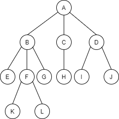
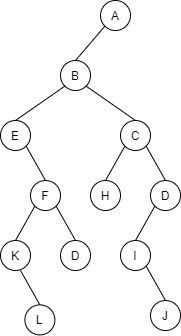
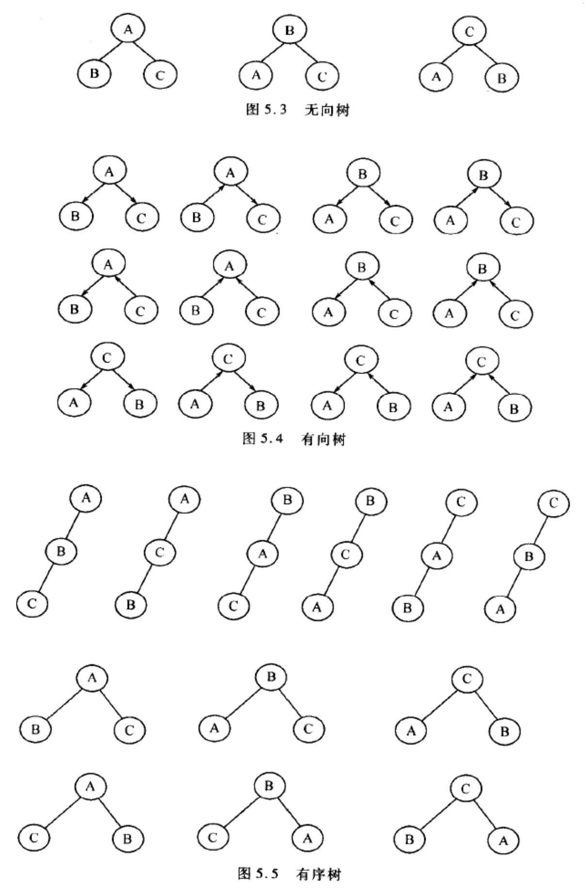
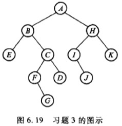
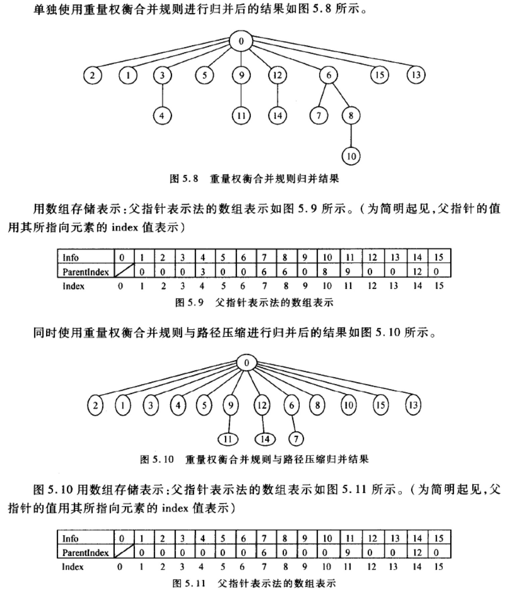
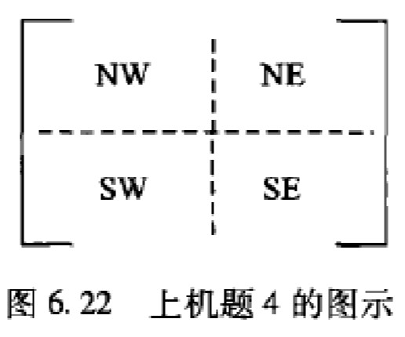
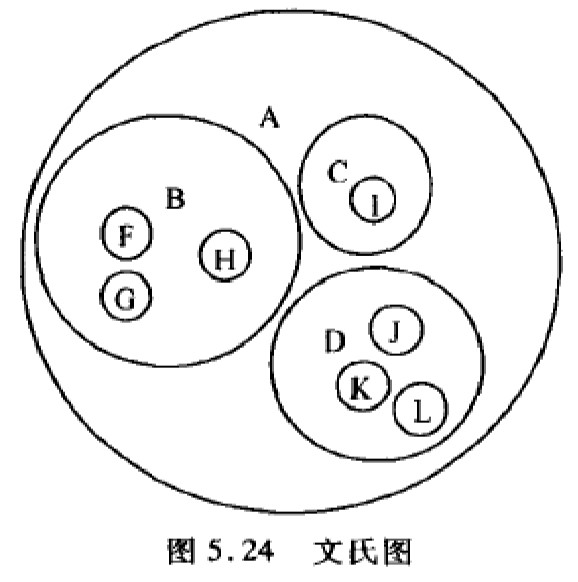
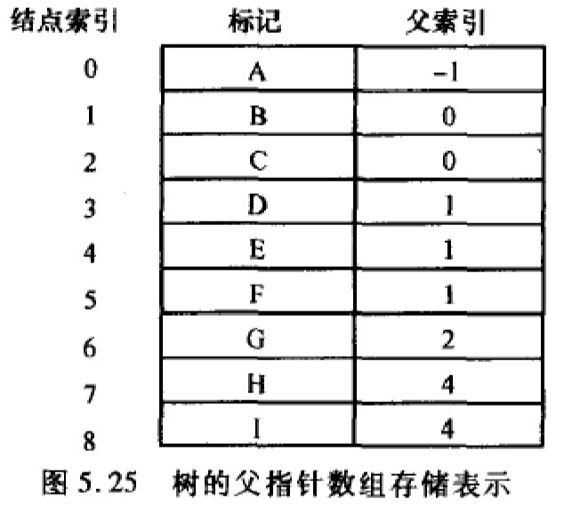

# 第五章 树

## 5.1 教材习题

### 5.1.1 给出一颗树的逻辑结构 T=(K,R)，其中 &nbsp;K={A,B,C,D,E,F,G,H,I,J,K,L,M} &nbsp;R={<A,B>, <A,C>, <A,D>, <B,E>, <B,F>, <B,G>, <C,H>, <D,I>, <D,J>, <F,K>, <F,L>} &emsp;试用树形表示法画出此树，并按照递归定义将此树划分为子树，指出哪些节点是根，哪些节点是树叶，确定各节点的层数、度数，并将该树转换为对应的二叉树

> **解答：**
>
> <table><tr>
> <td><div align="left"></div></td>
> <td><div align="right"></div></td>
> </tr></table>
>
> 根：A，子树的根有 B C D F  
> 树叶：E K L G H I J  
> 层数：0 层 { A }&emsp;1 层 { B C D } &emsp;2 层 {E F G H I J } &emsp; 3 层 { K L}  
> 度数：0 的是树叶，1 的有{ C } &emsp;2 的有{ F D } &emsp;3 的有{ A B }

### 5.1.2 对于 3 个节点可以构造出多少个不同的有序树？有多少不同的有向树。试将其画出来

> **解答：**
>
> 几个概念：
>
> 1. 无向树：连通而不含回路的无向图。无向图 G 性质如下：
>    - G 连通而不含回路
>    - G 的每对顶具有唯一的一条路径
> 2. 有向树：设 D 是有向图，若 D 基图是无向树，则称 D 为有向图，给无向树的边加上方向，即得到有向树
> 3. 有序树：设 T 为根树，若将 T 中层数相同的顶点都标定次序，则称 T 为有序树
>
> 3 个节点有 12 种不同有向树，不同的节点作为中间节点，可以得到 3 中不同的无向树。每棵树中的每条边都有两种取法，这样一颗无向树对应 4 棵有向树。有向树个数为 3×4=12
>
> 3 个节点有 12 种不同的有序树
>
> <div align="center"></div>

### 5.1.3 将图 6.19 中的二叉树转换为对应的森林，分别按照先根、后根次序列出其节点

<div align="center"></div>

> **解答：**
>
> <div align="center"></div>
>
> 先根周游：A B E C F G D H I J K  
> 后根周游：E B F G C D A I J H K

### 5.1.4 编写出一个算法来判断两棵树是否相同。尽可能提高算法效率，并分析算法的运行时间代价

> **解答：** _[code 5-1-4.cpp](./src/5-1-4.cpp)_
>
> 复杂度：由于每节点 j 只需要访问一次，由此复杂度为 O(n)
>
> ```cpp
> #include <stack>
> #include "../headers/treeNode.hpp"
>
>
> // 方法一：递归法1
> template <typename T>
> bool isEqual1(TreeNode<T> *root1, TreeNode<T> *root2){
>     while(root1 != nullptr && root2 != nullptr){
>         // 节点值不相等返回false
>         if(root1->value() != root2->value())
>             return false;
>         // 左子树不相等返回false
>         if(false == (isEqual1(root1->leftMostChild(), root2->leftMostChild())))
>             return false;
>         root1 = root1->rightSibling();
>         root2 = root2->rightSibling();
>     }
>     // 若此时root1和root2都是Null，返回true
>     if(root1 == nullptr && root2 == nullptr)
>         return true;
>     return false;
> }
>
> // 方法二：递归法2
> template <typename T>
> bool isEqual2(TreeNode<T> *root1, TreeNode<T> *root2){
>     // 若两个指针同时为null，则相等
>     if(root1 == nullptr && root2 == nullptr)
>         return true;
>     // 两者均不为空情况
>     if(root1 != nullptr && root2 != nullptr){
>         if(root1->value() != root2->value())
>             return false;
>         if(false == isEqual2(root1->leftMostChild(), root2->leftMostChild()))
>             return false;
>         if(false == isEqual2(root1->rightSibling(), root2->rightSibling()))
>             return false;
>         return true;
>     }
>     // 若其中一棵树为空
>     return false;
> }
>
> // 方法三：非递归->非递归周游
> // 注：两棵树的广度优先周游序列相等，但两棵树不一定相等
> template <typename T>
> bool isEqual3(TreeNode<T> *root1, TreeNode<T> *root2){
>     using std::stack;
>     stack<TreeNode<T> *> aStack, bStack;
>     TreeNode<T> *pointer1 = root1;
>     TreeNode<T> *pointer2 = root2;
>     // 两个栈同时不为空，或者两个指针同时不为null时继续循环
>     while((!aStack.empty() && !bStack.empty()) || (pointer1 && pointer2)){
>         if(pointer1 && pointer2){
>             if(pointer1->value() == pointer2->value()){
>                 aStack.push(pointer1);
>                 bStack.push(pointer2);
>                 pointer1 = pointer1->leftMostChild();
>                 pointer2 = pointer2->leftMostChild();
>             }else
>                 return false;
>         }else{
>             pointer1 = aStack.top();
>             aStack.pop();
>             pointer1 = pointer1->rightSibling();
>             pointer2 = bStack.top();
>             bStack.pop();
>             pointer2 = pointer2->rightSibling();
>         }
>     }
>     // 退出循环时，必须两个栈均为空，两个指针均为null，否则不相等
>     if(aStack.empty() && bStack.empty() && pointer1 == nullptr && pointer2 == nullptr)
>         return true;
>     return false;
> }
> ```

### 5.1.5 编写出一个算法来判断两棵树在不考虑子树顺序的前提下是否相等。尽可能提高算法效率，分析算法的运行时间代价

> **解答：** _[code 5-1-5.cpp](./src/5-1-5.cpp)_
>
> 由题意知：两棵树相等的充要条件是：根节点相等，并且根节点对应的子树集合相等。
>
> ```cpp
> #include <list>
> #include "../headers/treeNode.hpp"
>
>
> template <typename T>
> bool isEqual(TreeNode<T> *rt1, TreeNode<T> *rt2){
>     if(rt1 == nullptr && rt2 == nullptr)
>         return true;
>     // 若根节点不同或其中一个节点为null，返回fasle
>     if((rt1 == nullptr && rt2 != nullptr) || (rt1 != nullptr && rt2 != nullptr))
>         return false;
>     if(rt1->value() != rt2->value())
>         return false;
>     if(rt1->isLeaf() && rt2->isLeaf())
>         return true;
>
>     using std::list;
>     list<TreeNode<T> *> chs1, chs2;             // 分别存储两棵树的孩子列表
>     TreeNode<T> *ch1;
>     TreeNode<T> *ch2;
>     // 先将两棵树的所有子节点存入list中
>     for(ch1 = rt1->leftMostChild(); ch1 != nullptr; ch1 = ch1->rightSibling())
>         chs1.push_back(ch1);
>     for(ch2 = rt1->leftMostChild(); ch2 != nullptr; ch2 = ch2->rightSibling())
>         chs1.push_back(ch2);
>     // 如果孩子个数不等，返回false;
>     if(chs1.size() != chs2.size())
>         return false;
>     typename list<TreeNode<T> *>::iterator it1, it2;
>     for(it1 = chs1.begin(); it1 != chs1.end(); it1++){
>         for(it2 = chs2.begin(); it2 != chs2.end(); it2++)
>             // 如果从rt2的子树中找到了和*it1匹配的子树*it2,
>             // 那么从rt2的孩子列表中删除，避免重复判断，并终止后序比较
>             if(isEqual(*it1, *it2)){
>                 chs2.erase(it2);
>                 break;
>             }
>         // 如果没有找到任何与*it1匹配的子树，返回false
>         if(it2 == chs2.end())
>             return false;
>     }
>     // 如果每棵子树都在rt2的子树中找到对应的匹配，返回true
>     return true;
> }
> ```
>
> 复杂度：最坏情况下每个子树都需要比较任意一次，复杂度为 O(m×n)

### 5.1.6 编写一个函数，以一棵树为输入，返回树的节点数目

> **解答：** _[code 5-1-6.cpp](./src/5-1-6.cpp)_
>
> 对于任意一个节点，以它为根的树的节点个数就等于它的子树的节点个数总和加 1
>
> ```cpp
> #include "../headers/treeNode.hpp"
>
>
> // 解法一：递归1
> template <typename T>
> int nodeCount1(TreeNode<T> *root){
>     if(root == nullptr)
>         return 0;
>     return 1 + nodeCount1(root->leftMostChild()) + nodeCount1(root->rightSibling());
> }
>
> // 解法二：递归2
> template <typename T>
> int nodeCount2(TreeNode<T> *root){
>     int sum = 0;
>     while(root != nullptr){
>         sum ++;                     // 加上本节点
>         sum += nodeCount2(root->leftMostChild());
>         root = root->rightSibling();
>     }
>     return sum;
> }
> // 解法三：非递归（略）
> ```

### 5.1.7 分析“子节点表”表示法、“左子/右兄”二叉链表表示法的结构性开销比率。相比之下它们各自空间效率如何

> **解答：**
>
> 假设数字域的长度为 x,指针域的长度为 y
>
> 1. 子节点表示法  
>    假设共有 n 个节点，则所有链表的节点总和为 n-1（因为除根节点外每个节点都有一个父节点，所以除根节点外指向每个节点的指针都会在链表出现一次）  
>    数组的空间为(x+2y)×n  
>    链表的空间为(n-1)×2y  
>    结构性开销为所有指针域的开销，开销为(n-1)×2y + 2yn  
>    比率为((n-1)×2y+2yn) / ((x+2y)×n+(n-1)×2y)  
>    当 n 较大时，上式近似为 4y/(x+4y) = 1/(1+x/4y)
>
> 2. 左子节点/右兄弟节点表示法  
>    设有 n 个节点，结构性开销为 3yn，总空间为(x+3y)×n  
>    开销比率为 3yn/(x+3y)n = 1/(1+x/3y)
>
> 可以看出左子节点/右兄弟节点表示法效率更高

### 5.1.8 使用重量权衡合并规则与路径压缩，对下列从 0~15 之间的数的等价对进行归并，并给出所得树的父指针表示法的数组表示。在初始情况下，集合中的每个元素分别在独立的等价类中。当两颗树的规模同样大时，使节点较大的根节点作为值较小的根节点的子节点 &emsp;&emsp;&emsp;(0,2)&nbsp;(1,2)&nbsp;(3,4)&nbsp;(3,1)&nbsp;(3,5)&nbsp;(9,11)&nbsp;(12,14)&nbsp;(3,9)&nbsp;(4,14)&nbsp;(6,7);&nbsp;(8,10)&nbsp;(8,7)&nbsp;(7,0)&nbsp;(10,15)&nbsp;(10,13)

> **解答：**
>
> <div align="center"></div>

### 5.1.9 编写函数，以一棵树的根为输入，返回一棵对应的二叉树

> **解答：** _[code 5-1-9.cpp](./src/5-1-9.cpp)_
>
> 利用递归，当前节点的最左子树变换为对应二叉树的左子树，右兄弟指针指向的部分变换为二叉树的右子树
>
> ```cpp
> template <typename T>
> BinaryTree<T>* ToBinaryTree(TreeNode<T> *treeRoot){
>     BinaryTree *Btree = new BinaryTree();       // 申请空二叉树
>     if(!treeRoot) return Btree;                 // 为空则返回
>     Btree->root = ChangeSubTree(treeRoot);
>     return Btree;
> }
>
> template <typename T>
> BinaryTreeNode<T>* ChangeSubTree(TreeNode<T> *treeRoot){
>     BinaryTreeNode<T> *pointer;
>     if(treeRoot == NULL)
>         return NULL;
>     pointer = new BinaryTreeNode(treeRoot->value());
>     // 设置左节点
>     pointer->setLeftChild(ChangeSubTree<T>(tree->leftMostChild()));
>     // 设置右节点
>     pointer->setRightChild(ChangeSubTree<T>(tree->rightSibling()));
>     return pointer;
> }
> ```

### 5.1.10 编写一个高度为 L 的 K 叉树，如果按层次顺序对树中所有节点从 1 开始编号，问

**（1）编号为 n 的节点的父节点（若存在）编号是多少？**  
**（2）编号为 n 的节点的第 i 个子节点（若存在）编号是多少？**  
**（3）编号为 n 的节点有右兄弟的条件是什么？编号是多少？**

> **解答：**
>
> （1）编号为 n 的节点的父节点编号为\[(n-1)/K\]
>
> （2）编号为 n 的节点的第 i 个字节点编号为(n-1)×K+1+i
>
> （3）若 n-1 可以整除 K 则该节点没有右兄弟，n-1 不能整除 K 则该节点有右兄弟，其右兄弟编号为 n+1

### 5.1.11 画出图 6.20 所示二叉树对应森林的左子/右兄法存储表示、带右链的先根次序存储表示、带左链的层次次序存储表示和带度数的后根次序存储表示

<div align="center"></div>

> **解答：**
>
> <table align="center">
>     <caption>左子右兄节点法</caption>
>   <thread>
>   <tr>
>     <th>节点索引</th>
>     <th>左子节点指针</th>
>     <th>值</th>
>     <th>右兄弟节点指针</th>
>   </tr>
>   <thread>
>   <tbody>
>   <tr>
>     <td align="center">0</td>
>     <td align="center">B</td>
>     <td align="center">A</td>
>     <td align="center">\</td>
>   </tr>
>   <tr>
>     <td align="center">1</td>
>     <td align="center">3</td>
>     <td align="center">B</td>
>     <td align="center">2</td>
>   </tr>
>   <tr>
>     <td align="center">2</td>
>     <td align="center">5</td>
>     <td align="center">C</td>
>     <td align="center">6</td>
>   </tr>
>   <tr>
>     <td align="center">3</td>
>     <td align="center">\</td>
>     <td align="center">D</td>
>     <td align="center">4</td>
>   </tr>
>   <tr>
>     <td align="center">4</td>
>     <td align="center">7</td>
>     <td align="center">E</td>
>     <td align="center">\</td>
>   </tr>
>   <tr>
>     <td align="center">5</td>
>     <td align="center">8</td>
>     <td align="center">F</td>
>     <td align="center">9</td>
>   </tr>
>   <tr>
>     <td align="center">6</td>
>     <td align="center">\</td>
>     <td align="center">G</td>
>     <td align="center">\</td>
>   </tr>
>   <tr>
>     <td align="center">7</td>
>     <td align="center">\</td>
>     <td align="center">H</td>
>     <td align="center">\</td>
>   </tr>
>   <tr>
>     <td align="center">8</td>
>     <td align="center">\</td>
>     <td align="center">I</td>
>     <td align="center">\</td>
>   </tr>
>   <tr>
>     <td align="center">9</td>
>     <td align="center">\</td>
>     <td align="center">J</td>
>     <td align="center">\</td>
>   </tr>
>   </tbody>
> </table>
>
> <table>
>   <caption>
>     带右链的先根次序表示法
>   </caption>
>   <thread>
>     <tr>
>       <th align="center">节点索引号</th>
>       <th align="center">0</th>
>       <th align="center">1</th>
>       <th align="center">2</th>
>       <th align="center">3</th>
>       <th align="center">4</th>
>       <th align="center">5</th>
>       <th align="center">6</th>
>       <th align="center">7</th>
>       <th align="center">8</th>
>       <th align="center">9</th>
>     </tr>
>   </thread>
>   <tbody>
>     <tr>
>       <td align="center">Rlink</td>
>       <td align="center">5</td>
>       <td align="center">3</td>
>       <td align="center">/</td>
>       <td align="center">/</td>
>       <td align="center">/</td>
>       <td align="center">9</td>
>       <td align="center">8</td>
>       <td align="center">/</td>
>       <td align="center">/</td>
>       <td align="center">/</td>
>     </tr>
>     <tr>
>       <td align="center">Info</td>
>       <td align="center">A</td>
>       <td align="center">B</td>
>       <td align="center">D</td>
>       <td align="center">E</td>
>       <td align="center">H</td>
>       <td align="center">C</td>
>       <td align="center">F</td>
>       <td align="center">I</td>
>       <td align="center">J</td>
>       <td align="center">G</td>
>     </tr>
>     <tr>
>       <td align="center">Ltag</td>
>       <td align="center">0</td>
>       <td align="center">0</td>
>       <td align="center">1</td>
>       <td align="center">0</td>
>       <td align="center">1</td>
>       <td align="center">0</td>
>       <td align="center">0</td>
>       <td align="center">1</td>
>       <td align="center">1</td>
>       <td align="center">1</td>
>     </tr>
>   </tbody>
> </table>
>
> <table>
>   <caption>
>     带左链的层次次序表示法
>   </caption>
>   <thread>
>     <tr>
>       <th align="center">节点索引号</th>
>       <th align="center">0</th>
>       <th align="center">1</th>
>       <th align="center">2</th>
>       <th align="center">3</th>
>       <th align="center">4</th>
>       <th align="center">5</th>
>       <th align="center">6</th>
>       <th align="center">7</th>
>       <th align="center">8</th>
>       <th align="center">9</th>
>     </tr>
>   </thread>
>   <tbody>
>     <tr>
>       <td align="center">Llink</td>
>       <td align="center">3</td>
>       <td align="center">5</td>
>       <td align="center">/</td>
>       <td align="center">7</td>
>       <td align="center">8</td>
>       <td align="center">9</td>
>       <td align="center">/</td>
>       <td align="center">/</td>
>       <td align="center">/</td>
>       <td align="center">/</td>
>     </tr>
>     <tr>
>       <td align="center">Info</td>
>       <td align="center">A</td>
>       <td align="center">C</td>
>       <td align="center">G</td>
>       <td align="center">B</td>
>       <td align="center">E</td>
>       <td align="center">F</td>
>       <td align="center">J</td>
>       <td align="center">D</td>
>       <td align="center">H</td>
>       <td align="center">I</td>
>     </tr>
>     <tr>
>       <td align="center">Ltag</td>
>       <td align="center">0</td>
>       <td align="center">0</td>
>       <td align="center">1</td>
>       <td align="center">0</td>
>       <td align="center">1</td>
>       <td align="center">0</td>
>       <td align="center">1</td>
>       <td align="center">1</td>
>       <td align="center">1</td>
>       <td align="center">1</td>
>     </tr>
>   </tbody>
> </table>
>
> <table>
>   <caption>
>     带度数的后根次序表示法
>   </caption>
>   <thread>
>     <tr>
>       <th align="center">节点索引号</th>
>       <th align="center">0</th>
>       <th align="center">1</th>
>       <th align="center">2</th>
>       <th align="center">3</th>
>       <th align="center">4</th>
>       <th align="center">5</th>
>       <th align="center">6</th>
>       <th align="center">7</th>
>       <th align="center">8</th>
>       <th align="center">9</th>
>     </tr>
>   </thread>
>   <tbody>
>     <tr>
>       <td align="center">degree</td>
>       <td align="center">0</td>
>       <td align="center">0</td>
>       <td align="center">1</td>
>       <td align="center">2</td>
>       <td align="center">0</td>
>       <td align="center">0</td>
>       <td align="center">2</td>
>       <td align="center">0</td>
>       <td align="center">2</td>
>       <td align="center">2</td>
>     </tr>
>     <tr>
>       <td align="center">Info</td>
>       <td align="center">D</td>
>       <td align="center">H</td>
>       <td align="center">E</td>
>       <td align="center">B</td>
>       <td align="center">I</td>
>       <td align="center">J</td>
>       <td align="center">F</td>
>       <td align="center">G</td>
>       <td align="center">C</td>
>       <td align="center">A</td>
>     </tr>
>   </tbody>
> </table>

### 5.1.12 设计一个算法，将一个用带度数的后根次序法表示森林转换为左子/右兄法表示

> **解答：** _[code 5-1-12.cpp](./src/5-1-12.cpp)_
>
> 思路：  
> （1）如果节点度数 m 为 0，压栈  
> （2）如果节点度数 m 不为 0，从栈中弹出 m 个节点作为该节点的子树，生成的新子树压栈  
> （3）重复指向直到数组中所有节点处理完毕，栈中的节点就是森林所有树的根节点，也即新二叉树的根节点
>
> ```cpp
> #include <stack>
> #include <cassert>
> #include "../headers/treeNode.hpp"
>
> template <typename T>
> struct Node{
>     T info;
>     int degree;
> };
>
> template <typename T>
> TreeNode<T>* Convert(Node<T> *nodes, int size){
>     using std::stack;
>     TreeNode<T> *cur, *temp1, *temp2;
>     stack<TreeNode<T>* > st;
>     for(int i = 0; i < size; i++){
>         if(nodes[i].degree == 0)
>             st.push(new TreeNode<T>(nodes[i].info));
>         else{
>             assert(nodes[i].degree <= st.size());
>             cur = new TreeNode<T>(nodes[i].info);
>             temp2 = st.top();
>             st.pop();
>             // 依次弹出栈顶元素并连接成子树
>             for(int j = 1; j < nodes[i].degree; j++){
>                 temp1 = st.top();
>                 st.pop();
>                 temp1->setSibling(temp2);
>                 temp2 = temp1;
>             }
>             cur->setChild(temp2);
>             st.push(cur);
>         }
>     }
>     // 弹出原森林的最后一棵树的根节点
>     temp2 = st.top();
>     st.pop();
>     // 依次弹出所有元素
>     while(!st.empty()){
>         cur = st.top();
>         st.pop();
>         cur->setSibling(temp2);
>         temp2 = cur;
>     }
>     return temp2;
> }
> ```

### 5.1.13 设计一个算法，将一个用带右链的先根次序法表示的森林转换为带度数的后根次序法表示

> **解答：** _[code 5-1-13.cpp](./src/5-1-13.cpp)_
>
> ```cpp
> template <typename T>
> struct RlinkTreeNode{
>     int ltag;
>     T info;
>     RlinkTreeNode<T> *rlink;
> };
>
> template <typename T>
> struct PostTreeNode{
>     T info;
>     int degree;
> };
>
> RlinkTreeNode<int> RlinkTree[100];
> PostTreeNode<int> PostTree[100];
> int count = 0;
>
> template <typename T>
> int convert(PostTreeNode<T> *node){
>     if(node->ltag == 1){        // 没有左子节点，输出该节点到PostTree
>         PostTree[count].info = node->info;
>         PostTree[count].degree = 0;
>         count++;
>     }else{                      // 有左子节点则压栈
>         int tmp = convert(node+1);  // 访问第一个子节点，并返回度数
>         PostTree[count].info = node->info;
>         PostTree[count].degree = tmp;
>         count++;
>     }
>     if(node->rlink)             // 有右兄弟，访问并返回左边兄弟的数量+1
>         return convert(node->rlink)+1;
>     else
>         return 1;
> }
> ```

## 5.2 上机题

### 5.2.1 使用带子节点指针数组的树的链接表示法，实现 6.1.3 节中定义的树类。此实现必须能支持节点的子节点数目的变化。在生成时，节点应该只能被分配只够存储其初始子节点集的空间。当一个新的子节点添加到节点上以至于数组溢出时，则从可利用空间中分配一个原来数组两倍大的数组

### 5.2.2 使用父指针表示法，实现 6.1.3 节中定义的树类

### 5.2.3 若用大写字母标识树的节点，则可用带标号的广义表形式表示一棵树，其语法图如图 6.21 所示，编写递归算法

**（1）将这种表示方法的字符序列转换成树的左子/右兄表示法**  
**（2）将左子/右兄表示法表示的树转换为这个表示法的字符序列**

<div align="center"></div>

### 5.2.4 另外一种表示二维数组的方法是四叉树表示法，其中一个节点的 4 个儿子分别表示数组的 NE、SE、SW、NW，4 个分块如图 6.22 所示。这种表示二维数组的 4 叉树称为金字塔

**（1）设计一个基于金字塔表示法的矩阵乘法算法**  
**（2）对于给定的$2^p×2^p$矩阵，设计一个构造表示这个矩阵的二叉树算法。并将这个算法推广到可以表示任意 M×N 矩阵的情形，算法效率如何？**

<div align="center"></div>

## 5.3 《学习指导》教材习题解答

### 5.3.1~5.3.9 [教材习题 5.1.1](#511-给出一颗树的逻辑结构-tkr其中-kabcdefghijklm-rab-ac-ad-be-bf-bg-ch-di-dj-fk-fl-试用树形表示法画出此树并按照递归定义将此树划分为子树指出哪些节点是根哪些节点是树叶确定各节点的层数度数并将该树转换为对应的二叉树)~[教材习题 5.1.9](#519-编写函数以一棵树的根为输入返回一棵对应的二叉树)

### 5.3.10 利用完全二叉树顺序表示法存储 K 叉树，并导出非空完全 K 叉树节点之间的关联公式

> **解答：**
>
> 利用完全树顺序表示法存储 K 叉树，假设树的节点个数为 n，按照广度优先周游 K 叉树的顺序对其节点进行编号，树的节点编号从 0~n-1，把节点按照编号次序顺序存储到一个数组当中。  
> 下面用数组的下标表示节点，以表示出节点之间的关系。  
> 根据完全 K 叉树的特点（每个节点要么有 K 个子节点，要么没有子节点，并且没有子节点的节点在最后两层），可以推出在完全 K 叉树中，节点之间有如下关系：  
> （1）根节点下标为 0  
> （2）对于任意节点 i：其父节点为[(i-1)/k]，若 i=0，没有父节点  
> （3）i 的子节点可能为 i×K+1,i×K+2,i×K+3,...,i×K+K，即可表示为 i×K+j，1≤j≤K 且需要满足(i×K+j)≤n-1。若 i×K+1≥n，则没有子节点；若 i×K+1=n-1，则只有一个子节点；若 i×K+2=n-1，则有两个子节点，以此类推。  
> （4）节点 i 左边的兄弟节点从左到右为：[(i-1)/K]×K+1,[(i-1)/K]×K+2,...,i-1  
> &emsp;&nbsp;&nbsp;&nbsp;&nbsp;&nbsp;&nbsp;节点 i 右边的兄弟节点从左到右为：i+1,i+2,...,[(i-1)/K]×K+K

### 5.3.11 [教材习题 5.1.10](#5110-编写一个高度为-l-的-k-叉树如果按层次顺序对树中所有节点从-1-开始编号问)

### 5.3.12 使用数学归纳法证明非空满 K 叉树的叶节点数目为(K-1)×n+1，其中 n 为分支节点数目

> **解答：**
>
> （1）当 n=0 时，只有一个根节点，此时叶节点数目为 1，(K-1)n+1=1 成立；  
> &nbsp;&nbsp;&emsp;&emsp;当 n=1 时，(K-1)n+K=K 成立。  
> （2）假设 n=m(m≥1)时叶节点数目为(K-1)m+1；当 n=m+1 时，相当于把 n=m 时的 K 叉树里的一个叶节点扩展为分支节点，叶节点增加 K-1 个，故有(K-1)m+1+K-1=(m+1)K-m=(m+1)K-(m+1)+1=(K-1)(m+1)+1=(K-1)n+1
>
> 由上述可知该公式成立

### 5.3.13~5.3.15 [教材习题 5.1.11](#5111-画出图-620-所示二叉树对应森林的左子右兄法存储表示带右链的先根次序存储表示带左链的层次次序存储表示和带度数的后根次序存储表示)~[教材习题 5.1.13](#5113-设计一个算法将一个用带右链的先根次序法表示的森林转换为带度数的后根次序法表示)

## 5.4 《学习指导》教材上机题解答

### 5.4.1~5.4.3 [上机指导 5.2.1](#521-使用带子节点指针数组的树的链接表示法实现-613-节中定义的树类此实现必须能支持节点的子节点数目的变化在生成时节点应该只能被分配只够存储其初始子节点集的空间当一个新的子节点添加到节点上以至于数组溢出时则从可利用空间中分配一个原来数组两倍大的数组)~[上机指导 5.2.3](#523-若用大写字母标识树的节点则可用带标号的广义表形式表示一棵树其语法图如图-621-所示编写递归算法)

### 5.4.4 使用 Union/Find 算法解决下面问题：给出一个点集，点用(x,y)坐标形式表示，把点分配到簇中去。两个距离不超过 d 的点定义为在一个簇中。簇是等价关系，换句话说，点 A、B 和 C 定义为在一个簇中，如果 A 与 B 距离小于 d，且 A 与 C 距离小于 d，即 B 与 C 距离大于 d 也是成立的。为了解决这个问题，计算每一对点之间的距离，当出现两个点在特定距离内时，使用等价处理算法来归并簇。这个算法的渐进复杂度如何，处理瓶颈在何处

### 5.4.5 在 Union/Find 算法中，对于路径压缩分别进行如下改动，是否能提高算法性能，比较下列三种实现算法

**（1）标准 Union/Find 算法，使用路径压缩和重量权重合并规则**  
**（2）类似于（1），但是在 Union 操作后进行路径压缩，而不是在 Find 操作中进行**  
**（3）类似于（1），只做一点改动：在 Union 操作后将较小的树上要归并的节点的父指针指向较大树的根节点。例如，考虑处理等价对(A,B)，A'、B'分别是 A、B 所在树的根节点，且以 A'为根的树比以 B'为根的树大，则进行 Union/Find 操作后，将 B 的父指针直接指向 A'**

## 5.5 《学习指导》增补习题

### 5.5.1 给出一棵树的逻辑结构 T=(K,R)，其中 K={A,B,C,D,E,F,G,H,I,J},R={r},r={<A,B>, <B,E>, <B,F>, <F,G>, <F,H>, <A,C>, <C,I>, <C,J>, <J,K>, <A,D>}，试回答下列问题

**（1）哪个是根节点**  
**（2）哪些是叶节点**  
**（3）哪个是 F 的父节点**  
**（4）哪些是 F 的祖先**  
**（5）哪些是 F 的孩子**  
**（6）哪些是 B 的子孙**  
**（7）哪些是 B 的兄弟**  
**（8）节点 K 的层次是多少**  
**（9）树的深度是多少**  
**（10）以节点 C 为根的子树的深度是多少**

> **解答：**
>
> （1）A 是根节点  
> （2）叶节点：E G H I K D  
> （3）F 的父节点：B  
> （4）F 的祖先节点：B A  
> （5）F 的孩子：G H
> （6）B 的子孙：E F G H  
> （7）B 的兄弟：C D  
> （8）K 的层次：3 (根节点第 0 层)  
> （9）K 的深度：3 (根节点深度 0)  
> （10）C 为根的子树深度：2

### 5.5.2 图 5.24 是用文氏图表示的树，请分别用树形表示法，凹入表示法和嵌套括号表示法表示该树

<div align="center"></div>

### 5.5.3 图 5.25 是一棵树的父指针数组存储表示，请用树形表示法画出这棵树并分别用子节点表示法、动态节点表示法、左子节点/右兄弟节点表示法表示该树

<div align="center"></div>

### 5.5.4 假设先根次序遍历某棵树的节点次序为 SACEFBDGHIJK，后根次序遍历该树的节点次序为 CFEABHGIKJDS，请画出这棵树

### 5.5.5 一棵度为 2 的有序树和一棵二叉树有何区别

### 5.5.6 若一个具有 n 个顶点，K 条边的无向图是一个森林(n>K)，则该森林有多少棵树

### 5.5.7 已知一棵度为 m 的树种有$N_1$个度为 1 的节点，$N_2$个度为 2 的节点，...，$N_m$个度为 m 的节点。试问该树中有多少个叶子节点

### 5.5.8 一颗含有 n 个节点的 k 叉树，可能达到的最大深度和最小深度分别是多少

### 5.5.9 编写一个算法，将子节点表示法存储转换为

**（1）左子节点/右兄弟节点表示法**  
**（2）动态节点表示法**

### 5.5.10 编写一个算法，求一棵树的树高

> **解答：** [code 5-5-10.cpp](./src/5-5-10.cpp)
>
> ```cpp
> #include "../headers/treeNode.hpp"
>
> template <typename T>
> int height(TreeNode<T> *root){
>     if(root == nullptr)
>         return 0;
>     else{
>         int leftHeight = height(root->leftMostChild()) + 1;
>         int rightHeight = height(root->rightSibling() + 1);
>         return leftHeight > rightHeight ? leftHeight : rightHeight;
>     }
> }
> ```

### 5.5.11 用合适的结构定义一棵 5 叉树，写出数据结构，并编写一个递归函数按后序遍历该 5 叉树

### 5.5.12 如果只考虑有序树的情况，那么具有七个节点的不同形态的树共有多少个(提示：考虑树与二叉树的对应关系)

> **解答：**
>
> 7 个节点，最大层数是 7，每一层都有$A_{7}^{7}=7×6×5×4×3×2×1=5040$棵有序树，所以共有$7×5040=35280$种有序树

## 5.6 《学习指导》增补上机题

### 5.6.1 设计一棵树的数据存储图中的树并实现以下功能

**（1）按层次打印树，要求从打印方式看出树的结构还不是简单的输出按层次周游的节点序列**  
**（2）打印这颗树的根节点到叶节点的所有路径**

### 5.6.2 实现算法，把图 5.26 所示的树转换为二叉树并打印出来(可采用教材上的任一数据结构实现)

<div align="center"></div>
