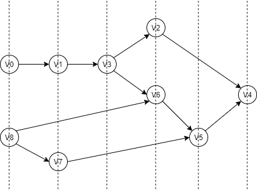
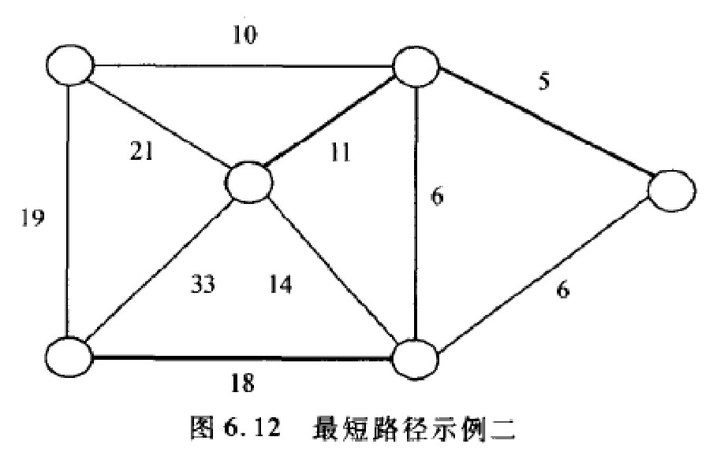
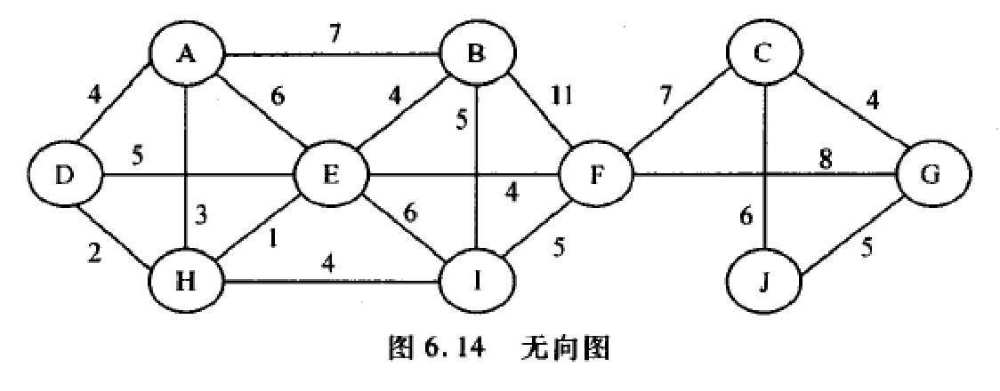
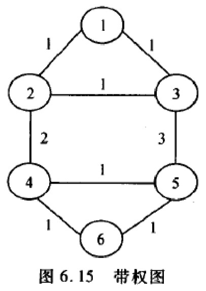

# 第六章-图

## 6.1 教材习题

### 6.1.1 对于图 7.26 所示的带权有向图

**（1）写出其相邻矩阵**  
**（2）画出其邻接表和邻接多重表表示**  
**（3）计算每个顶点的入度和出度**  
**（4）如果每个指针需要 4 个字节，每个顶点的标号需要 2 个字节，每条边的权需要 2 个字节，则此图采用哪种表示法所需的空间较少**

<div align="center"></div>

> **解答：**
>
> （1）邻接矩阵是：
>
> $$
> \begin{pmatrix}
>  0&  6&  0&  5&  0&  0&  0&  0&  0& \\
>  0&  0&  0&  0&  1&  0&  0&  0&  0& \\
>  4&  0&  0&  0&  1&  0&  0&  0&  0& \\
>  0&  0&  0&  0&  0&  0&  2&  0&  0& \\
>  0&  0&  0&  0&  0&  8&  0&  9&  0& \\
>  0&  0&  0&  0&  0&  0&  0&  0&  0& \\
>  0&  0&  0&  0&  0&  4&  0&  0&  4& \\
>  0&  0&  0&  0&  0&  0&  0&  0&  2& \\
>  0&  0&  0&  0&  0&  0&  0&  0&  0&
> \end{pmatrix}
> $$
>
> （2）邻接表和邻接多重表
>
> （3）顶点的入度和出度
>
> <table>
>   <caption>
>     顶点的入度和出度
>   </caption>
>   <thread>
>     <th align="center">顶点</th>
>     <th align="center">V0</th>
>     <th align="center">V1</th>
>     <th align="center">V2</th>
>     <th align="center">V3</th>
>     <th align="center">V4</th>
>     <th align="center">V5</th>
>     <th align="center">V6</th>
>     <th align="center">V7</th>
>     <th align="center">V8</th>
>   </thread>
>   <tbody>
>     <th align="center">入度</th>
>     <th align="center">1</th>
>     <th align="center">1</th>
>     <th align="center">0</th>
>     <th align="center">1</th>
>     <th align="center">2</th>
>     <th align="center">2</th>
>     <th align="center">1</th>
>     <th align="center">1</th>
>     <th align="center">2</th>
>   </tbody>
>   <tbody>
>     <th align="center">出度</th>
>     <th align="center">2</th>
>     <th align="center">1</th>
>     <th align="center">2</th>
>     <th align="center">1</th>
>     <th align="center">2</th>
>     <th align="center">0</th>
>     <th align="center">2</th>
>     <th align="center">1</th>
>     <th align="center">0</th>
>   </tbody>
> </table>
>
> （4）空间  
> 邻接矩阵：9×9×2=162 字节  
> 邻接表：(9+11)×4+(9+22)×2=142 字节  
> 邻接多重表：(9+11)×4+(9+33)×2=164 字节

### 6.1.2 对于图 7.27 所示的有向图，从顶点 v1 出发分别画出其深度优先搜索(DFS)和广度优先搜素(BFS)的生成森林

<div align="center"></div>

> **解答：**
>
> <div align="center"></div>

### 6.1.3 求图 7.28 所示的有向图中从顶点 v4 到其他各顶点的全部最短路径及长度

<div align="center"></div>

> **解答：**
>
> $V_0\qquad V_4 → V_1 → V_0 \qquad\qquad\qquad\qquad\ 14$  
> $V_1\qquad V_4 → V_1 \qquad\qquad\qquad\qquad\qquad\quad4$  
> $V_2\qquad V_4 → V_1 → V_0 → V_2\qquad\qquad\quad\ \ \ 29$  
> $V_3\qquad V_4 → V_1 → V_3 \qquad\qquad\qquad\qquad \ \ 6$  
> $V_4\qquad V_4 \qquad\qquad\qquad\qquad\qquad\qquad\quad\ \;0$  
> $V_5\qquad V_4 → V_1 → V_5\qquad\qquad\qquad\qquad\ 34$
>
> Dijkstra 算法流程：
>
> <table>
>   <tbody>
>     <td>初始状态</td>
>     <td>
>       <table border="0">
>         <thread>
>           <td align="center"></td>
>           <td align="center">V0</td>
>           <td align="center">V1</td>
>           <td align="center">V2</td>
>           <td align="center">V3</td>
>           <td align="center">V4</td>
>           <td align="center">V5</td>
>         </thread>
>         <tbody>
>           <td align="center">Distance</td>
>           <td align="center">∞</td>
>           <td align="center">∞</td>
>           <td align="center">∞</td>
>           <td align="center">∞</td>
>           <td align="center">∞</td>
>           <td align="center">∞</td>
>         </tbody>
>         <tbody>
>           <td align="center">Path</td>
>           <td align="center">-1</td>
>           <td align="center">-1</td>
>           <td align="center">-1</td>
>           <td align="center">-1</td>
>           <td align="center">-1</td>
>           <td align="center">-1</td>
>         </tbody>
>         <tbody>
>           <td align="center">Visit</td>
>           <td align="center">false</td>
>           <td align="center">false</td>
>           <td align="center">false</td>
>           <td align="center">false</td>
>           <td align="center">false</td>
>           <td align="center">false</td>
>         </tbody>
>       </table>
>     </td>
>   </tbody>
>   <tbody>
>     <td>初始化V4</td>
>     <td>
>       <table>
>         <thread>
>           <td align="center"></td>
>           <td align="center">V0</td>
>           <td align="center">V1</td>
>           <td align="center">V2</td>
>           <td align="center">V3</td>
>           <td align="center">V4</td>
>           <td align="center">V5</td>
>         </thread>
>         <tbody>
>           <td align="center">Distance</td>
>           <td align="center">∞</td>
>           <td align="center">∞</td>
>           <td align="center">∞</td>
>           <td align="center">∞</td>
>           <td align="center">0</td>
>           <td align="center">∞</td>
>         </tbody>
>         <tbody>
>           <td align="center">Path</td>
>           <td align="center">-1</td>
>           <td align="center">-1</td>
>           <td align="center">-1</td>
>           <td align="center">-1</td>
>           <td align="center">-1</td>
>           <td align="center">-1</td>
>         </tbody>
>         <tbody>
>           <td align="center">Visit</td>
>           <td align="center">false</td>
>           <td align="center">false</td>
>           <td align="center">false</td>
>           <td align="center">false</td>
>           <td align="center">false</td>
>           <td align="center">false</td>
>         </tbody>
>       </table>
>     </td>
>   </tbody>
>   <tbody>
>     <td>取V4</td>
>     <td>
>       <table>
>         <thread>
>           <td align="center"></td>
>           <td align="center">V0</td>
>           <td align="center">V1</td>
>           <td align="center">V2</td>
>           <td align="center">V3</td>
>           <td align="center">V4</td>
>           <td align="center">V5</td>
>         </thread>
>         <tbody>
>           <td align="center">Distance</td>
>           <td align="center">∞</td>
>           <td align="center">4</td>
>           <td align="center">∞</td>
>           <td align="center">∞</td>
>           <td align="center">0</td>
>           <td align="center">∞</td>
>         </tbody>
>         <tbody>
>           <td align="center">Path</td>
>           <td align="center">-1</td>
>           <td align="center">4</td>
>           <td align="center">-1</td>
>           <td align="center">-1</td>
>           <td align="center">-1</td>
>           <td align="center">-1</td>
>         </tbody>
>         <tbody>
>           <td align="center">Visit</td>
>           <td align="center">false</td>
>           <td align="center">false</td>
>           <td align="center">false</td>
>           <td align="center">false</td>
>           <td align="center">true</td>
>           <td align="center">false</td>
>         </tbody>
>       </table>
>     </td>
>   </tbody>
>   <tbody>
>     <td>取V1</td>
>     <td>
>       <table>
>         <thread>
>           <td align="center"></td>
>           <td align="center">V0</td>
>           <td align="center">V1</td>
>           <td align="center">V2</td>
>           <td align="center">V3</td>
>           <td align="center">V4</td>
>           <td align="center">V5</td>
>         </thread>
>         <tbody>
>           <td align="center">Distance</td>
>           <td align="center">14</td>
>           <td align="center">4</td>
>           <td align="center">∞</td>
>           <td align="center">6</td>
>           <td align="center">0</td>
>           <td align="center">34</td>
>         </tbody>
>         <tbody>
>           <td align="center">Path</td>
>           <td align="center">1</td>
>           <td align="center">4</td>
>           <td align="center">-1</td>
>           <td align="center">1</td>
>           <td align="center">-1</td>
>           <td align="center">1</td>
>         </tbody>
>         <tbody>
>           <td align="center">Visit</td>
>           <td align="center">false</td>
>           <td align="center">true</td>
>           <td align="center">false</td>
>           <td align="center">false</td>
>           <td align="center">true</td>
>           <td align="center">false</td>
>         </tbody>
>       </table>
>     </td>
>   </tbody>
>   <tbody>
>     <td>取V3</td>
>     <td>
>       <table>
>         <thread>
>           <td align="center"></td>
>           <td align="center">V0</td>
>           <td align="center">V1</td>
>           <td align="center">V2</td>
>           <td align="center">V3</td>
>           <td align="center">V4</td>
>           <td align="center">V5</td>
>         </thread>
>         <tbody>
>           <td align="center">Distance</td>
>           <td align="center">14</td>
>           <td align="center">4</td>
>           <td align="center">∞</td>
>           <td align="center">6</td>
>           <td align="center">0</td>
>           <td align="center">34</td>
>         </tbody>
>         <tbody>
>           <td align="center">Path</td>
>           <td align="center">1</td>
>           <td align="center">4</td>
>           <td align="center">-1</td>
>           <td align="center">1</td>
>           <td align="center">-1</td>
>           <td align="center">1</td>
>         </tbody>
>         <tbody>
>           <td align="center">Visit</td>
>           <td align="center">false</td>
>           <td align="center">true</td>
>           <td align="center">false</td>
>           <td align="center">true</td>
>           <td align="center">true</td>
>           <td align="center">false</td>
>         </tbody>
>       </table>
>     </td>
>   </tbody>
>   <tbody>
>     <td>取V0</td>
>     <td>
>       <table>
>         <thread>
>           <td align="center"></td>
>           <td align="center">V0</td>
>           <td align="center">V1</td>
>           <td align="center">V2</td>
>           <td align="center">V3</td>
>           <td align="center">V4</td>
>           <td align="center">V5</td>
>         </thread>
>         <tbody>
>           <td align="center">Distance</td>
>           <td align="center">14</td>
>           <td align="center">4</td>
>           <td align="center">29</td>
>           <td align="center">6</td>
>           <td align="center">0</td>
>           <td align="center">34</td>
>         </tbody>
>         <tbody>
>           <td align="center">Path</td>
>           <td align="center">1</td>
>           <td align="center">4</td>
>           <td align="center">0</td>
>           <td align="center">1</td>
>           <td align="center">-1</td>
>           <td align="center">1</td>
>         </tbody>
>         <tbody>
>           <td align="center">Visit</td>
>           <td align="center">true</td>
>           <td align="center">true</td>
>           <td align="center">false</td>
>           <td align="center">true</td>
>           <td align="center">true</td>
>           <td align="center">false</td>
>         </tbody>
>       </table>
>     </td>
>   </tbody>
>   <tbody>
>     <td>取V2</td>
>     <td>
>       <table>
>         <thread>
>           <td align="center"></td>
>           <td align="center">V0</td>
>           <td align="center">V1</td>
>           <td align="center">V2</td>
>           <td align="center">V3</td>
>           <td align="center">V4</td>
>           <td align="center">V5</td>
>         </thread>
>         <tbody>
>           <td align="center">Distance</td>
>           <td align="center">14</td>
>           <td align="center">4</td>
>           <td align="center">29</td>
>           <td align="center">6</td>
>           <td align="center">0</td>
>           <td align="center">34</td>
>         </tbody>
>         <tbody>
>           <td align="center">Path</td>
>           <td align="center">1</td>
>           <td align="center">4</td>
>           <td align="center">0</td>
>           <td align="center">1</td>
>           <td align="center">-1</td>
>           <td align="center">1</td>
>         </tbody>
>         <tbody>
>           <td align="center">Visit</td>
>           <td align="center">true</td>
>           <td align="center">true</td>
>           <td align="center">true</td>
>           <td align="center">true</td>
>           <td align="center">true</td>
>           <td align="center">false</td>
>         </tbody>
>       </table>
>     </td>
>   </tbody>
>   <tbody>
>     <td>取V5</td>
>     <td>
>       <table>
>         <thread>
>           <td align="center"></td>
>           <td align="center">V0</td>
>           <td align="center">V1</td>
>           <td align="center">V2</td>
>           <td align="center">V3</td>
>           <td align="center">V4</td>
>           <td align="center">V5</td>
>         </thread>
>         <tbody>
>           <td align="center">Distance</td>
>           <td align="center">14</td>
>           <td align="center">4</td>
>           <td align="center">29</td>
>           <td align="center">6</td>
>           <td align="center">0</td>
>           <td align="center">34</td>
>         </tbody>
>         <tbody>
>           <td align="center">Path</td>
>           <td align="center">1</td>
>           <td align="center">4</td>
>           <td align="center">0</td>
>           <td align="center">1</td>
>           <td align="center">-1</td>
>           <td align="center">1</td>
>         </tbody>
>         <tbody>
>           <td align="center">Visit</td>
>           <td align="center">true</td>
>           <td align="center">true</td>
>           <td align="center">true</td>
>           <td align="center">true</td>
>           <td align="center">true</td>
>           <td align="center">true</td>
>         </tbody>
>       </table>
>     </td>
>   </tbody>
> </table>

### 6.1.4 拓扑排序的结果不是唯一的，对于图 7.29 所示的有向图的顶点进行拓扑排序，能够得到多少个不同的拓扑序列？试输出得到的所有拓扑序列

<div align="center"></div>

> **解答：**
>
> <div align="center"></div>
>
> 得到拓扑序列是 52 个

### 6.1.5 证明：只要适当排列顶点的次序，就能够使有向无环图的相邻矩阵中对角线以下元素全为 0

> **解答：**
>
> 对于任何一个有向无环图，均可以进行拓扑排序。将顶点的拓扑序列作为各顶点新的次序，根据拓扑序列的性质，有以下结论：只要$V_i$到$V_j$有一条通路，必有$i<j$。也就是说，对于$\forall i>j$ 不存在$V_i$到$V_j$的通路，更不会有$V_i$到$V_j$边存在。所以，在相应的邻接矩阵中，对于$\forall i>j$，都有$M_{ij}=0$即对角线元素全为 0。  
> 所以，对于任何一个有向无环图，只要按照拓扑序列排序，就可以使得其邻接矩阵中对角线以下元素全为 0。

### 6.1.6 证明

**（1）一个没有简单回路的连通无向图 G=<V,E>有 v-1 条边**  
**（2）一个有 v-1 条边的无环图一定是连通的**

> **解答：**
>
> （1）数学归纳法证明  
> 当$v=1$时，边$=0=1-1$成立；  
> 当$v=2$时，边$=1=2-1$成立；  
> 设$v=n$时成立，  
> 当$v=n+1$时，设这$n+1$各节点为$V_0,V_1,V_2,...,V_n$，则$V_0$必然与其中的若干个节点相邻，不妨设与$V_2,...,V_j$相邻，则可对这个图做如下变化：  
> &emsp;&emsp;&emsp;&emsp;去掉边$(V_0,V_2)$，增加边$(V_1,V_2)$  
> &emsp;&emsp;&emsp;&emsp;去掉边$(V_0,V_3)$，增加边$(V_1,V_3)$  
> &emsp;&emsp;&emsp;&emsp;&emsp;&emsp;&emsp;&emsp;......  
> &emsp;&emsp;&emsp;&emsp;去掉边$(V_0,V_j)$，增加边$(V_1,V_j)$  
> 由于$(V_0,V_1)$存在且$(V_0,V_i)(i≠1)$存在，所以$(V_1,V_i)$不可能存在（因为图中没有简单回路）。所以上述变化没有改变图 G 中边的数目，也没有改变图 G 的性质（没有简单回路的连通无向图），然后令$G'=G-V_0$，显然$G'$也是没有简单回路的连通无向图，而且$G'$中边的数目比$G$中边的数目少$1$，$G'$中有$n$个节点，故$G'$有$n-1$条边，因此$G$中有$n$条边，满足$v-1=n$。命题成立。
>
> （2）假设这个无环图是连通的，则设图$G$有$k$个连通分支$G_1,G_2,...,G_k(k≥2)$，设$G_1$有$x_1$个节点，$G_2$有$x_2$个节点，...，$G_k$有$x_k$个节点，则有$x_1+x_2+...+x_k=n$，又因为$G_i$有$x_i-1$条边，所以图$G$有$(x_1-1)+(x_2-1)+...+(x_k-1)=n-k(k≥2)$条边，少于已知的$n-1$条边，所以假设不成立，该无环图一定是连通的。

### 6.1.7 有向图 $G=<V,E>$的转置是图$G^T=<V,E^T>$，其中边$<u,v>∈E^T$，当且仅当$<v,u>∈E$，即$G^T$就是逆转 $G$ 中所有方向而得到的图。试按照相邻矩阵和邻接表两种表示法写出从 $G$ 计算$G^T$的有效算法，并确定算法的时间复杂度

> **解答：** _[code 6-1-7.cpp](./src/6-1-7.cpp)_
>
> 下述算法中，邻接矩阵时间复杂度是$O(N^2)$，邻接矩阵时间复杂度是$O(N)$
>
> ```cpp
> struct Edge{
>     int from;
>     int to;
>     int weight;
> };
>
> class Graph{
>     public:
>         int verticesNum();
>         int edgesNum();
>         Edge firstEdge(int oneVertex);
>         Edge nextEdge(Edge preEdge);
>         bool setEdge(int fromVertex, int toVertex, int weight);
>         bool delEdge(int fromVertex, int toVertex);
> };
>
> // 邻接矩阵
> class Graphm: public Graph{
>     public:
>         Graphm(int num);
>         Graphm* transpose(){
>             int numVertex = verticesNum();
>             Graphm *GT = new Graphm(numVertex);
>             Edge tempE;
>             for(int i = 0; i < numVertex; i++){
>                 tempE = firstEdge(i);
>                 while(tempE.to != -1){
>                     GT->setEdge(tempE.to, i, tempE.weight);
>                     tempE = nextEdge(tempE);
>                 }
>             }
>             return GT;
>         }
> };
>
> // 邻接表
> class Graphl:public Graph{
>     public:
>         Graphl(int num);
>         Graphl* transpose(){
>             int numVertex = verticesNum();
>             Graphl *GT = new Graphl(numVertex);
>             Edge tempE;
>             Link<listUnit> *temp;
>             for(int i = numVertex-1; i >= 0; i--){
>                 temp = graList[i].head;
>                 while(temp->next){
>                     GT->setEdge(temp->next->element.vertex, i, temp->next->element.weight);
>                     temp = temp->next;
>                 }
>             }
>             return GT;
>         }
> };
> ```

### 6.1.8 有向图 $G=<V,E>$的平方图是图$G^2=<V,E^2>$,其中边$<u,v>∈E^2$，当且仅当存在一个顶点 $x∈V$，使得$<u,v>∈E$ 且$<x,v>∈E$，即当图 $G$ 中存在一条顶点 $u$ 到顶点 $v$ 的长度为 $2$ 的路径时，$<u,v>∈E^2$。试按照相邻矩阵和邻接表两种表示法写出从 $G$ 产生$G^2$的有效算法，并确定算法的时间复杂度

> **解答：**
>
> 用相邻矩阵时，设$G$的相邻矩阵为$A$，$G^2$的相邻矩阵为$B$，首先用一个两层循环搜索$A$的每个元素，若$A[i,]=1$，则用一层循环搜索第$j$行，若$A[j,k]=1$，则$B[i,k]=1$。这样就可以生成$G^2$的邻接矩阵$B$，时间代价是$O(N^3)$。
>
> ```cpp
> // 邻接矩阵
> Graphm* Graphm::squareGraph(){
>     Graphm *temp = new Graphm(numVert);
>     int i,j,k;
>     for(i = 0; i < numVert; i++){
>         for(j = 0; j < numVert; j++){
>             if(matrix[i][j] == 1){
>                 for(k = 0; k < numVert; k++){
>                     if(i != k && matrix[j][k] == 1)
>                         temp->matrix[i][k] = 1;
>                 }
>             }
>         }
>     }
> }
> ```
>
> 用邻接表（用出边表）。设$G$的邻接边表的数组为$A$，$G^2$的邻接边表的数组为$B$，遍历$A[i]$的链，若$A[i]$链上有元素$j$，遍历$A[j]$链，若$A[j]$链上有元素$k$，则将$k$链在$B[i]$的链上，这样就可以生成$G^2$的邻接表数组$B$，时间代价是$O(N^3)$。
>
> ```cpp
> // 邻接表
> Graphl* Graphl::squareGraph(){
>     Graphl *current = new Graphl(numVert);
>     Link<listUint> *node, *temp, *temp2;
>     int i, j, k;
>     for(i = 0; i < numVert; i++){
>         node = current->graList[i].head;
>         temp = graList[i].head;
>         while(temp->next){
>             temp = temp->next;
>             j = temp->element.vertex;
>             temp2 = graList[j].head;
>             while(temp2->next){
>                 temp2 = temp2->next;
>                 if(i != temp2->element.vertex){
>                     node->next = new Link;
>                     node->next->element.vertex = temp2->element->vertex;
>                     node->next->element.weight = temp2->element.weight + temp->element.weight;
>                     node = node->next;
>                 }
>             }
>         }
>     }
>     return current;
> }
> ```

### 6.1.9 写出一个算法确定一个有 n 个顶点 e 条边的图（有向图或无向图）是否包含回路，所设计的算法时间复杂度应该是 $\Theta(n+e)$

> **解答：** _[code 6-1-9.cpp](./src/6-1-9.cpp)_
>
> 1. 无向图，只需遍历一次  
>    先为每个顶点保留一个标识位，算法开始时所有标识为均为 0，然后采用 BFS 周游图，某个顶点被访问时，其标识位为 1，之后的周游过程中若遇到标识位为 1 的顶点，则存在回路。_DFS 用来检查是否存在环路_
> 2. 有向图需要用拓扑排序  
>    (1) 从图中选择一个入度为 0 的未访问的顶点，  
>    若找到继续(2)；  
>    若找不到，则图中有环，算法结束；  
>    若所有顶点都已经被访问过，则图中无环，算法结束。  
>    (2) 将该顶点标记为已访问并将其所有出边指向的顶点的入度减 1。  
>    (3) 回到(1)继续执行
>
> ```cpp
> #include <queue>
>
> // 邻接矩阵
> bool HasCirclePath(Graph &G, int V){
>     for(int i = 0; i < G.verticesNum(); i++)
>         G.mark[i] = 0;
>     using std::queue;
>     queue<int> Q;
>     G.mark[V] = 1;
>     Q.push(V);
>     while(!Q.empty()){
>         int V = Q.front();
>         Q.pop();
>         for(Egde e = G.firstEdge(); G.isEdge(e); e = G.nextEdge(e)){
>             if(!G.mark[G.toVertex(e)]){             // 该点未访问过则访问
>                 G.mark[G.toVertex(e)] = 1;
>                 Q.push(G.toVertex(e));
>             }else
>                 return false;
>         }
>     }
>     return true;
> }
>
>
> // 邻接表
> #include <stack>
>
> bool hasCirclePath(Graph &G){
>     for(int i = 0; i < G.verticesNum(); i++)
>         G.mark[i] = 0;
>     using std::stack;
>     stack<int> S;
>     for(int i = 0; i < G.verticesNum(); i++){
>         if(!G.indegree[i])                  // 度数为0的顶点入栈
>             S.push(i);
>     }
>     int count = 0;                          // 记录已访问过的顶点数
>     while(!S.empty()){
>         int V = S.top();
>         S.pop();
>         count++;
>         G.mark[V] = 1;
>         for(Edge e = G.firstEdge(V); G.isEdge(e); e = G.nextEdge(e)){
>             G.indegree[G.toVertex(e)]--;
>             if(!G.indegree[G.toVertex(e)])
>                 S.push(G.toVertex(e));
>         }
>     }
>     return (count < G.verticesNum());
> }
> ```

### 6.1.10 说明并验证你所认为的每对顶点间最短路径问题的最大可能下限

> **解答：**
>
> 算法的下限接近于$\Theta(|V|(|V|+|E|)log|V|)$。  
> 此算法相当于对于每个顶点执行一次 Dijkstra，而采用最佳数据结构时 Dijkstra 算法的平均时间代价是$\Theta(|V|(|V|+|E|)log|V|)$。  
> 不可能存在更优的算法，因为即使是求出任意两点间某条路径长度（不要求最短），就至少需要$\Theta(|V|(|V|+|E|))$的时间。

### 6.1.11 证明：如果图 G 的所有边的权均不相等时，它只存在一颗最小生成树

> **解答：**
>
> 证明：MST 的求解过程就是插入一个个顶点，同时把所有已插入的顶点的带权的边也插到最小堆里面的过程，然后，根据队中最小权的边指向的结点来确定下一步应该插入哪一个结点。因此，如果一个图中所有边的权都不一样，那么，堆中任何时候的最小值只有一个，也就不会存在同时有两种选择的可能。也就是说，MST 额建立是一个唯一的过程，不会因为起点的不同而有什么变化。因此对于一个确定的所有边的权都不一样的图，无论从哪一个结点开始构造 MST，它的 MST 都是唯一确定的。对于一个图中有的边的权值相同的情况，构造出来的 MST 有可能是唯一的，也可能存在几种情况。

### 6.1.12 Dijkstra 最短路径算法是否给出一颗生成树？是否给出一个最小生成树 MST？并证明你的结论

> **解答：**
>
> Dijkstra 最短路径算法对于已知图 G=(V,E)，给定源顶点 s∈E，找到 s 到图中其他各顶点的最短路径。而如果此图为连通图，根据 Dijkstra 算法，对于任意一个顶点 s，可以找到其他每个顶点到 s 的最短路径，在查找过程中要将所有顶点分成第一组和第二组，第一组为跟 s 相关联的顶点，对于每次新加入第一组的顶点 Vi，在处理过程中将顶点 Vm 设为其父结点，并将 s 到 Vi 的最短路径记录下来，这样查找完毕时就会发现，除了 s 没有父结点之外，其他每个结点都有且只有一个父结点。这便构成了一颗生成树，因此对于一个连通图来说，Dijkstra 最短路径算法可以给出一颗生成树。  
> 但是 Dijkstra 算法不能保证得到一颗最小生成树(MST)，例如对于图 6.10 所示的图。对于左上角的顶点 s 找到的最短路径图如 6.11 所示(粗线表示)。  
> 总权值为 19+21+10+5=61  
> 而该图的最小生成树之一如图 6.12 所示(粗线表示)，其权值为 10+11+5+6+18=50。  
> 所以，Dijkstra 算法不一定能够得到最小生成树。
>
> <div align="center"></div>
> <div align="center"></div>

### 6.1.13 设计算法找图（有向图或无向图）的所有连通分量（对于有向图则是强连通分量）。提示：第一个连通分量的所有顶点使用第一分量的标记，第二个连通分量的所有顶点使用第二连通分量的标记，依此类推

> **解答：** _[code 6-1-13.cpp](./src/6-1-13.cpp)_
>
> （1）无向图  
> 思路：深度优先周游图，根据图中结点处于不同的连通分支来对他们进行不同的标记。周游结束后每个结点的标记值记录在数组 value[]中，每个顶点的 v 的标记值表示 v 属于第几个连通分支
>
> ```cpp
> void Graph::Apart(){
>     int i, j;
>     for(i = 0; i < numVertex; i++)
>         Mark[i] = UNVISITED;
>     for(i = 0; i < numVertex; i++){
>         // 检查所有顶点是否被标记，从未标记顶点开始周游
>         if(Mark[i] == UNVISITED){
>             do_traverse(i, j);
>             j++;
>         }
>     }
> }
>
> void Graph::do_traverse(int v, int mark){
>     Mark[i] = VISITED;
>     value[v] = mark;
>
>     // 访问v邻接到的未被访问的结点，并递归地按照深度优先的方式进行周游
>     for(Edge e = FirstEdge(v); IsEdge(e); e = NextEdge(e)){
>         if(Mark[ToVertices(e)] == UNVISITED)
>             do_traverse(ToVertices(e), mark));
>     }
> }
> ```
>
> （2）有向图  
> 思路：从图中任取一个不属于任一连通分量的顶点 u，再取另一个不属于任一连通分量的顶点 v。然后判断 u->v 是否连通，v->u 是否连通，如果两个都连通则 u、v 是强连通分量，并将 u、v 标记为属于同一连通分量
>
> ```cpp
> // 判断u,v是否连通
> bool Graph::connected(int u, int v){
>     for(int i = 0; i < numVertex; i++)
>         Mark[i] = UNVISITED;
>     using std::queue;
>     queue<int> Q;
>     Q.push(u);
>     while(!Q.empty()){
>         int temp = Q.front();
>         Q.pop();
>         Mark[temp] = VISITED;
>         if(temp == v)
>             return true;
>         for(Edge e = FirstEdge; IsEdge(e); e = NextEdge(e)){
>             // 相邻的未访问的结点入队
>             if(Mark[ToVertex(e)] == UNVISITED)
>                 Q.push(ToVertex(e));
>         }
>     }
>     return false;
> }
>
> void Graph::Apart(){
>     memset(value 0, numVertex * sizeof(int));
>     int mark = 0;
>     for(int i = 0; i < numVertex-1; i++){
>         if(value[i] > 0)                    // 结点i已经属于某个连通分量
>             continue;
>         mark++;
>         value[i] = mark;
>         for(int j = i+1; j < numVertex; j++){
>             if(value[j] > 0)                // 结点j已经属于某个连通分量
>                 continue;
>             if(connected(i, j)){
>                 if(connected(j, i))
>                     value[j] = mark;
>             }
>         }
>     }
> }
> ```

### 6.1.14 证明：对于一个无向图 G=<V,E>，若 G 中各项顶点的度均大于或等于 2，则 G 中必有回路

> **解答：**
>
> 证明：  
> 因为 G 中各顶点的度 ≥2，所以|E|≥ 图中顶点的总度数/2≥|V|，假设该无向图有 n 个连通分支，n≥1，根据鸽巢原理，必有一个连通分支中边数 e≥ 节点数 n，取该连通分支的一颗支撑树则该支撑树包含 n 个结点和 n-1 条边。由边数 e≥n，必然还有一条以上的边包含在该支撑树中，任取一条边 e1，由树的定义可知，在树的任一两个不相邻顶点间加一条边，恰好得到一个回路。  
> 分情况讨论：  
> （1）e1 连接树中不相邻的两个顶点，则由树的定义可知，构成回路。  
> （2）e1 连接树中相邻的两个顶点，设为 u、v，则 u-v-u 构成回路。  
> （3）e1 连接相同的顶点，设为 u，则 u 构成回路。  
> 综上所述，在该连通分支中必有回路。故 G 中必有回路，证毕。

### 6.1.15 设有一个含 n 个顶点的有向无环连通图 G，试问 G 有多少条边

> **解答：**
>
> （1）强连通：可知最多由两个结点，结果不正确。  
> （2）弱连通：根据图论知识，可知边数 m ≥ n-1，并且 m ≤ [(n-1)×n]/2

### 6.1.16 在有向图，源是一个入度为 0 的顶点，试证明每个有向无环图(DAG)至少需要有一个源

> **解答：**
>
> 反证法：假设 DAG 没有源，即 DAG 的每一个顶点入度均大于 0，那么，任取其中一个顶点$V_0$，则至少存在一条边的终点是$V_0$，不妨设这条边是$<V_1,V_0>$。显然，顶点$V_1$的入度也不为 0，依此类推，可扩展出一条“最大路径”$V_x,V_{x-1},...,V_3,V_2,V_1,V_0$。此时  
> （1）该路径的各顶点均不相同（否则存在环，该图就不是 DAG）。  
> （2）因为路径是最大路径，所以对于图中剩余顶点（所谓剩余顶点，即不在最大路径中的顶点）的出边，其终点不可能是$V_x$。而对于已经在最大路径中的顶点，它们的出边的终点也不可能是$V_x$（否则存在环，该图就不是 DAG）。  
> 由上述可知，$V_x$的入度为 0，和假设矛盾，假设不成立，原命题得证。

### 6.1.17 什么样的有向无环图(DAG)具有唯一的拓扑排序

> **解答：**
>
> 若该 DAG 是单向连通的（对于任意两个顶点 v1,v2，有 v1 可达 v2 或 v2 可达 v1），则具有唯一的拓扑序列。证明如下：  
> （1）DAG 是单向连通的 => 唯一的拓扑序列  
> &emsp;&emsp;&nbsp;若单向连通，对任意两个顶点 v1,v2，它们在序列中的先后次序是一定的。因此序列唯一。  
> （2）唯一的拓扑序列 => DAG 是单向连通的  
> &emsp;&emsp;&nbsp;假设不是单向连通的，又因为双向连通不能产生唯一的拓扑序列，则一定存在两个点 v1,v2，它们互相不可达。则在排好的唯一序列里，v1,v2 中间的每个顶点一定只有 v1,v2 中一个点有单向可达关系。因此可以划分成个 v1 有可达关系，和 v2 有可达关系两个组，显然这两个组的前后关系在图中是没有定义的。因此不唯一，假设不成立。

### 6.1.18 采用相邻矩阵表示一个有向图 G，写出一个算法确定 G 是否含有一个漏（即入度为 n-1，出度为 0 的顶点），要求该算法的时间复杂度是 O(n2)

> **解答：** _[code 6-1-18.cpp](./src/6-1-18.cpp)_
>
> （1）根据漏的定义，在有向图 G 中仅可能有一个顶点符合条件。其他 n-1 个顶点都有指向漏的边，故出度不为 0。  
> （2）任取 G 中的顶点 Vi,Vj，根据 G 中有无 Vi 至 Vj 的边，可以判定 Vi 或 Vj 必不是漏。如果存在边 Vi -> Vj，则 Vi 必不是漏，因为 Vi 的出度不为 0；如果不存在边 Vi -> Vj，则 Vj 必不是漏，因为 Vj 的入度小于 n-1。  
> （3）依此在各个可能的顶点间重复（2），每次比较都可以排除一个顶点，可在 O(n)的时间内判定有无节点满足漏的定义。
>
> ```cpp
> // 第一个待比较的顶点
> x = 0;
> for(y = 2; y < n; y++){         // 依次比较n-1个顶点
>     if(matrix[x][y] > 0)        // 如果存在x至y的边则x非漏，将y与y+1比较
>         x = y;                  // 否则，y非漏，讲x和y+1比较
> }
> // n-1次比较后，x代表唯一可能是漏的顶点
> bool find = true;
> // 判断x是否是漏
> for(y = 0; y < n; y++){
>     if(y != x && matrix[y][x] <= 0 || matrix[x][y] > 0){
>         find = false;
>         break;
>     }
> }
> // 如果x是漏，则输出
> if(find)
>     cout << "Find: " << x << endl;
> else
>     cout << "No point statisfying requirement. " << endl;
> ```

### 6.1.19 对于一个具有 n 个顶点和 e 条边的有向图 G=<V,E>，证明：求其强连通分量的算法所需的时间复杂度是 O(n+e)

> **解答：**
>
> 求一个图的强连通分量的算法至少需要遍历每条边一次，那么复杂度肯定不小于 O(|E|)，同时存在复杂度 O(|E|)的求强连通分量的算法。  
> 此算法可以通过深度优先遍历实现，如果某个结点 u 的扩展出来的结点都到达不了扩展 u 所经过的所有结点，那么 u 与其扩展出来的顶点（未包含于其他强连通分支）在一个强连通分支中，标记这些结点已找到强连通分支，这样就可以求出所有的强连通分量。而且每条边都只被考虑一次，所有复杂度为 O(|E|)。

### 6.1.20 设计一个算法，在图（有向图或无向图）的邻接表表示的基础上实现边的插入和删除

> **解答：** _[code 6-1-20.cpp](./src/6-1-20.cpp)_
>
> ```cpp
> void setEdge(int from, int to, int weight){
>     Link<listUnit> *temp = graList[from].head;
>     while(temp->next && temp->next->element.vertex < to)
>         temp = temp->next;
>     if(temp->next == nullptr){
>         temp->next = new Link<listUnit>;
>         temp->next->element.vertex = to;
>         temp->netx->element.weight = weight;
>         numEdge++;
>         Indegree[to]++;
>         return;
>     }
>     if(temp->next->element.vertex == to){
>         // (from,to)已经存在
>         temp->next->element.weight = weight;
>         return;
>     }
>     if(temp->next->element.vertex > to){
>         Link<listUnit> *other = temp->next;
>         temp->next = new Link<listUnit>;
>         temp->next->element.vertex = to;
>         temp->next->element.weight = weight;
>         temp->next->next = other;
>         numEdge++;
>         Indegree[to]++;
>     }
> }
>
> void delEdge(int from, int to){
>     Link<listUnit> *temp = graList[from].head;
>     while(temp->next && temp->next->element.vertex < to)
>         temp = temp->next;
>     if(temp->next == nullptr){
>         cout << "The Edge isn't exist!" << endl;
>         return;
>     }
>     if(temp->next->element.vertex == to){
>         Link<listUnit> *other = temp->next->next;
>         delete temp->next;
>         temp->next = other;
>         numEdge--;
>         Indegree[to]--;
>     }
> }
> ```

### 6.1.21 只要图中不存在权值为负数的边，Dijkstra 算法就可以使用。如果一个图存在权值为负的边，Dijkstra 算法是否继续可用？如果你认为不可用，是否有办法改进 Dijkstra 算法使其可用？试证明你的结论，如果你改进了 Dijkstra 算法，也请证明所做的改进的正确性

> **解答：** _[code 6-1-21.cpp](./src/6-1-21.cpp)_
>
> 如果一个图中存在权值为负数的边，Dijkstra 算法就不可用。例如图 6.13 所示带权有向图
>
> <div align="center"></div>
>
> 当源顶点是 $V_0$ 时，按照 Dijkstra 算法，顶点加入第一组的顺序是$V_0,V_2,V_1$，且  
> &emsp;&emsp;D[0].length = 0, D[0].pre = 0  
> &emsp;&emsp;D[2].length = 5, D[2].pre = 0  
> &emsp;&emsp;D[1].length = 6, D[1].pre = 0  
> 但直观上，D[2].length = 6 - 7 = -1, D[2].pre = 1
>
> ```cpp
> // 如果存在负值循环则返回false，其他情况返回true
> bool ShortestPath(Graph &G, int s, Dist *&D){
>     D = new Dist[G.VerticesNum()];
>     int i,j;
>     // 初始化D数组
>     for(int i = 0;G < VerticesNum(); i++){
>         D[i].length = INFINITY;
>         D[i].pre = s;
>     }
>     D[s].length = 0;
>
>     for(int i = 0; i < G.VerticesNum(); i++)
>     {
>         for(int j = 0; j < G.VerticesNum(); j++)
>         {
>             if(D[j].length != INFINITY)
>                 for(Edge e = G.FirstEdge(j); G.IsEdge(e); e = G.NextEdge(e))
>                     if(D[G.ToVertex(e)].length > (D[j].length + G.Weight(e)))
>                     {
>                         D[G.ToVertex(e)].length = D[j].length + G.Weight(e);
>                         D[G.ToVertex(e)].pre = j;
>                     }
>         }
>     }
>     for(int i = 0; i < G.VerticesNum(); i++)
>     {
>         if(D[i].length != INFINITY)
>         {
>             for(Edge e = G.FirstEdge(e); G.IsEdge(e); e = G.NextEdge(e))
>             {
>                 if(D[G.ToVertex(e)].length > (D[i].length + G.Weight[e]))
>                 {
>                     cout << "存在负循环";
>                     return false;
>                 }
>             }
>         }
>     }
>     return true;
> }
> ```

### 6.1.22 设一个带权有向图 G=<V,E>，v 是 G 的一个顶点，v 的偏心距离定义为:max{从 u 到 v 的最短路径长度}，其中 u∈V，所谓最短路径长度，不是指边数，而是指路径上的边所带的权的总和。将 G 中偏心距最小的顶点称为 G 的中心，试设计一个算法求带权有向图的中心，并确定算法的时间复杂度

> **解答：** _[code 6-1-22.cpp](./src/6-1-22.cpp)_
>
> 首先用 Floyd 算法求出每对顶点之间的最短距离，然后做两层循环，得到每个顶点的偏心距，然后再做一层循环，找到最小的顶点偏心距并把该顶点确定为中心。  
> 时间复杂度$O(n^3)$
>
> ```cpp
> int Center(Graph &G, int **D){
>     // 用Floyd算法求每对顶点间的最短路径
>     int i, j, v, u, w;              // i,j,u,w是计数器，v记录相应顶点
>     int max[G.VerticesNum()];       // 记录每个顶点的偏心距
>     int cen, min;                   // 记录中心，Min记录最小的顶点偏心距
>     // 初始化D
>     for(i = 0; i < G.VerticesNum(); i++)
>         for(j = 0; j < G.VerticesNum(); j++)
>         {
>             if(i == j) D[i][j] = 0;
>             else D[i][j] = INFINITY;
>         }
>     // D = adj[0]，将边的值填入D数组
>     for(v = 0; v < G.VerticesNum(); v++)
>         for(Edge e = G.FirstEdge(v); G.IsEdge(e); e = G.NextEdge(e))
>             D[v][e.to] = G.Weight(e);
>     // 如果两个顶点间的最短路径经过顶点v,则有D[i][j] > (D[i][v] + D[v][j])
>     // 通过对的循环，相当于将图的一个顶点一个顶点的扩大
>     for(v = 0; v < G.VerticesNum(); v++)
>         for(i = 0; i < G.VerticesNum(); i++)
>             for(j = 0; j < G.VerticesNum(); j++)
>                 if(D[i][j] > (D[i][v] + D[v][j]))
>                     D[i][j] = D[i][v] + D[v][j];
>     // 循环求每个顶点的偏心距
>     for(w = 0; w < G.VerticesNum(); w++)
>     {
>         Max[w] = D[0][w];           // 初始偏心距为D[0][w]
>         for(u = 1; u < G.VerticesNum(); u++)
>         {
>             if(D[u][w] > Max[w])
>                 Max[w] = D[u][w];
>         }
>     }
>     cen = 0;            // 中心的初值设为0
>     min = Max[0];       // 中心的偏心距设为Max[0]
>     for(w = 1; w < G.VerticesNum(); w++)
>         if(Max[w] < min){
>             cen = w;
>             min = Max[w];
>         }
>     return cen;
> }
> ```

### 6.1.23 每棵树是一个有向无环图(DAG)，但不是所有的 DAG 就是树，试设计一个程序判断 DAG 是否是树，并确定程序所采用算法的时间复杂度

> **解答：** _[code 6-1-23.cpp](./src/6-1-23.cpp)_
>
> 一个 DAG 是树有两种情况：  
> （1）所有顶点入度都不大于 1，即各顶点的入度只能为 0 或 1，其中入度为 0 的顶点为树的根（若有多个根，则树变为森林），各顶点入边的始点即为它的父结点。  
> （2）所有顶点的出度都不大于 1，即各顶点的出度只能为 0 或 1，其中出度为 0 的顶点即为树的根（若有多个，则树变为森林），各顶点出边的终点即为它的父结点。此时树是用父指针表示法表示。  
> 特殊情况：同时满足以上两种情况，即所有顶点的出度和入度都不大于 1。
>
> ```cpp
> bool DAG::IsTree()
> {
>     bool InTag = true;              // 入度标识位
>     bool OutTag = true;             // 出度标识位
>     /* 以上两个变量位true表示当前访问过的顶点的相应度数均不大于1，
>        为false表示当前访问过的顶点有部分顶点的相应度数大于1
>     */
>     for(int i = 0; i < numVertex; i++)
>     {
>         // 若有一个顶点的入度大于1，则将InTag标记为false
>         if(Indegree[i] > 1)
>             InTag = false;
>         if(Outdegree[i] > 1)
>             OutTag = false;
>         // 若有一个顶点的出度和入度都大于1，则该DAG不是树
>         if(!InTag && !OutTag)
>             return false;
>     }
>     return true;
> }
> ```

### 6.1.24 设计算法找有向图的根。以一个有向图作为输入，如果它有根，则输出它的所有根；如果没有，则输出空。试分析算法的时间复杂度

> **解答：** _[code 6-1-24.cpp](./src/6-1-24.cpp)_
>
> 思路：通过图的遍历来实，如果由某个结点开始遍历，可以遍历所有的结点那么开始的结点就是根结点。由于所有结点、所有边都遍历了一次，因此所需时间是：O(V\*E)
>
> ```cpp
> static int length = 1;                  // 用来监控是否遍历完了图
> void root(Graph &G){
>     using std::queue;
>     Queue<int> aQueue;
>     for(int i = 0; i < G.verticesNum(); i++){
>         aQueue.push(i);
>         G.mark[i] = VISITED;
>         while(!aQueue.empty()){
>             int x = aQueue.top();
>             aQueue.pop();
>             for(Edge e = G.FirstEdge(x); G.IsEdge(e); e = G.NextEdge(e)){
>                 length++;
>                 G.Mark[G.ToVertices(e)] = VISITED;
>                 aQueue.push(G.ToVertices(e));
>             }
>         }
>         if(length == G.numberVert)      // 判断这个结点是否是根结点的条件
>             cout << i;
>         length = 1;                     // 重新使监控恢复到原来的数值
>         aQueue.MakeEmpty();
>     }
>     return;
> }
> ```

### 6.1.25 设计算法找有向无环图(DAG)每对顶点间的“最长简单路径”（所谓的“最长简单路径”，是值该简单路径包含的边数最多）。以一个有向无环图作为输入，对于每对顶点，如果他们之间存在简单路径，则输出其中路径长度最长（边数最多）的简单路径，否则输出空。试分析算法的时间复杂度

> **解答：**
>
> 借鉴 Floyd 算法，做如下修改：  
> （1）求最短路径改成求最长路径，将边的权值都设为 1。  
> （2）将 INFINITY 的值申明成极小。

### 6.1.26 设计一个程序，输入一个图（有向图或无向图）G=<V,E>以及一对顶点的 vi,vj∈E，输出结果是：如果从 vi 到 vj 存在一条简单路径，则输出从 vi 到 vj 的所有简单路径；如果不存在，则输出空

> **解答：** \_[code 6-1-16.cpp](./src/6-1-26.cpp)
>
> 思路 1：输出所有简单路径  
> 思路 2：寻找从 Vi 到 Vj 的简单路径，只要考虑以 Vi 为起点进行深度周游即可。
>
> ```cpp
> // 方法一
> void FindPath(Graph &G, int v, int vj, Edge * &path, int l){
>     if(v == vj){                    // 当前结点是目标结点
>         printpath(path, l);
>         return;
>     }
>     for(Edge e = G.FirstEdge(v); G.IsEdge(e); e = G.NextEdge(e)){
>         if(!InPath(G.ToVertex(e))){
>             // InPath判断下一搜索结点是否已在路径中出现过
>             l++;
>             path[l] = G.ToVertex(e);
>             FindPath(G, G.ToVertex(e), vj, path.l);
>             l--;
>         }
>     }
> }
>
>
> // 方法二
> void allSimplePath(Graph &G, int i, int j){
>     int *path = new int[G.VerticesNum()];
>     using std::stack;
>     stack<int> aStack;
>     aStack.push(i);
>     G.Mark[i] = VISITED;
>     int mark = -1;              // 标识变量，防止重复访问
>     while(!aStack.empty()){
>         Edge e;
>         // 寻找第一个所连顶点未被访问的且没有重复访问的顶点
>         for(e = G.FirstEdge(aStack.top()); G.IsEdge(e); e = NextEdge(e)){
>             if(G.Mark[G.ToVertices(e)] == UNVISITED && G.ToVertices(e) > mark){
>                 aStack.push(G.ToVertices(e));
>                 G.Mark[G.ToVertices(e)] = VISITED;
>                 break;
>             }
>         }
>         mark = -1;
>         if(!G.IsEdge(e)){       // 如果某个顶点没有边了，则把他从栈中弹出，标记为未访问
>             mark = aStack.top();
>             G.Mark[mark] = UNVISITED;
>             aStack.pop();
>         }
>         // 如果栈顶元素为Vj,则输出栈中保存的路径
>         if(aStack.top() == j){
>             int a = 0;
>             while(!aStack.empty()){
>                 path[a++] = aStack.top();
>                 aStack.pop();
>             }
>             while(a >= 0){
>                 aStack.push(path[a]);
>                 cout << path[a] << " ";
>             }
>             cout << endl;
>             mark = j;
>             G.Mark[aStack.top()] = UNVISITED;
>             aStack.pop();
>         }
>     }
> }
> ```

## 6.2 上机题

### 6.2.1 套汇是指利用汇率差异将一个单位的货币转换为大于一个单位的同种货币。假如，假设 1 美元兑换 7.51 人民币，1 人民币兑换 0.07 英镑，1 英镑兑换 2.03 美元，那么如果一个人拿 1 美元先兑换成人民币，再把人民币兑换成英镑，最后把英镑兑换成美元，则它最后能够得到 1×7.51×0.07×2.03=1.07 美元，从而获得 1.07-1=0.07 美元的利润，这就是套汇。假设有 n 种货币$v_1,v_2,...,v_n$和有关汇率的$n×n$矩阵，其中$A[i_1,i_2]×A[i_2,i_3]×...×A[i_k,i_1] > 1$，如果存在，则输出所有这样的货币序列，如果不存在，则输出空，并确定算法的时间复杂度

## 6.3 教材习题解答

### [同 6.1 教材习题](#61-教材习题)

## 6.4 增补习题

### 6.4.1 有 n 个顶点的有向强连通图最多有多少条边？最少有多少条边？

### 6.4.2 对于一个具有 n 个节点的连通无向图，如果它有且只有一个简单回路，那么此图有几条边？一个具有 n 个节点的弱连通图至少有几条边？

### 6.4.3 表示一个有 1000 个顶点、1000 条边的有向图的邻接矩阵有多少个矩阵元素？是否是稀疏矩阵？

### 6.4.4 对于一个有向图，不用拓扑排序，如何判断图中是否存在环？

### 6.4.5 如果有向图 G 中的顶点允许有不同的类型，而其弧也允许有不同的类型，那么

**（1）能否采用邻接矩阵描述图 G，并说明理由**  
**（2）能否采用邻接表描述图 G；若能描述，图示其表示**

### 6.4.6 对于有四个顶点的完全无向图，请给出邻接多重表存储结构

### 6.4.7 若一个有向图的邻接矩阵中，主对角线以下的元素均为 0，则该图的拓扑有序序列是否存在？

### 6.4.8 试编写算法，求有向图的强连通分量

### 6.4.9 有向无环图 G 中，如果存在一个顶点 v，从顶点 v 到任意其他顶点都有一条有向路径，则称 v 为 G 的根。试编写一个算法，判断一个有向无环图是否有根。如果有，则输出这些根

### 6.4.10 二部图(Bipartite Graph)G=(V,E)是一个能将其节点集 V 分为两个不相交子集$V_1$和$V_2=V-V_1$的无向图，使得$V1$中任何两个节点在图 G 中均不相邻，$V_2$中任何两个节点在图 G 中也均不相邻

**(1) 请各举一个节点个数为 5 的二部图和非二部图的例子**  
\*\*(2) 请用类 C++伪码编写一个函数 BIPARTITE 判断一个连通

### 6.4.11 用深度优先搜索遍历图 6.14 所示的无向图，试给出以 A 为起点的顶点访问序列（同一个顶点的多个邻点，按字母顺序访问），并给出一颗最小生成树

<div align="center"></div>

### 6.4.12 在 Prim 算法和 Kruskal 算法中，哪一种比较合适求稀疏的最小生成树，为什么？

### 6.4.13 已知 AOE 网络为 G=(V,E)，请给出各活动可能的最早开始时间和允许的最晚结束时间，并指出哪些活动是关键活动

**其中**  
**$V = {v_1, v_2, v_3, v_4, v_5, v_6, v_7, v_8, v_9, v_{10}}$**  
**$E = {a_1, a_2, a_2, a_4, a_5, a_6, a_7, a_8, a_9, a_{10}, a_{11}, a_{12}, a_{13}, a_{14}}$**  
**$a_1:(v_1, v_2)5 \qquad a_2:(v_1, v_3)6 \qquad a_3:(v_2, v_5)3 \qquad a_4:(v_3, v_4)3$  
$a_5:(v_3, v_5)6 \qquad a_6:(v_4, v_6)3 \qquad a_7:(v_4, v_7)1 \qquad a_8:(v_4, v_8)4$  
$a_9:(v_5, v_6)4 \qquad a_{10}:(v_5, v_7)2 \qquad a_{11}:(v_6, v_{10})4 \qquad a_{12}:(v_7, v_9)5$  
$a_{13}:(v_8, v_9)2 \qquad a_{14}:(v_9, v_{10})2$**  
**顶点偶对的右边数字表示边上的权值**

### 6.4.14 编写在有 n 个顶点的有向图的邻接表上计算某个顶点 V 的出度的函数

### 6.4.15 编写在有 n 个顶点的无向图的邻接表上计算某个顶点 V 的度的函数

### 6.4.16 一个无向连通图的存储结构以邻接表的形式给定，设计算法删除该图的一条边(i,j)

### 6.4.17 写出从图的邻接表表示转换成邻接矩阵表示的算法，用类 C++语言写成函数形式

### 6.4.18 试分别采用 Kruskal 和 Prim 算法，画出图 6.15 所示的最小生成树的过程

<div align="center"></div>

### 6.4.19 下面是求无向连通图最小生成树的一种算法，试证明这个算法所得到的图是原图的最小生成树

**将图中所有边的权重从小到大排序为(e1,e2,...,em)**  
**&emsp;&emsp;i = 1;  
 &emsp;&emsp;while(所剩边数>=顶点数){  
 &emsp;&emsp;&emsp;从图中删去 ei;  
 &emsp;&emsp;&emsp;若图不再连通，则回复 ei;  
 &emsp;&emsp;&emsp;i++;  
 &emsp;&emsp;}**

### 6.4.20 图的 D-搜索类似于 BFS，不同之处在于使用栈代替 BFS 中的队列，入、出队列的操作改成入、出栈。即当一个顶点的所有邻接点被搜索之后，下一个搜索出发点应该是最近入栈的顶点。请用邻接表作为存储结构，设计一个 D-搜索算法

### 6.4.21 假如有向图中存在权为负的弧，但不存在权为负的环路，是说明这样的有向图对 Floyd 算法仍能正常执行

## 6.5 增补上机题

### 6.5.1 用“破圈法”求解带权连通无向图的一个最小代价生成树。所谓“破圈法”就是“任取一圈，去掉圈上权最大的边”（注：圈就是回路），反复执行这一步骤，直到没有圈为止。请给出用“破圈法”求解给定的带权连通无向图的一颗最小代价树的详细算法，并用程序实现此算法

### 6.5.2 自由树（即无环连通图）T=(V,E)的直径是树中所有点对点最短路径长度的最大值，即 T 的直径定义为 MAX d(u,v)(u,v∈V)，这里 d(u,v)表示顶点 u 到顶点 v 的最短路径长度(路径长度为路径中包含的边数)。试设计一个算法求 T 的直径，并分析算法的时间复杂度
