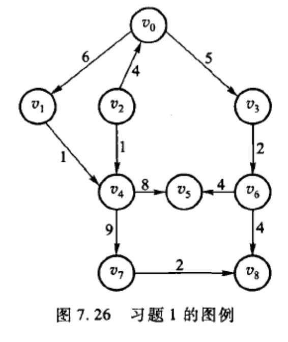
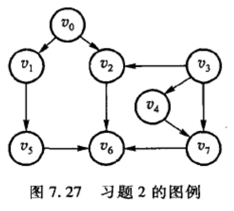
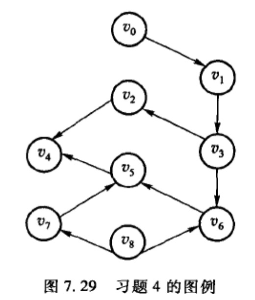

# 第六章-图

## 6.1 教材习题

### 6.1.1 对于图 7.26 所示的带权有向图

- （1）写出其相邻矩阵
- （2）画出其邻接表表示
- （3）计算每个顶点的入度和出度
- （4）如果每个指针需要 4 个字节，每个顶点的标号需要 2 个字节，每条边的权需要两个字节，则此图采用哪种表示法所需的空间较少

### 6.1.2 对于图 7.27 所示的有向图，从顶点 v1 出发分别画出其深度优先搜索(DFS)和广度优先搜素(BFS)的生成森林

### 6.1.3 求图 7.28 所示的有向图中从顶点 v4 到其他各顶点的全部最短路径及长度

### 6.1.4 拓扑排序的结果不是唯一的，对于图 7.29 所示的有向图的顶点进行拓扑排序，能够得到多少个不同的拓扑序列？试输出得到的所有拓扑序列

### 6.1.5 证明：只要适当排列顶点的次序，就能够使有向无环图的相邻矩阵中对角线以下元素全为 0

### 6.1.6 证明

- （1）一个没有简单回路的连通无向图 G=<V,E>有 n-1 条边
- （2）一个有 n-1 条边的无环图一定是连通的

### 6.1.7 有向图 G=<V,E>的转置是图$G^T=<V,E^T>$，其中边$<u,v>∈E^T$，当且仅当<v,u>∈E，即$G^T$就是逆转 G 中所有方向而得到的图。试按照相邻矩阵和邻接表两种表示法写出从 G 计算$G^T$的有效算法，并确定算法的时间复杂度

### 6.1.8 有向图 G=<V,E>的平方图是图$G^2=<V,E^2>$,其中边$<u,v>∈E^2$，当且仅当存在一个顶点 x∈V，使得<u,v>∈E 且<x,v>∈E，即当图 G 中存在一条顶点 u 到顶点 v 的长度为 2 的路径时，$<u,v>∈E^2$。试按照相邻矩阵和邻接表两种表示法写出从 G 产生$G^2$的有效算法，并确定算法的时间复杂度

### 6.1.9 写出一个算法确定一个有 n 个顶点 e 条边的图（有向图或无向图）是否包含回路，所设计的算法时间复杂度应该是 O(n+e)

### 6.1.10 说明并验证你所认为的每对顶点间最短路径问题的最大可能下限

### 6.1.11 证明：如果图 G 的所有边的权均不相等时，它只存在一颗最小生成树

### 6.1.12 Dijkstra 最短路径算法是否给出一颗生成树？是否给出一个最小生成树 MST？并证明你的结论

### 6.1.13 设计算法找图（有向图或无向图）的所有连通分量（对于有向图则是强连通分量）。提示：第一个连通分量的所有顶点使用第一分量的标记，第二个连通分量的所有顶点使用第二连通分量的标记，依此类推

### 6.1.14 证明：对于一个无向图 G=<V,E>，若 G 中各项顶点的度均大于或等于 2，则 G 中必有回路

### 6.1.15 设有一个含 n 个顶点的有向无环连通图 G，试问 G 有多少条边

### 6.1.16 在有向图，源是一个入度为 0 的顶点，试证明每个有向无环图(DAG)至少需要有一个源

### 6.1.17 什么样的有向无环图(DAG)具有唯一的拓扑排序

### 6.1.18 采用相邻矩阵表示一个有向图 G，写出一个算法确定 G 是否含有一个漏（即入度为 n-1，出度为 0 的顶点），要求该算法的时间复杂度是 O(n2)

### 6.1.19 对于一个具有 n 个顶点和 e 条边的有向图 G=<V,E>，证明：求其强连通分量的算法所需的时间复杂度是 O(n+e)

### 6.1.20 设计一个算法，在图（有向图或无向图）的邻接表表示的基础上实现边的插入和删除

### 6.1.21 只要图中不存在权值为负数的边，Dijkstra 算法就可以使用。如果一个图存在权值为负的边，Dijkstra 算法是否继续可用？如果你认为不可用，是否有办法改进 Dijkstra 算法使其可用？试证明你的结论，如果你改进了 Dijkstra 算法，也请证明所做的改进的正确性

### 6.1.22 设一个带权有向图 G=<V,E>，v 是 G 的一个顶点，v 的偏心距离定义为:max{从 u 到 v 的最短路径长度}，其中 u∈V，所谓最短路径长度，不是指边数，而是指路径上的边所带的权的总和。将 G 中偏心距最小的顶点称为 G 的中心，试设计一个算法求带权有向图的中心，并确定算法的时间复杂度

### 6.1.23 每棵树是一个有向无环图(DAG)，但不是所有的 DAG 就是树，试设计一个程序判断 DAG 是否是树，并确定程序所采用算法的时间复杂度

### 6.1.24 设计算法找有向图的根。以一个有向图作为输入，如果它有根，则输出它的所有根；如果没有，则输出空。试分析算法的时间复杂度

### 6.1.25 设计算法找有向无环图(DAG)每对顶点间的“最长简单路径”（所谓的“最长简单路径”，是值该简单路径包含的边数最多）。以一个有向无环图作为输入，对于每对顶点，如果他们之间存在简单路径，则输出其中路径长度最长（边数最多）的简单路径，否则输出空。试分析算法的时间复杂度

### 6.1.26 设计一个程序，输入一个图（有向图或无向图）G=<V,E>以及一对顶点的 vi,vj∈E，输出结果是：如果从 vi 到 vj 存在一条简单路径，则输出从 vi 到 vj 的所有简单路径；如果不存在，则输出空

## 6.2 上机题

### 6.2.1 套汇是指利用汇率差异将一个单位的货币转换为大于一个单位的同种货币。假如，假设 1 美元兑换 7.51 人民币，1 人民币兑换 0.07 英镑，1 英镑兑换 2.03 美元，那么如果一个人拿 1 美元先兑换成人民币，再把人民币兑换成英镑，最后把英镑兑换成美元，则它最后能够得到 1×7.51×0.07×2.03=1.07 美元，从而获得 1.07-1=0.07 美元的利润，这就是套汇。假设有 n 种货币$v_1,v_2,...,v_n$和有关汇率的$n×n$矩阵，其中$A[i_1,i_2]×A[i_2,i_3]×...×A[i_k,i_1] > 1$，如果存在，则输出所有这样的货币序列，如果不存在，则输出空，并确定算法的时间复杂度
