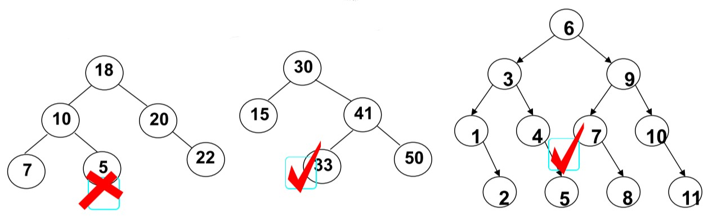
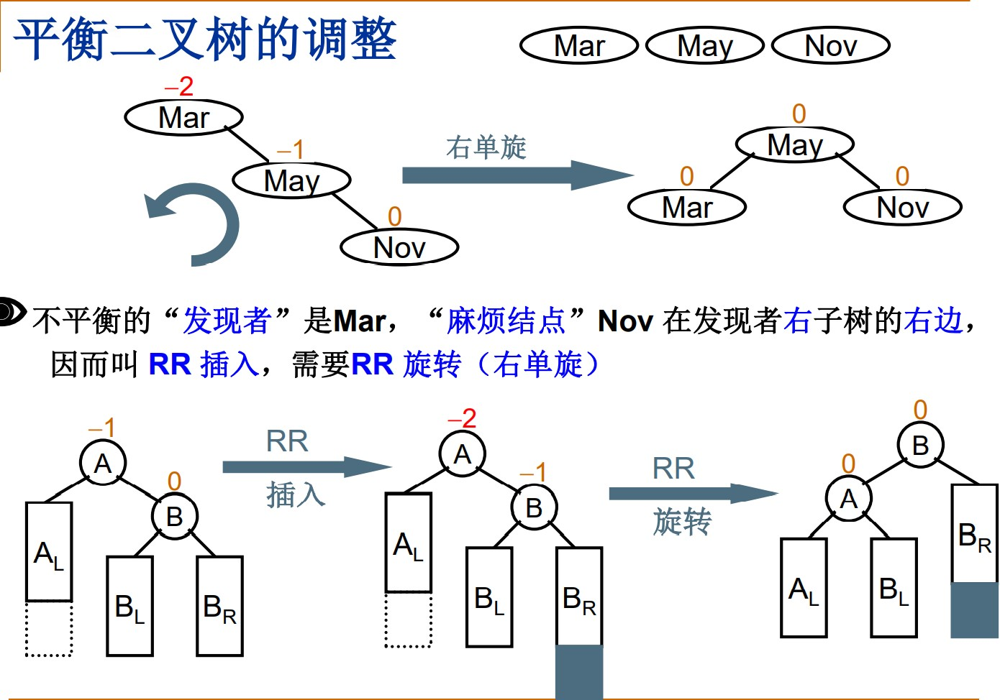
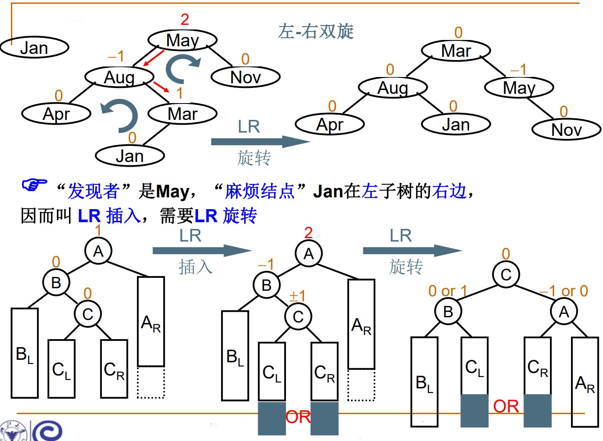
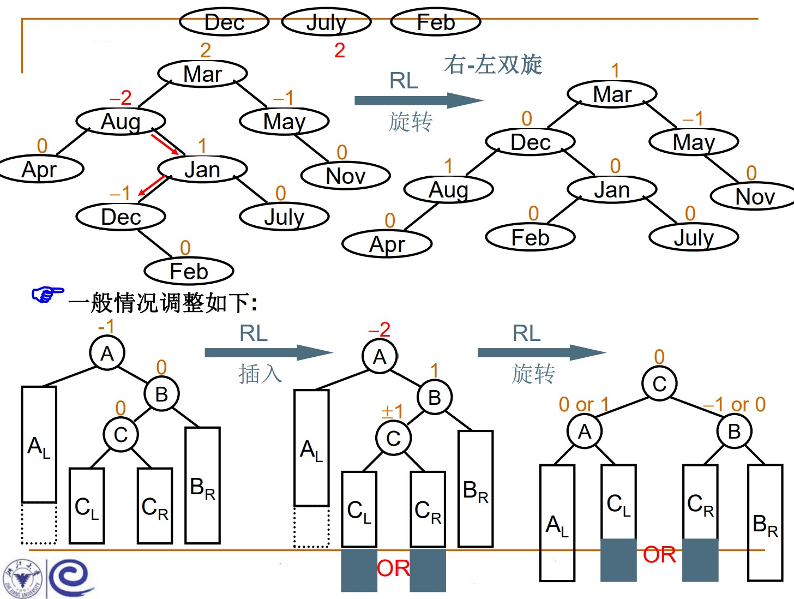
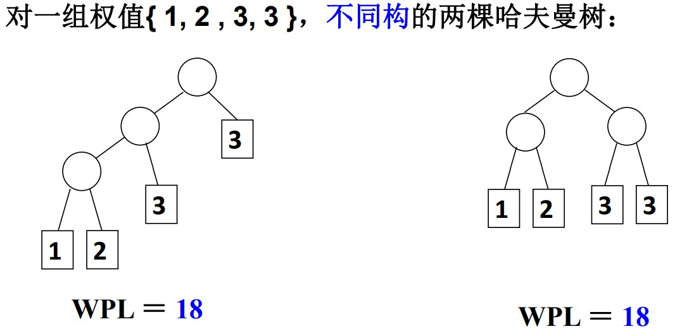

# 树

## 引子

**静态查找**：集合中记录是固定的，没有插入和删除的操作，只有查找

**动态查找**：集合中记录是动态变化的，除了查找，还可能发生插入和删除

- 静态查找

1. 方法 1-顺序查找

   ```cpp
   int SequentialSearch(StaticTable *Tbl, ElementType K){
       // 在表Tbl[1]~Tbl[n]中查找关键字为K的数据元素
       int i;
       Tbl->Element[0] = K;        // 建立哨兵，建立哨兵后循环判断语句只需要一次
       for(i = Tbl->Length; Tbl->Element[i] != K; i--);
       return i;
   }
   ```

2. 方法 2-二分查找

   二分查找的数据必须是有序的(如：小到大)，二分查找的时间复杂度是 O(logN)

   ```cpp
   int BinarySearch(StaticTable *Tbl, ElementType K){
       int left, right, mid, NoFound = -1;
       left = 1;               // 左边界
       right = Tbl->Length;    // 右边界
       while(left <= right){
           mid = (left + right) / 2;
           if(K < Tbl->Element[mid])       // 中间值大于目标值，调整右边界
               right = mid- 1;
           else if(K > Tbl->Element[mid])
               left = mid + 1;
           else return mid;                // 找到元素
       }
       return NoFound;
   }
   ```

   <div align=center></div>

## 树的定义

1. 树：n(n≥0)个结点构成的有限集合。当 n=0，称为*空树*，对于*非空树*，它具有以下性质:

   - 树种有一个称为“根（root）”的特殊结点，用 r 表示
   - 其余结点可分为 m(m>0)个互不相交的有限集$T_1, T_2, ..., T_m$，其中每个集合本身又是一棵树，称为原来树的“子树”

   <div align=center></div>

2. 树与非树

   - 子树是不相交的；
   - 除了根结点外，每个结点有且仅有一个父结点；
   - 一颗 N 个结点的树有 N-1 条边。

3. 基本术语
   - 结点的度(Degree)：结点的子树个数
   - 树的度：树的所有结点中最大的度数
   - 叶结点(Leaf)：度为 0 的结点
   - 父结点(Parent)：有子树的结点是其子树的根结点的父结点
   - 子结点(Child)：若 A 结点是 B 结点的父结点，则陈 B 结点是 A 结点的子结点，也称孩子结点
   - 兄弟结点(Sibling)：具有同一父结点的各结点彼此是兄弟结点
   - 路径和路径长度：从结点$n_1$到$n_k$的路径为一个结点序列$n_1, n_2, ..., n_k, n_j$是$n_{j+1}$的父结点。路径所包含边的个数为路径的长度。
   - 祖先结点(Ancestor)：沿树根到某一结点路径上的所有结点都是这个结点的祖先结点
   - 子孙结点(Descendant)：某一结点的子树中的所有结点是这个结点的子孙
   - 结点的层次(Level)：规定根结点在 1 层，其他任意结点的层数是其父结点的层数加 1
   - 树的深度(Depth)：树种所有结点种最大层次

## 二叉树及存储结构

1. 二叉树的定义：一个有穷的结点集合。这个集合可以为空，若不为空，则它是根结点和称其为左子树 TL 和右子树 TR 的两个不相交的二叉树组成。

   - 二叉树五种基本形态
   <div align=center></div>

   - 二叉树的子树有左右顺序之分

2. 特殊二叉树
   <div align=center></div>

3. 几个重要性质

   - 一个二叉树第 i 层的最大结点数为：$2^{i-1}, i≥1$
   - 深度为 k 的为叉树有最大结点总数为：$2^k-1, k≥1$
   - 对任何非空二叉树 T，若 n0 表示叶结点的个数、n2 是度为 2 的非叶结点个数，那么两者满足关系$n_0=n_2+n_1$

4. 二叉树的抽象数据类型

   ```txt
   类型名称：二叉树
   数据对象集：一个有穷的结点集合。若不为空，则由根结点和左右二叉子树构成
   操作集：BT∈BinTree, Item∈ElementType
       1. BinTree CreateBinTree();      // 创建一个二叉树
       2. Bool IsEmpty(BinTree BT);     // 判别BT是否为空
       3. void PreOrderTraversal(BinTree BT);       // 先序遍历--根、左子树、右子树
       4. void InOrderTraversal(BinTree BT);        // 中序遍历--左子树、根、右子树
       5. void PostOrderTraversal(BinTree BT);      // 后序遍历--左子树、右子树、根
       6. void LevelOrderTraversal(BinTree BT);     // 层次遍历，从上到下、从左到右
   ```

5. 二叉树的存储结构

   - 顺序存储
     完全二叉树：按从上到下、从左到右顺序存储，n 各结点的完全二叉树的结点父子关系： - 非根结点(序号 i>1)的父结点的序号是[i/2]; - 结点(序号为 i)的左孩子结点序号是 2i; - 结点(序号为 i)的右孩子结点的序号是 2i+1

       <div align=center></div>

     |      |     |     |     |     |     |     |     |     |     |
     | :--: | :-: | :-: | :-: | :-: | :-: | :-: | :-: | :-: | :-: |
     | 结点 |  A  |  B  |  O  |  C  |  S  |  M  |  Q  |  W  |  K  |
     | 序号 |  1  |  2  |  3  |  4  |  5  |  6  |  7  |  8  |  9  |

     一般二叉树也可采用这种结构，但会造成空间浪费

   - 链式存储

     ```cpp
     typedef struct TreeNode *BinTree;
     typedef BinTree Position;
     struct TreeNode{
         ElementType Data;
         BinTree Left;
         BinTree Right;
      }
     ```

   - 静态链表（结构数组表示二叉树）

     ```cpp
     #define MaxTree 10
     #define ElementType char
     #define Tree int
     #define Null -1

     struct TreeNode{
         ElementType ELement;
         Tree Left;
         Tree Right;
     }T1[MaxTree], T2[MaxTree];
     ```

     <div align=center></div>

6. 二叉树的遍历

   - 先序遍历（先根，再左，后右）

     ```cpp
     void PreOrderTraversal(BinTree BT){
         if(BT){
             printf("%d ", BT->Data);
             PreOrderTraversal(BT->Left);
             PreOrderTraversal(BT->Right);
         }
     }
     ```

   - 中序遍历（先左，再根，后右）

     ```cpp
     void InOrderTraversal(BinTree BT){
         if(BT){
             InOrderTraversal(BT->Left);
             printf("%d ", BT->Data);
             InOrderTraversal(BT->Right);
         }
     }
     ```

   - 后序遍历（先左，再后，后根）

     ```cpp
     void InOrderTraversal(BinTree BT){
         if(BT){
             InOrderTraversal(BT->Left);
             InOrderTraversal(BT->Right);
             printf("%d ", BT->Data);
         }
     }
     ```

   注：以上三种遍历路线是一样的，差异在输出结点的顺序

   - 中序遍历的非递归算法

     - (1)当遇到一个结点，把它压栈，并去遍历它的左子树
     - (2)当左子树遍历结束后，栈顶弹出这个结点并访问它
     - (3)然后按其右指针再去中序遍历该结点的右子树

     ```cpp
     void InOrderTraversal(BinTree BT){
         BinTree T = BT;
         Stack S = CreateStack(Maxsize);         // 创建一个栈
         while(T || !IsEmpty(S)){
             while(T){
                 // printf("%5d", T->Data);      // 若访问在此处是先序遍历
                 Push(S, T);
                 T = T->Left;
             }
             if(!IsEmpty(S)){
                 T = Pop(S);
                 printf("%5d", T->Data);
                 T = T->Right;                   // 转向右子树
             }
         }
     }
     ```

   - 层序遍历

     队列实现：遍历从根结点开始，先将根结点入队，然后开始执行循环：结点出队、访问该结点、其左右儿子入队

     ```cpp
     void LevelOrderTraversal(BinTree BT){
         Queue Q;
         BinTree BT;
         if(!BT) return;             // 空树
         Q = CreateQueue(MaxSize);
         AddQ(Q, BT);
         while(!IsEmptyQ(Q)){
             T = DeleteQ(Q);
             printf("%d\n", T->Data);
             if(T->Left)
                 Add(Q, T->Left);
             if(T->Right)
                 Add(Q, T->Right);
         }
     }
     ```

## 二叉搜索树

1. 二叉搜索树(BST, Binary Search Tree)，也称二叉排序树或二叉查找树，当其不为空时，满足以下性质：

   - 非空左子树的所有键值小于其根结点的键值
   - 非空右子树的所有键值小于其根结点的键值
   - 左、右子树都是二叉搜索树

   <div align=center></div>

2. 二叉树的查找操作：Find

   - 从根结点开始，若树为空，返回 NULL
   - 若搜索树非空，则根结点关键字和 X(目标值)进行比较，并进行不同处理：

     - (1)若 X 小于根结点的键值，只需要在左子树中继续搜索；
     - (2)若 X 大于根结点的键值，在右子树继续搜索；
     - (3)若结果相等，返回指向该结点指针

     ```cpp
     Position Find(ElementType X, BinTree BST){
         if(!BST) return NULL;
         if(X > BST->Data)
             return Find(X, BST->Right);         // 右子树查找
         else if(X < BST->Data)
             return Find(X, BST->Left);          // 左子树查找
         else // 相等
             return BST;
     }

     /*由于非递归执行效率高，将"尾递归"函数改成迭代函数*/
     Position Find(ElementType X, BinTree BST){
         while(BST){
             if(X > BST->Data)
                 BST = BST->Right;
             else if(X < BST->Data)
                 BST = BST->Left
             else
                 return BST;
         }
         return NULL;
     }
     ```

3. 查找最大元素和最小元素

   - 最大元素一定是在树的最右分支的端结点上
   - 最小元素一定是在树的最左分支的端结点上

   ```cpp
   // 递归实现查找最小元素
   Position FindMin(BinTree BST){
       if(!BST)
           return NULL;
       else if(!BST->Left)
           return BST;             // 左子树为空，即为最左叶结点
       else
           return FindMIn(BST->Left);
   }

   // 非递归实现查找最大元素
   Position FindMax(BinTree BST){
       if(BST)
           while(BST->Right)
               BST = BST->Right;
       return BST;
   }
   ```

4. 二叉搜索树的插入

   ```cpp
   BinTree Insert(ElementType X, BinTree BST){
       if(!BST){
           // 原树为空
           BST = malloc(sizeof(struct TreeNode));
           BST->Data = X;
           BST->Left = BST->Right = NULL;
       }else{
           if(X < BST->Data)
               BST->Left = Insert(X, BST->Left)
           else if(X > BST->Data)
               BST->Right = Insert(X, BST->Right);
           // X已经存在则忽略
       }
       return BST;
   }
   ```

5. 二叉搜索树的删除

   需要考虑三种情况：

   - 要删除的结点是叶结点，直接删除，修改父结点指针为 NULL
   - 要删除的结点只有一个孩子，将其父结点的指针指向要删除结点的孩子结点
   - 要删除的结点由左、右两颗子树，用另一结点替代被删除结点：右子树的最小元素或左子树的最大元素

   ```cpp
   BinTree Delete(ElementType X, BinTree BST){
       Position Tmp;
       if(!BST){
           printf("空树");
           return NULL;
       }
       else if(X < BST->Data)
           BST->Left = Delete(X, BST->Left);
       else if(X > BST->Data)
           BST->Right = Delete(X, BST->Right);
       else  // 找到要删除的结点
           if(BST->Left && BST->Right){ // 被删除结点有左右两个子结点
               Tmp = FindMin(BST->Right);
               BST->Data = Tmp->Data;
               // 被删结点右子树中删除最小元素
               BST->Right = Delete(BST->Data, BST->Right);
           }else{                      // 被删结点有一个或无子结点
               Tmp = BST;
               if(!BST->Left)          // 有右孩子或无子结点
                   BST = BST->Right;
               else if(!BST->Right)    // 有左孩子或无子结点
                   BST = BST->Left;
               free(Tmp);
           }
       return BST;
   }
   ```

## 平衡二叉树

1. 平衡因子(Balance Factor):BF(T)=hl - hr，左子树高度减去右子树高度
2. 平衡二叉树(Balanced Binary Tree)(AVL 树)：任一结点左、右子树高度差的绝对值不超过 1，即|BF(T)|≤1
3. 平衡二叉树的调整
   <div align="center"></div>
   <div align="center"></div>
   <div align="center"></div>
   <div align="center"></div>

## 堆

1. 优先队列(Priority Queue)：特殊的“队列”，取出的元素的顺序时依照元素的优先权大小，而不是元素进入队列的先后顺序。

   实现优先队列的方式之一是完全二叉树，堆是一种特殊的完全二叉树。

2. 堆的特性是：任一结点的关键字是其子树所有结点的最大值(最大堆)或最小值(最小堆)

3. 堆的抽象数据类型描述

   ```txt
   类型名称：最大堆(MaxHeap)
   数据对象集：完全二叉树，每个结点的元素值不小于其子结点的元素值
   操作集：最大堆H∈MaxHeap，元素item∈ElementType，主要操作有：
       MaxHeap Create(int MaxSize);        创建一个空的最大堆
       Boolean IsFull(MaxHeap H);          判断最大堆H是否已满
       Insert(MaxHeap H, ElmentType item); 将元素item插入最大堆H
       Boolean IsEmpty(MaxHeap H);         判断最大堆H是否为空
       ElementType DeleteMax(MaxHeap H);   返回H中的最大元素
   ```

   - 最大堆的创建

   ```cpp
   typedef struct HeapStruct *MaxHeap;
   struct HeapStruct{
       ElementType *Elements;      // 存储堆元素的数组
       int Size;                   // 堆当前的个数
       int Capacity;               // 堆的最大容量
   };

   MaxHeap Create(int MaxSize){
       MaxHeap H = malloc(sizeof(struct HeapStruct));
       H->Elements = malloc((MaxSize+1)*sizeof(ElementType));
       H->Size = 0;
       H->Capacity = MaxSize;
       H->Elements[0] = MaxData;    // 哨兵
       return H;
   }
   ```

   - 最大堆的插入

   ```cpp
   void Insert(MaxHeap H, ElementType item){
       // H->Elements[0]是哨兵
       int i;
       if(isFull(H)){
           printf("最大堆已满");
           return;
       }
       i = ++H->Size;          // 假设插入的位置是最后一个，再比较
       for(; H->Elements[i/2] < item; i /= 2)
           H->Elemnets[i] = H->Elements[i/2];
       H->Elements[i] = item;
   }
   ```

   - 最大堆的删除

   ```cpp
   ElementType DeleteMax(MaxHeap H){
       int parent, child;
       ElementType MaxItem, temp;
       if(isEmpty(H)){
           printf("最大堆为空");
           return;
       }
       MaxItem = H->Elements[1];       // 取出最大值
       temp = H->Elements[H->Size--];  // 取出最后一个元素
       for(parent = 1; parent * 2 <= H->Size; parent = child){
           child = parent * 2;
           if((child != H->Size) && (H->Elements[child] < H->Elements[child+1]))
               child++;                // child指向左右子结点的较大者
           if(temp >= H->Elements[child])
               break;
           else
               H->Elements[parent] = H->Elements[child];
       }
       H->Elements[parent] = temp;
       return Maxitem;
   }
   ```

   - 最大堆的建立

     建立最大堆：将已经存在的 N 个元素按最大堆的要求存放在一个一维数组中

     方法 1：通过插入操作，将 N 个元素一个个相继插入到一个初始为空的堆栈中去，时间代价最大为 O(NlogN)

     方法 2：在线性时间复杂度下建立最大堆 O(n)

     - (1)将 N 个元素按输入顺序存入，先满足完全二叉树的结构特性
     - (2)调整各结点位置，以满足最大堆的有序特性

## 哈夫曼树与哈夫曼编码

1. 带权路径长度：设二叉树有 n 个叶子结点，每个叶子结点带有权值$W_k$，从根结点到每个叶子结点的长度为$l_k$，则每个叶子结点的带权路径长度之和就是： $WPL=\sum_{k=1}^{n}W_k l_k$

2. 哈夫曼树(Huffman)：WPL 最小的二叉树，也称最优二叉树

   - Huffman 树的构造

     每次把权值最小的两颗二叉树合并

     ```cpp
     typedef struct TreeNode *HuffmanTree;
     struct TreeNode{
         int Weight;
         HuffmanTree Left, Right;
     };

     HuffmanTree Huffman(MinHeap H){
         // 假设H-Size个权值已经存在H->Elemnets[]->weight里
         int i;
         HuffmanTree T;
         BuildMinHeap(H);        // 将H->Elemnets[]按权值调整为最小堆
         for(i = 1; i < H->Size; i++){
             T = malloc(sizeof(struct TreeNode));
             T->Left = DeleteMin(H);         // 从最小堆中删除一个结点，作为新T的左子结点
             T->Right = DeleteMin(H);
             T->Weight = T->Left->Weight + T->Right->Weight;     // 计算新权值
             Insert(H, T);       // 将新T插入最小堆
         }
         T = DeleteMin(H);
         return T;
     }
     ```

   - Huffman 树的特点
     - 没有度为 1 的结点
     - n 个叶子结点的哈夫曼树共 2n-1 个结点
     - 哈夫曼树的任意非叶结点的左右子树交换后仍是哈夫曼树
     - 堆同一组权值${W_1, W_2, ..., W_n}$，存在不同构的两颗哈夫曼树，但是 WPL 是相等的。如
     <div align="center"></div>

3. 哈夫曼编码：哈夫曼树的一种应用
